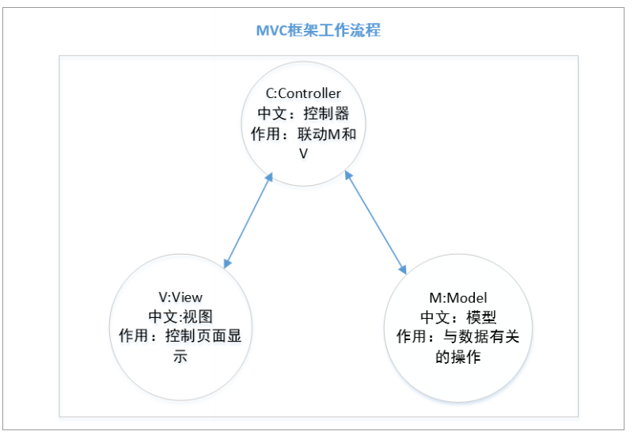
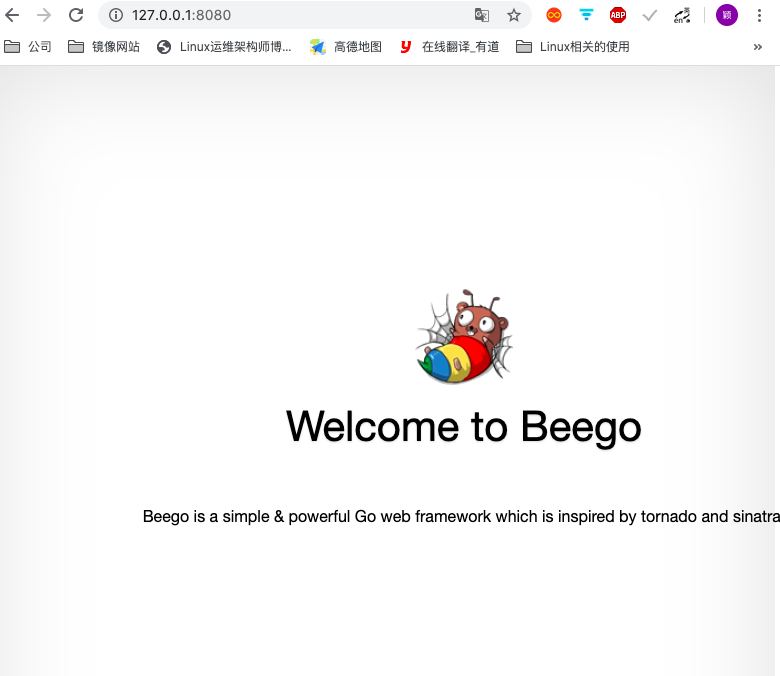
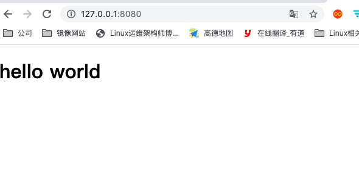
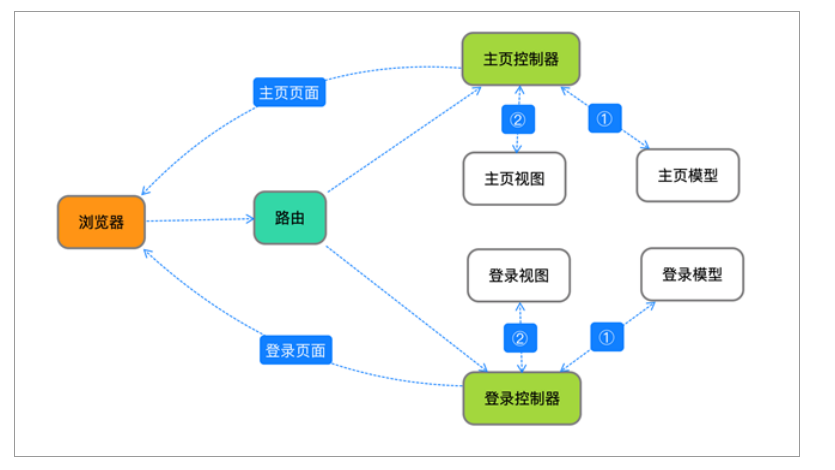
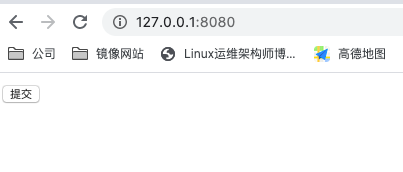
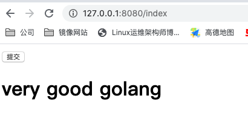

# beego 简介
beego 框架事 go 语言开发的 web 框架

框架: 就是别人写好的代码,我们可以直接利用,这个代码专门针对某一个方向开发定制的,例如:我们要做一个网站,利用 beego 框架就能非常快速的完成网站的开发,如果没有框架的话,每一个细节我们都需要去处理,开发的速度会大大的降低

go 语言的 web 框架: beego,gin,echo 等等

#### beego
中国人(谢孟君)开发的,开发文档比较详细,公司里面用的比较多

官网:https://beego.me/

# MVC 框架
beego 事 MVC 框架,MVC 是一种应用非常广泛的体系矿建,几乎所有的编程语言都会使用到,而且所有的程序员在工作中都会用到,用 MVC 的方式开发程序,可以让程序的结构更加合理清晰



- M:model,模型,作用是处理数据有关的操作

- V:view,视图,作用是控制页面显示

- C:controller,控制器,作用是联动 model 和 view

当外部的请求请求服务器页面的时候,首先会将请求发送到 controller,然后 controller 将请求数据发送给 model,model 将返回结果发送给 controller,controller 再将数据发送给 view,view 将数据展示到页视图上面并将视图返回给 model,最后 model 将视图返回给浏览器

## beego 环境的搭建
需要安装 beego 源码和 bee 开发工具,前提是安装好了 go 语言环境
```bash
# 会自动下载到 GOPATH 的 src 目录中
weiying@weiyingdeMacBook-Air ~$ go get -u -v github.com/astaxie/beego
weiying@weiyingdeMacBook-Air ~$ go get -u -v github.com/beego/bee
```

beego:就是框架的源码

Bee:是开发工具,带有很多 bee 命令,比如 bee new 创建项目,bee run 运行项目等

用 bee 运行的项目,项目自带热更新(是一种在后台程序常用的技术,就是在服务运行期间,可以不停服务的替换静态资源,替换 go 文件的时候会自动重新编译)

上面的项目安装完毕后,bee 的可执行程序放在 GOPATH 的 bin 目录下,需要挺假环境变量
```bash
weiying@weiyingdeMacBook-Air ~$ vim /etc/profile
# 在最下面追加
export PATH=$PATH:$GOPATH/bin

# 重新加载环境变量
weiying@weiyingdeMacBook-Air ~$ source /etc/profile
```

查看 bee命令的帮助
```bash
weiying@weiyingdeMacBook-Air ~$ bee -h
Bee is a Fast and Flexible tool for managing your Beego Web Application.

USAGE
    bee command [arguments]

AVAILABLE COMMANDS

    version     查看版本
    migrate     Runs database migrations
    api         Creates a Beego API application
    bale        Transforms non-Go files to Go source files
    fix         Fixes your application by making it compatible with newer versions of Beego
    dlv         Start a debugging session using Delve
    dockerize   Generates a Dockerfile for your Beego application
    generate    Source code generator
    hprose      Creates an RPC application based on Hprose and Beego frameworks
    new         创建一个 Beego 应用
    pack        Compresses a Beego application into a single file
    rs          Run customized scripts
    run        通过启动本地开发服务器运行应用程序
    server      serving static content over HTTP on port

Use bee help [command] for more information about a command.

ADDITIONAL HELP TOPICS


Use bee help [topic] for more information about that topic
```

## 创建 beego 项目
1. 环境安装好之后,使用 bee 自带的命令  bee new preojectName 创建项目
```bash
weiying@weiyingdeMacBook-Air ~$ bee new quickstart
______
| ___ \
| |_/ /  ___   ___
| ___ \ / _ \ / _ \
| |_/ /|  __/|  __/
\____/  \___| \___| v1.10.0
2020/05/26 15:07:09 WARN     ▶ 0001 You current workdir is not inside $GOPATH/src.
2020/05/26 15:07:09 INFO     ▶ 0002 Creating application...
	create	 /Users/weiying/go/src/quickstart/
	create	 /Users/weiying/go/src/quickstart/conf/
	create	 /Users/weiying/go/src/quickstart/controllers/
	create	 /Users/weiying/go/src/quickstart/models/
	create	 /Users/weiying/go/src/quickstart/routers/
	create	 /Users/weiying/go/src/quickstart/tests/
	create	 /Users/weiying/go/src/quickstart/static/
	create	 /Users/weiying/go/src/quickstart/static/js/
	create	 /Users/weiying/go/src/quickstart/static/css/
	create	 /Users/weiying/go/src/quickstart/static/img/
	create	 /Users/weiying/go/src/quickstart/views/
	create	 /Users/weiying/go/src/quickstart/conf/app.conf
	create	 /Users/weiying/go/src/quickstart/controllers/default.go
	create	 /Users/weiying/go/src/quickstart/views/index.tpl
	create	 /Users/weiying/go/src/quickstart/routers/router.go
	create	 /Users/weiying/go/src/quickstart/tests/default_test.go
	create	 /Users/weiying/go/src/quickstart/main.go
2020/05/26 15:07:09 SUCCESS  ▶ 0003 New application successfully created!
```
2. 项目创建成功后,会自动代在 GOPATH 的 src 目录下面生成项目,项目结构如下
```bash
weiying@weiyingdeMacBook-Air ~$ tree /Users/weiying/go/src/quickstart
/Users/weiying/go/src/quickstart
├── conf
│   └── app.conf
├── controllers
│   └── default.go
├── main.go
├── models
├── routers
│   └── router.go
├── static
│   ├── css
│   ├── img
│   └── js
│       └── reload.min.js
├── tests
│   └── default_test.go
└── views
    └── index.tpl
```

3. 运行项目
到项目的目录,执行 bee run 命令即可运行,运行成功后可以通过 127.0.0.1:8080 访问
```bash
weiying@weiyingdeMacBook-Air ~$ cd /Users/weiying/go/src/quickstart
weiying@weiyingdeMacBook-Air quickstart$ bee run
______
| ___ \
| |_/ /  ___   ___
| ___ \ / _ \ / _ \
| |_/ /|  __/|  __/
\____/  \___| \___| v1.10.0
2020/05/26 15:10:18 INFO     ▶ 0001 Using 'quickstart' as 'appname'
2020/05/26 15:10:18 INFO     ▶ 0002 Initializing watcher...
quickstart/controllers
quickstart/routers
quickstart
2020/05/26 15:10:24 SUCCESS  ▶ 0003 Built Successfully!
2020/05/26 15:10:24 INFO     ▶ 0004 Restarting 'quickstart'...
2020/05/26 15:10:24 SUCCESS  ▶ 0005 './quickstart' is running...
2020/05/26 15:10:24.145 [I] [asm_amd64.s:1357]  http server Running on http://:8080
```
访问查看


### Beego 项目解析
Beego 项目创建成功后,会在 GOPATH 的 src 目录下生成对应的项目文件,结构如下 
```bash
weiying@weiyingdeMacBook-Air ~$ tree /Users/weiying/go/src/quickstart
/Users/weiying/go/src/quickstart
├── conf
│   └── app.conf
├── controllers
│   └── default.go
├── main.go
├── models
├── routers
│   └── router.go
├── static
│   ├── css
│   ├── img
│   └── js
│       └── reload.min.js
├── tests
│   └── default_test.go
└── views
    └── index.tpl
```

1. conf 文件夹: 存放的是项目相关的配置文件

2. controllers : 存放的是主要的业务代码

3. main.go : 项目的入口文件

4. models: 存放的是数据库相关的内容

5. routers : 存放的是路由文件,作用是根据不同的请求指定不同的控制器

6. static : 存放静态资源文件,包括图片,html 页面,css 样式,js 文件等
静态资源不能接收服务器传递的参数,Beego 中默认注册了 static 目录为静态处理的目录,当我们去访问资源为http://localhost/static/xxx 的时候,默认不会使用路由去匹配,而是直接到 static 目录下寻找对应的文件,也可以在 main 函数中指定其他的静态资源的目录
```go
// 要指定在 beego.Run()函数之前
beego.SetStaticPath("/down1", "download1")
beego.SetStaticPath("/down2", "download2")
```

7. tests : 测试文件

8. views : 存放视图有关的内容

## 编写简单的 Beego 项目

1. 修改 Get 方法中的 c.TplName 的内容
编辑项目目录下面的 controller 目录下面的default.go 文件
```go
package controllers

import (
	"github.com/astaxie/beego"
)

type MainController struct {
	beego.Controller
}

func (c *MainController) Get() {
	c.Data["Website"] = "beego.me"
	c.Data["Email"] = "astaxie@gmail.com"
	//c.TplName = "index.tpl"
	c.TplName = "index.html"
}
```

2. 根据修改的内筒在 view 目录下创建新的视图
创建上面指定名称的 html 文件
```html
<!DOCTYPE html>
<html lang="en">
<head>
    <meta charset="UTF-8">
    <title>Beego first project</title>
</head>
<body>
<h1> hello world </h1>
</body>
</html>
```

3. 访问测试


### controller 给视图传递数据的解析
controller 给视图传递数据的方式,定义在 default.go 文件中
```go
package controllers

import (
	"github.com/astaxie/beego"
)

type MainController struct {
	beego.Controller
}

func (c *MainController) Get() {
	c.Data["Website"] = "beego.me"
	c.Data["Email"] = "astaxie@gmail.com"
	//c.TplName = "index.tpl"
	c.TplName = "index.html"
}
```

1. c.data["key"] = "value"
是给视图传递参数,在视图界面中,渔岙使用 {{ }} 加上"."才能获取到

c.Data["test"] = "golang" : 这个代码的含义就是,传递给视图 key 为 test ,值为 golang 的数据,在视图用需要使用 {{.test}} 就能获取到传递的值

```html
<!DOCTYPE html>
<html lang="en">
<head>
    <meta charset="UTF-8">
    <title>Beego first project</title>
</head>
<body>
	<h1> {{.test}} </h1> 
	{{/*接收 controller 传递的数据*/}}
</body>
</html>
```

2. c.TplName = "index.html"
作用就是指定视图,这里需要注意的是,默认指定的视图是以 tpl 结尾,但是打开这个文件,发现实质还是 html 文件,所以这里我们指定 html 文件即可

3. 总结 controller 的作用

- 给视图传递数据

- 能够指定视图

### view 视图的作用

1. view 本质就是个 html 文件,能够在浏览器渲染展示

2. 能够接收控制器传递过来的数据

## Beego 运行流程分析



1. 浏览器发出请求

2. 路由拿到请求,并交给相应的请求的控制器

3. 找到控制器后,控制器查看是否需要查询数据库

4. 如果需要查询数据,就去找 model 获取数据

5. 如果不需要查询数据库,直接找 view 请求视图

6. 控制器获取视图页面后,将页面返回给浏览器,浏览器渲染展示

#### 代码的执行流程

1. 首先从项目的入口 main.go 开始
```go
package main

import (
	_ "quickstart/routers"  // 下划线表示 main  函数执行之前,先执行包中的 init 函数
	"github.com/astaxie/beego"
)

func main() {
	beego.Run()
}
```

2. 找到 router.go 中的 init 函数
```go
package routers

import (
	"quickstart/controllers"
	"github.com/astaxie/beego"
)

func init() {
    beego.Router("/", &controllers.MainController{})
}
```

3. 找到路由指定的控制器文件 default.go 的 get 方法
```go
package controllers

import (
	"github.com/astaxie/beego"
)

type MainController struct {
	beego.Controller
}

func (c *MainController) Get() {
	c.Data["Website"] = "beego.me"
	c.Data["Email"] = "astaxie@gmail.com"
	c.Data["test"] = "golang"
	//c.TplName = "index.tpl"
	c.TplName = "index.html"
}
```

4. 然后找到指定视图的语法,整个项目就串起来了

## Post 案例的实现
上面,查看了 Beego 项目的运行流程,因为浏览器发起的是 GET 请求,那么就会对应的找到 default.go 中的 GET 方法,为了验证这个问题,我们让浏览器发送 post 请求来测试

1. 修改前端的代码,发送 post 请求
```html
<!DOCTYPE html>
<html lang="en">
<head>
    <meta charset="UTF-8">
    <title>Beego first project</title>
</head>
<body>
    <form method="post" action="/index">
		{{/*    action 指定的是路由中的请求路径    */}}
        <input type="submit">
    </form>
    <h1> {{.data}} </h1>
    {{/*接收 controller 传递的数据*/}}
</body>
</html>
```

2. 添加 html 页面中指定的路由
```go
package routers

import (
	"quickstart/controllers"
	"github.com/astaxie/beego"
)

func init() {
    beego.Router("/", &controllers.MainController{})
	beego.Router("/index", &controllers.IndexController{})
    // 指定路由,参数是访问路径和指定处理请求的控制器
}
```

3. 创建指定的控制器
创建指定的结构体和方法
```go
package controllers

import (
	"github.com/astaxie/beego"
)

type MainController struct {
	beego.Controller
}
type IndexController struct {
	beego.Controller
}

func (c *MainController) Get() {
	c.Data["Website"] = "beego.me"
	c.Data["Email"] = "astaxie@gmail.com"
	c.Data["test"] = "golang"
	//c.TplName = "index.tpl"
	c.TplName = "index.html"
}

func (c *IndexController) Post() {
	c.Data["data"] = "very good golang"
	c.TplName = "index.html"
}
```

4. 在浏览器中访问,点击提交按钮测试


