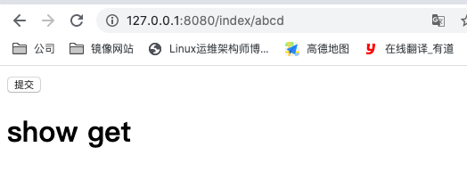

## Beego 中的路由详解

路由的功能就是,更加不同的请求,选择相应的控制器

### 简单的路由函数如下
```go
package routers

import (
	"quickstart/controllers"
	"github.com/astaxie/beego"
)

func init() {
    beego.Router("/", &controllers.MainController{})
}
```

- 第一个参数: URL,指定请求资源的路径

- 第二个参数: 指定的控制器

### 高级路由设置

一般在开发的过程中,我们基本上不会使用 beego 提供的默认的请求方法,都是自定义的

定义请求方法需要用到 Roouter 的第三个参数,这个参数是用来给不同的请求指定不同的方法,有一下几种情况:

1. 一个请求访问一个方法(最常用),请求和方法之间使用冒号":"分割,不同的请求使用分号";"分割
```go
beego.Router("/simple",&SimpleController{},"get:GetFunc;post:PostFunc")
```

2. 多个请求访问同一个方法,使用星号"*"代表所有的请求,请求与方法之间使用冒号分割
```go
beego.Router("/api",&RestController{},"get,post:ApiFunc")
```

3. 所有的请求都访问一个方法,使用星号"*"代表所有的请求,请求与方法之间使用冒号分割
```go
beego.Router("/api/list",&RestController{},"*:ListFood")
```

4. 如果同时存在 "*"和指定的请求方法,那么优先执行指定的请求对应的方法
```go
beego.Router("/simple",&SimpleController{},"*:AllFunc;post:PostFunc")
// 如果请求为 post , 那么优先执行 PostFunc 方法
```

> 注意: 当使用了自定义方法之后,默认的请求将不能被访问


### 正则路由
为了用户更加方便的路由设置,beego 支持多中方式的路由

1. 默认匹配
```go
// ? 表示0个或1个字符,下面的代码表示匹配 index 下面的所有,将匹配到的值赋值给id
beego.Router("/index/?:id", &controllers.IndexController{},"*:ShowGet;post:Post")
//  当下面这种匹配规则的时候,匹配 index 后面不加参数的话,会匹配失败
beego.Router("/index/:id", &controllers.IndexController{},"*:ShowGet;post:Post")
```

在指定的方法中使用这个值
```go
func (c *IndexController) ShowGet() {
	id :=c.GetString(":id")
	beego.Info(id)
	c.Data["data2"] = "show get"
	c.TplName = "index.html"
}
```
访问并查看控制台输出


控制台输出
```bash
2020/05/26 17:41:36.120 [I] [default.go:31]  abcd 
```

2. 自定义正则匹配

- 数字匹配

```go
	beego.Router("/index/:id([0-9]+)", &controllers.IndexController{},"*:ShowGet;post:Post")
```

- 字母匹配

```go
	beego.Router("/index/:id([\\w]+)", &controllers.IndexController{},"*:ShowGet;post:Post")
```

- 匹配文件

```go
	beego.Router("/index/*.*", &controllers.IndexController{},"*:ShowGet;post:Post")
```

匹配文件的时候,不能通过将匹配到的值赋值给某个变量,那么怎么获取这个值呢
```go
func (c *IndexController) ShowGet() {
	path := c.GetString(":path") // 获取的是文件名,不包含后缀
	ext := c.GetString(":ext") // 获取的是文件的后缀
	beego.Info("path=",path,"ext=",ext)
	c.Data["data2"] = "show get"
	c.TplName = "index.html"
}
```
> 注意: ":path"和":ext"是固定不能改变的

4. 全文件名匹配
```go
beego.Router("/index/*", &controllers.IndexController{},"*:ShowGet;post:Post")
```

获取这个值
```go
func (c *IndexController) ShowGet() {
	splat := c.GetString(":splat") // 获取到的是包含后缀的文件名
	beego.Info(splat)
	c.Data["data2"] = "show get"
	c.TplName = "index.html"
}
```

> 注意: ":splat" 也是不能改变的

例: 匹配指定路径下以 i 开头中间包含任意字符,但是必须有一个".",以任意字符结尾的文件
```go
beego.Router("/index/?:id(^i[\\w]+\\.[\\w]+)", &controllers.IndexController{},"*:ShowGet;post:Post")
```