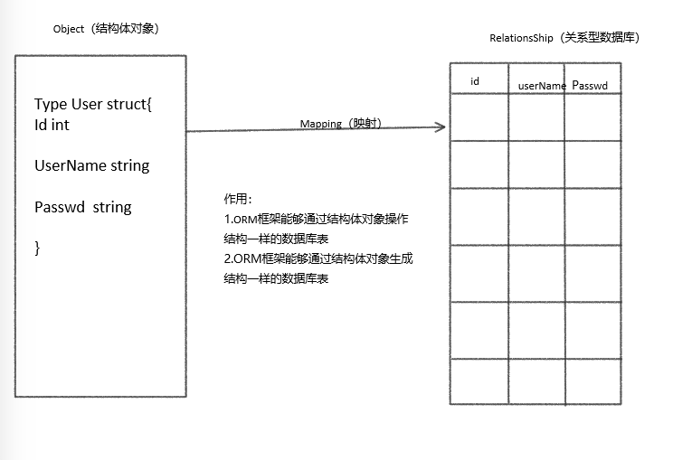

#  ORM

Beego 中内嵌了 ORM 框架,用来操作数据库,那么 ROM 框架是什么呢? 

ORM 框架是 Object-RelationShip-Mapping 的缩写,叫做对象关系映射




### 作用

1. 能够通过结构体对象操作数据库中对应的表

2. 能通过结构体对象生成对应的表

## ORM 的使用

1. 首先要导入 orm 包
```go
import "github.com/astaxie/beego/orm"
// 如果没有下载的话需要下载
go get github.com/astaxie/beego/orm
```

2. 创建路由
```go
beego.Router("/mysql", &controllers.OrmController{},"get:ShowORM")
```

3. 创建 ORM 使用的控制器
```go
package controllers

import (
	"github.com/astaxie/beego"
	"github.com/astaxie/beego/orm"
	_ "github.com/go-sql-driver/mysql"
)

type OrmController struct {
	beego.Controller
}

// 1. 首先定义结构体
type User struct {
	Id int
	Name string
	Age int
}

// 在建表的时候,表名和字段名必须是首字母大写,表中默认会转变为小写
//而第二个大写的字母会在两个单词之间加下划线
// 例如 TypeName 会变为 type_name

func (c *OrmController) ShowOrm() {
	// 连接数据库
	orm.RegisterDataBase("default","mysql","root:admin123@(172.19.36.53:3306)/goMysql?charset=utf8")
	// 注册表
	orm.RegisterModel(new(User))
	//3.生成表
	//1.数据库别名
	//2.是否强制更新
	//3.创建表过程是否可见
	orm.RunSyncdb("default",false,true)

	c.Ctx.WriteString("ok")
	}
```

> 注意:创建结构体的时候,结构体的名称和字段名称,必须要使用大写


orm.RegisterDataBase() 方法是用来连接数据库,有三个参数:

- 第一个参数: 数据库的别名,也可以理解为是数据库的 key 值,项目中必须有且只有一个别名为 default 的连接

- 第二个参数: 数据库的驱动

- 第三个参数 数据库连接的参数,因为无论是 go 语言还是 orm 都是不能创建数据库的,所以指定的数据库一定要提前创建出来


orm.RegisterModel() 方法是用来注册数据库表,参数是结构体对象,如果有多个表,使用逗号分隔
```go
orm.RegisterModel(new(Table1),new(Table2)...)
```

orm.RunSyncdb() 方法是用来生成表,同样有三个参数

- 第一个参数: 是数据库的别名,要和连接数据库的时候定义的别名对应

- 第二个参数: 表示是否强制更新,一般是 false,如果是true 的话,每次项目编译一次,数据库都会被清空一次,false 的话只有数据库在发生重大改变(如添加字段)的时候,更新数据库

- 第三个参数:表示生成表的过程是否可见,如果是可见的话,那么生成表的时候,执行的 sql 语句会在终端中看到

> 因为每次操作数据库都需要进行连接数据库,注册表和生成表的操作,那么我们可也将这些初始化的操作,放到 models 中定义,并且在 main 函数调用的时候进行初始化

## 在设计数据库表的时候,需要指定表中某些字段的属性
``` go
1. 设置主键
`orm:"pk"`

2. 设置自增长
`orm:"auto"`
// 当类型为 int,int32,int64,uint,uint32,uint64 时,可以设置字段为自增长
// 当模型定义里面没有主键时,符合上述类型且名称为 Id 的 Field 将被视为自增长

3. 是否允许为空
`orm:"null"` // null 表示可以为空,默认是不允许为空的

4. 设置字符串的长度
`orm:"size(20)"`

5. 设置时间类型
`orm:"type(时间类型)"` //mysql 的时间类型有 date 和 datetime
`orm:"auto_now_add;type(datetime)"` // 只有在第一次保存的时候,设置时间
`orm:"auto_now;type(data)"`	//每次保存的时候,都会对时间自动更新

6. 设置唯一键
`orm:"unique"`

7. 设置浮点数精度
`orm:"digits(12);decimals(4)"` //总共 12 位,小数点后四位

8. 设置默认值
`orm:"default(value)"`

9. 设置外键
//一对一
`orm:"rel(one)"`
`orm:"reverse(one)"` 

// 一对多
`orm:"rel(fk)"`
`orm:"reverse(many)"` 

// 多对多
`orm:"rel(m2m)"`
`orm:"reverse(many)"` 

// rel(fk) 和 reverse()是成对出现的
// 如果创建的是一对多或者的关系,创建表的时候,会在"多"的表中创建对应的外键
// 如果是多对多的关系,会自动的创建一张新的表,来记录对应关系

```

```go
package models

import (
	"github.com/astaxie/beego/orm"
	_ "github.com/go-sql-driver/mysql"
)

// 1. 首先定义结构体
type User2 struct {
	Id   int
	Name string
	Age  int
}

func init() {
	// 连接数据库
	orm.RegisterDataBase("default", "mysql", "root:admin123@(172.19.36.53:3306)/goMysql?charset=utf8")
	// 注册表
	orm.RegisterModel(new(User2))

	//3.生成表
	//1.数据库别名
	//2.是否强制更新
	//3.创建表过程是否可见
	orm.RunSyncdb("default", false, true)

}
```

在 main 函数中调用 init 函数进程初始化
```go
package main

import (
	"github.com/astaxie/beego"
	_ "quickstart/models"
	_ "quickstart/routers"
)

func main() {
	beego.Run()
}
```

## ORM 简单的增删改查操作

1. 插入数据
```go
func (c *MainController) InsertMysql() {
	c.TplName = "register.html"
	//获取 ORM 对象
	db := orm.NewOrm()
	// 定义要插入的结构体对象
	user := models.User2{}

	// 给定义的对象赋值
	user.Name = "张三"
	user.Age = 30
	//执行插入操作 , 参数是结构体对象地址,返回插入的 id 和错误信息
	id, err := db.Insert(&user)
	if err != nil {
		beego.Info("数据插入失败", err)
		return
	}
	beego.Info(id)
}
```

> 上面的代码中,我们没有指定 id 字段,因为在创建数据库的时候,没有指定主键,那么 ORM 摸摸人会以变量名称为 Id, 类型为 int 字段当做主键,插入数据的时候,可以不添加

2. 查询数据
```go
func (c *MainController) SelectMysql() {
	c.TplName = "register.html"
	//获取 ORM 对象
	db := orm.NewOrm()
	// 定义要插入的结构体对象
	user := models.User2{}

	// 给定义的对象赋值,相当于给查询条件赋值
	user.Name = "张三"

	//执行查询操作 , 参数是结构体对象地址和指定查询的字段,返回值只有错误信息
	// 如果查询到了数据,会将数据赋值给结构体中的元素
	err := db.Read(&user,"Name")
	if err != nil {
		beego.Info("数据查询失败", err)
		return
	}
	beego.Info(user.Id,user.Name,user.Age)
}
```

> 如果查询字段是查询对象的主键的话，可以不用指定查询字段


3. 更新数据
```go
func (c *MainController) UpdateMysql() {
	c.TplName = "register.html"
	//获取 ORM 对象
	db := orm.NewOrm()
	// 定义要插入的结构体对象
	user := models.User2{}

	// 给定义的对象赋值,相当于给查询条件赋值
	user.Id = 1
	// 查询要更新的对象是否存在
	err := db.Read(&user)
	if err != nil {
		beego.Info("对象不存在", err)
		return
	}
	//如果存在,就给要更新的对象赋新的值
	user.Name = "xxxx"
	//执行更新操作
	// 参数是结构体对象指针,返回值是更新的条目数和错误信息
	count,err=db.Update(&user)
	if err != nil{
		beego.Info("更新数据错误",err)
		return
	}
}
```

4. 删除数据
```go
func (c *MainController) DeleteMysql() {
	c.TplName = "register.html"
	//获取 ORM 对象
	db := orm.NewOrm()
	// 定义要插入的结构体对象
	user := models.User2{}

	// 给定义的对象赋值,相当于给查询条件赋值
	user.Id = 1
	//执行删除操作
	// 参数是结构体对象指针,返回值是更新的条目数和错误信息
	n, err := db.Delete(&user, "Id")
	if err != nil{
		beego.Info("更新数据错误",err)
		return
	}
	beego.Info(n)
}
```

> 删除的对象主键必须有值,如果没有值的话,新查询一下

### 高级查询
orm 以 QuerySeter 来组织查询,使用 QueryTable 来指定查询的表,返回的对象就是 QuerySeter

```go
ps := db.QueryTable("user")  // ps 为 QuerySeter 对象
```
每个返回 QuerySeter 的方法,都会获取一个新的 QuerySeter 对象,常用的方法有(:

- All(container interface{}, cols ...string) (int64, error): 
相当于 select * from user

参数 1: 容器,这个容器是用来存储查询返回结果的数组,一般是创建表的时候所使用的结构体类型的数组对象
参数 2: 要查询的字段 ,默认为所有
```go
	db := orm.NewOrm()
	ps := db.QueryTable("User")
	// models.User 类型的数组
	var user []models.User
	ps.All(&user)
	beego.Info(user[0].Id, user[0].Name, user[0].Passwd)  //结果 1  张三  1234567
// 如果在使用 All() 方法的时候,指定了查询的字段,那么没有指定的字段是不会赋值到数组对象中的
```

- One()

- Filter(string, ...interface{}) QuerySeter:过滤器,作用相当于 SQL 语句中的 where
```go
// 第一个参数: 字段名,多表查询的时候为 表名__字段名(为双下划线)
// 第二个参数: 要匹配的值
	db.QueryTable("Article").Filter("ArticleType__TypeName", typeName).All(&articletype)
// 上面的写法,实际上是不会获取到值的
// 因为 orm 是惰性查询,没有指定查询ArticleType表就不会去查询
// 使用下面的方法,使用RelatedSel() 函数关联一个表
	db.QueryTable("Article").RelatedSel("ArticleType").Filter("ArticleType__TypeName", typeName).All(&articletype)

// 上面的过滤器中,表名__字段名 加上要匹配的值表示等值比较,也就是判断前面的字段等于后面给定的值

// 但是在实际的业务开发过程中,不止会有等值的比较
// 还有大于,小于,大于等于,小于等于,包含以及以某个字段开始和以某个字段结束等查询操作

qs.Filter("表名__字段名__操作符",value) 
// 表示将字段按照操作符的规则与 value 进行匹配
// 下面介绍操作符

exact/iexact        判断指定的字段是否等于 value 的值
contains/icontains    判断指定的字段是否包含 value 指定的值
gt/gte                判断指定的字段是否大于/大于等于 value 的值
lt/lte                判断指定的字段是否小于/小于等于 value 的值
startswith/istatswith    判断指定的字段是否以 value 指定的值开头
endswith/iendswith        判断指定的字段是否以 value 指定的值结束
isnull                    判断指定的字段是否为 null
in                判断指定的字段是否在 value 的内部(这时的 value 一般为切片或者是多个参数)

// 上面成对出现的,而且以 i 开头的操作符表示不区分大小写
```

- Limit(limit interface{}, args ...interface{}) QuerySeter: 从指定的位置开始,获取指定条目的数据
```go
// 参数1,获取的条目数
// 参数 2,起始位置
c.Limit(2,0) 
// 从开始位置获取两条数据,返回值是 QuerySeter 类型,可以继续使用 QuerySeter 对应的方法
ps.Limit(2, 0).All(&User)
```

- OrderBy():排序

- Distinct() : 去重

- Count() (int64, error) : 返回数据条目数
```go
num, err := ps.Count()
	if err != nil {
		beego.Info("查询 错误：", err)
		return
}
```

- Delete()

- Update()

- RelatedSel(params ...interface{}) QuerySeter: 关联表,用在多表查询的时候,指定要关联的表

- Values()

- ValuesList()

- VlauesFlat()

### 一对多的插入
一对多的插入和一般的插入一样,但是只是给多的那一张表插入数据即可:

比如现在有两张表分别为 article 和 articleType,arcticle 中的ArticleType字段与articleType表中的 id 字段是一对多的关系
```go
db := orm.NewOrm()

article := models.Article{}
article.Title = title
article.Content = content
article.Image = "./static/img/" + filename

// 获取多的那张表的对象
var articleType models.ArticleType
articleType.TypeName = typeNme
db.Read(&articleType, "TypeName")
// 给一的表插入多的那个属性，注意是类型对象
article.ArticleType = &articleType
//插入数据库
db.Insert(&article)
```

### 多对多的插入操作
比如现在有 User 表和 article 表,User 表中的 id 字段和 Article 表中的 id 字段是多对多的关系
```go
db := orm.NewOrm()

// 获取操作对象
arti := Article{Id:1}

// 获取多对多操作对象
m2m := db.QueryM2M(&arti,"user") 
// 第一个参数的对象必须要有主键
// 第二个参数是要操作的表中的多的那个字段

// 获取要插入的对象
user := &User{Id:1}

o.Read(&user)
// 执行插入操作,多对多插入
num , err := m2m.Add(user)
```

### 多对多的查询

方法一:
```go
//指定查询对象
arti := Article{Id:1}
// 读取操作
db.Read(&arti)
// 查询操作
num , err := db.LoadRelated(&arti,"User")
// 参数是查询对象和要查询的的字段

// 视图中使用这个值,获取到的是数组,循环打印
<p class="detail">
{{range .articel.User}}
{{.Name}}
{{end}
</p>
```

方法二:
```go
var user []*User
// 多对多查询的时候,首先要指定"多"的关系的那个字段名,然后是表名,最后是要查询的字段的名
// 这三个名称之间都使用双下划线连接
num ,err := db.QueryTable("要查询的表").Filter("字段名__表名__要查询的字段名","要查询的值").All(&user)
num ,err := db.QueryTable("User").Filter("Article__Article__id",articleid).Distinct().All(&user)
```