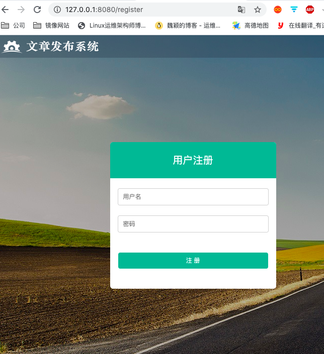

# 简单的注册页面的实现

下面用到的前端页面可在:http://upload.aishad.top/static.zip ,下载覆盖到项目的 static 目录,并将其中的 html 页面拷贝到视图中

1. 首先在 modles 中创建用于初始化数据库连接的方法
```go
package models

import (
	"github.com/astaxie/beego/orm"
	_ "github.com/go-sql-driver/mysql"
)

// 1. 首先定义结构体
type User2 struct {
	Id     int
	Name   string
	Passwd string
}

func init() {
	// 连接数据库
	orm.RegisterDataBase("default", "mysql", "root:admin123@(172.19.36.53:3306)/goMysql?charset=utf8")
	// 注册表
	orm.RegisterModel(new(User2))

	//3.生成表
	//1.数据库别名
	//2.是否强制更新
	//3.创建表过程是否可见
	orm.RunSyncdb("default", false, true)
}
```

2. 创建路由,以/register作为注册的请求路径
```go
beego.Router("/register", &controllers.UserController{}, "*:ShowRegister")
```

3. 根据上面创建的路由,创建对应的控制器,并添加注册页面函数
```go
package controllers

import (
	"github.com/astaxie/beego"
)

type UserController struct {
	beego.Controller
}

func (c *UserController) ShowRegister() {
	c.TplName = "register.html"
}
```

查看注册页面


4. 修改注册页面的代码
需要在 form 标签中添加需要的两个属性,一个是 action , 一个是 method,action 其实就是当我们点击注册的时候,提交数据的地址,我们还使用 register 请求,method 为设置请求的方法,这里为上传数据,我们设置为 post 请求
```html
<div class="login_logo">
        
    </div>
    <form  class="login_form" name = "login" action="/register" method="post">
        <h1 class="login_title">用户注册</h1>
        <input type="text" placeholder="用户名" class="input_txt" name="userName">
        <input type="password" placeholder="密码" class="input_txt" name = "password">
        <input type="submit" value="注 册" class="input_sub">
    </form>
    <div class="login_bg"></div>
</body>
```

5. 处理 post 请求
因为在注册页面中,action 设置的请求地址还是 register ,那么需要修改对应的路由
```go
beego.Router("/register", &controllers.UserController{}, "get:ShowRegister;post:HandleRegister")
```

## 注册业务处理
需要根据上面路由中的设置,创建对应的方法

1. 首选创建 HandleRegister 方法
```go
func (c *UserController) HandleRegister() {

}
```

2. 处理注册业务
处理注册业务之前,需要先获取用户提交上来的数据

```go
// 用于显示注册界面
func (c *UserController) ShowRegister() {
	c.TplName = "register.html"
}

// 用于处理注册请求
func (c *UserController) HandleRegister() {
	// 获取用户名
	userName := c.GetString("userName")
	// 获取密码
	password := c.GetString("password")
	// 对获取到的数据做校验，这里只做简单的判断
	if userName == "" || password == "" {
		//c.Data["res"] = "输入的数据不完整，请重新输入！"
		beego.Info("用户名或密码不能为空，请重新输入！")
		c.TplName = "register.html"
		return
	}
	// 如果数据没问题的话，插入到数据库
	// 获取orm对象
	db := orm.NewOrm()
	// 获取要插入的数据对象
	user := models.User{}
	// 给对象赋值
	user.Name = userName
	user.Passwd = password
	// 插入数据
	_, err := db.Insert(&user)
	if err != nil {
		beego.Info("注册失败，请更换用户名再次注册!")
		c.TplName = "register.html" // 一般注册成功后都是返回到登录界面,这里还没有实现,暂时就先返回一句话
		return
	}
	c.Ctx.WriteString("注册成功！")
}
```

> 一般的在对用户传递的数据,都要进行一系列的校验,然后才能写入到数据库中

# 简单的登录界面的实现
登录和注册的业务流程差不读,差别就是一个是对数据库的查询,另一个是对数据库的插入


1. 修改路由文件
```go
beego.Router("/login", &controllers.UserController{}, "get:ShowLogin;post:HandleLogin")
```

2. 实现登录
```go
// 用于显示注册界面
func (c *UserController) ShowLogin() {
	c.TplName = "login.html"
}

// 用于显示注册界面
func (c *UserController) HandleLogin() {
	// 获取用户传递的数据
	username := c.GetString("userName")
	password := c.GetString("password")

	//进行数据校验
	if username == "" || password == "" {
		//c.Data["res"] = "输入的数据不完整，请重新输入！"
		beego.Info("用户名或密码不能为空，请重新输入！")
		c.TplName = "register.html"
		return
	}
	// 查询数据库
	db := orm.NewOrm()
	user := models.User{}
	user.Name = username

	err := db.Read(&user, "Name")
	if err != nil {
		beego.Info("用户名或密码错误，请重新登录")
		c.TplName = "login.html"
		return
	}
	if user.Passwd != password {
		beego.Info("用户名或密码错误，请重新登录")
		c.TplName = "login.html"
		return
	}
	// 返回登录成功的信息
	c.Ctx.WriteString("登录成功！")
}
```

3. 登录界面的 html 中添加 method 和 action
```go
<body>
    <div class="login_logo">
        
    </div>
    <form  class="login_form"  name = "login" action="/login" method="post">
        <h1 class="login_title">用户登录</h1>
        <input type="text"  class="input_txt" name = "userName">
        <input type="password" name = "password"  class="input_txt">
        <div class="remember"><input type="checkbox" name="remember" ><label>记住用户名</label></div>
        <input type="submit" value="登 录" class="input_sub">
    </form>
    <div class="login_bg"></div>
</body>
```

> 这样的话,登录和注册界面就 sauna 简单的完成了,但是有个问题,就是将注册成功的界面转到登录界面

# 页面跳转方式
beego 里面页面有两种方式实现页面跳转,一种是重定向,另一种是渲染,都能够在显示器上显示新的页面


## 重定向
重定向用到的方法就是 Redirect() 方法,这个方法有连个参数:

- 请求路径:就是超链接

- 返回给服务器的请求状态码

#### 重定向的工作流程

1. 当服务器端向客户端响应 Redirect 后,并没有提供任何视图数据进行渲染,仅仅是告诉浏览器响应为 Redirect,以及重定向的目标地址

2. 浏览器收到服务端 Redirect 发过来的请求,会向其返回的超链接重新请求数据

## 渲染
渲染就是把控制器一些数据传递给视图,然后视图用这些输出组织成 html 界面,所以不会再向浏览器发送请求变化,是服务器自己的行为,所以浏览器你的地址是不会改变的,但是现实的页面会变化

### 两者的区别
|    区别    |                            重定向                            |                             渲染                             |
| :--------: | :----------------------------------------------------------: | :----------------------------------------------------------: |
|  响应方式  | 告诉浏览器相应是redirect，然后返回一个新的地址给浏览器，让浏览器重新发起请求 |                     直接给浏览器返回视图                     |
| 地址栏显示 |                 浏览器地址栏显示的是新的地址                 |               浏览器地址栏显示的还是原来的地址               |
|    作用    |      不能给视图传递数据，但是能够获取到加载页面时的数据      | 能够给视图传递数据，但如果要获取加载页面时的数据，需要再次写相关代码 |
|  使用场景  |                        页面跳转的时候                        |               页面加载或者是登陆注册失败的时候               |

### 使用重定向来解决注册和登录界面的联动问题
```go
// 用于处理注册请求
func (c *UserController) HandleRegister() {
	// 获取用户名
	userName := c.GetString("userName")
	// 获取密码
	password := c.GetString("password")
	// 对获取到的数据做校验，这里只做简单的判断
	if userName == "" || password == "" {
		//c.Data["res"] = "输入的数据不完整，请重新输入！"
		beego.Info("输入的数据不完整，请重新输入！")
		c.TplName = "register.html"
		return
	}
	// 如果数据没问题的话，插入到数据库
	// 获取orm对象
	db := orm.NewOrm()
	// 获取要插入的数据对象
	user := models.User{}
	// 给对象赋值
	user.Name = userName
	user.Passwd = password
	// 插入数据
	_, err := db.Insert(&user)
	if err != nil {
		beego.Info("注册失败，请更换用户名再次注册!")
		c.TplName = "register.html" //渲染
		return
	}
	c.Redirect("http://127.0.0.1:8080/login",302) // 重定向
}
```