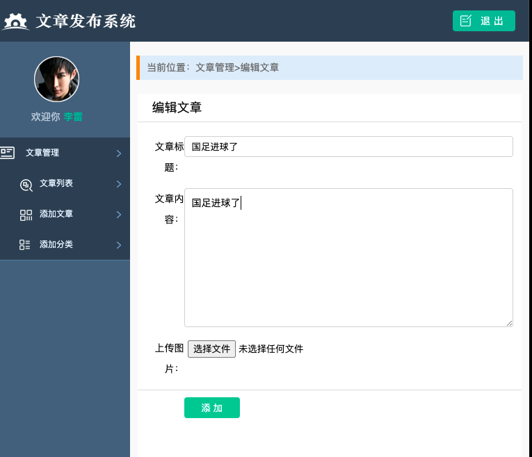

# 实现文章的删除操作

在文章的列表界面,可以进行文章的删除操作

1. 设置删除文章的路由
```go
	beego.Router("/deletearticle", &controllers.ArticleController{}, "get:DeleteArticle")

```

2. 设置控制器
```go
// 删除文章
func (c *ArticleController) DeleteArticle() {
	// 获取传递过来的文章id
	id, err := c.GetInt("articleId")
	// 数据校验
	if err != nil {
		beego.Info("传递的参数错误！", err)
	}
	//操作数据
	db := orm.NewOrm()
	var article models.Article

	article.Id = id

	//数据库删除数据
	db.Delete(&article, "Id")
	// 返回视图
	c.Redirect("/showarticle", 302)
}
```

3. 更改视图
此处的目的是,文章列表视图中的删除按钮传递参数,执行删除的时候,请求的资源为/deletearticle,传递的参数为要删除的文章的 id
```react
{{range $index , $value := .article}}

    <tr>
        <td>{{$value.Title}}</td>
        <td><a href="/showarticlecontent?articleId={{$value.Id}}">查看详情</a></td>
        <td> {{$value.Time}}</td>
        <td>{{$value.Count}}</td>
        <td><a href="/deletearticle?articleId={{$value.Id}}" class="dels">删除</a></td>
        <td><a href="#">编辑</a></td>
        <td>财经新闻</td>
    </tr>
{{end}}
```


在上面的删除中,点击删除后会立即删除,没有提示信息,应该设计删除的时候让用户确认
```react

<script>
    window.onload = function () {
        $(".dels").click(function (){
           if (!confirm("是否删除")){
               return false
           }
        })
    }
</script>
....

{{range $index , $value := .article}}

    <tr>
        <td>{{$value.Title}}</td>
        <td><a href="/showarticlecontent?articleId={{$value.Id}}">查看详情</a></td>
        <td> {{$value.Time}}</td>
        <td>{{$value.Count}}</td>
        <td><a href="/deletearticle?articleId={{$value.Id}}" class="dels" class="dels">删除</a></td>
        <td><a href="#">编辑</a></td>
        <td>财经新闻</td>
    </tr>
{{end}}

```

# 编辑文件

 

实际上功能实现的时候,是先从数据库中读取数据,然后将数据传递给视图展示,修改完毕提交后,获取到视图上的数据然后在更新到数据库中

1. 添加路由
```go
	beego.Router("/updatearticle", &controllers.ArticleController{}, "get:ShowUpdateArticle;post:HandleUpdateArticle")

```

2. 根据路由创建对应的控制器
```go
// 更新文章
func (c *ArticleController) ShowUpdateArticle() {
	c.TplName = "update.html"
	//首先获取用户要编辑的文章的id
	// 获取传递过来的文章id
	id, err := c.GetInt("articleId")
	// 数据校验
	if err != nil {
		beego.Info("传递的参数错误！", err)
	}
	// 根据id 到数据中查询数据
	db := orm.NewOrm()

	var article models.Article
	//指定查询结果
	article.Id = id
	// 执行查询操操作
	db.Read(&article)
	// 把数据传递给视图
	c.Data["article"] = article
}

func (c *ArticleController) HandleUpdateArticle() {
	// 获取用户上传的数据
	// 暂时需要获取的是文章标题，文章内容和图片
	title := c.GetString("articleName")
	content := c.GetString("content")
	// 判断输入的数据
	if title == "" && content == "" {
		beego.Info("标题或者内容不能为空")
		return
	}
	//获取用户上传的文件
	file, head, err := c.GetFile("uploadname")

	if err != nil {
		beego.Info("获取文件失败", err)
		return
	}
	defer file.Close()
	// 处理用户上传的图片
	//1。 格式为图片
	// 获取文件的后缀
	ext := path.Ext(head.Filename)

	if ext != ".jpg" && ext != ".png" && ext != ".jpeg" {
		beego.Info("上传文件格式不正确")
		return
	}
	//2。文件大小,单位是字节
	if head.Size > 1024000 {
		beego.Info("上传文件太大")
		return
	}
	//3。 不能重名，添加当前时间
	//2006-01-02 15:04:05 是固定写法
	filename := time.Now().Format("2006-01-02 15:04:05") + ext

	//插入数据库
	// 首先获取要更新的文章id
	id, err := c.GetInt("articleId")
	if err != nil {
		beego.Info("要更新的文章不存在:", err)
	}
	// 获取orm对象
	db := orm.NewOrm()
	// 获取数据库表对象
	article := models.Article{Id: id}
	// 将用户更新的数据上传
	article.Title = title
	article.Content = content
	article.Image = "./static/img/" + filename

	// 更新数据
	db.Update(&article)

	//存储用户上传的文件,应该在数据插入到数据库之后再将图片上传
	err = c.SaveToFile("uploadname", "./static/img/"+filename)
	if err != nil {
		beego.Info("保存文件失败", err)
		return
	}
	// 返回视图,返回到文章列表界面
	c.Redirect("/showarticle", 302)
}
```

3. 修改视图界面
主要是修改 form 标签中的上传参数,以及从服务器获取数据展示到界面
```react
<div class="pannel">
    <form name=logon method="post" action="/updatearticle" enctype="multipart/form-data">
        <h3 class="review_title">编辑文章</h3>
        <div class="form_group">
            <label>文章标题：</label>
            <input type="text" class="input_txt2" name="articleName" value={{.article.Title}}>
        </div>
        <div class="form_group">
            <label>文章内容：</label>
            <textarea class="input_multxt" name="content">{{.article.Content}}</textarea></textarea>
        </div>
        <div class="form_group">
            <label>上传图片：</label>
            
            <input type="file" name="uploadname" class="input_file">
        </div>
        <input name="atricleid" value={{.article.Id}} hidden="hidden">
            {{/* 使用隐藏域上传文章id属性，避免在from中上传id */}}
        <div class="form_group indent_group line_top">
            <input type="submit" value="添 加" class="confirm">
            <span>{{.errmsg}}</span>
        </div>
    </form>

</div>
```

> 上面html 界面中,最好建议使用隐藏域上传文章 id,也可以使用在发送 post 请求的时候,将 id 指定在 post 请求的 url 后面

4. 修改文章列表视图中,编辑按钮跳转到更新文章的路由
```react
{{range $index , $value := .article}}

    <tr>
        <td>{{$value.Title}}</td>
        <td><a href="/showarticlecontent?articleId={{$value.Id}}">查看详情</a></td>
        <td> {{$value.Time}}</td>
        <td>{{$value.Count}}</td>
        <td><a href="/deletearticle?articleId={{$value.Id}}" class="dels" class="dels">删除</a></td>
        <td><a href="/updatearticle?articleId={{$value.Id}}">编辑</a></td>
        <td>财经新闻</td>
    </tr>
{{end}}
```