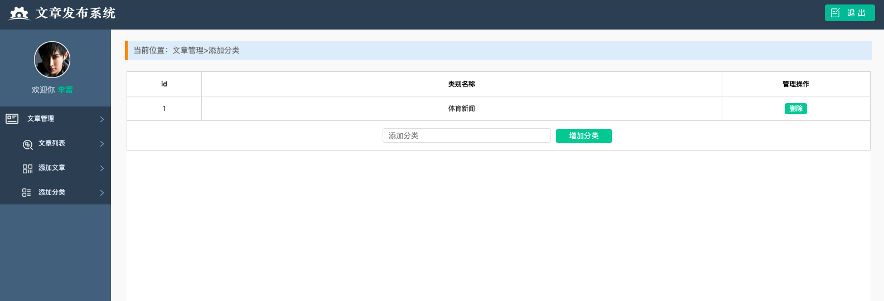

# 文章类型功能的实现

在实现文章分类之前,思考一个问题:就是文章与分类之间的关系,应该是一个分类可以对应多篇文章,还有就是文章与用户之间的关系,应该是每个用户可以查看多个文章,同时每个文章可以被多个用户查看,那么应该是多对多的关系

### 创建文章类别表,并完善上面的关系
```go
package models

import (
	"github.com/astaxie/beego/orm"
	_ "github.com/go-sql-driver/mysql"
	"time"
)

// 1. 首先定义结构体,用户表
type User struct {
	Id      int
	Name    string
	Passwd  string
	Article []*Article `orm:"rel(m2m)"`
}

//2. 文章表
type Article struct {
	Id          int          `orm:"pk;auto"`                     //文章的id
	Title       string       `orm:"size(20)"`                    //文章的标题
	Content     string       `orm:"size(500)"`                   //文章的内容
	Image       string       `orm:"size(50);null"`               //文章的图片，这里存储的是图片的路径,能够使访问加速
	Time        time.Time    `orm:"type(datetime);auto_now_add"` //文章的发布时间
	Count       int          `orm:"default(0)"`                  //文章的阅读量
	ArticleType *ArticleType `orm:"rel(fk)"`                     // 设置外键,一对多
	User        []*User      `orm:"reverse(many)"`
}

// 文章类别表

type ArticleType struct {
	Id       int        `orm:"pk;auto"`
	TypeName string     `orm:"size(20)"`
	Article  []*Article `orm:"reverse(many)"` // 设置外键,rel(fk) 和 reverse()是成对出现的
	//many 表示一对多
}

func init() {
	// 连接数据库
	orm.RegisterDataBase("default", "mysql", "root:admin123@(172.19.36.53:3306)/goMysql?charset=utf8&loc=Local")
	// 注册表
	orm.RegisterModel(new(User), new(Article), new(ArticleType))

	//3.生成表
	//1.数据库别名
	//2.是否强制更新
	//3.创建表过程是否可见
	orm.RunSyncdb("default", false, true)

}
```

创建好上面的表后,我们查看生成的表结构
```go
// 首先是一对多的表的结构
// 文章类别表,没有任何的变化,和创建的一样
mysql> desc article_type;
+-----------+-------------+------+-----+---------+----------------+
| Field     | Type        | Null | Key | Default | Extra          |
+-----------+-------------+------+-----+---------+----------------+
| id        | int(11)     | NO   | PRI | NULL    | auto_increment |
| type_name | varchar(20) | NO   |     |         |                |
+-----------+-------------+------+-----+---------+----------------+

// 文章表,文章表中多了一个字段,就是外键,指定的是文章类别表的 id
mysql> desc article;
+-----------------+--------------+------+-----+---------+----------------+
| Field           | Type         | Null | Key | Default | Extra          |
+-----------------+--------------+------+-----+---------+----------------+
| id              | int(11)      | NO   | PRI | NULL    | auto_increment |
| title           | varchar(20)  | NO   |     |         |                |
| content         | varchar(500) | NO   |     |         |                |
| image           | varchar(50)  | YES  |     | NULL    |                |
| time            | datetime     | NO   |     | NULL    |                |
| count           | int(11)      | NO   |     | 0       |                |
| article_type_id | int(11)      | NO   |     | NULL    |                |
+-----------------+--------------+------+-----+---------+----------------+

// 然后查看多对多的表
// user 表没有任何变化
mysql> desc user;
+--------+--------------+------+-----+---------+----------------+
| Field  | Type         | Null | Key | Default | Extra          |
+--------+--------------+------+-----+---------+----------------+
| id     | int(11)      | NO   | PRI | NULL    | auto_increment |
| name   | varchar(255) | NO   |     |         |                |
| passwd | varchar(255) | NO   |     |         |                |
+--------+--------------+------+-----+---------+----------------+

// 但是创建多对多的关系的时候,多了一张表,里面记录对应关系
mysql> desc user_articles;
+------------+------------+------+-----+---------+----------------+
| Field      | Type       | Null | Key | Default | Extra          |
+------------+------------+------+-----+---------+----------------+
| id         | bigint(20) | NO   | PRI | NULL    | auto_increment |
| user_id    | int(11)    | NO   |     | NULL    |                |
| article_id | int(11)    | NO   |     | NULL    |                |
+------------+------------+------+-----+---------+----------------+
```

## 文章类别添加功能的实现
有两个功能 get 请求对应显示添加文章类别的页面,post 请求表示发起创建分类的请求

1. get 请求的实现,首先设置路由表
```go
	beego.Router("/addarticletype", &controllers.TypeController{}, "get:AddArticleType")

```

2. 根据路由创建对应的控制器
```go
func (c *TypeController) AddArticleType() {
	c.TplName = "addType.html"
}
```

 

3. 从数据库中读取数据并显示在页面上
```go
func (c *TypeController) AddArticleType() {
	c.TplName = "addType.html"
	// 到数据库中查询数据
	db := orm.NewOrm()
	var articletype []models.ArticleType
	db.QueryTable("ArticleType").All(&articletype)

	//把数据传递给视图展示
	c.Data["articletype"] = articletype
}
```

4. 视图页面显示传递的参数
```go
{{range .articletype}}
    <tr>
        <td>{{.Id}}</td>
        <td>{{.TypeName}}</td>
        <td><a href="javascript:;" class="edit">删除</a></td>
    </tr>
{{end}}
```

5. post 上传请求,创建路由
```go
	beego.Router("/addarticletype", &controllers.TypeController{}, "get:AddArticleType;post:HandleAddArticleType")

```

6. 根据路由创建对应的控制器
```go
func (c *TypeController) HandleAddArticleType() {
	// 获取用户上传的数据，添加的文章类型
	typeName := c.GetString("typeName")
	// 判断上传的数据
	if typeName == "" {
		beego.Info("添加的类型为空")
		c.Redirect("/addarticletype", 302)
		return
	}
	// 插入数据到数据库
	db := orm.NewOrm()
	var articletype []models.ArticleType
	//判断分类是否存在
	//首先查询所有
	db.QueryTable("ArticleType").All(&articletype)
	for _, date := range articletype {
		if typeName == date.TypeName {
			beego.Info("添加失败，分类存在")
			c.Redirect("/addarticletype", 302)
			return
		}
	}
	// 如果添加的分类不存在的话，插入数据库
	var newType models.ArticleType
	newType.TypeName = typeName
	_, err := db.Insert(&newType)
	if err != nil {
		beego.Info("插入失败", err)
		return
	}
	c.Redirect("/addarticletype", 302)
}
```

7. 修改视图
主要是修改 form 标签对应的属性
```go
<td colspan="3">
    <form method="post" action="/addarticletype">
        <input type="text" class="type_txt" placeholder="添加分类" name="typeName">
        <input type="submit" class="addtype" value="增加分类">
    </form>
</td>
```


## 文章类型下拉框的绑定
在所有文章的列表页和添加文章的页面的下拉框中,都有关于文章类别的选择,下面来完善这些功能

#### 完成文章列表页的分类功能

1. 在文章显示的列表页设置对应的功能
```go
func (c *ArticleController) ShowArticleList() {
	c.TplName = "index.html"

	//1. 查询
	// 获取 orm 对象
	db := orm.NewOrm()
	// 获取 QuerySeter对象
	ps := db.QueryTable("Article")
	// 创建models.Article 类型的切片
	var article []models.Article

	// 获取条目淑
	num, err := ps.Count()
	if err != nil {
		beego.Info("查询 错误：", err)
		return
	}
	c.Data["num"] = num
	// 获取页数，这里设置每页显示两个
	pageNum := 2
	//c.Data["pageNum"] = num/int64(pageNum) + num%int64(pageNum)
	c.Data["pageNum"] = math.Ceil(float64(num) / float64(pageNum))
	//math.Ceil()函数是向上取整
	//math.Floor() 函数是向下取整

	// 指定页数
	pageIndex, err := strconv.Atoi(c.GetString("pageindex"))
	if err != nil {
		pageIndex = 1
	}
	if pageIndex == 1 {
		FirstPage := true
		c.Data["FirstPage"] = FirstPage
	}
	if pageIndex == int(math.Ceil(float64(num)/float64(pageNum))) {
		LastPage := true
		c.Data["LastPage"] = LastPage
	}

	ps.Limit(pageNum, pageIndex-1).All(&article)
	//2。 把数据传递给视图显示
	c.Data["article"] = article
	c.Data["index"] = pageIndex
	// 查询所有分类
	var articletype []models.ArticleType
	db.QueryTable("ArticleType").All(&articletype)

	// 传递给视图
	c.Data["type"] = articletype
}
```

2. 在视图界面显示分类
```go
<select name="select" id="select" class="sel_opt">
    {{range .type}}
        <option selected="true">{{.TypeName}}</option>
    {{end}}
</select>
```

#### 在添加文章的页面实现相同的功能
1. 在添加文章的页面设置对应的功能
```go
func (c *ArticleController) ShowAddArticle() {
	c.TplName = "add.html"
	// 从数据库查询所有的分类，并传递给视图
	db := orm.NewOrm()
	var articletype []models.ArticleType

	db.QueryTable("ArticleType").All(&articletype)

	c.Data["type"] = articletype
}
```

2. 更改视图显示分类
```go
<select class="sel_opt" name="select">
    {{range .type}}
        <option>{{.TypeName}}</option>
    {{end}}
</select>
```


## 添加文章的时候,插入文章的分类
添加文章的时候,因为 select 下拉框是包含在 form 中的,就能获取到这个分类,那么插入的时候,就可以插入对应的分类,但是因为在 article 表中 articeType 是外键,不能直接插入这个值,要插入的是分类对应的类型对象,那么就要先获取到这个对象,在赋值插入

1. 在添加文章的控制器中实现插入分类
```go
func (c *ArticleController) HandleArticle() {
	// 获取用户上传的数据
	// 暂时需要获取的是文章标题，文章内容和图片
	title := c.GetString("articleName")
	content := c.GetString("content")
	// 获取到下拉框文章分类的值
	typeNme := c.GetString("select")
	// 判断输入的数据
	if title == "" && content == "" && typeNme == "" {
		beego.Info("标题或者内容不能为空")
		return
	}
	//获取用户上传的文件
	file, head, err := c.GetFile("uploadname")
	defer file.Close()
	if err != nil {
		beego.Info("获取文件失败", err)
		return
	}

	// 处理用户上传的图片
	//1。 格式为图片
	// 获取文件的后缀
	ext := path.Ext(head.Filename)

	if ext != ".jpg" && ext != ".png" && ext != ".jpeg" {
		beego.Info("上传文件格式不正确")
		return
	}
	//2。文件大小,单位是字节
	if head.Size > 1024000 {
		beego.Info("上传文件太大")
		return
	}
	//3。 不能重名，添加当前时间
	//2006-01-02 15:04:05 是固定写法
	filename := time.Now().Format("2006-01-02 15:04:05") + ext

	//获取orm 对象，以及表对象，并赋值
	db := orm.NewOrm()
	article := models.Article{}
	article.Title = title
	article.Content = content
	article.Image = "./static/img/" + filename

	// 获取文章分类对象
	var articleType models.ArticleType
	articleType.TypeName = typeNme
	err = db.Read(&articleType, "TypeName")
	if err != nil {
		beego.Info("文章类型没有获取到", err)
		return
	}
	// 给文章类型赋值，注意是类型对象
	article.ArticleType = &articleType
	//插入数据库
	_, err = db.Insert(&article)
	if err != nil {
		beego.Info("写入数据库失败", err)
		return
	}

	//存储用户上传的文件,应该在数据插入到数据库之后再将图片上传
	err = c.SaveToFile("uploadname", "./static/img/"+filename)
	if err != nil {
		beego.Info("保存文件失败", err)
		return
	}
	// 返回视图,返回到文章列表界面
	c.Redirect("/showarticle", 302)
}
```

## 在文章列表界面,根据选择的分类展示对应的新闻
首先要思考一个问题,就是要实现这个功能的话,需要将我们选择的分类的 id 传递给后端服务器,这样服务器才能根据分类去筛选数据,那么要实现这个功能可以通过 js 去实现,利用选择下拉框选择的 change 事件来来实现

1. 在视图中添加该功能
```go
// 下拉框的原本写法
<select name="select" id="select" class="sel_opt">
    {{range .type}}
        <option selected="true">{{.TypeName}}</option>
    {{end}}
</select>

// 但是我们想的是,要在用户选择下拉框的时候,向服务器端提交这个分类的数据
// 那么就需要 form 标签来提交数据,但是又没有按钮,要通过 js 来实现这个功能
<script>
    window.onload = function () {
        $(".dels").click(function () {
            if (!confirm("是否删除")) {
                return false
            }
        })
        $("#select").change(function () {
            $("#form").submit()
        })
    }
</script>
....
// 理论上来说,这个 form 应该使用的是 post 请求
// 但是因为在首页信息展示的时候,已经实现了太多的功能
// 如果要是使用新的控制器实现这个 post 方法,还需要重写这些功能,导致代码累赘
// 所以直接使用 get 请求,到首页信息展示的控制器中实现这个功能
<form id="form" method="get" action="/showarticle">
<select name="select" id="select" class="sel_opt">
    {{range .type}}
        {{if compare .TypeName $.typeName}}
            <option selected="true">{{.TypeName}}</option>
        {{else}}
            <option>{{.TypeName}}</option>
        {{end}}
    {{end}}
</select>
</form>
....
// 同时还要实现在使用上一页或者下一页的时候,传递当前的分类
{{ if compare .FirstPage true }}

{{ else }}}
    <li><a href="/showarticle?pageindex=1&select={{.typeName}}">首页</a></li>
    <li><a href="/showarticle?pageindex={{.index | BeferPage}}&select={{.typeName}}">上一页 </a></li>
{{end}}

{{ if compare .LastPage true }}

{{else}}
    <li><a href="/showarticle?pageindex={{.index | AfterPage}}&select={{.typeName}}">下一页</a></li>
    <li><a href="/showarticle?pageindex={{.pageNum}}&select={{.typeName}}">末页</a></li>
{{end}}
```

2. 根据上面 form 的 get 请求到的控制器,实现这个功能
```go
func (c *ArticleController) ShowArticleList() {
	c.TplName = "index.html"
	//查新数据库
	db := orm.NewOrm()

	qs := db.QueryTable("Article")

	var article []models.Article
	// 查询记录数
	typeName := c.GetString("select")
	var count int64

	// 获取总页数
	pageSize := 2
	// 获取页码
	pageindex, err := c.GetInt("pageindex")
	// 如果没有获取到页码，默认为1
	if err != nil {
		pageindex = 1
	}
	// 根据粉来获取数据条目
	if typeName == "" {
		// 如果没有获取到类型，那么默认查询全部数据条目,无论是什么分类
		count, _ = qs.Count()

	} else {
		// 获取到分类，按分类查询
		count, _ = qs.Filter("ArticleType__TypeName", typeName).Count()
	}
	//	获取所有的分类
	var types []models.ArticleType
	db.QueryTable("ArticleType").All(&types)

	//根据分类获取数据
	if typeName == "" {
		// 如果没有获取到分类，默认查看所有到数据
		qs.Limit(pageSize, (pageindex-1)*pageSize).RelatedSel("ArticleType").All(&article)
	} else {
		qs.Limit(pageSize, (pageindex-1)*pageSize).RelatedSel("ArticleType").Filter("ArticleType__TypeName", typeName).All(&article)
	}

	// 判断首页和未页
	if pageindex == 1 {
		FirstPage := true
		c.Data["FirstPage"] = FirstPage
	}
	if pageindex == int(math.Ceil(float64(count)/float64(pageSize))) {
		LastPage := true
		c.Data["LastPage"] = LastPage
	}

	// 向视图传递数据
	c.Data["article"] = article
	//向视图传递总页数和总记录数和当前页
	c.Data["pageNum"] = math.Ceil(float64(count) / float64(pageSize))
	c.Data["num"] = count
	c.Data["index"] = pageindex
	//向视图传递所有的分类
	c.Data["type"] = types
	//向视图传递当前的分类
	c.Data["typeName"] = typeName

}

```

## 删除分类功能的实现

1. 设置删除分类的路由
```go
	beego.Router("/deletearticletype", &controllers.TypeController{}, "get:DeleteArticleType")
```

2. 设置对应路由的控制器
```go
func (c *TypeController) DeleteArticleType() {
	// 首先获取要删除的文章的id
	id, err := c.GetInt("articletypeid")
	// 校验数据
	if err != nil {
		beego.Info("传递的参数错误！", err)
		c.Redirect("/addarticletype", 302)
		return
	}
	//数据库操作
	db := orm.NewOrm()
	var articletype models.ArticleType
	articletype.Id = id

	db.Delete(&articletype, "Id")
	// 返回视图
	c.Redirect("/addarticletype", 302)
}
```

3. 修改对应的视图
```go
{{range .articletype}}
    <tr>
        <td>{{.Id}}</td>
        <td>{{.TypeName}}</td>
        <td><a href="/deletearticletype?articletypeid={{.Id}}"     class="edit">删除</a></td>
    </tr>
{{end}}
```