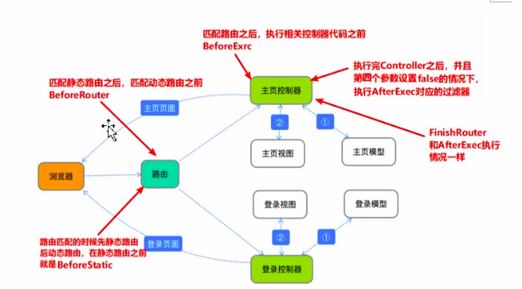

# 记住用户名功能的实现

要实现记住用户名,就要有地方存储用户名,因为记住用户名是有时间限制的,那么去哪里临时存储这个用户名呢

### cookie
作用: 能把数据存储在浏览器一段时间,当设置的有效时间结束,cookie 失效

##### 用法
以 key - value 的方式传递给浏览器
```go
//发送 cookie
func (ctx *Context) SetCookie(name string, value string, others ...interface{}) {
	ctx.Output.Cookie(name, value, others...)
}

// 第一个参数是 key
// 第二个参数是 value
// 第三个参数是有效时间


// 获取 cookie,指定 key 值,获取 value
func (ctx *Context) GetCookie(key string) string {
	return ctx.Input.Cookie(key)
}
```

#### 流程
1. 登录成功后,设置 cookie

2. 下次登录时,判断 cookie 是否有内容

3. 如果有内容的话,就直接取 cookie 的值传递给视图

## 完成这个功能

1. 在负责登录的控制器中,登录成功后发送 cookie
```go
func (c *UserController) HandleLogin() {
	// 获取用户传递的数据
	username := c.GetString("userName")
	password := c.GetString("password")

	//进行数据校验
	if username == "" || password == "" {
		//c.Data["res"] = "输入的数据不完整，请重新输入！"
		beego.Info("输入的数据不完整，请重新输入！")
		c.TplName = "register.html"
		return
	}
	// 查询数据库
	db := orm.NewOrm()
	user := models.User{}
	user.Name = username

	err := db.Read(&user, "Name")
	if err != nil {
		beego.Info("用户名或密码错误，请重新登录")
		c.TplName = "login.html"
		return
	}
	if user.Passwd != password {
		beego.Info("用户名或密码错误，请重新登录")
		c.TplName = "login.html"
		return
	}

	// 获取点击记住用户名的时候，传递的值
	rem := c.GetString("remember")
	if rem == "on" {
		// 勾选记住用户的按钮后，设置cookie
		c.Ctx.SetCookie("username", username, time.Second*3600)
		// 返回登录成功的信息
	} else {
		// 没有勾选记住用户的按钮，删除cookie
		c.Ctx.SetCookie("username", username, -1)
	}

	c.Redirect("/showarticle", 302)
}
```

2. 在用户登录界面的控制中,根据是否发送了 cookie,自动填充用户名
```go
func (c *UserController) ShowLogin() {
	c.TplName = "login.html"
	username := c.Ctx.GetCookie("username")
	if username != "" {
		// 将数据传递给视图
		c.Data["user"] = username
		// 默认勾选记住用户名
		c.Data["check"] = "checked"
	}

}
```

3. 在登录的视图中获取数据
```go
<body>
    <div class="login_logo">
        
    </div>
    <form  class="login_form"  name = "login" action="/login" method="post">
        <h1 class="login_title">用户登录</h1>
        <input type="text"  class="input_txt" name = "userName" value={{ .user }}>
        <input type="password" name = "password"  class="input_txt">
        <div class="remember"><input type="checkbox" name="remember" {{.check}} ><label>记住用户名</label></div>
        <input type="submit" value="登 录" class="input_sub">
    </form>
    <div class="login_bg"></div>
</body>
```


## 登录判断功能

后台的页面需要由权限的限制,那么最简单的权限控制就是不登录不让查看,那么就应该去判断用户是否登录了,那么可以把登录信息存储在一个地方,如果能获取到表上已经登录了,就允许访问,如果获取不到就表示没有登录,退出登录的时候要清除这个信息

如果用 cookie 来实现的话,cookie 信息是存储在浏览器上的,不是十分安全

### Session
session 的原理和 cookie差不多,cookie 是存储在浏览器端的数据,session 是保存在服务器端的数据,session 的保存方法有很多,比如在内存,文件和数据库中都可以存储 session

beego 默认吧 session 数据保存在内存中,临时存储数据,如果浏览器关闭,session 数据会丢失

##### session 和 cookie 的区别
| 区别     | session        | cookie               |
| -------- | -------------- | -------------------- |
| 存储位置 | 存储在服务器   | 存储在浏览器(客户端) |
| 安全性   | 高             | 低                   |
| 生命周期 | 关闭浏览器失效 | 设置时间结束失效     |


#### 用法
用户登录成功设置 session ,访问网页的时候判断是否有有 session 的值,如果有就跳转到指定的页面,如果没有跳转到登录页面

如果要使用 session,那么要在配置文件中开启这个选项
```go
sessionon=true
```

设置 session
```go
func (c *Controller) SetSession(name interface{}, value interface{}) {
	if c.CruSession == nil {
		c.StartSession()
	}
	c.CruSession.Set(name, value)
}
// session 同样是 key-value 形式的存储
// 参数分别问 key 和 value
```

获取 session
```go
func (c *Controller) GetSession(name interface{}) interface{} {
	if c.CruSession == nil {
		c.StartSession()
	}
	return c.CruSession.Get(name)
}
// 参数是 key,返回指定的 key 对应的 value
```

删除 session
```go
func (c *Controller) DelSession(name interface{}) {
	if c.CruSession == nil {
		c.StartSession()
	}
	c.CruSession.Delete(name)
}
// 根据指定的 key,删除对应的 value
```

## 完善业务流程
1. 修改配置文件,开启 session
```go
// conf/app.conf
appname = quickstart
httpport = 8080
runmode = dev
sessionon=true
```

2. 登录成功的时候设置 session
```go
c.SetSession("username", username)
```

3. 显示文章列表的时候,判断 session
```go
func (c *ArticleController) ShowArticleList() {
  // 判断session
  username := c.GetSession("username")
  if username == nil {
      //没有session，回到登录界面
      c.Redirect("/login", 302)
      return
  }
...
}
```

#### 退出登录

1. 修改视图中退出按钮的请求地址
```go
<div class="header">
    <a href="#" class="logo fl"></a>
    <a href="logout" class="logout fr">退 出</a>
</div>
```

2. 根据请求地址设置路由
```go
	beego.Router("/logout", &controllers.UserController{}, "get:Logout")

```

3. 创建对应的控制器
```go
// 退出登录
func (c *UserController) Logout() {
	//删除session
	c.DelSession("username")
	// 返回视图
	c.TplName = "login.html"
}
```

## 过滤器函数

上面我们实现了访问首页的时候,根据 session 判断用户是否有权限访问,那么我们所有的界面都需要去做 session 判断,这样是使代码很繁琐,那么通过过滤器函数,就能实现每个页面都能实现登录判断,而不是在每一个页面写登录判断的代码

#### 过滤器函数
路由过滤器,可以指定路由匹配规则和匹配时间点去执行自定义函数,函数一般放在 beego.router()之前

函数格式
```go
func InsertFilter(pattern string, pos int, filter FilterFunc, params ...bool) *App {
	BeeApp.Handlers.InsertFilter(pattern, pos, filter, params...)
	return BeeApp
}
// pattern:路由规则,可以根据一定的规则进行路由,如果全匹配可以使用 "*"号
// pos : 执行 filter 的时间,五个固定参数如下:分别表示不同的执行过程时间点
    // BeforeStatic: 静态地址之前
    // BeforeRouter:寻找路由之前
    // BeforeExec:找到路由之后,开始执行相应的 controller 之前
    // AfterExec:执行完 controller 逻辑之后执行的过滤器
    // FinishRouter : 执行完逻辑之后执行的过滤器
        // 最后两个参数要结合第四个参数使用
        //默认为 false,表示执行完控制器之后就结束了不再执行别的
        // 如果为 true表示执行完毕控制器之后再去执行过滤器中指定的函数
// filter : 过滤器函数type FilterFunc func(*context.Context)
//示例代码
```

 

示例代码
```go
package routers

import (
	"github.com/astaxie/beego"
	"github.com/astaxie/beego/context"
	"quickstart/controllers"
)

func init() {
    // 设置路由过滤器
	var BeferExecFunc = func(ctx *context.Context) {
		username := ctx.Input.Session("username")
		if username == nil {
			ctx.Redirect(302, "/login")
		}
	}
	beego.InsertFilter("/article/*", beego.BeforeExec, BeferExecFunc)

	beego.Router("/register", &controllers.UserController{}, "get:ShowRegister;post:HandleRegister")

	beego.Router("/login", &controllers.UserController{}, "get:ShowLogin;post:HandleLogin")

	beego.Router("/article/showarticle", &controllers.ArticleController{}, "get:ShowArticleList")
...
}

```