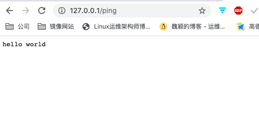
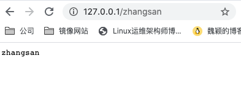
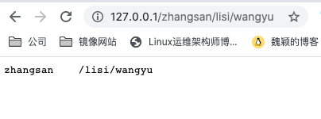
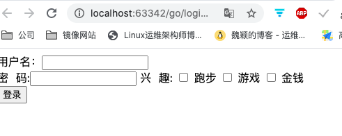
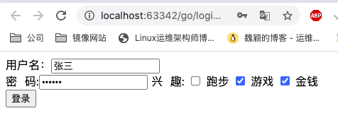
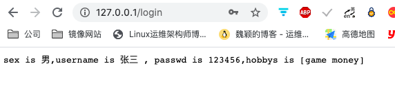

## 介绍

gin 是一个 Golang 的微框架,封装的比较优雅,API 友好,源码注释比较明确,具有快速灵活,容错方便等特点

对于 Golang 而言,web 框架的依赖要远比 Python 或者 jaav 之类的要小,自身的 `net/http`足够简单,性能也不错

借助框架开发,不仅可以省去很多常用的封装带来的时间,也有助于团队的编码风格和形成规范

## 安装
```bash
go get -u -v github.com/gin-gonic/gin
```

## 简单的使用gin完成helllo world
```go
package main

import (
	"github.com/gin-gonic/gin"
	"net/http"
)

func main() {
	// 1. 创建路由，返回Engine
	r := gin.Default()
	// 2. 绑定路由规则
		// get 方法参数为访问的地址和回调函数
	r.GET("/ping", func(c *gin.Context) { // gin.Context 中封装了 request和resp
		// 返回的数据，code为状态码http.StatusOK 表示200，后面是要返回的数据
		c.String(http.StatusOK,"hello world")
	})
	// 3. 监听端口，默认为8080
	r.Run(":80")
}
```

 

## Gin 的路由

1. 基本路由

- gin 框架的路由库是基于 `httprouter`做的
- httprouter 的地址为:[https://github.com/julienschmidt/httprouter](https://github.com/julienschmidt/httprouter)

2. Restful 风格的 API

- gin 支持 Restful 风格的 API
- Restful 是一种互联网应用程序的 API 设计理念: URL 定位资源,使用 HTTP 描述操作(get,put 或者 del 等)

3. API 参数
可以通过 Context 的 Param 方法来获取 API 参数

```go
package main

import (
	"github.com/gin-gonic/gin"
)

func main() {
	// 1. 创建路由，返回Engine
	r := gin.Default()
	// 2. 绑定路由规则
		// get 方法参数为访问的地址和回调函数
	r.GET("/:name", test)
	// 3. 监听端口，默认为8080
	r.Run(":80")
}

func test(c *gin.Context)  {
	name := c.Param("name")
	c.String(200,name)
}
```

访问测试
 

获取多个参数
```go
package main

import (
	"github.com/gin-gonic/gin"
)

func main() {
	// 1. 创建路由，返回Engine
	r := gin.Default()
	// 2. 绑定路由规则
		// get 方法参数为访问的地址和回调函数
	r.GET("/:name/*other", test)
	// 3. 监听端口，默认为8080
	r.Run(":80")
}

func test(c *gin.Context)  {
	name := c.Param("name")
	other := c.Param("other")
	c.String(200,name + "    "+ other)
}
```

访问测试
 

4. URL 传参

URL 参数可以通过 DefaultQuery():  或 Query() 方法获取

- DefaultQuery(): 如过参数不存在会有默认值,两个参数,第一个参数是key,第二个参数是指定的默认值
- Query(): 如果不存在放回空串

```go
package main

import (
	"github.com/gin-gonic/gin"
)

func main() {
	// 1. 创建路由，返回Engine
	r := gin.Default()
	// 2. 绑定路由规则
		// get 方法参数为访问的地址和回调函数
	r.GET("/user", test)
	// 3. 监听端口，默认为8080
	r.Run(":80")
}

func test(c *gin.Context)  {
	name := c.DefaultQuery("name","jack")
	c.String(200,name)
}
```

访问测试
```bash
$ curl 127.0.0.1/user # 没有参数,返回指定的默认值
jack
$ curl 127.0.0.1/user?name=maria  # 匹配到参数
maria
```

5. 表单传参
表单传输为 post 请求,http 常见的传输格式为四种:

- application/json
- application/x-www-form-urlencoded
- application/xml
- multipart/form-data

表单参数可以通过 PostForm() 方法获取,该方法默认解析的是x-www-form-urlencoded 或者 form-data格式的参数

比如说现在有下面的 html 界面
```html
<!DOCTYPE html>
<html lang="en">
<head>
    <meta charset="UTF-8">
    <title>登录</title>
</head>
<body>

    <form action="http://127.0.0.1/login" method="post" enctype="application/x-www-form-urlencoded">
        用户名：<input type="text" name="username">
        <br>
        密&nbsp&nbsp码:<input type="password" name="password">
        兴&nbsp&nbsp趣:
        <input type="checkbox" value="run" name="hobby"> 跑步
        <input type="checkbox" value="game" name="hobby"> 游戏
        <input type="checkbox" value="money" name="hobby"> 金钱
        <br>
        <input type="submit" value="登录">
    </form>

</body>
</html>
```
 

上面的前端界面中点击登录后,后台能够接收到用户传递的参数,下面在后台获取参数

```go
package main

import (
	"fmt"
	"github.com/gin-gonic/gin"
)

func main() {
	// 1. 创建路由，返回Engine
	r := gin.Default()
	// 2. 绑定路由规则
		// Post 方法参数为访问的地址和回调函数
	r.POST("/login", test)
	// 3. 监听端口，默认为8080
	r.Run(":80")
}

func test(c *gin.Context)  {
	//设置默认参数
	sex := c.DefaultPostForm("sex","男")
	// 接收其他的参数
	usernmae := c.PostForm("username")
	password := c.PostForm("password")
	//获取多选框
	hobbys := c.PostFormArray("hobby")
	c.String(200,fmt.Sprintf("sex is %s,username is %s , passwd is %s,hobbys is %v",sex,usernmae,password,hobbys))
}
```

前端提交测试
 

查案返回的结果

 


6. 上传单个文件

- multipart/form-data 格式用于文件上传
- gin 文件上传与原生的 net/http 方法类似,不同与在 gin 把原生的 request 封装到 c.Request

现在有下面的html 页面,用于提交文件
```html
<!DOCTYPE html>
<html lang="en">
<head>
    <meta charset="UTF-8">
    <title>登录</title>
</head>
<body>

    <form action="http://127.0.0.1/login" method="post" enctype="multipart/form-data">
        图片：<input type="file" name="file">
        <br>
        <input type="submit" value="提交">
    </form>

</body>
</html>
```

后台获取上传的文件
```go
package main

import (
	"fmt"
	"github.com/gin-gonic/gin"
)

func main() {
	// 1. 创建路由，返回Engine
	r := gin.Default()
	// 2. 绑定路由规则
		// get 方法参数为访问的地址和回调函数
	r.POST("/upload", test)
	// 3. 监听端口，默认为8080
	r.Run(":80")
}

func test(c *gin.Context)  {
	// 获取表单文件
	file , err := c.FormFile("file")
	if err != nil {
		fmt.Println("获取文件失败：",err)
		return
	}
	// 存储文件, 参数为获取的文件指针和文件名，默认存放在程序所在的目录
	err = c.SaveUploadedFile(file,file.Filename)
	if err != nil {
		fmt.Println("存储文件失败：",err)
		return
	}
	c.String(200,fmt.Sprintln("存储文件成功：",file.Filename))
}
```

启动程序测试

7. 上传多个文件

修改html 参数,使其支持上传多个文件
```html
<!DOCTYPE html>
<html lang="en">
<head>
    <meta charset="UTF-8">
    <title>登录</title>
</head>
<body>

    <form action="http://127.0.0.1/upload" method="post" enctype="multipart/form-data">
        图片：<input type="file" name="files" multiple>
        <br>
        <input type="submit" value="提交">
    </form>

</body>
</html>
```

后台接收文件
```go
package main

import (
	"fmt"
	"github.com/gin-gonic/gin"
)

func main() {
	// 1. 创建路由，返回Engine
	r := gin.Default()
	// 2. 绑定路由规则
	// get 方法参数为访问的地址和回调函数
	// 设置上传文件的大小，默认为32M,现在设置为8M
	r.MaxMultipartMemory = 8 << 20
	r.POST("/upload", test)
	// 3. 监听端口，默认为8080
	r.Run(":80")
}

func test(c *gin.Context) {
	// 获取整个表单
	form ,err := c.MultipartForm()
	if err != nil {
		c.String(400,fmt.Sprintln("err:",err.Error()))
	}
	// 获取表单中的所有文件
	files ,_ := form.File["files"]
	//遍历所有的文件，逐个存储
	for _,file := range files {
		err = c.SaveUploadedFile(file, file.Filename)
		if err != nil {
			c.String(400,fmt.Sprintln("err:",err.Error()))
			return
		}
		c.String(200, fmt.Sprintln("存储文件成功：", file.Filename))
	}
}
```

上传文件测试

8. routes group

- toutes group: 路由组,为了管理一些相同的 URL

创建路由组测试

```go
package main

import (
	"fmt"
	"github.com/gin-gonic/gin"
)

func main() {
	// 1. 创建路由，返回Engine
	r := gin.Default()
	// 2. 绑定路由规则
	// 设置路由组
	v1 := r.Group("/v1")
	{
		v1.GET("/login",loginv1)
		v1.GET("/upload",uploadv1)
	}

	v2 := r.Group("/v2")
	{
		v2.POST("/login",loginv2)
		v2.POST("/upload",uploadv2)
	}
	// 3. 监听端口，默认为8080
	r.Run(":80")
}

func loginv1(c *gin.Context)  {
	username := c.DefaultQuery("name","jack")
	c.String(200,fmt.Sprintln("username is :",username))
}

func uploadv1(c * gin.Context) {
	username := c.DefaultQuery("name","maria")
	c.String(200,fmt.Sprintln("username is :",username))
}

func loginv2(c *gin.Context)  {
	username := c.DefaultQuery("name","张三")
	c.String(200,fmt.Sprintln("username is :",username))
}

func uploadv2(c * gin.Context) {
	username := c.DefaultQuery("name","李四")
	c.String(200,fmt.Sprintln("username is :",username))
}


```

使用命令测试
```bash
$ curl 127.0.0.1/v1/login
username is : jack
$ curl 127.0.0.1/v1/upload?name=bbb
username is : bbb
$ curl -X POST 127.0.0.1/v2/login
username is : 张三
$ curl -X POST 127.0.0.1/v2/upload?name=bbb
username is : bbb
```

9. 路由原理

- httprouter 会将所有的路由规则构造成一颗前缀树