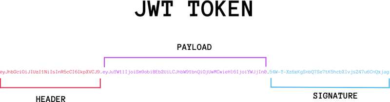

## JWT

Json Web Token 是目前最流行的跨域认证解决方案

#### 一般的认证流程

1. 用户向服务器发送用户名和密码
2. 服务器验证通过后,在当前对话(session)里面保存相关的数据
3. 服务器向用户返回一个 session_id,将其写入到cookie
4. 用户随后的每一层请求,都会通过 cookie,将 session_id 发送到服务器
5. 服务器接收到用户发送过来的 session_id,找到前期保存的数据,由此可以获得用户的身份

这种模式的问题在于,扩展性不好,单机是没有问题的,如果是服务器集群,或者是跨域的服务导向架构,就要求 session 数据共享,每台服务器都能够读取 session 才行

> 比如说: A 网站和 B 网站是同一家公司的关联服务器,现在要求,用户只要在其中一个网站登录,再访问另一个网站就能自动登录,这个使用 session 的方式就会比较麻烦

上面例子中,有两种解决方案:

- session 数据持久化,写入数据库或者别的持久层,各个服务收到请求后,都向持久层请求数据,这种方式的缺点就是工程量比较大
- JWT: 服务器不保存 session 数据,所有的数据都保存在客户端,每次请求都发送到服务器

### JWT 原理

JWT 的原理是,服务器认证后,会生成一个 JSON 对象, 将其返回给客户端,例如下面的这种格式

```json
{
  "姓名": "张三",
  "角色": "管理员",
  "到期时间": "2018年7月1日0点0分"
}
```

以后,用户与服务器端进行通信的时候,都需要发回这个 json 的对象,服务器认证完全靠这个对象认定用户身份,为了防止用户篡改数据,服务器在生成这个对象的时候,会加上签名

> 这样的话,服务器就不会保存任何的 session 数据了,也就是说,服务变成 了无状态的服务,从而比较容易的实现扩展

### JWT 的数据结构

实际的 JWT大概就像是下面的这种格式

```
eyJhbGciOiJSUzI1NiIsInR5cCIgOiAiSldUIiwia2lkIiA.
IiwiZW1haWwiOiIxMjQ5MDAyMDQ0QHFxLmNvbSJ9.
quixFeeOT8B4PpsiWSSLMz7_on5lEqI6stsSoTiVdy7uSN5B
```

是一个很长的字符串,中间使用`.`分隔成三部分,注意,JWT内部数没有换行的.这里只是为了便于观察才会分成了几行

JWT 的三部分主要是如下含义:

- Header: 头部信息
- Payload: 负载
- Signature: 签名

```
Header.Payload.Signature
```



### Header

Header 部分是一个 json 对象,描述 JWT 的元数据,通常是下面的样子

```json
{
  "alg": "HS256",
  "typ": "JWT"
}
```

上面的代码中,`alg`属性表示签名的算法,默认是 SHA256(写成 HS256),`typ`属性表示这个令牌的类型为 JWT

> 最后将上面 json 对象使用 base64URL 算法转化成字符串

### Payload

Payload 部分也是一个 json 对象,用来存放实际需要传递的数据,JWT 官方值规定了 7 个官方字段:

- iss(issuer): 签发人
- exp(expiration time): 过期时间
- sub(subject): 主题
- aud(audience): 受众
- nbf(not before): 生效时间
- jat(issued at): 签发时间
- jti(jwt id): 编号

除了上面官方指定的字段,也可以自定义私有的字段

```json

{
  "sub": "1234567890",
  "name": "John Doe",
  "admin": true
}
```

> JWT 默认是不加密的,任何人都可以读到,所以不要把私密的信息放在这个部分中

Payload 部分的 json 对象也要使用 base64url 算法转换成字符串


### Signature

Signature 部分是对前两部分的签名,防止数据发生篡改

首先,需要指定一个密钥(secret),这个密钥只有服务器才能知道,不能泄露给用户,然后使用 Header 里面指定的算法,按照下面的方式进行签名

```go
HMACSHA256(
  base64UrlEncode(header) + "." +
  base64UrlEncode(payload),
  secret)
```

算出签名以后，把 Header、Payload、Signature 三个部分拼成一个字符串，每个部分之间用"点"（`.`）分隔，就可以返回给用户。


### base64url

前面提到,header 和 payload 串行化的方式是使用 base64url 算法,这个算法跟 base64 算法基本类似,但是有一些很小的不同


JWT 作为一个令牌(token),有些场合可能会放到 URL 中(比如: api.exapmle.com/?token=xxx),这种情况下的话,Base64 有三个字符`+`、`/`和`=`，在 URL 里面有特殊含义，所以要被替换掉：`=`被省略、`+`替换成`-`，`/`替换成`_` 。这就是 Base64URL 算法。

### JWT 的使用方式

客户端接收到服务器端返回的 JWT,可以存储在 Cookie 里面,也可以存储在 LocalStorage

此后,客户端每次与服务器通信,都要带上这个 JWT,你可以把它放在 Cookie 里面自动发送,但是这样不能跨域,最好的做法是放在 HTTP 请求的头部`Authorization`字段里面

```
Authorization: Bearer <token>
```

另一种做法就是,跨域的时候,JWT就放在POST 请求的数据体里面

## JWT 的特点

1. JWT 默认是不加密的,但是也可以加密,生成原始的 token 后,可以再使用密钥加密一次
2. JWT 不加密的情况下,不能将私密的数据写入到 JWT 中
3. JWT 不仅可以用于认证,也可以用于交换信息,有效的使用 JWT,可以降低服务器查询数据库的次数
4. JWT 的最大缺点是,由于服务器不保存 session 状态,因此无法在使用的过程中废止某个 token,或者更改 token 的权限,也就是说,一旦 JWT 签发了,在到期之前就会始终有效,除非是服务器部署了额外的逻辑
5. JWT 本身包含了认证信息,一旦泄露,任何人都可以获得该令牌的所有权限,为了减少盗用,JWT 的有效期应该设置的比较短,对于一些比较重要的权限,使用的时候应该再次对用户进行认证
6. 为了减少盗用,JWT 不应该使用 HTTP 协议明码传输,要使用 HTTPS 协议传输