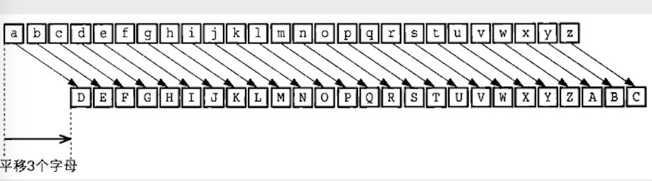

## 基础知识
#### 为什么要加密
为了数据在传输的过程中的数据安全,需要对数据进行加密

#### 加密三要素

- 明文/密文
加密之前的数据称为明文,加密之后的数据称为密文

- 密钥:对数据进行加密解密的工具
然而，密码算法中的密钥，则是像203554728568477650354673080689430768这样的一串非常大的数字。具体的长度需要使用加密算法来得到定长的长度

- 加密算法/解密算法: 通过加密算法将明文数据进行加密,通过解密算法将密文数据进行解密
从明文生成密文的步骤，也就是加密的步骤，称为“加密算法"，而解密的步骤则称为“解密算法"。加密、解密的算法合在一起统称为**密码算法**。


## 对称加密和非对称加密

#### 对称加密

对称加密也称为对称密码,是指在加密和解密的时候使用的是用一个密钥

- 特点:
  - 双方向保证数据的安全性
  - 加密效率高,适合加密大数据,大文件
  - 加密强度相对非对称加密不高
  
#### 非对称加密
非对称加密中,密钥有公钥个私钥,需要使用密钥生成算法来得到密钥对

- 公钥: 可以公开的密钥
使用公钥加密的数据,必须使用对应的私钥进行解密

- 私钥: 需要妥善保管,私有密钥
使用私钥加密,必须使用对应的公钥才能解密

- 特点
  - 数据的机密性只能单方向保证
  - 加密效率低,适合加密数据少的
  - 相对对称加密来说,加密强度高

 ## 凯撒密码

 恺撒密码（Caesar cipher）是一种相传尤利乌斯·恺撒曾使用过的密码。恺撒于公元前100年左右诞生于古罗马，是一位著名的军事统帅。

恺撤密码是通过将明文中所使用的字母表按照一定的字数“平移”来进行加密的。比如在日语（例如平假名）或者汉语（例如汉语拼音）或者英文字母表中都可以用同样的思路来实现恺撒密码。

为了讲解方便，我们用小写字母（a，b，c，…）来表小明文，用大写字母（A，B，C，...）来表示密文。

现在我们将字母表平移3个字母，于是，明文中的a在加密后就变成了与其相隔3个字母的D，以此类推。b变成E，c变成F，d变成G......v变成Y，w变成Z，而x则会回到字母表的开头而变成A，相应地，y变成B，z变成C。通过下图我们可以很容易地理解“平移"的具体工作方式。

 

## 密码信息威胁
我们将信息安全所面临的威胁与用来用对这些威胁的密码技术直接的关系用一张图标来表示出来

 

## DES

**DES（Data Encryption Standard）**是1977年美国联邦信息处理标准（FIPS）中所采用的一种对称密码（FIPS46.3）。DES一直以来被美国以及其他国家的政府和银行等广泛使用。然而，随着计算机的进步，现在DES已经能够被暴力破解，强度大不如前了。

### 加密和解密
DES 是一种将 64 比特的明文加密成 64 比特的密文的对称加密算法,它的密钥长度为 56 比特,尽管从规格上来说，DES的密钥长度是64比特，但由于每隔7比特会设置一个用于错误检查的比特，因此实质上其密钥长度是56比特。

DES是以64比特的明文（比特序列）为一个单位来进行加密的，这个64比特的单位称为分组。一般来说，以分组为单位进行处理的密码算法称为分组密码（blockcipher），DES就是分组密码的一种。

DES每次只能加密64比特的数据，如果要加密的明文比较长，就需要对DES加密进行迭代（反复），而迭代的具体方式就称为模式（mode）

 

###  go 语言中对 DES 的操作

#### 加密解密实现思路

##### 加密 - CBC分组模式
1. 创建并返回一个使用 DES 算法的cipher.Block接口
```go
// 使用的包为 "crypto/des"
func NewCipher(key []byte) (cipher.Block, error) {
	if len(key) != 8 {
		return nil, KeySizeError(len(key))
	}

	c := new(desCipher)
	c.generateSubkeys(key)
	return c, nil
}

// block 接口
type Block interface {
    // 返回加密字节块的大小
    BlockSize() int
    // 加密src的第一块数据并写入dst，src和dst可指向同一内存地址
    Encrypt(dst, src []byte
    // 解密src的第一块数据并写入dst，src和dst可指向同一内存地址
    Decrypt(dst, src []byte
}
```

- **秘钥长度为64bit, 即 64/8 = 8字节(byte)**

2. 对最后一个明文分组进行数据填充

- DES是以64比特的明文（比特序列）为一个单位来进行加密的
- 最后一组不够64bit, 则需要进行数据填充

3. 创建一个密码分组为链接模式的,底层使用 DES 加密的 BlockMode 接口
```go
// 以 CBC 模式为例
// block 为NewCipher的时候返回的,iv 为初始化向量
func NewCBCEncrypter(b Block, iv []byte) BlockMode {
	if len(iv) != b.BlockSize() {
		panic("cipher.NewCBCEncrypter: IV length must equal block size")
	}
	if cbc, ok := b.(cbcEncAble); ok {
		return cbc.NewCBCEncrypter(iv)
	}
	return (*cbcEncrypter)(newCBC(b, iv))
}

// CBC 模式返回的是 BlockMode 接口
type BlockMode interface {
    // 返回加密字节块的大小
	BlockSize() int
    // 加密或解密连续的数据块，src的尺寸必须是块大小的整数倍，src和dst可指向同一内存地址
	CryptBlocks(dst, src []byte)
}

// OFB 返回的是 Stream
type Stream interface {
    // 从加密器的key流和src中依次取出字节二者xor后写入dst，src和dst可指向同一内存地址
    XORKeyStream(dst, src []byte)
}

```
4. 加密连续的数据块


##### 解密

1.  创建并返回一个使用DES算法的cipher.Block接口
2.  创建一个密码分组为链接模式的, 底层使用DES解密的BlockMode接口
3.  数据块解密
4.  去掉最后一组的填充数据

### 加密解密的代码实现

des的CDC模式的加密和解密
```go
package main

import (
	"bytes"
	"crypto/cipher"
	"crypto/des"
	"fmt"
)

// 编写填充函数，如果最后一个分组字节数不够，进行填充
// 如果字节数刚好，添加一个新的分组
// 填充的字节的值等于缺少的字节数
// 参数为要加密的明文和每个组的数据块大小
func paddingLastGroup(plainText []byte,blockSize int)  []byte{
	// 1. 计算最后一个分组中剩余的字节数
	padNum := blockSize - len(plainText)%blockSize
	// 创建新的切片，长度为padNum，每个字节的值为 byte[padNum]
	char := []byte{byte(padNum)} //切片的长度为1 ，值为将缺少的字节数转换为byte的值
	// 将char重复padNum次，然后串联成一个新的字节切片
	newPlain :=bytes.Repeat(char,padNum)
	// 将要填充的部分，追加到原始的明文的后面
	// append 第二个参数为一个变参，但是newPlain为一个数组切片，那么需要加上...将去打散使用
	newText := append(plainText,newPlain...)
	return newText
}

// 删除填充的数据,参数为明文
func unPaddingLastGroup(plainText []byte) []byte {
	// 需要取出切片中的最后一个字节
	//得到最后一个字节就是一个byte类型的整形数字，就能知道填充了多少
	length := len(plainText)
	lastChar := plainText[length - 1]
	num := int(lastChar)
	// 去掉
	return plainText[:length-num]
}

// 加密
func desEncrype(plainText []byte,key []byte) []byte {
	// 1.创建并返回一个使用 DES 算法的cipher.Block接口
	block , err := des.NewCipher(key)
	if err != nil {
		panic(err)
	}
	// 2. 对明文进行填充
	newText := paddingLastGroup(plainText,block.BlockSize())
	// 3. 创建使用CBC分组的接口
	//定义初始化向量
	iv := []byte("12345678")
	blockMode :=cipher.NewCBCEncrypter(block,iv)
	// 4. 加密,参数为加密后的数据和要加密的数据
	cipherText := make([]byte,len(newText))
	blockMode.CryptBlocks(cipherText,newText)
	// 也可以不创建切片，直接将加密后的数据覆盖到明文
	//blockMode.CryptBlocks(newText,newText)
	return cipherText
}

// 解密
func desDEcrype(cipherText []byte,key []byte) []byte {
	// 1.创建并返回一个使用 DES 算法的cipher.Block接口
	block , err := des.NewCipher(key)
	if err != nil {
		panic(err)
	}
	// 2. 创建使用CBC分组的接口
	//定义初始化向量,和加密的一样
	iv := []byte("12345678")
	blockMode :=cipher.NewCBCDecrypter(block,iv)
	// 3. 解密
	blockMode.CryptBlocks(cipherText,cipherText)
	// 4. 删除填充
	plainText := unPaddingLastGroup(cipherText)
	return plainText
}

func main() {
	// des的CDC模式的加密
	// 生成密钥
	key := []byte("1234abcd")
	// 明文
	src := []byte("DES每次只能加密64比特的数据，如果要加密的明文比较长，就需要对DES加密进行迭代（反复），而迭代的具体方式就称为模式（mode）")

	// 加密
	cipherText := desEncrype(src,key)

	// 解密
	plainText := desDEcrype(cipherText,key)

	fmt.Printf(string(plainText))
}

```

## 三重 DES 加密

**三重DES（triple-DES）是为了增加DES的强度，将DES重复3次所得到的一种密码算法，通常缩写为3DES**

#### 加密
 

3DES 加密的时候,首先需要传递密钥,这个密钥会被分为三份,明文首先通过密钥 1 进行加密,然后通过密钥 2 进行解密,最后通过密钥3 进行加密得到密码

#### 解密
 

明文经过三次 des 处理才能变成最后的密文,由于 DES 密钥的长度为 8 个字节,那么3DES 的密钥长度为 24 字节

这样经过加密--->解密--->加密后的数据,目的是为了兼容 DES加密,因为在使用 DES的时候,三次的密钥是相同的,相当于只进行了一次的 DES 加密,> 就可以通过这种方式用三重DES来进行解密。也就是说，三重DES对DES具备向下兼容性。

 如果密钥1和密钥3使用相同的密钥，而密钥2使用不同的密钥（也就是只使用两个DES密钥），这种三重DES就称为DES-EDE2。EDE表示的是加密（Encryption) -->解密（Decryption)-->加密（Encryption）这个流程。

 密钥1、密钥2、密钥3全部使用不同的比特序列的三重DES称为DES-EDE3。

 尽管三重DES目前还被银行等机构使用，但其处理速度不高，而且在安全性方面也逐渐显现出了一些问题。

### GO 语言中对 3DES 的操作

#### 加密

1. 创建并返回一个使用3DES算法的cipher.Block接口
```go
// 使用的包为 "crypto/des"
func NewTripleDESCipher(key []byte) (cipher.Block, error) {
	if len(key) != 24 {
		return nil, KeySizeError(len(key))
	}

	c := new(tripleDESCipher)
	c.cipher1.generateSubkeys(key[:8])
	c.cipher2.generateSubkeys(key[8:16])
	c.cipher3.generateSubkeys(key[16:])
	return c, nil
}
```

- **秘钥长度为64bit\*3=192bit, 即 192/8 = 24字节(byte)**

2. 对最后一个明文分组进行数据填充

- 3DES是以64比特的明文（比特序列）为一个单位来进行加密的
- 最后一组不够64bit, 则需要进行数据填充

3. 创建一个密码分组为链接模式的, 底层使用3DES加密的BlockMode接口
4. 加密连续的数据块

#### 解密

1. 创建并返回一个使用3DES算法的cipher.Block接口
2. 创建一个密码分组为链接模式的, 底层使用3DES解密的BlockMode接口
3. 数据块解密
4. 去掉最后一组的填充数据

### Go 语言对 3DES 的实现

实现方式与 des 加密的实现原理相同,只不过是使用指定的加密方式为des.NewTripleDESCipher,加密的密钥长度为24 字节

## AES
AES（Advanced Encryption Standard）是取代其前任标准（DES）而成为新标准的一种对称密码算法。全世界的企业和密码学家提交了多个对称密码算法作为AES的候选，最终在2000年从这些候选算法中选出了一种名为**Rijndael**的对称密码算法，并将其确定为了AES。

Rijndael是由比利时密码学家Joan Daemen和Vincent Rijmen设汁的分组密码算法，今后会有越来越多的密码软件支持这种算法。

**Rijndael的分组长度为128比特**，密钥长度可以以32比特为单位在128比特到256比特的范围内进行选择（不过**在AES的规格中，密钥长度只有128、192和256比特三种**）。

> 在 go 语言提供的接口中,密钥长度只有 16 字节

### AES 的加密和解密

和DES—样，AES算法也是由多个轮所构成的，下图展示了每一轮的大致计算步骤。DES使用Feistel网络作为其基本结构，而AES没有使用Feistel网络，而是使用了SPN Rijndael的输人分组为128比特，也就是16字节。首先，需要逐个字节地对16字节的输入数据进行SubBytes处理。所谓SubBytes,就是以每个字节的值（0～255中的任意值）为索引，从一张拥有256个值的替换表（S-Box）中查找出对应值的处理，也是说，将一个1字节的值替换成另一个1字节的值。

SubBytes之后需要进行ShiftRows处理，即将SubBytes的输出以字节为单位进行打乱处理。从下图的线我们可以看出，这种打乱处理是有规律的。

ShiftRows之后需要进行MixCo1umns处理，即对一个4字节的值进行比特运算，将其变为另外一个4字节值。

最后，需要将MixColumns的输出与轮密钥进行XOR，即进行AddRoundKey处理。到这里，AES的一轮就结東了。实际上，在AES中需要重复进行10 ~ 14轮计算。

通过上面的结构我们可以发现输入的所有比特在一轮中都会被加密。和每一轮都只加密一半输人的比特的Feistel网络相比，这种方式的优势在于加密所需要的轮数更少。此外，这种方式还有一个优势，即SubBytes，ShiftRows和MixColumns可以分别按字节、行和列为单位进行并行计算。

 

<font color="red">SubBytes		-- 	字节代换</font>

<font color="red">ShiftRows		--	行移位代换</font>

<font color="red">MixColumns	--	列混淆	</font>

<font color="red">AddRoundKey	--	轮密钥加</font>

下图展示了AES中一轮的解密过程。从图中我们可以看出，SubBytes、ShiftRows、MixColumns分别存在反向运算InvSubBytes、InvShiftRows、InvMixColumns，这是因为AES不像Feistel网络一样能够用同一种结构实现加密和解密。

 

<font color="red">InvSubBytes		--	逆字节替代</font>

<font color="red">InvShiftRows		--	逆行移位</font>

<font color="red">InvMixColumns	--	逆列混淆</font>

### Go 语言中对 AES 的使用

#### 加密

1. 创建并返回一个使用AES算法的cipher.Block接口
```go
// 使用的包为 "crypto/aes"
func NewCipher(key []byte) (cipher.Block, error) {
	k := len(key)
	switch k {
	default:
		return nil, KeySizeError(k)
	case 16, 24, 32:
		break
	}
	return newCipher(key)
}
```

- **秘钥长度为128bit, 即 128/8 = 16字节(byte)**
  
2. 对最后一个明文分组进行数据填充
   
- AES是以128比特的明文（比特序列）为一个单位来进行加密的
  
- 最后一组不够128bit, 则需要进行数据填充
        
3. 创建一个密码分组为链接模式的, 底层使用AES加密的BlockMode接口
   
4. 加密连续的数据块

#### 解密

1. 创建并返回一个使用AES算法的cipher.Block接口
2. 创建一个密码分组为链接模式的, 底层使用AES解密的BlockMode接口
3. 数据块解密
4. 去掉最后一组的填充数据

### Go 语言对 AES的代码实现 
 AES 的 CTR 分组模式加密,使用 CTR 加密,只需要一个接口即可,因为是按位异或的模式,一个值对另一个值执行两次按位异或的结果就是这个值本身
```go
// 加密和解密,分组模式为ctr
func aesEncrype(plainText []byte,key []byte) []byte {
	// 1.创建并返回一个使用 DES 算法的cipher.Block接口
	block , err := aes.NewCipher(key)
	if err != nil {
		panic(err)
	}
	// 2. 创建使用CTR分组的接口
	//定义初始化向量,通过iv为种子生成随机数,长度等于明文分组的长度
	iv := []byte("12345678abcdefgh")
	stream :=cipher.NewCTR(block,iv)
	// 3. 加密,参数为加密后的数据和要加密的数据
	stream.XORKeyStream(plainText,plainText)

	return plainText
}

func main() {
	// aes的STR模式的加密
	// 生成密钥
	key := []byte("abcedfghijklmnop")
	// 明文
	src := []byte("DES每次只能加密64比特的数据，如果要加密的明文比较长，就需要对DES加密进行迭代（反复），而迭代的具体方式就称为模式（mode）")

	// 加密
	cipherText := aesEncrype(src,key)

	// 解密
	plainText := aesEncrype(cipherText,key)

	fmt.Printf(string(plainText))
}
```


## 分组密码的模式
在上面中,我们说到了无论是 DES 还是 AES 都属于分组密码,它们只能加密固定长度的明文,如果需要加载任意长度的明文,就需要得分组密码进行迭代,而分组密码的迭代方法就称为分组密码的模式

分组密码有很多的模式,如果模式使用的不恰当,就无法保证数据的机密性,例如,如果使用ECB 模式,明文中的一些规律就可以通过密文被识别出来


### 分组密码
分组密码是每次只能处理特定长度的一块数据的一类密码算法,这里的一块就称为分组,此外,一个分组的字节长度就是分组的长度

例如，**DES和三重DES的分组长度都是64比特**。这些密码算法一次只能加密64比特的明文．并生成64比特的密文。

**AES的分组长度可以从128比特、192比特和256比特中进行选择。当选择128比特的分组长度时，AES一次可加密128比特的明文，并生成128比特的密文。**

### 模式

**分组密码算法只能加密固定长度的分组，但是我们需要加密的明文长度可能会超过分组密码的分组长度，这时就需要对分组密码算法进行迭代，以便将一段很长的明文全部加密。而迭代的方法就称为分组密码的模式（mode）**。

模式有很多种类，分组密码的主要模式有以下5种：

- **ECB模式**：Electronic Code Book mode（电子密码本模式）
  
- **CBC模式**：Cipher Block Chaining mode（密码分组链接模式）
  
- **CFB模式**：Cipher FeedBack mode（密文反馈模式）
  
- **OFB模式**：Output FeedBack mode（输出反馈模式）
  
- **CTR模式**：CounTeR mode（计数器模式）

> 前两种模式需要对最后一个分组进行填充

#### 明文分组和密文分组

明文分组:只分组密码算法中作为加密对象的明文,明文分组的长度与分组密码算法的分组长度是相等的

密文分组:是指使用分组密码算法将明文分组加密之后锁生成的密文

## ECB 模式

ECB(Electronic Code Book, 电子密码本)模式是最简单的加密模式，<font color="red">明文消息被分成固定大小的块（分组），并且每个块被单独加密。</font>  每个块的加密和解密都是独立的，且使用相同的方法进行加密，所以可以进行并行计算，但是这种方法一旦有一个块被破解，使用相同的方法可以解密所有的明文数据，<font color="red">安全性比较差。  适用于数据较少的情形，加密前需要把明文数据填充到块大小的整倍数。</font>

 

使用ECB模式加密时，相同的明文分组会被转换为相同的密文分组，也就是说，我们可以将其理解为是一个巨大的“明文分组-->密文分组"的对应表，因此ECB模式也称为电子密码本模式**当最后一个明文分组的内容小于分组长度时，需要用一特定的数据进行填充（padding），让值一个分组长度等于分组长度**。

ECB模式是所有模式中最简单的一种。ECB模式中，明文分组与密文分组是一一对应的关系，因此，如果明文中存在多个相同的明文分组，则这些明文分组最终都将被转换为相同的密文分组。这样一来，只要观察一下密文，就可以知道明文中存在怎样的重复组合，并可以以此为线索来破译密码，因此ECB模式是存在一定风险的。


## CBC 模式
CBC(Cipher Block Chaining, 密码块链)<font color="red">模式中每一个分组要先和前一个分组加密后的数据进行XOR异或操作，然后再进行加密</font>。  这样每个密文块依赖该块之前的所有明文块，为了保持每条消息都具有唯一性，<font color="red">第一个数据块进行加密之前需要用初始化向量IV进行异或操作</font>。  <font color="blue">CBC模式是一种最常用的加密模式，它主要缺点是加密是连续的，不能并行处理，并且与ECB一样消息块必须填充到块大小的整倍数。</font>

 

>如果将一个分组的加密过程分离出来，我们就可以很容易地比较出ECB模式和CBC模式的区别 。ECB模式只进行了加密，而CBC模式则在加密之前进行了一次XOR

#### 初始化向量

> **当加密第一个明文分组时，由于不存在“前一个密文分组"，因此需要事先准备一个长度为一个分组的比特序列来代替“前一个密文分组"，这个比特序列称为初始化向量（initialization vector）**
>
> 通常缩写为 IV 一般来说，每次加密时都会随机产生一个不同的比特序列来作为初始化向量。

明文分组在加密之前一定会与“前一个密文分组"进行 XOR 运算，因此即便明文分组1和2的值是相等的，密文分组1和2的值也不一定是相等的。这样一来，ECB模式的缺陷在CBC模式中就不存在了

## CFB 模式

CFB模式的全称是Cipher FeedBack模式（密文反馈模式）。在CFB模式中，<font color="red">前一个分组的密文加密后和当前分组的明文XOR异或操作生成当前分组的密文</font>。

所谓反馈，这里指的就是返回输人端的意思，即前一个密文分组会被送回到密码算法的输入端。

CFB模式的解密和CBC模式的加密在流程上其实是非常相似的。

 

 

> 在ECB模式和CBC模式中，明文分组都是通过密码算法进行加密的，然而，在CFB模式中，明文分组并没有通过密码算法来直接进行加密。

>从上图可以看出，明文分组和密文分组之间并没有经过"加密"这一步骤。在CFB模式中，明文分和密文分组之间只有一个XOR。

>我们将CBC模式与CFB模式对比一下，就可以看出其中的差异了（如下图）。在CBC模式中，明文分组和密文分组之间有XOR和密码算法两个步骤，而在CFB模式中，明文分组和密文分组之间则只有XOR。


#### 初始化向量

> 在生成第一个密文分组时，由于不存在前一个输出的数据，因此需要使用初始化向量（IV）来代替，这一点和CBC模式是相同的。一般来说，我们需要在每次加密时生成一个不同的随机比特序列用作初始化向量。

#### CFB模式与流密码

> CFB模式是通过将“明文分组”与“密码算法的输出"进行XOR运算来生成“密文分组”的。
>
> 在CFB模式中，密码算法的输出相当于一个随机比特序列。由于密码算法的输出是通过计算得到的，并不是真正的随机数，因此CFB模式不可能具各理论上不可破译的性质。
>
> CFB模式中由密算法所生成的比特序列称为密钥流（key stream）。在CFB模式中，密码算法就相当于用来生成密钥流的伪随机数生成器，而初始化向量相当于伪随机数生成器的“种子“。
>
> 在CFB模式中，明文数据可以被逐比特加密，因此我们可以将CFB模式看做是一种使用分组密码来实现流密码的方式。

## OFB 模式

> OFB式的全称是Output-Feedback模式（输出反馈模式）。在OFB模式中，密码算法的输出会反馈到密码算法的输入中， 即上一个分组密码算法的输出是当前分组密码算法的输入（下图）。
>
> OFB模式并不是通过密码算法对明文直接进行加密的，而是通过将 “明文分组" 和 “密码算法的输出” 进行XOR来产生 “密文分组” 的，在这一点上OFB模式和CFB模式非常相似。

 

#### 初始化向量

> 和CBC模式、CFB模式一样，OFB模式中也需要使用初始化向量（IV）。一般来说，我们需要在每次加密时生成一个不同的随机比特序列用作初始化向量。

#### CFB模式和OFB模式对比

> OFB模式和CFB模式的区别仅仅在于密码算法的输入。
>
> CFB式中，密码算法的输人是前一个密文分组，也就是将密文分组反馈到密算法中，因此就有了“密文反馈模式”这个名字。
>
> 相对地，OFB模式中，密码算法的输入则是密码算法的前一个输出，也就是将输出反馈给密码算法，因此就有了“输出反馈模式"这个名字。

## CTR 模式

> CTR模式的全称是CounTeR模式（计数器模式）。CTR摸式是一种通过将逐次累加的计数器进行加密来生成密钥流的流密码（下图）。
>
> CTR模式中，每个分组对应一个逐次累加的计数器，并通过对计数器进行加密来生成密钥流。也就是说，最终的密文分组是通过将计数器加密得到的比特序列，与明文分组进行XOR而得到的。

 

 

#### 计数器的生成方法

> 每次加密时都会生成一个不同的值（nonce）来作为计数器的初始值。当分组长度为128比特（16字节）时，计数器的初始值可能是像下面这样的形式。

 

> 其中前8个字节为nonce（随机数），这个值在每次加密时必须都是不同的，后8个字节为分组序号，这个部分是会逐次累加的。在加密的过程中，计数器的值会产生如下变化：

 

> 按照上述生成方法，可以保证计数器的值每次都不同。由于计数器的值每次都不同，因此每个分组中将计数器进行加密所得到的密钥流也是不同的。也是说，这种方法就是用分组密码来模拟生成随机的比特序列。

#### CTR模式的特点

> CTR模式的加密和解密使用了完全相同的结构，因此在程序实现上比较容易。这一特点和同为流密码的OFB模式是一样的。
>
> 此外，CTR模式中可以以任意顺序对分组进行加密和解密，因此在加密和解密时需要用到的“计数器"的值可以由nonce和分组序号直接计算出来。这一性质是OFB模式所不具备的。
>
> 能够以任意顺序处理分组，就意味着能够实现并行计算。在支持并行计算的系统中，CTR模式的速度是非常快的。

## 总结
 