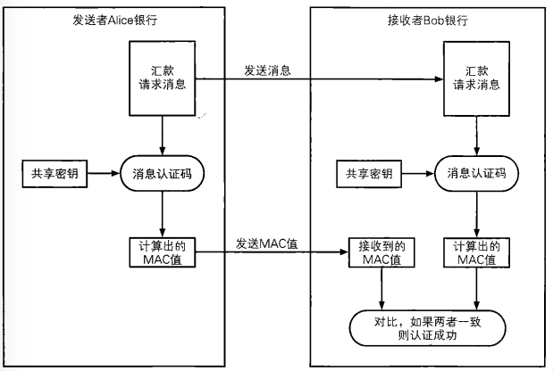

## 什么是消息认证码

是一种确认完整性并进行认证的技术,**取三个单词的首字母，简称为MAC。**

消息认证码的输入包括任意长度的消息和一个发送者与接收者之间共享密钥,它可以输出固定长度的数据,这和数据称为 MAC 值

根据任意长度的消息输出固定长度的数据,这一点和单向散列函数类似,但是单向散列函数中计算散列值不需要密钥,而消息认证码中则需要使用发送者与接收者之间共享的密钥

要计算MAC必须持有共享密钥，没有共享密钥的人就无法计算MAC值，消息认证码正是利用这一性质来完成认证的。此外，和单向散列函数的散列值一样，哪怕消息中发生1比特的变化，MAC值也会产生变化，消息认证码正是利用这一性质来确认完整性的。

消息认证码有很多种实现方法，大家可以暂且这样理解：消息认证码是一种与密钥相关联的单向散列函数。

## 消息认证码的使用步骤

我们还是以Alice银行和Bob银行的故事为例，来讲解一下消息认证码的使用步骤: 

 

1. 发送者Alice与接收者Bob事先共享密钥。
2. 发送者Alice根据汇款请求消息计算MAC值（使用共享密钥）。
3. 发送者Alice将汇款请求消息和MAC值两者发送给接收者Bob。
4. 接收者Bob根据接收到的汇款请求消息计算MAC值（使用共享密钥）。
5. 接收者Bob将自己计算的MAC值与从Alice处收到的MAC值进行对比。
6. 如果两个MAC值一致，则接收者Bob就可以断定汇款请求的确来自Alice（认证成功）；如果不一致，则可以断定消息不是来自Alice（认证失败）。

## HMAC
HMAC 是一种使用单向散列函数来构造消息认证码的方式RFC2104），其中HMAC的H就是Hash的意思。

HMAC 中所使用的单向散列函数并不仅限于一种,任何高强度的单向散列函数都可以被用于 HMAC,如果将来设计出了新的单向散列函数,也可以被使用

使用SHA-I、MD5、RIPEMD-160所构造的HMAC，分别称为HMAC-SHA-1、HMAC-MD5和HMAC-RlPEMD。

## Go 语言中对 HMAC 中的使用

1. hamc.New 函数,生成消息认证码
```go
func New(h func() hash.Hash, key []byte) hash.Hash
// 参数 1:回调函数,使用的 hash 校验算法如- md5.New,sha1.New,sha256.New
        //-- md5.New
        //-- sha1.New
        //-- sha256.New
        //-- sha256.New224
        //-- sha512.New
        //-- sha512.New384
// 参数 2:消息认证码生成的时候需要的密钥
// 返回值是 hash 的接口
```

2. 使用 Write 添加数据
3. 使用 Sum 计算散列值
4. hmac.Equal 函数,比较两个 MAC 是否相同
```go
函数对应的包: "crypto/hmac"
func Equal(mac1, mac2 []byte) bool
    - 参数 mac1, mac2: 通过哈希算法计算得到的消息认证码
    - 返回值: 如果mac1==mac2, 返回 true; 否则, 返回 false
```

#### 代码实现生成消息认证码
```go
package main

import (
	"crypto/hmac"
	"crypto/sha256"
	"encoding/hex"
	"fmt"
)
// 生成消息认证码
func GenerateHMAC(src, key []byte)string {
	// 1. 创建一个底层采用sha256算法的 hash.Hash 接口
	myHmac := hmac.New(sha256.New, key)
	// 2. 添加测试数据
	myHmac.Write(src)
	// 3. 计算结果
	result := myHmac.Sum(nil)
	// 4. 格式转换
	res := hex.EncodeToString(result)
	return res
}

// 验证消息认证码
func VerifyHMAC(PlainText, key, HashText []byte) bool {
	// 1. 创建一个底层采用sha256算法的 hash.Hash 接口
	myHmac := hmac.New(sha256.New, key)
	// 2. 添加测试数据
	myHmac.Write(PlainText)
	// 3. 计算结果
	result := myHmac.Sum(nil)
	// 4. 格式转换
	res := hex.EncodeToString(result)
	// 5. 比较结果
	return hmac.Equal(HashText, []byte(res))
}

func main()  {
	src := []byte("hello")
	key := []byte("12345678")

	res:= GenerateHMAC(src,key)
	fmt.Println(res)

	ok := VerifyHMAC(src,key,[]byte(res))
	fmt.Println(ok)
}
```

## 消息认证码的密钥配送问题

在消息认证码中,需要发送者和接收者之间共享密钥,这个密钥不能被主动攻击者好哦去,如果这个密钥被获取了,那么攻击者也就可以使用这个密钥进行篡改和伪装了,这样消息认证码就无法发挥作用了

发送者和接收者需要共享密钥，这一点和我们介绍的对称加密很相似。实际上，对称加密的密钥配送问题在消息认证码中也同样会发生。关于秘钥的配送后边章节会介绍如何使用非对称加密的方式进行解决。

### 消息认证码无法解决的问题
#### 对第三方证明

> 假设Bob在接收了来自Alice的消息之后，想要向第三方验证者Victor证明这条消息的确是Alice发送的，但是用消息认证码无法进行这样的证明，这是为什么呢？
>
> 首先，Victor要校验MAC值，就需要知道Alice和Bob之间共享的密钥。
>
> 假设Bob相信Victor, 同意将密钥告诉Victor,即便如此，Victor也无法判断这条消息是由Alice发送的，因为Victor可以认为：“即使MAC值是正确的，发送这条消息的人也不一定是Alice，还有可能是Bob。"
>
> 能够计算出正确MAC值的人只有Alice和Bob，在他们两个人之间进行通信时，可以断定是对方计算了MAC值，这是因为共享这个密钥的双方之中，有一方就是自己。然而，对于第三方Victor、Alice或Bob却无法证明是对方计算了MAC值，而不是自己。
>
> 使用第7章中将要介绍的数字签名就可以实现对第三方的证明。

#### 防止否认

> 假设Bob收到了包含MAC值的消息，这个MAC值是用Alice和Bob共享的密钥计算出来的，因此Bob能够判断这条消息的确来自Alice。
>
> 但是，上面我们讲过，Bob无法向验证者Victor证明这一点，也就是说，发送者Alice可以向Victor声称：“我没有向Bob发送过这条消息。”这样的行为就称为否认（repudiation）。
>
> Alice可以说“这条消息是Bob自己编的吧"，“说不定Bob的密钥被主动攻击者Mallory给盗取了，我的密钥可是妥善保管着呢" 等。说白了，就是Alice和Bob吵起来了。
>
> 即便Bob拿MAC值来举证，Victor也无法判断Alice和Bob谁的主张才是正确的，也就是说，**用消息认证码无法防止否认（nonrepudiatlon）**。