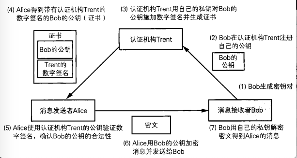
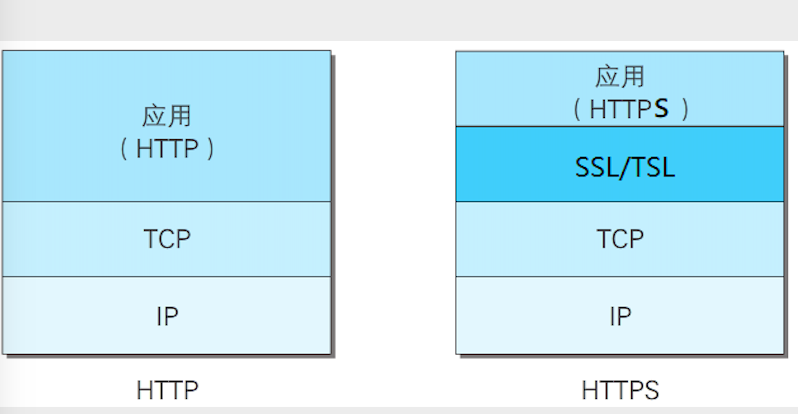
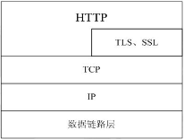
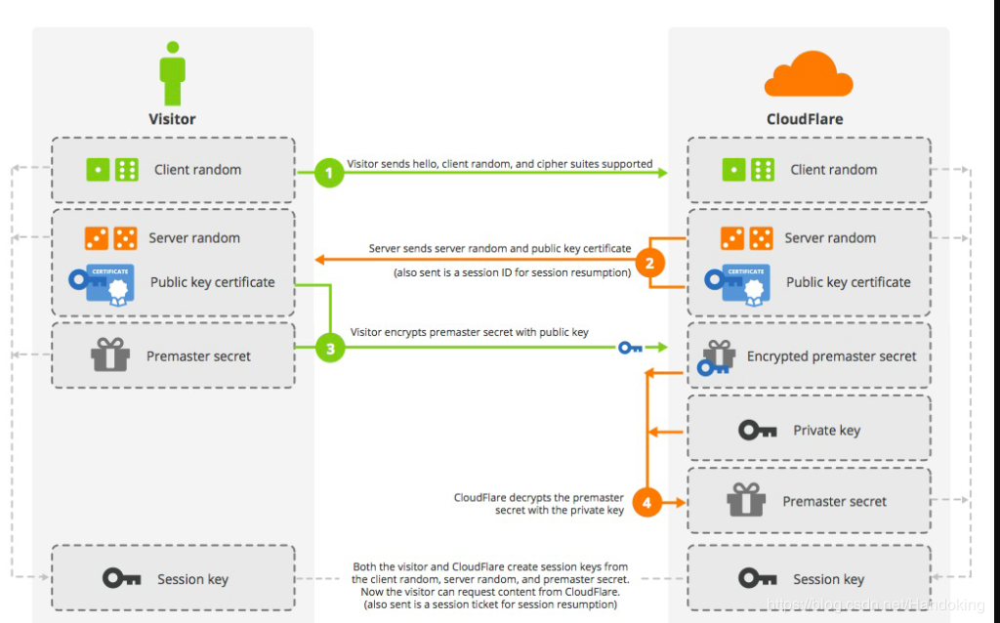
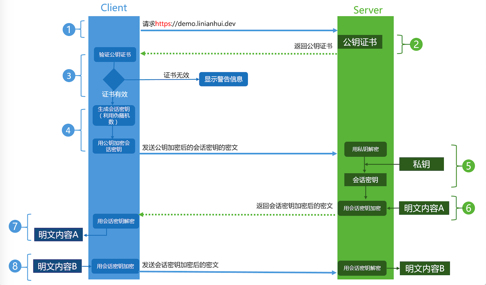

## 公钥证书
Public-Key Certificate，PKC)其实和驾照很相似，里面记有姓名、组织、邮箱地址等<font color="red">个人信息</font>，以及属于<font color="red">此人的公钥, 并由认证机构（Certification Authority、Certifying Authority, CA）施加数字签名</font>。只要看到公钥证书，我们就可以知道认证机构认定该公钥的确属于此人。公钥证书也简称为证书（certificate）。

#### 证书的使用场景
 

以百度为例,说明一下证书生成和验证的过程 

1. 百度服务器生成自己的密钥对
2. 百度将自己的公钥发送给证书颁发机构(CA)
3. CA 收到百度的公钥之后,进行确认之后,对百度的公钥进行签名(这一过程就是 CA 使用自己的私钥对百度的公钥进行签名),生成证书
4. CA 将生成的证书发送给百度
5. 客户端访问百度的时候,使用认证机构的公钥解密百度的证书,得到证书中的信息,包含百度的公钥,注册信息等
6. 客户端使用百度的公钥对数据进行加密(这一步实际上就是客户端使用百度的公钥将对称加密的密钥进行加密)
7. 百度收到加密的数据之后,使用私钥进行解密,得到对称加密的密钥,然后使用对称加密进行通信

### 证书规范格式 -- x509

x509 是一种非常通用的证书格式,所有的证书都符合 ITU-T x509 国际标准,因此(理论上)为一种应用创建的证书可以用于任何其他符合 x509 标准的应用,X.509证书的结构是用ASN1(Abstract Syntax Notation One)进行描述数据结构，并使用ASN.1语法进行编码.

X.509规范中一般推荐使用PEM(Privacy Enhanced Mail）格式来存储证书相关的文件。

- 证书文件的文件名后缀一般为 .crt 或 .cer 
- 对应私钥文件的文件名后缀一般为 .key
- 证书请求文件的文件名后綴为 .csr 
- 有时候也统一用pem作为文件名后缀。

### 证书规范
前使用最广泛的标准为ITU和ISO联合制定的X.509的 v3版本规范 (RFC5280）, 其中定义了如下证书信息域：

- 版本号(Version Number): 规范的版本号,目前为版本 3,值为 0x2
- 序列号(Serial Number):由 CA 维护的,为它所颁发的正式分配的一个序列号,用来追踪和撤销证书,只要拥有签发者信息和序列号就能唯一标识一个证书,最大不能超过 20 个字节
- 签名算法(Signature Algorithm): 数字签名所用的算法,如:sha256-with-RSA-Encryption
- 颁发者(Issuer):颁发证书的单位的标识信息
- 有效期(Validity): 证书的有效期,包括起止日期
- 主体(Subject): 证书拥有者的标识信息
- 主体的公钥信息(Subject public key info): 其中包括公钥使用的算法和公钥主体
- 颁发者唯一号(Issuer Unique Identifier):代表颁发者的唯一标识仅2、3版本支持，可选；
- 注意唯一号(Subject Unique Identifier):代表拥有证书实体的唯一信息,仅2、3版本支持，可选
- 扩展:可选信息
  - Subject Key Identifier：实体的秘钥标识符，区分实体的多对秘钥；
  - Basic Constraints：一指明是否属于CA;
  - Authority Key Identifier：证书颁发者的公钥标识符；
  - CRL Distribution Points: 撤销文件的颁发地址；
  - Key Usage：证书的用途或功能信息。
    
## CA 证书

CA是Certificate Authority的缩写，也叫“证书授权中心”。

它是负责管理和签发证书的第三方机构, 好比一个可信任的中介公司。一般来说，CA必须是所有行业和所有公众都信任的、认可的。因此它必须具有足够的权威性。就好比A、B两公司都必须信任C公司，才会找 C 公司作为公章的中介

CA 证书就是指 CA 颁发的证书

#### 证书信任链

处于最顶上的树根位置的那个证书，就是“**根证书**”。除了根证书，其它证书都要依靠上一级的证书，来证明自己。那谁来证明“根证书”可靠捏？实际上，根证书自己证明自己是可靠滴（或者换句话说，根证书是不需要被证明滴)

根证书在操作系统安装的时候,是默认内置在操作系统中的

### 证书的作用

1. 验证网站是否可信(针对 HTTPS)
有了正式之后,当使用浏览器访问 https 的网站的时候,会验证该站点上的 CA 证书,如果发现证书没有问题,那么就会打开页面,如果证书存在问题就会弹出警告信息

2. 验证某文件是否被篡改过
通过使用证书来制作文件的数字签名

#### CA 机构
世界上较早的数字认证中心是美国的verisign`威瑞信`公司，在windows的证书窗口中可以看到好多verisign公司生成的证书, 美国的*DigiCert*

另外还有加拿大的ENTRUST公司，也是很著名的证书机构。

中国的安全认证体系分为金融CA和非金融CA。

- 在金融CA方面，根证书由中国人民银行管理，
- 非金融CA方面，由中国电信负责。
  - 行业性CA
    - 中国金融认证中心
    - 中国电信认证中心
  - 区域性CA, 区域性CA主要是以政府为背景，以企业机制运行
    - 广东CA中心
    - 上海CA中心

## 公钥基础设施 PKI

仅制定证书的规范还不足以支持公钥的实际运用，我们还需要很多其他的规范，例如证书应该由谁来颁发，如何颁发，私钥泄露时应该如何作废证书，计算机之间的数据交换应采用怎样的格式等。这一节我们将介绍能够使公钥的运用更加有效的公钥基础设施。

公钥基础设施就是为了能够更加有效的运用公钥而制定的一系列的规范和规格的总称,公钥基础设施一般是根据硬件缩写而简称为 PKI

### PKI 的组成要素

- 用户 --- 使用 PKI 的人
- 认证机构 -- 颁发证书的人
- 仓库 --- 保存证书的数据库

##### 用户

1. 注册公钥的用户所进行的操作

- 生成密钥对(也可以委托 CA 生成)
- 在认证机构注册公钥
- 向认证机构申请证书
- 根据需要申请作废已注册的证书
- 解密接收到的密文
- 对消息进行数字签名 

2. 使用已注册的公钥的用户所进行的操作

- 将消息加密后发送给接收者
- 验证数字签名

##### 认证机构

 - 生成密钥对(也可以由用户生成)
 - 在注册公钥的时候,对注册人的身份验证,并颁发证书

 认证机构根据其认证业务准则对用户的身份进行认证,并生成证书,在生成证书的时候,需要认证机构使用私钥进行数字签名,生成的证书格式由 PKCS#6 和x509 定义

 - 作废证书

作废证书,认证机构需要支付一张证明==作废清单,简称 CRL,CRL 是认证机构宣布作废的证书一览表,具体的来说,是一张已作废的证书序列号的清单,并由认证机构加上数字签名

##### 仓库
仓库是一个保存证书的数据库,PKI 用户在需要的时候可以从中获取到证书

## SSL 和 TSL
 



#### SSL
SSL(Secure Socket Layer): 为 Netscape所研发的,用来保障在 internet 上数据传输的安全,利用数据加密技术,可确保数据在网络上传输的过程中不会被截取,当前版本为 3.0,他可以被广泛的用于 web 浏览器与服务器之间的身份认证和加密数据传输

ssl 协议位于 TCP/IP 协议与各种应用层协议之间,为数据通信提供安全支持,SSL 协议可分为两层

- SSL 记录协议:它建立在可靠的传出协议(如 TCP)之上,它为高层协议提供数据封装,压缩和加密等基本功能的支持
- SSL 握手协议:它是建立在 SSL 记录协议之上,用于实际的数据传输开始之前,通讯双方进行身份认证,协商加密算法和交换加密密钥等

#### TSL
传输层安全协议,用于两个应用程序之间提供保密性和数据完整性

TLS 1.0 是 IETF 制定的一种新的协议,它建立在 SSL 3.0 协议规范之上,是 SSL 3.0 的后续版本,可以理解为 SSL 3.1 , 它是写入了 RFC 的,TSL 协议也由两部分组成

- TSL 记录协议:处于较低层,位于某可靠的传输协议之上(如 TCP)
- TSL 握手协议

#### SSL 和 TLS 协议提供的服务

1. 认证用户和服务器,保证数据发送到正确的用户和服务器
2. 加密数据防止数据中途被窃取
3. 维护数据的完整性,确保数据在传输的过程中不被改变

### SSL/TSL 通信的过程

SSL或者TSL的通信是在客户端与服务器端经过TCP/IP的三次握手之后进行的,必须依赖于TCP的连接之上

 

SSL 的四次握手

1. 客户端发起建立建立的请求,向服务器端发送随机码,以及自己支持的加密方式,压缩方式等
2. 服务器收到请求后,向客户端发送随机码 B,以及确认客户端可以使用的加密方式,数字证书和非对称加密的公钥等信息,如果服务器端与客户端加密方式不一致,那么连接关闭
3. 客户端收到服务器的回复报文之后,验证数字证书的正确性以及其它信息,并使用服务器返回的加密方式,使用公钥对生成的**对称加密**密钥进行加密,然后将加密后的数据发送给服务器
4. 服务器收到数据后,使用私钥进行解密,得到A,B以及对称加密的 session key,服务器使用得到session key 加密一段握手信息,发送给客户端,HTTP 使用此方式加密数据进行传输

### http 和 https
http 协议:是互联网上应用最为广泛的一种网络协议,是一个客户端和服务器端请求和应答的标准,用户从 www 服务器传输超文本到本地浏览器的传输协议

https:是以安全为目标的 http 通道,简单的来说是 http 的安全版,即 http 下加入 SSL/TSL 层

https 协议的主要作用有一下两种

- 建立一个信息安全通道,来保证数据传输的安全
- 确认网站的真实性

### https 的优缺点

优点 

1. 使用HTTPS协议可认证用户和服务器，确保数据发送到正确的客户机和服务器；
2. HTTPS协议是由SSL+HTTP协议构建的可进行加密传输、身份认证的网络协议，要比http协议安全，可防止数据在传输过程中不被窃取、改变，确保数据的完整性。
3. HTTPS是现行架构下最安全的解决方案，虽然不是绝对安全，但它大幅增加了中间人攻击的成本。
4. 谷歌曾在2014年8月份调整搜索引擎算法，并称 “比起同等HTTP网站，采用HTTPS加密的网站在搜索结果中的排名将会更高”

缺点

1. HTTPS协议握手阶段比较费时，会使页面的加载时间延长近50%，增加10%到20%的耗电；
2. HTTPS连接缓存不如HTTP高效，会增加数据开销和功耗，甚至已有的安全措施也会因此而受到影响；
3. SSL/TLS证书需要钱，功能越强大的证书费用越高，个人网站、小网站没有必要一般不会用。
4. SSL/TLS证书通常需要绑定IP，不能在同一IP上绑定多个域名，IPv4资源不可能支撑这个消耗。
5. HTTPS协议的加密范围也比较有限，在黑客攻击、拒绝服务攻击、服务器劫持等方面几乎起不到什么作用。最关键的，SSL证书的信用链体系并不安全，特别是在某些国家可以控制CA根证书的情况下，中间人攻击一样可行。

### 快速的生成 CA 自签名证书
```bash
# 生成私钥
weiying@weiyingdeMacBook-Air ~$ openssl genrsa -out ca.key

Generating RSA private key, 2048 bit long modulus

...............+++

........................+++

e is 65537 (0x10001)

# 自签名
weiying@weiyingdeMacBook-Air ~$ openssl req -x509 -new -nodes -key ca.key -subj "/CN=test.ca.com" -days 7120 -out ca.crt
# /CN:为证书绑定的域名
```

## HTTPS 单向通信流程
 

1. 客户端通过 ip 地址或者域名,向服务器发起 https 请求
2. 服务器收到了客户端的请求后,将 CA 签发的证书发送给客户端
3. 客户端收到证书之后,使用 CA 的公钥对证书进行解密,得到了服务器的公钥和证书信息,并验证公钥和证书的信息
4. 客户端会生成一个随机数(作为对称加密的密钥来使用),使用服务器的公钥对这个随机数加密之后发送给服务器端
5. 服务器收到数据后,使用私钥进行解密,得到对称加密的密钥
6. 客户端和服务器端使用对称加密的方式进行数据通信