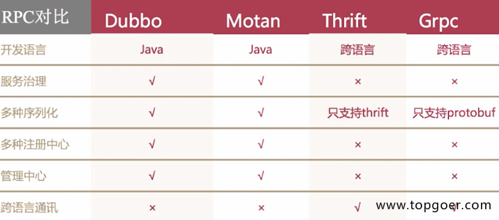

## RPC

远程过程调用,是一个计算机通信协议,该协议允许运行于一台计算机的程序调用另一台计算机的子程序,而且程序员无需额外的为这个交互作用编程,如果涉及的软件采用面向对象编程,那么远程过程调用亦可以称为远程调用或者远程方法调用

### 流行RPC框架的对比




### golang 中怎么实现rpc

golang中实现rpc非常的简单,官方提供了封装好的库,还有一些第三方的库


golang官方的`net/rpc`库使用`encodeing/gob`进行编码,支持tcp和http数据传输方式,由于其他语言不支持gob编解码的方式,所以golang的rpc只支持golang开发的服务器与客户端之间的交互


官方还提供了`net/rpc/jsonspc`库实现rpc方法,jsonrpc采用json进行数据编解码,因而支持跨语言的调用,目前jsonrpc库是基于tcp协议实现的,暂时不支持http传输方式

#### 使用rpc 来实现计算矩形的面积和周长

1. rpc 服务端的实现

```go
package main

import (
	"log"
	"net/http"
	"net/rpc"
)
// 参数声明结构体
type Params struct {
	Width , Height int
}
// 用于注册的结构体
type Rect struct {}

func (r * Rect) Area(p *Params,ret *int)error{
	*ret = p.Height * p.Width
	return nil
}

func (r * Rect) Perimeter(p *Params,ret *int)error{
	*ret = (p.Height + p.Width) * 2
	return nil
}

func main() {
	// 1. 注册一个服务
	rect := new(Rect)
	// 2. 注册一个Rect的服务
	rpc.Register(rect)
	// 3. 将服务处理绑定到http协议上
	rpc.HandleHTTP()
	// 4. 监听服务
	err := http.ListenAndServe(":8080",nil)
	if err != nil {
		log.Panicln(err)
	}
}
```

2. rpc 客户端的实现

```go
package main

import (
	"fmt"
	"log"
	"net/rpc"
)

type Params2 struct {
	Width , Height int
}

func main() {
	// 1. 连接远程RPC服务
	conn ,err := rpc.DialHTTP("tcp","127.0.0.1:8080")
	if err != nil {
		log.Fatalln(err)
	}
	// 调用求面积的方法
	ret := 0
	err = conn.Call("Rect.Area",Params2{50,100},&ret)
	if err != nil {
		log.Fatalln(err)
	}
	// 调用求周长的方法
	ret2 := 0
	err = conn.Call("Rect.Perimeter",Params2{50,100},&ret2)
	if err != nil {
		log.Fatalln(err)
	}
	fmt.Println("周长是:",ret2,"面积为:",ret)
}
```

#### rpc 程序的基本条件

1. 结构体的首字母要大写,这样才能通过客户端调用
2. 函数名的首字母必须要大写
3. 函数的第一个参数是接收参数,第二个参数是返回给客户端的参数,必须是指针类型
4. 函数必须要有一个返回值

### RPC 调用的流程

微服务架构下数据交互一般是对内RPC,对外REST

将业务按照模块拆分到各个微服务,具有提高项目协作的效率,降低模块的耦合度,提高熊可用性等优点,但是开发门槛较高,比如RPC框架的使用以及后期服务器的监控等工作


一般情况下,我们会将功能代码在本地直接调用,微服务架构下,我们需要将这个函数作为单独的服务运行,客户端通过网络调用

### 网络传输数据格式

rpc 两端要约定好数据包的格式

成熟 rpc框架会有自定义传输协议,这里网络传输格式定义如下: 前面是固定长度的消息头,后面是变长消息体

