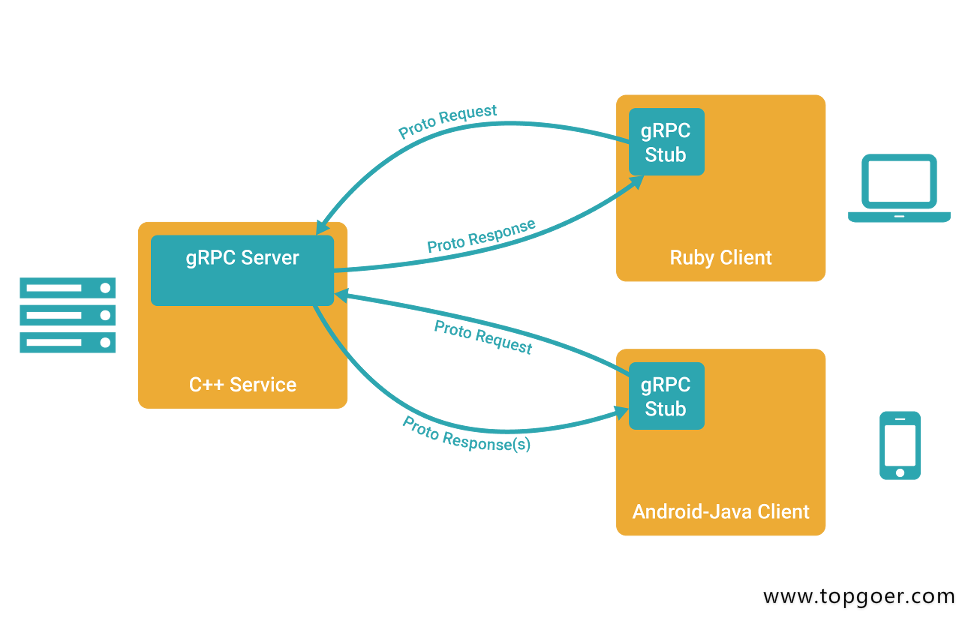

## gRPC 简介

gRPC 是高性能的,开源的,通用的rpc框架,有google推荐,基于HTTP2 昔日以标准设计开发,默认采用 Protocol buffers 数据序列化协议,支持多种开发语言,gRPC提供了一种简单的方式来精确的定义服务,并且客户端和服务端自动生成可靠的功能库

在gRPC 客户端可以直接调用不同服务器上的远程程序,使用姿势看起来就像是调用本地程序一样,很容易去构建分布式应用和服务,和很多RPC系统一样,服务器负责实现定义好的接口并处理客户端的请求,客户端根据接口描述直接调用需要的服务,客户端和服务端可以分别使用gRPC支持的不同语言实现

### gRPC的主要特性

1. 强大的IDL

gRPC使用protoBuf 来定义服务,ProtoBuf是由谷歌开源的一种数据序列化协议(类似XML,JSON,hessian)ProtoBuf 能够将数据进行序列化,并广泛应用在数据存储,通信协议等方面

2. 多语言支持

gRPC 支持多种语言,并且能够基于语言自动生成客户端和服务端功能库,目前已经提供了C版本grpc、Java版本grpc-java 和 Go版本grpc-go，其它语言的版本正在积极开发中，其中，grpc支持C、C++、Node.js、Python、Ruby、Objective-C、PHP和C#等语言，grpc-java已经支持Android开发。

3. HTTP2

gRPC 基于HTTP2 标准设计,所以相对于其他的RPC框架来说,gRPC带来了更强大的功能,如: 双向流,头部压缩,多复用请求等,这些功能给移动设备带来的重大的益处,如节省带宽,降低TCP连接次数,节省CPU使用和延长电池寿命等,同时gRPC还能够一稿云端服务和web应用的性能,gPRC既能在客户端使用,也能够在服务器端使用,从而以透明的方式实现客户端和服务器端的通信和简化通信系统的构建

## gRPC和protoBuf的安装

微服务架构中,由于每个服务对应的代码都是独立运行的,无法直接调用,彼此间的通信就是最大的问题

gRPC可以实现微服务,将大的项目拆分成多个小的且独立的业务模块,也就是服务,各个服务间使用高效的ProtoBuf协议进行RPC调用,gRPC默认使用protocol buffers ,可以使用proto files 创建gRPC服务,用message类型来定义方法参数和返回类型

#### 安装

- go get github.com/golang/protobuf/proto
- go get google.golang.org/grpc（无法使用，用如下命令代替）
  - git clone https://github.com/grpc/grpc-go.git $GOPATH/src/google.golang.org/grpc
  - git clone https://github.com/golang/net.git $GOPATH/src/golang.org/x/net
  - git clone https://github.com/golang/text.git $GOPATH/src/golang.org/x/text
  - go get -u github.com/golang/protobuf/{proto,protoc-gen-go}
  - git clone https://github.com/google/go-genproto.git $GOPATH/src/google.golang.org/genproto
  - cd $GOPATH/src/
  - go install google.golang.org/grpc
- go get github.com/golang/protobuf/protoc-gen-go
- 上面安装好后，会在GOPATH/bin下生成protoc-gen-go.exe
- 但还需要一个protoc.exe，windows平台编译受限，很难自己手动编译，直接去网站下载一个，地址：https://github.com/protocolbuffers/protobuf/releases/tag/v3.9.0 ，同样放在GOPATH/bin下