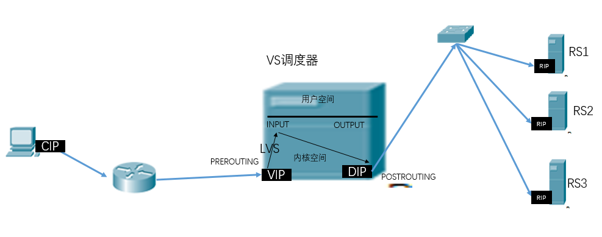
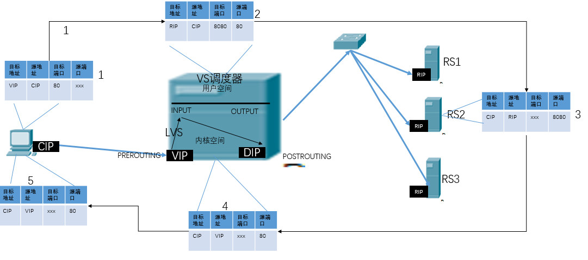
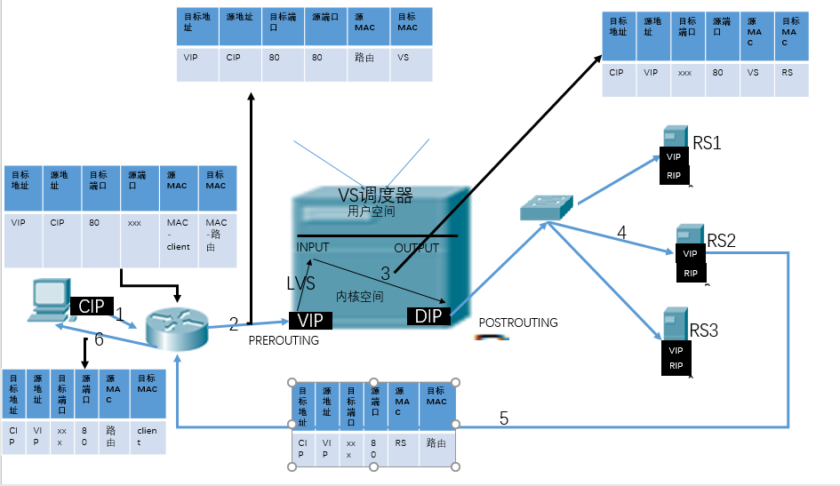
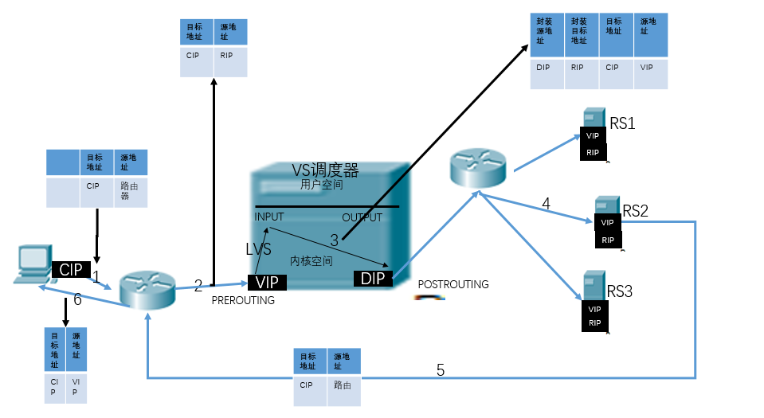
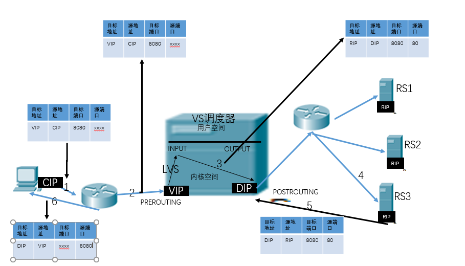

# 企业级调度器LVS
## 系统的性能扩展
- Scale Up：向上扩展，使用性能更好的硬件设备
	问题：
		一：随着计算机的性能的增加，其价格会成倍增长
		二：单台计算机的性能是有上限的
- Sclae Out：向外扩展，增加设备，并行的运用多个服务调度分配问题，Cluster
## Cluster：集群，为解决某特定问题将多台计算机组合起来形成的单个系统
- LB：Load Balancing，负载均衡
- HA：High Availiablity 高可用
	MTBF：平均无故障时长
	MTTR：平均故障恢复时长
	A=MTBF/(MTBF+MTTR)：判断系统的稳定性
- HPC：High-perfor computing ，高性能
	全球高性能计算机排名：www.top500.org
## 分布式系统
- 分布式存储：云盘
- 分布式计算：Hadoop，Spark
### 集群和分布式的概念
- 集群：同一业务系统，部署在多台服务器上，在集群中每台服务器实现的功能没有差别，数据和代码都是一样的
- 分布式：一个业务被拆分成多个子业务，或者本身就是不同的业务，部署在多台服务器上，分布式中每台服务器实现的功能是有差别的，加起来才是完整的业务系统
	分布式系统是以缩短单个任务的执行时间来提高效率，而集群则是通过提高单位时间内执行的任务数来提高效率的
### LB Cluster的实现
- 硬件：
	F5 Big-IP
	Citrix Netscaler
	A10 A10
- 软件：
	LVS：Linux Virtual Server  阿里四层SLB (Server Load Balance)使用
	Nginx：支持七层调度，阿里七层SLB使用Tengine
	haproxy：支持七层调度
	ats：Apache Traffic Server，yahoo捐助给apache
	perlbal：Perl 编写
	pound
#### 软件LB Cluster的基于根据工作的协议层次划分：
- 传输层：
	LVS：
	nginx：stream
	haproxy：mode tcp
- 应用层：针对特定协议，自定义的请求模型分类
	http：nginx, httpd, haproxy(mode http), ...
	fastcgi：nginx, httpd, ...
	mysql：mysql-proxy, ...

### 会话保持：负载均衡
- session sticky：session绑定，同一用户调度固定服务器(无法保证服务器故障session仍然存在)
	Source IP：LVS sh算法（对某一特定服务而言）,来自同一ip地址的用户，都往相同的服务器上调度
	Cookie:在请求报文中插入cookie，相同的cookie网相同的服务器调用
- session replication：(session 集群)每台服务器拥有全部	session
	session multicast cluster
- session server：专门的session服务器
	Memcached，Redis
## LVS介绍
	负载调度器，内核集成，章文嵩研发
	VS：Virtual Server，负载调度
	RS：Real Server，负责真正的提供服务
	L4：四层路由器或交换机
	阿里的四层LSB(Server Load Balance)是基于LVS+keepalived实现

- 内核支持
	grep -i -A 10 "IPVS" /boot/config-3.10.0-862.el7.x86_64
	
	IPVS transport protocol load balancing support
	CONFIG_IP_VS_PROTO_TCP=y #开启tcp
	CONFIG_IP_VS_PROTO_UDP=y #开启udp
	CONFIG_IP_VS_PROTO_AH_ESP=y
	CONFIG_IP_VS_PROTO_ESP=y
	CONFIG_IP_VS_PROTO_AH=y
	CONFIG_IP_VS_PROTO_SCTP=y #
	IPVS scheduler #默认支持的算法
	CONFIG_IP_VS_RR=m
	CONFIG_IP_VS_WRR=m
	CONFIG_IP_VS_LC=m
	CONFIG_IP_VS_WLC=m
	CONFIG_IP_VS_LBLC=m
	CONFIG_IP_VS_LBLCR=m
	CONFIG_IP_VS_DH=m
	CONFIG_IP_VS_SH=m
	CONFIG_IP_VS_SED=m
	
- 工作原理
	VS根据请求报文的目标IP和目标协议及端口将其调度转发至某RS，根据调度算法来挑选RS(lvs要借助于netfilter工作)
	
	当用户请求经过PREROUTING进入后，进过INPUT，接下来要进入用户空间，但是如果发现请求的是lvs定义的集群服务器，那么会强行将请求转发到POSTROUTING，经过调度算法选择将请求交由哪个RS提供真正的服务
	
### LVS集群中的专业术语
- VS：Virtual Server，Director Server(DS)：Dispatcher(调度器)，Load Balancer
- RS：Real Server(lvs), upstream server(nginx) backend server(haproxy)
- CIP：client ip
- VIP：Virtual serve IP VS外网的IP
- DIP: Director IP VS内网的IP
- RIP: Real server IP
	访问流程：CIP <--> VIP == DIP <--> RIP

### LVS: ipvsadm/ipvs
- ipvsadm：用户空间的命令行工具，规则管理器，用于管理集群服务及RealServer
- ipvs：工作于内核空间netfilter的INPUT钩子上的框架

### LVS集群的类型：
1. LVS-NAT
	本质是多目标IP的DNAT，通过将请求报文中的目标地址和目标端口修改为某挑出的RS的RIP和PORT实现转发
	
- 特性
	（1）RIP和DIP应在同一个IP网络，且应使用私网地址；RS的网关要指向DIP
	（2）请求报文和响应报文都必须经由Director转发，Director易于成为系统瓶颈
	（3）支持端口映射，可修改请求报文的目标PORT
	（4）VS必须是Linux系统，RS可以是任意OS系统

2. LVS—DR：Direct Routing，直接路由，LVS默认模式,应用最广泛,通过为请求报文重新封装一个MAC首部进行转发，源MAC是DIP所在的接口的MAC，目标MAC是某挑选出的RS的RIP所在接口的MAC地址；源IP/PORT，以及目标IP/PORT均保持不变
	
	原理：对于每个RS来说，RIP配置在物理网卡上，VIP配置在lo网卡，要求从那个网络接口进来的请求报文，就必须从哪个接口出去，RS的RIP收到DIP的转发报文后会转发给lo的VIP，由VIP封装之后将报文交由RIP转发出去
	
	路由器通过发送arp广播，从而将client请求报文中的VIP替换为VS的MAC，当RS也绑定了VIP的时候，那么RS服务器要禁止拒绝对arp请求的VIP请求做响应
	
	特点
	
- Director和各RS都配置有VIP
- 确保前端路由器将目标IP为VIP的请求报文发往Director

	方法一：在前端网关做静态绑定VIP和Director的MAC地址
	方法二：在RS上使用arptables工具(让RS拒绝对arp请求的VIP请求做响应)

 	arptables -A IN -d $VIP -j DROP
 	arptables -A OUT -s $VIP -j mangle --mangle-ip-s $RIP
 	方法三：在RS上修改内核参数以限制arp通告及应答级别
 	/proc/sys/net/ipv4/conf/all/arp_ignore
 	 /proc/sys/net/ipv4/conf/all/arp_announce

- RS的RIP可以使用私网地址，也可以是公网地址；RIP与DIP在同一IP网络；RIP的网关不能指向DIP，以确保响应报文不会经由Director
- RS和Director要在同一个物理网络
- 请求报文要经由Director，但响应报文不经由Director，而由RS直接发往Client
- 不支持端口映射（端口不能修败）
- RS可使用大多数OS系统
3. LVS-TUN
	转发方式：不修改请求报文的IP首部（源IP为CIP，目标IP为VIP），而在原IP报文之外再封装一个IP首部（源IP是DIP，目标IP是RIP），将报文发往挑选出的目标RS；RS直接响应给客户端（源IP是VIP，目标IP是CIP）
	

	对于每个RS来说，RIP配置在物理网卡上，VIP配置在lo网卡，要求从那个网络接口进来的请求报文，就必须从哪个接口出去，RS的RIP收到DIP的转发报文后会转发给lo的VIP，由VIP封装之后将报文交由RIP转发出去
	
	MTU：最大传输单元，以太网的标准为1500个字节，如果在传输过程中再加上重新封装的1500，那么要经过二次切片才可以，所以必须要保证DIP和RIP之间的网络设备允许二次切片，或者在VS上限制每次最多传输1400，保证能够有足够的空间封装ip

- 特点
	(1) DIP, VIP, RIP都应该是公网地址
	(2) RS的网关一般不能指向DIP
	(3) 请求报文要经由Director，但响应不经由Director
	(4) 不支持端口映射
	(5) RS的OS须支持隧道功能(如果不支持，那么OS将不会理解为什么封装了ip)

4. LVS-funllnat
	通过同时修改请求报文的源IP地址和目标IP地址进行转发
	

- 特点
	1) VIP是公网地址，RIP和DIP是私网地址，且通常不在同一IP网络；因此，RIP的网关一般不会指向DIP
	(2) RS收到的请求报文源地址是DIP，因此，只需响应给DIP；但Director还要将其发往Client
	(3) 请求和响应报文都经由Director
	(4) 支持端口映射
	注意：此类型kernel默认不支持
### LVS工作模式总结
- lvs-nat与lvs-fullnat：请求和响应报文都经由Director
	lvs-nat：RIP的网关要指向DIP
	lvs-fullnat：RIP和DIP未必在同一IP网络，但要能通信
- lvs-dr与lvs-tun：请求报文要经由Director，但响应报文由RS直接发往Client
	lvs-dr：通过封装新的MAC首部实现，通过MAC网络转发
	lvs-tun：通过在原IP报文外封装新IP头实现转发，支持远距离通信
	
## ipvs scheduler：根据其调度时是否考虑各RS当前的负载状态
	两种：静态方法和动态方法
#### 静态方法：仅根据算法本身进行调度
1. RR：roundrobin,轮询
2. WRR：Weighted RR,加权轮询
3. SH：Source Hashing,实现session sticky，源IP地址hash；将来自于同一个IP地址的请求始终发往第一次挑中的RS，从而实现会话绑定
4. DH：Destination Hashing,目标地址哈希，第一次轮询调度至RS，后续将发往同一个目标地址的请求始终转发至第一次挑中的RS，典型使用场景是正向代理缓存场景中的负载均衡，如：宽带运营商
#### 动态方法：主要根据每RS当前的负载状态及调度算法进行调度Overhead=value较小的RS将被调度
1. LC：least connections（最少连接数） 适用于长连接应用
	Overhead=activeconns*256+inactiveconns
2. WLC：Weighted LC，默认调度方法,加权最小连接	
	Overhead(activeconns*256+inactiveconns)/weight
3. SED：Shortest Expection Delay,初始连接高权重优先
	Overhead=(activeconns+1)*256/weight
4. NQ：Never Queue，第一轮均匀分配，后续SED
5. LBLC：Locality-Based LC，动态的DH算法，使用场景：根据负载状态实现正向代理
6. LBLCR：LBLC with Replication，带复制功能的LBLC，解决LBLC负载不均衡问题，从负载重的复制到负载轻的RS