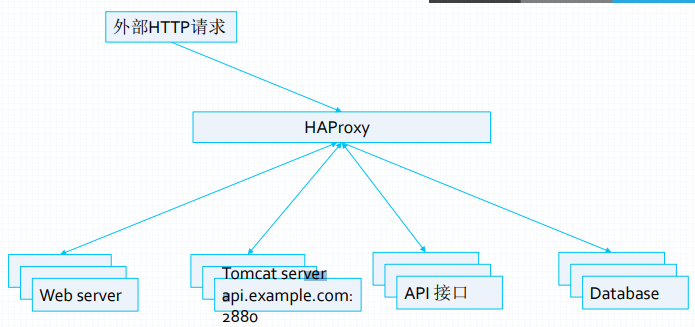

# HAProxy的安装及简单配置

- 简单的互联网架构：
	这种简单的架构只适用于并发量不是很大的小型网站

[](http://aishad.top/wordpress/wp-content/uploads/2019/06/架构.png)

- 访问入口高可用的互联网架构：
	防止访问入口遭受攻击或者某个网络入口故障，导致网站不能访问，通常B机房需要专线连接A机房后端application服务器，保证数据的一致性

[](http://aishad.top/wordpress/wp-content/uploads/2019/06/访问入口.png)

## HAPrxoy介绍
	HAProxy: 是法国开发者Willy Tarreau开发的一个开源软件，是一款具备高并发、高性能的TCP和HTTP负载均衡器，支持基于cookie的持久性，自动故障切换，支持正则表达式及web状态统计。

### HAProxy的功能
	HAProxy是TCP / HTTP反向代理服务器，尤其适合于高可用性高并发环境

- 可以针对HTTP请求添加cookie，进行路由后端服务器

- 可平衡负载至后端服务器，并支持持久连接

- 支持基于cookie进行调度

- 支持所有主服务器故障切换至备用服务器

- 支持专用端口实现监控服务

- 支持不影响现有连接情况下停止接受新连接请求

- 可以在双向添加，修改或删除HTTP报文首部
	双向添加，用户请求的报文和服务端的响应报文

- 支持基于pattern实现连接请求的访问控制

- 通过特定的URI为授权用户提供详细的状态信息

### 历史版本更新功能

- 1.8：多线程，HTTP/2缓存……

- 1.7：服务器动态配置，多类型证书……

- 1.6：DNS解析支持，HTTP连接多路复用……

- 1.5：开始支持SSL，IPV6，keepalived……

### HAProxy应用
[](http://aishad.top/wordpress/wp-content/uploads/2019/06/haproxy.png)

### HAProxy的安装 

	主程序：/usr/sbin/haproxy
	配置文件：/etc/haproxy/haproxy.cfg
	Unit file：/usr/lib/systemd/system/haproxy.service


1. yum安装

- CentOS：yum install haproxy

- Ubuntu：apt-get install haproxy

2. 编译安装
	源码程序包获取http://haproxy.org/

- 安装依赖包：yum install gcc gcc-c++ glibc glibc-devel pcre pcre-devel openssl openssl-devel systemd-devel net-tools vim iotop bc zip unzip zlib-devel lrzsz tree screen lsof tcpdump wget ntpdate

- 解包：tar xvf haproxy-1.8.16.tar.gz && cd haproxy-1.8.16 

- 编译：make ARCH=x86_64 TARGET=linux2628 USE_PCRE=1 USE_OPENSSL=1 USE_ZLIB=1 USE_SYSTEMD=1 USE_CPU_AFFINITY=1 PREFIX=/usr/local/haproxy
	ARCH：指定cpu架构
	TARGET：指定内核版本
	USE_PCRE：是否支持正则表达式
	USE_OPENSSL：是否开启ssl
	USE_ZLIB：否支持压缩
	USE_SYSTEMD：为1支持使用 -Ws参数（systemd-aware master-worker 模式）启动Haproxy，从而实现单主进程多子进程运行模式。
	USE_CPU_AFFINITY：为开启haproxy进程与CPU核心绑定
	PREFIX：安装路径

- 安装：
	make install PREFIX=/usr/local/haproxy

- 复制启动命令：
	cp haproxy /usr/sbin/

3. 配置HAProxy

- 创建启动脚本
```bash
cat /usr/lib/systemd/system/haproxy.service
	[Unit]
	Description=HAProxy Load Balancer
	After=syslog.target network.target
	[Service]
	#支持多配置文件读取，类似于从侧面是实现配置文件的include功能。
	ExecStartPre=/usr/sbin/haproxy -f /etc/haproxy/haproxy.cfg -c -q
	ExecStart=/usr/sbin/haproxy -Ws -f /etc/haproxy/haproxy.cfg -p /run/haproxy.pid
	ExecReload=/bin/kill -USR2 $MAINPID
	[Install]
	WantedBy=multi-user.target
```

- 创建目录和用户
	mkdir /etc/haproxy
	useradd haproxy -s /sbin/nologin
	mkdir /var/lib/haproxy
	chown haproxy.haproxy /var/lib/haproxy/ -R
	systemctl restart haproxy

- 创建配置文件：
```bash
	vim /etc/haproxy/haproxy.cfg
		global
		maxconn 100000
		chroot /usr/local/haproxy
		#stats socket /var/lib/haproxy/haproxy.sock mode 600 level admin
		uid 99
		gid 99
		daemon
		nbproc 4
		cpu-map 1 0
		cpu-map 2 1
		cpu-map 3 2
		cpu-map 4 3
		pidfile /usr/local/haproxy/run/haproxy.pid
		log 127.0.0.1 local3 info

		defaults
		option http-keep-alive
		option  forwardfor
		maxconn 100000
		mode http
		timeout connect 300000ms
		timeout client  300000ms
		timeout server  300000ms

		listen stats
		 mode http
		 bind 0.0.0.0:9999
		 stats enable
		 log global
		 stats uri     /haproxy-status
		 stats auth    haadmin:q1w2e3r4ys

		listen  web_port
		 bind 0.0.0.0:80
		 mode http
		 log global
		 server web1  127.0.0.1:8080  check inter 3000 fall 2 rise 5
```

4. 启动并验证HAProxy的工作进程

- HAProxy1.5版本的进程

```bash
	root       7098      1  0 11:24 ?        00:00:00 /usr/sbin/haproxy-systemd-wrapper -f /etc/haproxy/haproxy.cfg -p /run/haproxy.pid
	haproxy    7099   7098  0 11:24 ?        00:00:00 /usr/sbin/haproxy -f /etc/haproxy/haproxy.cfg -p /run/haproxy.pid -Ds
	haproxy    7100   7099  0 11:24 ?        00:00:00 /usr/sbin/haproxy -f /etc/haproxy/haproxy.cfg -p /run/haproxy.pid -Ds
```

- HAProxy1.8版本的进程
```bash
	root       7659      1  0 11:23 ?        00:00:00 /usr/sbin/haproxy -Ws -f /etc/haproxy/haproxy.cfg -p /run/haproxy.pid
	nobody     7661   7659  0 11:23 ?        00:00:00 /usr/sbin/haproxy -Ws -f /etc/haproxy/haproxy.cfg -p /run/haproxy.pid
	nobody     7662   7659  0 11:23 ?        00:00:00 /usr/sbin/haproxy -Ws -f /etc/haproxy/haproxy.cfg -p /run/haproxy.pid
	nobody     7663   7659  0 11:23 ?        00:00:00 /usr/sbin/haproxy -Ws -f /etc/haproxy/haproxy.cfg -p /run/haproxy.pid
	nobody     7664   7659  0 11:23 ?        00:00:00 /usr/sbin/haproxy -Ws -f /etc/haproxy/haproxy.cfg -p /run/haproxy.pid
```

### HAProxy使用介绍

- 启动： 
	systemctl start haproxy
	systemctl enable haproxy

- haproxy命令：
	主要选项：
	-v：查看详细信息
	-f：指定配置文件
	-Ws：指定master-worker工作模式
	-q：静默模式


## HAProxy的配置
1. global：全局配置段
	进程及安全配置相关的参数
	性能调整相关参数
	Debug参数

2. proxies：代理配置段
	defaults：为frontend, backend, listen提供默认配置
	frontend：前端，相当于nginx中的server {}
	backend：后端，相当于nginx中的upstream {}
	listen：同时拥有前端和后端配置

### glob配置字段详解

1. chroot：锁定运行目录

2. daemon：以守护进程运行

3. stats socket /var/lib/haproxy/haproxy.sock mode 600 level admin：socket文件
	mode 600：socket文件的权限是600
	level admin：级别是admin

4. user, group, uid, gid :运行haproxy的用户身份

5. nbproc :开启的haproxy工作进程数，与CPU保持一致

6. cpu-map 1 0 #绑定haproxy 进程至指定CPU
	查看指定工作进程运行在哪颗cpu上：ps axo pid,cmd,psr | grep haproxy

7. maxconn ：每个haproxy进程的最大并发连接数

8. maxsslconn SSL每个haproxy进程ssl最大连接数

9. maxconnrate ：每个进程每秒最大连接数

10. spread-checks :后端server状态check随机提前或延迟百分比时间，建议2-5(20%-50%)之间
	避免在后端服务器过多的情况下，HAProxy同时去检测全部服务器，导致负载过重

11. pidfile ：指定pid文件路径

12. log 127.0.0.1 local3 info ：定义全局的syslog服务器；最多可以定义两个

### proxies配置字段详解
> • 注：name字段只能使用”-”、”_”、”.”、和”:”，并且严格区分大小写，例如：Web和web是完全不同的两组服务器。

1. defaults [name] #默认配置项，针对以下的frontend、backend和lsiten生效，可以多个name

- options  redispatch :当server Id对应的服务器挂掉后，强制定向到其他健康的服务器

- option abortonclose :当服务器负载很高的时候，自动结束掉当前队列处理比较久的链接

- option http-keep-alive 60:开启会话保持

- option forwardfor :开启IP透传

- mode [http|tcp] :默认工作类型

- timeout connect 120s :转发客户端请求到后端server的最长连接时间(TCP之前)

- timeout server 600s :转发客户端请求到后端服务端的超时超时时长（TCP之后）

- timeout client 600s :与客户端的最长空闲时间

- timeout http-keep-alive 120s : session 会话保持超时时间，范围内会转发到相同的后端服务器

- timeout check 5s :对后端服务器的检测超时时间

2. frontend配置参数

- bind：指定HAProxy的监听地址，可以是IPV4或IPV6，可以同时监听多个IP或端口，可同时用于listen字段中
	bind [address]:[port_range] [, ...] [param*]
	mode http/tcp #指定负载协议类型,如果不配置，会基础defaults中的配置
	use_backend backend_name #调用的后端服务器组名称

- 实例：
```bash
	frontend WEB_PORT
		bind 172.20.45.132:80,172.20.45.132:8080
		bind 192.168.45.132:10080,192.168.45.132:10043
		use_backend web_host
```

3. backend配置参数

- mode http/tcp ：指定负载协议类型

- option ：配置选项

- server name ip:port options：定义后端real server

> 注意：option后面加httpchk，smtpchk, mysql-check, pgsql-check，ssl-hello-chk方法，可用于实现更多应用层检测功能。

- 实例：
```bash
	backend web_host #(这里的名称必须是frontend中use_backend定义的名称)
	server webapp1 172.20.45.133:80
	server webapp1 172.20.45.133:80
```

4. 后端服务器状态监测及相关配置

- check :对指定的real server进行健康状态检查，默认不开启
	addr IP :可指定的健康状态监测IP
	port num :指定的健康状态监测端口
	inter num :健康状态检查间隔时间，默认2000 ms
	fall num :后端服务器失效检查次数，默认为3
	rise num :后端服务器从下线恢复检查次数，默认为2
	weight :默认为1，最大值为256，0表示不参与负载均衡
	backup :将后端服务器标记为备份状态
	disabled :将后端服务器标记为不可用状态
	redirect prefix http://www.xxx.com/ :将请求临时重定向至其它URL，只适用于http模式
	maxconn num：当前后端server的最大并发连接数
	backlog num：当server的连接数达到上限后的后援队列长度

> frontend/ backend 配置案例
```bash
	#官网业务访问入口======================================
	frontend WEB_PORT_80
		bind 192.168.7.248:80
		mode http
		use_backend web_prot_http_nodes
		
	backend web_prot_http_nodes
		mode http
		option forwardfor
		server 192.168.7.101 192.168.7.101:8080 check inter 3000 fall 3 rise 5
		server 192.168.7.102 192.168.7.102:8080 check inter 3000 fall 3 rise 5
```

5. listen配置参数
	listen相当于frontend+backend
> 使用listen替换frontend和backend的配置方式：
```bash
	#官网业务访问入口=====================================
	listen WEB_PORT_80
		bind 192.168.7.102:80
		mode http
		option forwardfor
		server web1 192.168.7.101:8080 check inter 3000 fall 3 rise 5
		server web2 192.168.7.101:8080 check inter 3000 fall 3 rise 5
```