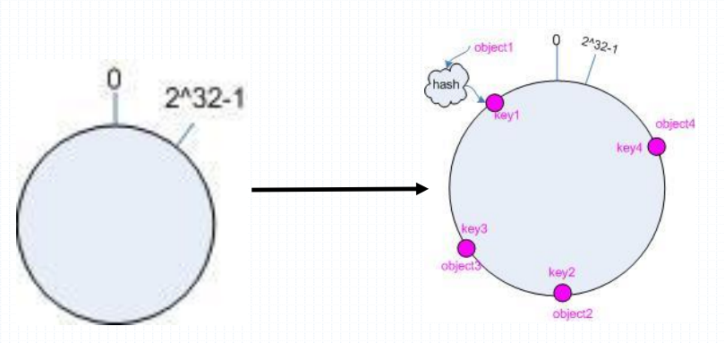
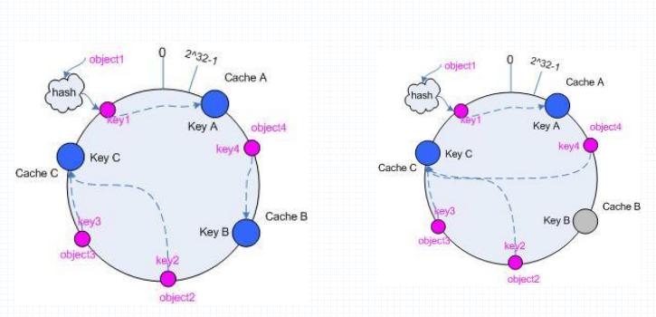
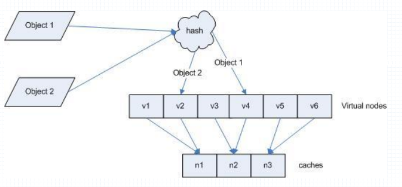

# HAProxy的调度算法
	HAProxy所使用的调度算法决定了，HAProxy接收到用户请求后，将请求转发到哪台后端服务器、或者去请求哪台后端服务器，HAProxy的调度算法分为静态调度算法和动态调度算法

> balance：指明对后端服务器视同的调度算法，配置在listen或者backend中

## HAProxy的静态调度算法
	按照事先定义好的规则轮询公平调度，不关心后端服务器的当前负载、链接数和响应速度等，且无法实时修改权重，只能重启后生效。

1. static-rr：基于权重的轮询调度算法，不支持权重的运行时调整及后端服务器的慢启动，其后端服务器数量没有限制，后端服务器默认的权重都为1，使用weight指定权重

> 慢启动：新加的服务器会逐渐增加转发数，会逐渐的给它分一部分请求，直到达到均衡

```bash
	listen  web_port
	 bind 172.20.45.132:80
	 bind 192.168.45.132:80
	 mode http
	 balance static-rr
	 log global
	 server web1  192.168.45.133:80  weight 2 check inter 3000 fall 2 rise 5
	 server web2  192.168.45.134:80  weight 1 check inter 3000 fall 2 rise 5
```

2. first:根据服务器在列表中的位置，自上而下进行调度，但是其只会当第一台服务器的连接数达到上限，新请求才会分配给下一台服务，因此会忽略服务器的权重设置。

```bash
	listen  web_port
	 bind 172.20.45.132:80
	 bind 192.168.45.132:80
	 mode http
	 balance first
	 log global
	 server web1  192.168.45.133:80  maxconn 2 check inter 3000 fall 2 rise 5
	 server web2  192.168.45.134:80  check inter 3000 fall 2 rise 5
```
> 当web1指定的最大并发连接数占满之后，才会将请求调度到web2，不常用

### -动态上下线服务器或者动态修改权重：
	将指定的字符串重定向到socket文件实现，因此haproxy需要打开socket文件：stats socket /var/lib/haproxy/haproxy.sock mode 600 level admin

- 依赖的软件包：socat 

1. socat的使用

- 查看帮助：echo "help" | socat stdio /var/lib/haproxy/haproxy.sock

- disable server：关掉一个后端服务器
	echo "disable server web_port/web1" | socat stdio /var/lib/haproxy/haproxy.sock
- enable server：打开一个后端服务器
	echo "enable server web_port/web1" | socat stdio /var/lib/haproxy/haproxy.sock
- set server：更改一个服务器的信息，类似权重，ip地址

- set weight：设置权重，要指定backend name/server name或者listen/server name
	echo "set weight web_port/web1 1" | socat stdio /var/lib/haproxy/haproxy.sock 

- get weight：获取权重
	echo "get weight web_port/web1" | socat stdio /var/lib/haproxy/haproxy.sock 
	echo "get weight web_port/web2" | socat stdio /var/lib/haproxy/haproxy.sock

## HAProxy的动态调度算法
	基于后端服务器 状态进行调度适当调整，比如优先调度至当前负载较低的服务器，且权重可以在haproxy运行时动态调整无需重启。

1. roundrobin：基于权重的轮询动态调度算法，支持权重的运行时调整，不等于lvs 的rr，支持慢启动即新加的服务器会逐渐增加转发数，每个后端backend中最多支持4095个server，此为默认调度算法，server 权重设置 weight

```bash
	listen  web_port
	 bind 172.20.45.132:80
	 bind 192.168.45.132:80
	 mode http
	 balance roundrobin
	 log global
	 server web1  192.168.45.133:80 weight 2 check inter 3000 fall 2 rise 5
	 server web2  192.168.45.134:80 weight 1 check inter 3000 fall 2 rise 5
```
2. leastconn： 加权的最少连接的动态，支持权重的运行时调整和慢启动，即当前后端服务器连接最少的优先调度，比较适合长连接的场景使用，比如MySQL等场景。

3. source:源地址hash，基于用户源地址hash并将请求转发到后端服务器，默认为静态即取模方式，但是可以通过hash-type支持的选项更改，后续同一个源地址请求将被转发至同一个后端web服务器，比较适用于session保持/缓存业务等场景。

- map-based:取模法，hash数据结构是静态数组；该hash是静态的，不支持在线调整权重，不支持慢启动；该算法调度平滑，后端服务器能够均匀承受负载;缺点也是明显的：当服务器的总权重发生变化时，即有服务器上线或下线，都会导致调度结果整体改变。
	例如：现在有web1和web2两个后端服务器，web1的权重为2，web2的权重为1，客户端访问时，源地址hash得到的值为11,那么11%3=2，那么会在hash表中记录取模后的值和对应的后端服务器，当用户下次再来访问的时候会调度到hash中记录的相同值的后端服务器上

[](http://aishad.top/wordpress/wp-content/uploads/2019/06/hash.png)

- consistent：一致性哈希，该hash是动态的，支持在线调整权重，支持慢启动，优点在于当服务器的总权重发生变化时，对调度结果影响是局部的，不会引起大的变动。
	一致性哈希算法,将0~2^32-1构成一个环,每个后端服务器生成大量节点平均分配在环的不同位置.将url哈希后的数值以2^32为被除数进行取模,计算后的数值一定在该环的不同位置.数值顺时针旋转遇到的第一个服务器便是选定的服务器.这个散列是动态的,它支持在服务器启动时更改权重.

[](http://aishad.top/wordpress/wp-content/uploads/2019/06/hash2.png)

```bash
	listen  web_port
	 bind 172.20.45.132:80
	 bind 192.168.45.132:80
	 mode http
	 balance source
	 hash-type consistent
	 log global
	 option forwardfor
	 server web1  192.168.45.133:80  check inter 3000 fall 2 rise 5
	 server web2  192.168.45.134:80  check inter 3000 fall 2 rise 5
```
- 一致性hash对象到后端服务器的映射关系：

[](http://aishad.top/wordpress/wp-content/uploads/2019/06/hash3.png)

4. uri：基于对用户请求的uri做hash并将请求转发到后端指定服务器,通常用于缓存服务器
	uri和url的详解请见博客：[Nginx配置](http://aishad.top/wordpress/?p=158 "Nginx配置")
	map-based：取模法
	consistent：一致性哈希
```bash
	listen  web_port
	 bind 172.20.45.132:80
	 bind 192.168.45.132:80
	 mode http
	 balance uri
	 hash-type consistent
	 log global
	 option forwardfor
	 server web1  192.168.45.133:80  check inter 3000 fall 2 rise 5
	 server web2  192.168.45.134:80  check inter 3000 fall 2 rise 5
```
> 注意：uri算法只能用在http模式下不支持tcp，会切换到tcp的roundrobin负载模式

5. url_param：对用户请求的url中的params部分中的参数name作hash计算，并由服务器总权重相除以后派发至某挑出的服务器；通常用于追踪用户，以确保来自同一个用户的请求始终发往同一个Backend Server
	假设url = http://www.magedu.com/foo/bar/index.php?k1=v1&k2=v2
	那么：
	host = "www.magedu.com"
	url_param = "k1=v1&k2=v2"
```bash
	listen  web_port
	 bind 172.20.45.132:80
	 bind 192.168.45.132:80
	 mode http
	 balance uri_param name
	 hash-type consistent
	 log global
	 option forwardfor
	 server web1  192.168.45.133:80  check inter 3000 fall 2 rise 5
	 server web2  192.168.45.134:80  check inter 3000 fall 2 rise 5
	测试：
		curl http://172.20.45.132/index.html?name=jack
		curl http://172.20.45.132/linux.html?name=jack
		curl http://172.20.45.132/index.html?name=tom
		curl http://172.20.45.132/index.html?passwd=123456
		curl http://172.20.45.132/index.html?passwd=123456
	相同的name字段，都会被调度到相同的后端服务器，除了指定字段以外的字段会被轮询调度
```
> 注意：uri_param算法只能用在http模式下不支持tcp，会切换到tcp的roundrobin负载模式

6. hdr：针对用户每个http头部(header)请求中的指定信息做hash，此处由name指定的http首部将会被取出并做hash计算，然后由服务器总权重相除以后派发至某挑出的服务器，假如无有效的值，则会被轮询调度
```bash
	listen  web_port
	 bind 172.20.45.132:80
	 bind 192.168.45.132:80
	 mode http
	 balance hdr(User-Agent) #对请求报文中的User-Agent字段做hash
	 hash-type consistent
	 log global
	 option forwardfor
	 server web1  192.168.45.133:80  check inter 3000 fall 2 rise 5
	 server web2  192.168.45.134:80  check inter 3000 fall 2 rise 5
```

7. rpd-cookie：对远程桌面的负载，使用cookie做会话保持
```bash
	listen RDP
	 bind 192.168.45.132:3389
	 balance rdp-cookie
	 mode tcp # 一定要是tcp
	 server rdp0 172.20.45.133:3389 check fall 3 rise 5 inter 2000 weight 1
	 server rdp1 172.20.45.134:3389 check fall 3 rise 5 inter 2000 weight 1
	# haproxy 还要做iptables实现目标地址转换
		iptables -t nat -A PREROUTING -d 192.168.45.132 -p tcp --dport 3389 -j DNAT --to-destination 172.20.45.133:3389
	iptables -t nat -A POSTROUTING -s 192.168.0.0/21 -j SNAT --to-source 192.168.45.132
```

## 调度算法总结：

- static-rr-------------->tcp/http 静态
	静态轮询

- first-------------------->tcp/http 静态，支持动态修改权重，但是不生效
	很少使用

- roundrobin-------->tcp/http 动态
	一般用于四层，做过session共享用的最多的调度算法

- leastconn----------->tcp/http 动态
	一般用于四层，用于后端服务器上的MySQL

> 以下的调度算法取决于hash_type是否consistent，才能判断是否为动态还是静态

- source---------------->tcp/http
	一般用于后端服务器没有做session共享，还想实现会话保持

- uri---------------------->http
	一般用于缓存场景，CDN缓存服务器，七层

- url_param---------->http 
	一般用于缓存场景，七层

- hdr--------------------->http
	基于请求报文头部指定信息做调度，七层

> 一般来说，HAProxy工作在四层负载均衡的工作性能要优于七层负载均衡，因为四层的情况下，HAProxy只做报文的转发，但是在七层情况下，HAProxy要对要对报文进行解封装和封装，性能会有下降

- rdp-cookie--------->tcp