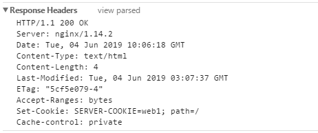
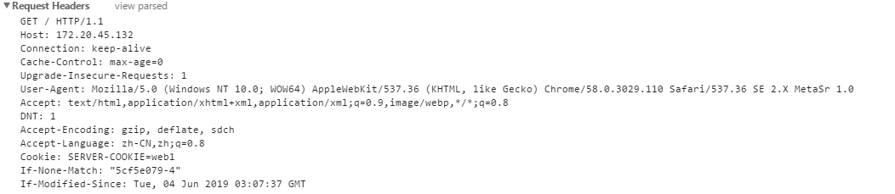

# HAProxy高级配置(一)：ip透传和cookie
	四层负载均衡和七层负载均衡见：[四层和七层详解](http://http://aishad.top/wordpress/?p=182 "四层和七层详解")

## 七层和四层的ip透传

1. 七层负载均衡的ip透传

- HAProxy设置：

```bash
	listen  web_port
	 bind 172.20.45.132:80
	 bind 192.168.45.132:80
	 mode http
	 option forwardfor # 开启ip透传
	 balance roundrobin
	 log global
	 server web1  www.aishd.top:80 weight 2 check inter 3000 fall 2 rise 5
```
- nginx配置json日志格式：
```bash
	log_format access_json '{"@timestamp":"$time_iso8601",'
        '"host":"$server_addr",'
        '"clientip":"$remote_addr",'
        '"size":$body_bytes_sent,'
        '"responsetime":$request_time,'
        '"upstreamtime":"$upstream_response_time",'
        '"upstreamhost":"$upstream_addr",'
        '"http_host":"$host",'
        '"uri":"$uri",'
        '"domain":"$host",'
        '"xff":"$http_x_forwarded_for",'  # 这里会记录透传过来的ip
        '"referer":"$http_referer",'
        '"tcp_xff":"$proxy_protocol_addr",'
        '"http_user_agent":"$http_user_agent",'
        '"status":"$status"}';
```
- 查看访问日志显示：
```bash
	tail -f /data/nginx/logs/blog_access.log
	{"@timestamp":"2019-06-04T17:32:10+08:00","host":"172.16.45.126","clientip":"114.245.34.42","size":6678,"responsetime":0.209,"upstreamtime":"0.209","upstreamhost":"127.0.0.1:9000","http_host":"172.20.45.132","uri":"/index.php","domain":"172.20.45.132","xff":"172.20.45.1","referer":"-","tcp_xff":"","http_user_agent":"Mozilla/5.0 (Windows NT 10.0; WOW64) AppleWebKit/537.36 (KHTML, like Gecko) Chrome/58.0.3029.110 Safari/537.36 SE 2.X MetaSr 1.0","status":"200"}
```

2. 四层负载均衡的ip透传

- HAProxy配置：
```bash
	listen  web_port
	 bind 172.20.45.132:80
	 bind 192.168.45.132:80
	 mode tcp
	 balance roundrobin
	 log global
	 server web1  www.aishd.top:80 send-proxy weight 2 check inter 3000 fall 2 rise 5
```
- nginx配置：
	listen 80 proxy_protocol;
	'"tcp_ip":"$proxy_protocol_addr",' #TCP获取客户端真实IP日志格式

- 查看访问日志显示：
```bash
	{"@timestamp":"2019-06-04T17:54:36+08:00","host":"192.168.45.133","clientip":"192.168.45.132","size":0,"responsetime":0.000,"upstreamtime":"-","upstreamhost":"-","http_host":"172.20.45.132","uri":"/index.html","domain":"172.20.45.132","xff":"-","referer":"-","tcp_xff":"172.20.45.1","http_user_agent":"Mozilla/5.0 (Windows NT 10.0; WOW64) AppleWebKit/537.36 (KHTML, like Gecko) Chrome/58.0.3029.110 Safari/537.36 SE 2.X MetaSr 1.0","status":"304"}
```

## cookie配置
	基于目前的上网方式基本上用的都是nat，如果使用source做调度算法的话，使用相同的nat出来的用户都会被转发到同一台后端服务器，这种情况下如果用户过多的情况下也会导致后端服务器的负载过重，那么久可以使用roundrobin的调度算法，当用户请求的时候，判断cookie是否存在，不存在的话插入cookie，存在的话将用户调度到对应的后端服务器,这样的话就实现了相同的源地址，不同的后端服务器的实现

- cookie配置： 模式要在http下才生效
```bash
	cookie <value>：为当前server指定cookie值，实现基于cookie的会话黏性
	cookie <name> [ rewrite | insert | prefix ] [ indirect ] [ nocache ] [ postonly ] [preserve ] [ httponly ] [ secure ] [ domain <domain> ]* [ maxidle <idle> ] [maxlife <life> ]
	<name>：cookie名称，用于实现持久连接
		rewrite：重写
		insert：插入
		prefix：前缀
		nocache：当client和hapoxy之间有缓存时，不缓存cookie
```
- 基于cookie实现的session保持
```bash
	listen  web_port
	 bind 172.20.45.132:80
	 bind 192.168.45.132:80
	 mode http
	 #option forwardfor
	 balance roundrobin
	 cookie SERVER-COOKIE insert indirect nocache  # SERVER-COOKIE为cookie的名称
	 log global
	 server web1  192.168.45.133:80  cookie web1 check inter 3000 fall 2 rise 5 # web1为cookie的id
	 server web2  192.168.45.134:80  cookie web2 check inter 3000 fall 2 rise 5
```
- 第一次访问测试：
	由于是第一次连接，HAProxy会在响应报文中插入设置cookie

[](http://aishad.top/wordpress/wp-content/uploads/2019/06/cookie.png)

- 后续访问测试：
	由于在第一次设置了cooike，那么在此去访问的话会客户端的请求报文中会携带cookie信息

[](http://aishad.top/wordpress/wp-content/uploads/2019/06/cookie2.png)