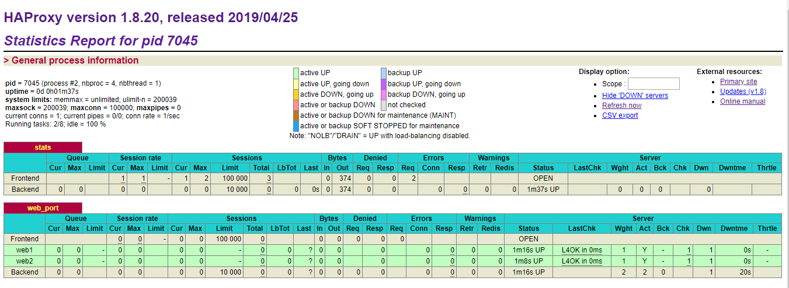

HAProxy高级配置(二)：状态页、报文修改、压缩、状态监测和自定义日志

##  HAProxy的状态页

```bash
	listen stats
		bind :9009
		stats enable # 基于默认的参数启用stats page
		#stats hide-version  # 隐藏版本
		stats uri /haproxy-status  #自定义stats page uri，默认值：/haproxy?stats
		stats realm HAPorxy\ Stats\ Page   #账户认证时的提示信息，
		stats auth haadmin:123456  # 认证时的账号和密码，可使用多次，默认：no authentication
		stats auth admin:123456
		stats refresh 30s   # 设定自动刷新时间间隔
		stats admin if TRUE #启用stats page中的管理功能
```

- 访问测试：haproxy_ip:9009/haproxy-status
[](http://aishad.top/wordpress/wp-content/uploads/2019/06/HAProxy-status.png)

## 修改报文首部

1. 在请求尾部添加指定信息
	reqadd [string] [{if | unless} [cond]] ：支持条件判断

2. 在响应报文尾部添加指定信息
	rspadd <string\> [{if | unless} <cond\>]

3. 从请求报文中删除匹配正则表达式的首部
	reqdel <search\> [{if | unless} <cond\>]
	reqidel <search\> [{if | unless} <cond\>] 不分大小写

4. 从响应报文中删除匹配正则表达式的首部
	rspdel <search\> [{if | unless} <cond\>]
	rspidel <search\> [{if | unless} <cond\>]

- 示例：
	rspidel server.* #从相应报文删除server信息
	rspidel X-Powered-By:.* #从响应报文删除X-Powered-By信息

## HAProxy日志配置
	在default配置项定义

1. 日志配置
	log 127.0.0.1 local{1-7} info #基于syslog记录日志到指定设备，级别有(err、warning、info、debug)

- 配置rsyslog：
	$ModLoad imudp
	$UDPServerRun 514
	local3.* /var/log/haproxy.log

- 配置HAProxy
	listen web_port
	 bind 127.0.0.1:80
	 mode http
	 log global
	 option tcplog
	 server web1 127.0.0.1:8080 check inter 3000 fall 2 rise 5


2. 自定义记录日志

- 将特定信息记录在日志中
	capture cookie <name\> len <length\> #捕获请求和响应报文中的 cookie并记录日志
	capture request header <name\> len <length\> #捕获请求报文中指定的首部内容和长度并记录日志
	capture response header <name\> len <length\> #捕获响应报文中指定的内容和长度首部并记录日志

- 示例：
	capture request header Host len 256 # 记录Host信息
	capture request header User-Agent len 512  # 记录请求报文中的浏览器类型
	capture request header Referer len 256 # 记录referer信息(从哪个网站跳转过来)

## 压缩功能：要在http模式下
	compression algo #启用http协议中的压缩机制，常用算法有gzip deflate
	compression type #要压缩的类型

- 示例：
	compression algo gzip
	compression type compression type text/plain text/html text/css text/xmltext/javascript application/javascript

[](http://aishad.top/wordpress/wp-content/uploads/2019/06/HAProxy-status.png)

## Web服务器状态监测
- 三种状态监测方式：

1. 基于四层的传输端口做状态监测
	server web1  192.168.45.133:80   check inter 3000 fall 2 rise 5

2. 基于指定URI做状态监测
	option httpchk GET /wp-includes/js/jquery/jquery.js?ver=1.12.4 HTTP/1.0 #基于指定URL
	一般来说该页面不对用户提供访问，只用于做健康性监测，但是这种方式是有问题的，因为当HAProxy做健康性监测的时候，需要完整的将监控页面完整的传输一次，会造成不必要的磁盘I/O和网络I/O
	option httpchk HEAD /wp-includes/js/jquery/jquery.js:一般使用这种方式，只获取

3. 基于指定URI的request请求头部内容做状态监测
	option httpchk HEAD /wp-includes/js/jquery/jquery.js?ver=1.12.4 HTTP/1.0\r\nHost:\ 192.168.7.102 #通过request 获取的头部信息进行匹配进行健康检测