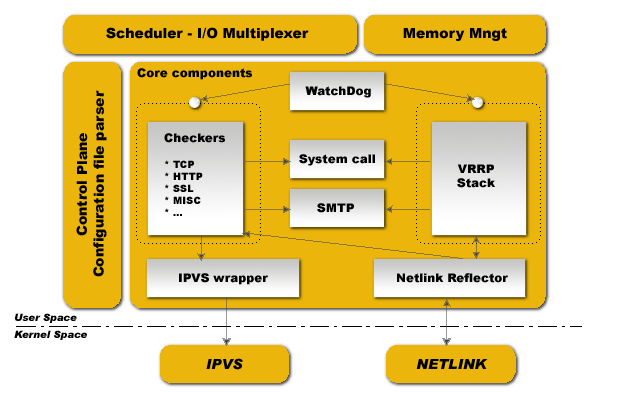

# Keepalived简介
	vrrp协议的软件实现，原生设计目的为了高可用ipvs服务

- 功能：
	• 基于vrrp协议完成地址流动
	• 为vip地址所在的节点生成ipvs规则(在配置文件中预先定义)
	• 为ipvs集群的各RS做健康状态检测
	• 基于脚本调用接口通过执行脚本完成脚本中定义的功能，进而影响集群事务，以此支持nginx、haproxy等服务

[](http://aishad.top/wordpress/wp-content/uploads/2019/06/keepalived.png)

- 术语:
	虚拟路由器：Virtual Router
	虚拟路由器标识：VRID(0-255)，唯一标识虚拟路由器
	物理路由器：
		master：主设备
		backup：备用设备
		priority：优先级(通常master的优先级高于backup，优先级的高度决定资源在哪运行)
	VIP：Virtual IP
	VMAC：Virutal MAC (00-00-5e-00-01-VRID)

- 通告：心跳，优先级等；周期性默认是1s

- 工作方式：抢占式，非抢占式

- 安全工作：master和backup之间的监测
	无认证
	简单字符认证：预共享密钥

- 工作模式：
	主/备：单虚拟路由器
	主/主：主/备（虚拟路由器1），备/主（虚拟路由器2）

- 安装：
	yum -y install keepalived

#### 组件
- 用户空间核心组件
	vrrp stack-VIP消息通告：定期广播vip所在的服务器
	checkers-监测real server，监测端口，html等
	system call-标记real server权重
	SMTP-邮件组件，出现异常后的通知机制
	ipvs wrapper-生成IPVS规则
	Netlink Reflector-网络接口
	WatchDog-监控进程

- 控制组件：control plane
	解析配置文件

- IO复用器

- 内存管理组件

## keepalived配置
- 程序环境：
	• 主配置文件：/etc/keepalived/keepalived.conf
	• 主程序文件：/usr/sbin/keepalived

- Unit File：
	• /usr/lib/systemd/system/keepalived.service (CentOS)
	• /lib/systemd/system/keepalived.service (Ubuntu)

- • Unit File的环境配置文件：
		• /etc/sysconfig/keepalived

### keepalived.conf配置文件

1. global_defs ：全局配置

- notification_email：邮件通知配置
	root@localhost #keepalived 发生故障切换时邮件发送的对象，可以按行区分写多个

- 全局配置参数：keepalived启动后和主进程相关的参数
	notification_email_from Alexandre.Cassen@firewall.loc ：声明报警邮件是从哪发出去的
	smtp_server 127.0.0.1 ： smtp服务器地址
  	smtp_connect_timeout 30 ：smtp服务器连接超时时间
   	router_id LVS_DEVEL ：虚拟路由标识符，一般为当前主机名称，保证master和backup不同
   	vrrp_skip_check_adv_addr ：所有报文都检查比较消耗性能，此配置为如果收到的报文和上一个报文是同一个路由器则跳过检查报文中的源地址
   	vrrp_strict ：#严格遵守VRRP协议,不允许状况:1.没有VIP地址 2.单播邻居 3.在VRRP版本2中有IPv6地址
   	vrrp_garp_interval 0  #ARP报文发送延迟
   	vrrp_gna_interval 0  #消息发送延迟
	vrrp_mcast_group4 224.0.0.18 #默认组播IP地址，224.0.0.0到239.255.255.255(keepalived默认是通过组播来监测心跳信息的)
	vrrp_iptables :不生成默认的iptables规则

2. vrrp_instance：配置虚拟路由器，后面加实例名称
	state MASTER：当前节点在此虚拟路由器上的初始状态，状态为MASTER或者BACKUP
   	interface eth0 ：绑定为当前虚拟路由器使用的物理接口
   	virtual_router_id 51：当前虚拟路由器惟一标识，范围是0-255
   	priority 100： 当前物理节点在此虚拟路由器中的优先级；范围1-254
   	advert_int 2：keepalived默认探测时间间隔

- authentication：认证机制
        auth_type PASS ：认证类型是密码
        auth_pass admin123：认证密码，仅前8位有效

- virtual_ipaddress：虚拟路由地址
	<IPADDR\>/<MASK\> brd <IPADDR\> dev <STRING\> scope <SCOPE\> label <LABEL\>
	172.20.45.248 dev eth0 label eth0:0

- master节点配置示例：
```bash
	! Configuration File for keepalived

	global_defs {
	   notification_email {
		  root@localhost
	   }
	   notification_email_from root@localhost
	   smtp_server 127.0.0.1
	   smtp_connect_timeout 30
	   router_id keepalived1
	   vrrp_skip_check_adv_addr
	   vrrp_strict
	   vrrp_garp_interval 0
	   vrrp_gna_interval 0
	   vrrp_iptables
	}

	vrrp_instance VIP_1 {
		state MASTER
		interface eth0
		virtual_router_id 45
		priority 100
		advert_int 1
		authentication {
			auth_type PASS
			auth_pass admin123
		}
		virtual_ipaddress {
			172.20.45.248 dev eth0 label eth0:0
		}
	}
```
- backup节点配置示例：
```bash
	! Configuration File for keepalived

	global_defs {
	   notification_email {
		  root@localhost
	   }
	   notification_email_from root@localhost
	   smtp_server 127.0.0.1
	   smtp_connect_timeout 30
	   router_id keepalived2
	   vrrp_skip_check_adv_addr
	   vrrp_strict
	   vrrp_garp_interval 0
	   vrrp_gna_interval 0
	   vrrp_iptables
	}

	vrrp_instance VIP_1 {
		state BACKUP
		interface eth0
		virtual_router_id 45
		priority 80
		advert_int 1
		authentication {
			auth_type PASS
			auth_pass admin123
		}
		virtual_ipaddress {
			172.20.45.248 dev eth0 label eth0:0
		}
	}
```