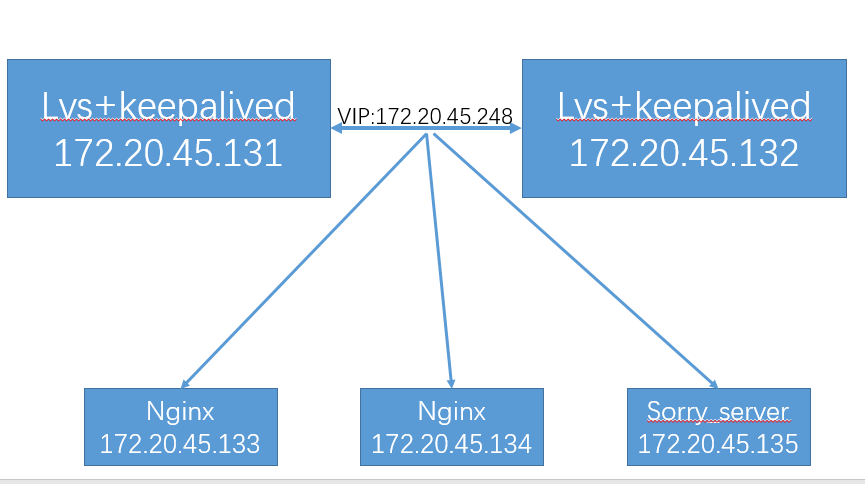

# KeepAlived与IPVS

### 虚拟服务器配置参数

- virtual server （虚拟服务）的定义
	virtual_server IP port #定义虚拟主机IP地址及其端口
	virtual_server fwmark int #ipvs的防火墙打标，实现基于防火墙的负载均衡集群，凡是访问相同ip地址的，无论是哪个端口都一起发送给指定的服务器
	virtual_server group string #将多个虚拟服务器定义成组，将组定义成虚拟服务

```bash
	virtual_server IP port
	{
	虚拟服务的调度方法
	...
	real_server ipaddr port {
	real_server ip、端口、监测方式等
	...
	}
	…
	}
```

- virtual_server字段配置：
	delay_loop 数值：检查后端服务器的时间间隔
	lb_algo rr|wrr|lc|wlc|lblc|sh|dh：定义调度方法
	lb_kind NAT|DR|TUN：集群的类型，通常是DR模式
	persistence_timeout 数值：持久连接时长
	protocol TCP|UDP|SCTP：指定服务协议
	sorry_server <IPADDR\> <PORT\>：所有RS故障时，备用服务器地址

- real_server <IPADDR\> <PORT\>字段配置：
	weight <INT\> RS权重
	notify_up <STRING\>|<QUOTED-STRING\> RS上线通知脚本
	notify_down <STRING\>|<QUOTED-STRING\> RS下线通知脚本
	HTTP_GET|SSL_GET|TCP_CHECK|SMTP_CHECK|MISC_CHECK { ... }：定义当前主机的健康状态检测方法

### 应用层监测
> HTTP_GET|SSL_GET：应用层检测
```bash
HTTP_GET|SSL_GET {
	url {
	    path <URL_PATH>：定义要监控的URL
	    status_code <INT>：判断上述检测机制为健康状态的响应码
	}
	connect_timeout <INTEGER>：连接请求的超时时长
	nb_get_retry <INT>：重试次数
	delay_before_retry <INT>：重试之前的延迟时长
	connect_ip <IP ADDRESS>：向当前RS哪个IP地址发起健康状态检测请求
	connect_port <PORT>：向当前RS的哪个PORT发起健康状态检测请求
	bindto <IP ADDRESS>：发出健康状态检测请求时使用的源地址
	bind_port <PORT>：发出健康状态检测请求时使用的源端口
}
```

### TCP监测
> 传输层检测 TCP_CHECK
```bash
TCP_CHECK {
	connect_ip <IP ADDRESS>：向当前RS的哪个IP地址发起健康状态检测请求
	connect_port <PORT>：向当前RS的哪个PORT发起健康状态检测请求
	bindto <IP ADDRESS>：发出健康状态检测请求时使用的源地址
	bind_port <PORT>：发出健康状态检测请求时使用的源端口
	connect_timeout <INTEGER>：连接请求的超时时长
}
```
## Keepalived案例一：实现LVS-DR模式
[](http://aishad.top/wordpress/wp-content/uploads/2019/06/lvs_DR.png)

1. 配置keepalived：两个keepalived服务器的配置类似

- keepalived主配置文件中导入：
	include /etc/keepalived/conf/*.conf

- vim /etc/keepalived/conf/web.conf
```bash
virtual_server 172.20.45.248 80 {
    delay_loop 6
    lb_algo wrr
    lb_kind DR
    #persistence_timeout 120 #会话保持时间
    protocol TCP
    #sorry_server 172.20.45.135 80

    real_server 172.20.45.133 80 {
        weight 1
        TCP_CHECK {
            connect_timeout 5
            nb_get_retry 3
            delay_before_retry 3
            connect_port 80
        }
     }

        real_server 172.20.45.134 80 {
            weight 1
            TCP_CHECK {
            connect_timeout 5
            nb_get_retry 3
            delay_before_retry 3
            connect_port 80
            }
         }
}
```
- 重启keepalived，查看生成的lvs规则
	ipvsadm -Ln --stats

2. 准备web服务器并使用脚本绑定VIP至web服务器lo网卡
```bash
[ root@localhost ~]# vim lvs_dr.sh 
#!/bin/bash
vip=172.20.45.248
mask='255.255.255.255'
dev=lo:1
case $1 in
start)
        echo 1 > /proc/sys/net/ipv4/conf/all/arp_ignore
        echo 1 > /proc/sys/net/ipv4/conf/lo/arp_ignore
        echo 2 > /proc/sys/net/ipv4/conf/all/arp_announce
        echo 2 > /proc/sys/net/ipv4/conf/lo/arp_announce
        ifconfig $dev $vip netmask $mask #broadcast $vip up
        #route add -host $vip dev $dev
        ;;
stop)
        ifconfig $dev down
        echo 0 > /proc/sys/net/ipv4/conf/all/arp_ignore
        echo 0 > /proc/sys/net/ipv4/conf/lo/arp_ignore
        echo 0 > /proc/sys/net/ipv4/conf/all/arp_announce
        echo 0 > /proc/sys/net/ipv4/conf/lo/arp_announce
        ;;
*)
        echo "Usage: $(basename $0) start|stop"
        exit 1
;;
esac

[ root@localhost ~]# bash lvs_dr.sh start
```

3. 测试web访问

4. 配置http监测
```bash
real_server 172.20.45.133 80 {
	weight 1
	HTTP_GET {
		url {
			path /index.html
			status_code 200
		}
	}
	connect_timeout 5
	nb_get_retry 3
	delay_before_retry 3
}                     
```