# 容器技术
容器技术是虚拟化、云计算、大数据之后的一门新兴的并且炙手可热的新技术，容器技术提高了硬件资源利用率，方便了企业的业务快速横向扩容、实现了业务宕机自愈能力，因此未来数年会是一个容器愈发流行的时代

容器技术最早出现在FreeBSD上，叫做jail

- 资源视图隔离 : namespace
- 控制资源的使用率 : cgroup
- 独立的文件系统 : chroot

> 容器:是一个视图隔离,资源可限制,独立文件系统的进程集合,运行容器所需要的文件的集合称为镜像

## docker
docker是2013年开源的，基于go语言编写的一个开源的Pass层(Platform as a Service，平台即服务的缩写)的实现，docker是基于Linux内核实现的，最早采用LXC技术（Linux container），而虚拟化技术KVM是基于模块实现的，后来docker改为使用自己研发并开源的runc技术运行容器

### docker的特点
docker相比虚拟机来说，交付速度更快、资源消耗更低，docker采用C/S架构(启动docker后服务端是docker启动的守护进程，客户端是docker命令，用来管理docker容器)，使用远程API来管理和创建Docker容器，其可以轻松创建一个轻量级、可移植的、自给自足的容器

docker的三大理念是build(构建)、ship(运输)、run(运行)，并通过namespace及cgroup来提供容器的资源隔离与安全保障等(一次构建，任意运输，到处运行)

## Docker的组成
https://docs.docker.com/engine/docker-overview/

Docker Host(主机)：一个物理机或虚拟机，用于运行Docker服务进程和容器
Docker Server(服务端)：Docker的守护进程，运行docker容器
Docker Client(客户端)：客户端使用docker命令或其他工具调用docker API
Docker Registry(仓库)：保存镜像的仓库，类似与git或svn这样的版本控制系统
Docker Images(镜像)：镜像可以理解为创建实例使用的模板
Docker Container（容器）：容器是从镜像生成对外提供服务的一个或一组服务

> 官方仓库：https://hub.docker.com/
> 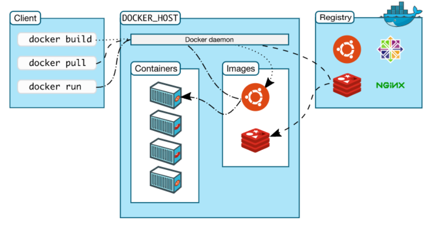

### Docker对比虚拟机

1. 资源利用率更高，一台物理机可以运行数百个容器，但是一般只能运行数十个虚拟机

2. 开销更小：不需要启动单独的虚拟机占用硬件资源

3. 启动速度更快：可以再数秒内完成启动

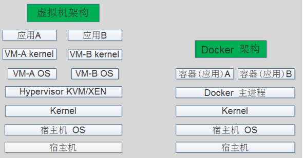
使用虚拟机是为了更好的实现服务运行时的环境隔离，每个虚拟机都有独立的内核，虚拟化可以实现不同操作系统的虚拟机，但是通常一个虚拟机只运行一个服务，这样的话就会造成资源的浪费，但是容器技术会监测中间运行环境，能带来较大的性能提升
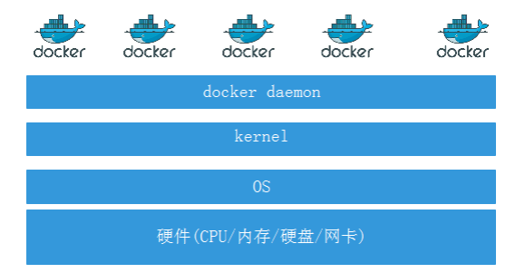

当一个宿主机运行了 N 个容器，多个容器带来的以下问题通过Linux的namespace来解决
1. 怎么样保证每个容器都有不同的文件系统并且能互不影响？
2. 一个 docker 主进程内的各个容器都是其子进程，那么实现同一个主进程下不同类型的子进程？各个进程间通信能相互访问(内存数据)吗？
3. 每个容器怎么解决 IP 及端口分配的问题？
4. 多个容器的主机名能一样吗？
5. 每个容器都要不要有 root 用户？怎么解决账户重名问题？

## Linux的Namespace技术
namespace是Linux系统的底层概念，在内核层实现，即有一些不同类型的命名空间被部署在内核，各个docker容器运行在同一个docker主进程并且共同且公用同一个宿主机的系统内核，各个docker容器运行在数字键的用户空间，每个容器都要有类似与虚拟机一样的相互隔离的运行空间，但是容器技术是在一个进程内实现运行指定服务的运行环境，并且还可以保护宿主机内核不受其他进程的干扰和影响，如文件系统空间、网络空间、进程空间等，目前主要通过一下技术实现容器运行空间的相互隔离
[table id=4 /]

1. MNT Namespace
每个容器都要有独立的根文件系统和独立的用户空间，以实现在容器中启动服务并使用容器的运行环境，即一个Ubuntu的宿主机，里面可以启动一个CentOS运行环境的容器，并在里面启动一个nginx服务，此nginx运行时使用的环境就是CentOS系统目录的运行环境，但是在容器中是不能访问宿主机的资源，宿主机是使用了chroot技术，把容器锁定到一个指定的运行目录里面
例如：/var/lib/containerd/io.containerd.runtime.v1.linux/moby/容器ID
```bash
# 运行了两个容器就会有两个隔离的文件
root@weiying:~# ls /var/lib/containerd/io.containerd.runtime.v1.linux/moby/
9e650aa34db63b9e6167c98cdb823d02a7fab019c108cc9f9392be18261a550d
db134b1fd44d89e3a9e02f0a94c70cc1c7d547c5a5bd5833491f7a4e8534eb6f
root@weiying:~# docker ps
CONTAINER ID        IMAGE               COMMAND                  CREATED              STATUS              PORTS                NAMES
db134b1fd44d        nginx               "nginx -g 'daemon of…"   About a minute ago   Up About a minute   0.0.0.0:80->80/tcp   nginx-1
9e650aa34db6        centos              "/bin/bash"              24 hours ago         Up 3 minutes                             gracious_liskov
```
进入容器中并验证容器的根文件系统
```bash
root@weiying:~# docker exec -it 9e650aa34db6 bash
[root@9e650aa34db6 /]# ls
anaconda-post.log  dev  home  lib64  mnt  proc  run   srv  tmp  var
bin                etc  lib   media  opt  root  sbin  sys  usr
```

2. IPC Namespace
一个容器中的进程间通信，允许一个容器内的不同的进程的(内存、缓存等)数据访问，但是不能跨容器访问其他容器的数据

3. UTS Namespace
包含了运行内核的名称、版本、底层体系结构类型等信息，用于系统标识，其中包含hostname和域名
domainname ，它使得一个容器拥有属于自己 hostname 标识，这个主机名标识独立于宿主机系统和其上的其他容器。

4. ：PID Namespace
Linux 系统中，有一个 PID 为 1 的进程(init/systemd)是其他所有进程的父进程，那么在每个容器内也要有一个父进程来管理其下属的子进程，那么多个容器的进程通 PID namespace 进程隔离(比如 PID 编号重复、器内的主进程生成与回收子进程等)。

例：在nginx镜像中内使用 top 命令看到的 PID 为 1 的进程是 nginx：
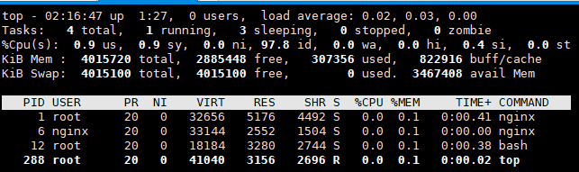

容器中查看nginx镜像的主进程与工作进程
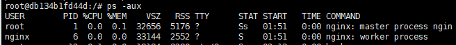

查看宿主机的PID信息
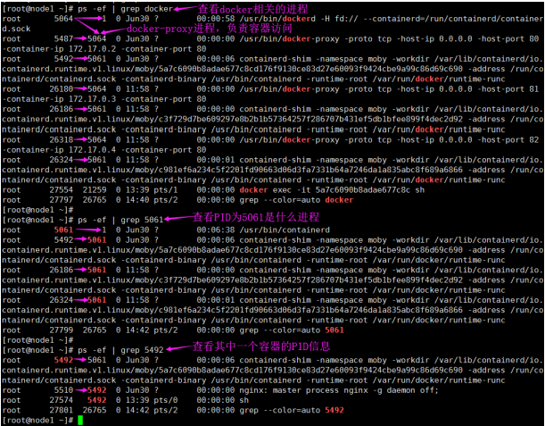

查看容器汇总PID信息
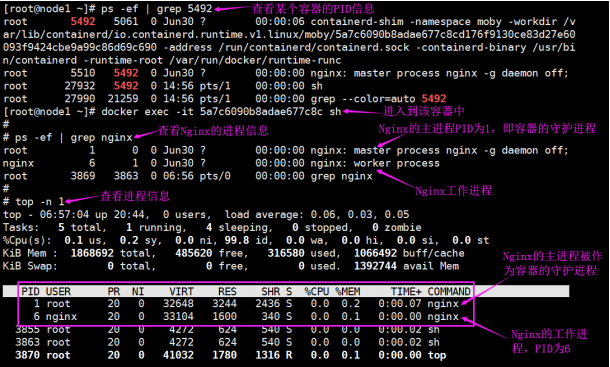

> pid为1的守护进程，是通过指定的命令启动的
5. Net Namespace
每个容器中都类似与虚拟机一样有自己的网卡、监听端口、tcp/ip协议栈等，docker使用network namespace启动一个vethX接口，这样你的容器将拥有它自己的桥接ip地址，通常是docker0，而docker0实质上就是linux的虚拟网桥，,网桥是在 OSI 七层模型的数据链路层的网络设备，通过 mac 地址对网络进行划分，并且在不同网络直接传递数据

查看宿主机的网卡信息
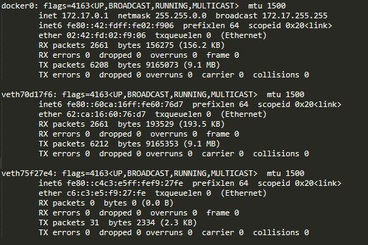

查看宿主机桥接设备
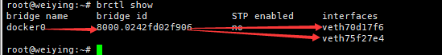

容器内的网络设备查看
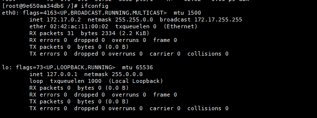

网络实现逻辑图
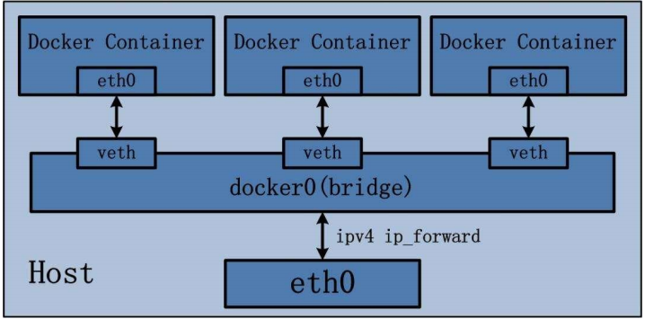

宿主机的iptables规则

> 宿主机和容器的通信，默认完全依靠iptables来实现，只要是宿主机能访问的网络，容器就能访问，如果容器数量太多的话，会导致产生大量的iptables规则，会影响性能，因此可以基于LVS实现

- 通过源地址转换，让容器通过宿主机访问外网
[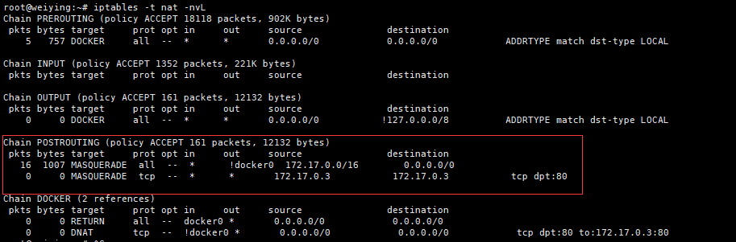](http://aishad.top/wordpress/wp-content/uploads/2019/07/4c53c7326c4edf4dcd4abff162a723cd.png)


- 通过目的地址转换，以实现从外部宿主机访问容器
[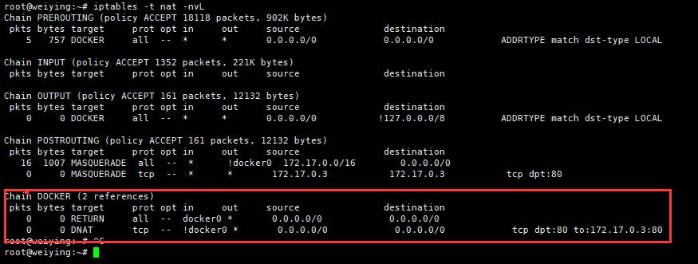](http://aishad.top/wordpress/wp-content/uploads/2019/07/fd5906a2f4145e58f9eb43ba883cdf22.png)

- iptables定义的转发规则
[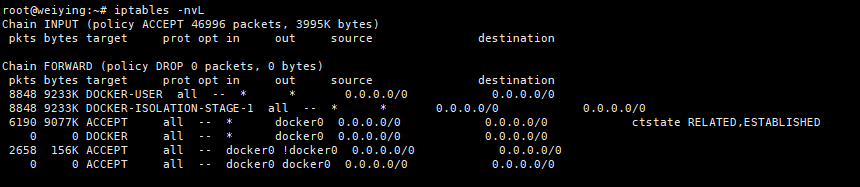](http://aishad.top/wordpress/wp-content/uploads/2019/07/787d77793ce193d29ebb24fca6518563.png)

6. User Namespace
User Namespace 允许在各个宿主机的各个容器空间内创建相同的用户名以及相同的用户 UID 和 GID，只是会把用户的作用范围限制在每个容器内，即 A 容器和 B 容器可以有相同的用户名称和 ID 的账户，但是此用户的有效范围仅是当前容器内，不能访问另外一个容器内的文件系统，即相互隔离、互补影响、永不相见

## Linux Control Groups
在一个容器，如果不对其做任何资源限制，则宿主机会允许其占用无限大的内存空间，有时候会因为代码 bug 程序会一直申请内存，直到把宿主机内存占完，为了避免此类的问题出现，宿主机有必要对容器进行资源分配限制，比如CPU、内存等，Linux Cgroups 的全称是 Linux Control Groups，它最主要的作用，就是限制一个进程组能够使用的资源上限，包括 CPU、内存、磁盘、网络带宽等等。此外，还能够对进程进行优先级设置，以及将进程挂起和恢复等操作。

### 验证系统的cgroups
Cgroups 在内核层默认已经开启，从 centos 和 ubuntu 对比结果来看，显然内核较新的 ubuntu 支持的功能更多。

ubuntu的cgroups
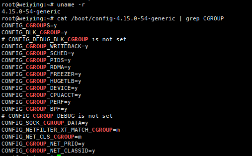

CentOS的cgroups
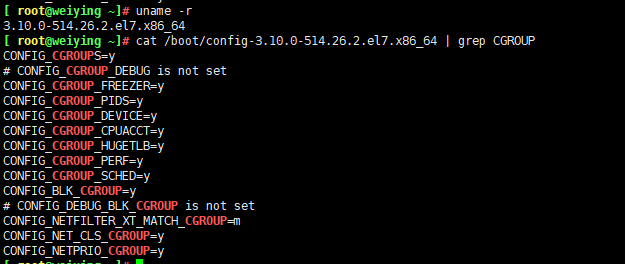

### Cgroups具体的实现
查看系统的cgroups
```bash
root@weiying:~# ll /sys/fs/cgroup/
total 0
drwxr-xr-x 15 root root 380 Jul  4 00:49 ./
drwxr-xr-x 10 root root   0 Jul  4 00:49 ../
dr-xr-xr-x  5 root root   0 Jul  4 00:49 blkio/
lrwxrwxrwx  1 root root  11 Jul  4 00:49 cpu -> cpu,cpuacct/
lrwxrwxrwx  1 root root  11 Jul  4 00:49 cpuacct -> cpu,cpuacct/
dr-xr-xr-x  5 root root   0 Jul  4 00:49 cpu,cpuacct/
dr-xr-xr-x  3 root root   0 Jul  4 00:49 cpuset/
dr-xr-xr-x  5 root root   0 Jul  4 00:49 devices/
dr-xr-xr-x  3 root root   0 Jul  4 00:49 freezer/
dr-xr-xr-x  3 root root   0 Jul  4 00:49 hugetlb/
dr-xr-xr-x  5 root root   0 Jul  4 00:49 memory/
lrwxrwxrwx  1 root root  16 Jul  4 00:49 net_cls -> net_cls,net_prio/
dr-xr-xr-x  3 root root   0 Jul  4 00:49 net_cls,net_prio/
lrwxrwxrwx  1 root root  16 Jul  4 00:49 net_prio -> net_cls,net_prio/
dr-xr-xr-x  3 root root   0 Jul  4 00:49 perf_event/
dr-xr-xr-x  5 root root   0 Jul  4 00:49 pids/
dr-xr-xr-x  2 root root   0 Jul  4 00:49 rdma/
dr-xr-xr-x  6 root root   0 Jul  4 00:49 systemd/
dr-xr-xr-x  5 root root   0 Jul  4 00:49 unified/
```
各个目录的说明
```bash
blkio：块设备 IO 限制。
cpu：使用调度程序为 cgroup 任务提供 cpu 的访问。
cpuacct：产生 cgroup 任务的 cpu 资源报告。
cpuset：如果是多核心的 cpu，这个子系统会为 cgroup 任务分配单独的 cpu 和内存。
devices：允许或拒绝 cgroup 任务对设备的访问。
freezer：暂停和恢复 cgroup 任务。
memory：设置每个 cgroup 的内存限制以及产生内存资源报告。
net_cls：标记每个网络包以供 cgroup 方便使用。
ns：命名空间子系统。
perf_event：增加了对每 group 的监测跟踪的能力，可以监测属于某个特定的 group 的所有线程以及运行在特定 CPU 上的线程。
```

# 容器管理工具

## LXC
 Linux Container 的简写。可以提供轻量级的虚拟化，以便隔离进程和资源，官方网站：https://linuxcontainers.org/


## pouch
https://www.infoq.cn/article/alibaba-pouch
https://github.com/alibaba/pouch
阿里巴巴开源的基于 Apache 2.0 协议的容器技术 Pouch。Pouch 是一款轻量级的容器技术，拥有快速高效、可移植性高、资源占用少等特性，主要帮助阿里更快的做到内部业务的交付，同时提高超大规模下数据中心的物理资源利用率。


## docker
Docker 启动一个容器也需要一个外部模板但是较多镜像，docke 的镜像可以保存在一个公共的地方共享使用，只要把镜像下载下来就可以使用，最主要的是可以在镜像基础之上做自定义配置并且可以再把其提交为一个镜像，一个镜像可以被启动为多个容器。

Docker的镜像是分层的，镜像底层为库文件切只读，既不能写也不能删除数据，从镜像加载启动为一个容器后会生成一个可写层，其写入的数据会复制到容器目录，但是容器内的数据在删除容器后也会随之被删除
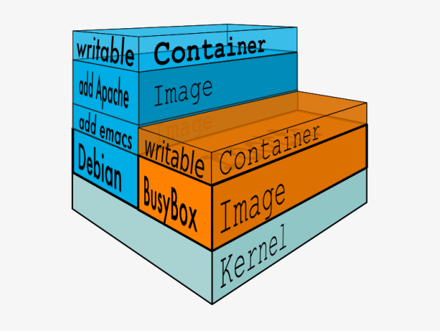

### docker的优势
- 快速部署
短时间内可以部署成百上千个应用，更快速交付到线上。

- 高效虚拟化
不需要额外的 hypervisor 支持，直接基于 linux 实现应用虚拟化，相比虚拟机大幅提高性能和效率。

- 节省开支
提高服务器利用率，降低 IT 支出。

- 简化配置
将运行环境打包保存至容器，使用时直接启动即可。

- 快速迁移和扩展
可夸平台运行在物理机、虚拟机、公有云等环境，良好的兼容性可以方便将应用从 A 宿主机迁移到 B 宿主机，甚至是 A 平台迁移到 B 平台。

> Docker 的缺点：
> 隔离性：各应用之间的隔离不如虚拟机彻底。

### 容器的runtime
runtime是真正运行容器的地方，因此为了运行不同的容器的runtime需要和操作系统内核紧密合作相互支持，以便为容器提供相应的运行环境，目前主流的runtime有以下三种：

1. Lxc：linux上早起的runtime，docker早起就采用lxc作为runtime

2. runc：目前docker默认的runtime，runc遵守OCI规范，因此也可以兼容lxc

3. rkt：是CoreOS开发的容器runtime，也符合OCI规范，所以使用rktruntime也可以运行Docker容器

### 容器管理工具
管理工具连接runtime与用户，对用户提供图形或命令方式操作，然后管理工具将用户操作传递给runtime执行

	Lxc是lxd的管理工具
	Runc的管理工具是docker engine，docker engine包括后台deamon和client两部分，大家经常提到的docker就是指docker engine
	Rkt的管理工具是rkt cli

### 容器定义工具
容器定义工具允许用户定义容器的属性和内容，以方便容器能够被保存、共享和重建

- docker image：是docker容器的模板，runtime依据docker image创建容器

- dicker file：包含N个命令的文本文件，通过docker file创建出docker image

- ACI(App container image)：与docker image类似，是 CoreOS 开发的 rkt 容器的镜像格式。

### Registry
统一保存镜像而且是多个不同镜像版本的地方，叫做镜像仓库。

- Image registry：docker 官方提供的私有仓库部署工具。

- Docker hub：docker 官方的公共仓库，已经保存了大量的常用镜像，可以方便大家直接使用。(默认的)

- Harbor：vmware 提供的自带 web 界面自带认证功能的镜像仓库，目前有很多公司使用。

### 编排工具
当多个容器在多个主机运行的时候，单独管理容器是相当复杂而且很容易出错，而且也无法实现某一台主机宕机后容器自动迁移到其他主机从而实现高可用的目的，也无法实现动态伸缩的功能，因此需要有一种工具可以实现统一管理、动态伸缩、故障自愈、批量执行等功能，这就是容器编排引擎。

容器编排通常包含容器管理、调度、集群定义和服务发现等功能

- docker swarm：docker开发的容器编排引擎

- kubernetes：google 领导开发的容器编排引擎，内部项目为 Borg，且其同时支持docker 和 CoreOS。

- Mesos+Marathon：通用的集群组员调度平台，mesos(资源分配)与 marathon(容器编排平台)一起提供容器编排引擎功能
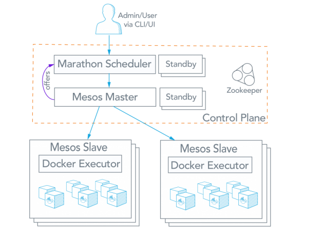

## 容器依赖的技术

1. 容器网络
docker自带的网络docker network 仅支持管理单机上的容器网络，当多主机运行的时候，需要使用第三方开源网络，例如callco、flannel

2. 服务发现
容器的动态扩容特性决定了容器的ip也会随之变化，因此需要一种机制开源自动书别并将用户请求动态转发到新创建的容器上kubernetes再带服务发现功能，需要结合kube-dns服务解析内部域名

3. 容器监控
可以通过原生命令 docker ps/top/stats 查看容器运行状态，另外也可以使用heapster/prometheus等第三方监控工具监控容器的运行状态

4. 数据管理
容器的动态迁移会导致其在不同的Host之间迁移，因此如何保证与容器相关的数据也能随之迁移或随时访问，可以使用逻辑卷/存储挂载等方式解决

5. 日志收集
docker原生的日志查看工具 docker logs，但是容器内部的日志需要通过ELK等专门的日志收集分析和展示工具进行处理