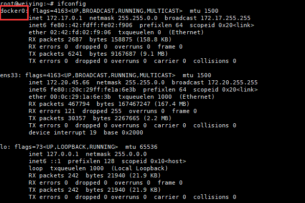

# docker安装
网址：[docker官方地址](https://www.docker.com/ "docker官方地址")

- 系统版本选择

Docker 目前已经支持多种操作系统的安装运行，比如 Ubuntu、CentOS、Redhat、Debian、Fedora，甚至是还支持了 Mac 和 Windows，在 linux 系统上需要内核版本在 3.10 或以上，docker 版本号之前一直是 0.X 版本或 1.X 版本，但是从 2017 年 3 月 1 号开始改为每个季度发布一次稳版，其版本号规则也统一变更为 YY.MM，例如 17.09 表示是 2017 年 9 月份发布的。

- docker版本选择
 Docker 之前没有区分版本，但是 2017 年推出(将 docker 更名为)新的项目Moby，github 地址：https://github.com/moby/moby 项目属于 Docker 项目的全新上游，Docker 将是一个隶属于的 Moby 的子产品，而且之后的版本之后开始区分为 CE 版本（社区版本）和 EE（企业收费版），CE 社区版本和 EE 企业版本都是每个季度发布一个新版本，但是 EE 版本提供后期安全维护 1 年，而CE 版本是 4 个月

## 在Centos安装docker
官方 rpm 包下载地址:
https://download.docker.com/linux/centos/7/x86_64/stable/Packages/

阿里镜像下载地址：
https://mirrors.aliyun.com/docker-ce/linux/centos/7/x86_64/stable/Packages/

```bash
# step 1: 安装必要的一些系统工具
sudo yum install -y yum-utils device-mapper-persistent-data lvm2
# Step 2: 添加软件源信息
sudo yum-config-manager --add-repo http://mirrors.aliyun.com/docker-ce/linux/centos/docker-ce.repo
# Step 3: 更新并安装 Docker-CE
sudo yum makecache fast
sudo yum -y install docker-ce
# Step 4: 开启Docker服务
sudo service docker start

注意：其他注意事项在下面的注释中
# 官方软件源默认启用了最新的软件，您可以通过编辑软件源的方式获取各个版本的软件包。例如官方并没有将测试版本的软件源置为可用，你可以通过以下方式开启。同理可以开启各种测试版本等。
# vim /etc/yum.repos.d/docker-ce.repo
#   将 [docker-ce-test] 下方的 enabled=0 修改为 enabled=1
#
# 安装指定版本的Docker-CE:
# Step 1: 查找Docker-CE的版本:
# yum list docker-ce.x86_64 --showduplicates | sort -r
#   Loading mirror speeds from cached hostfile
#   Loaded plugins: branch, fastestmirror, langpacks
#   docker-ce.x86_64            17.03.1.ce-1.el7.centos            docker-ce-stable
#   docker-ce.x86_64            17.03.1.ce-1.el7.centos            @docker-ce-stable
#   docker-ce.x86_64            17.03.0.ce-1.el7.centos            docker-ce-stable
#   Available Packages
# Step2 : 安装指定版本的Docker-CE: (VERSION 例如上面的 17.03.0.ce.1-1.el7.centos)
# sudo yum -y install docker-ce-[VERSION]
# 注意：在某些版本之后，docker-ce安装出现了其他依赖包，如果安装失败的话请关注错误信息。例如 docker-ce 17.03 之后，需要先安装 docker-ce-selinux。
# yum list docker-ce-selinux- --showduplicates | sort -r
# sudo yum -y install docker-ce-selinux-[VERSION]

# 通过经典网络、VPC网络内网安装时，用以下命令替换Step 2中的命令
# 经典网络：
# sudo yum-config-manager --add-repo http://mirrors.aliyuncs.com/docker-ce/linux/centos/docker-ce.repo
# VPC网络：
# sudo yum-config-manager --add-repo http://mirrors.could.aliyuncs.com/docker-ce/linux/centos/docker-ce.repo
```


## 在Ubuntu安装docker
```bash
# step 1: 安装必要的一些系统工具
sudo apt-get update
sudo apt-get -y install apt-transport-https ca-certificates curl software-properties-common
# step 2: 安装GPG证书
curl -fsSL http://mirrors.aliyun.com/docker-ce/linux/ubuntu/gpg | sudo apt-key add -
# Step 3: 写入软件源信息
sudo add-apt-repository "deb [arch=amd64] http://mirrors.aliyun.com/docker-ce/linux/ubuntu $(lsb_release -cs) stable"
# Step 4: 更新并安装 Docker-CE
sudo apt-get -y update
sudo apt-get -y install docker-ce

注意：其他注意事项在下面的注释中
# 安装指定版本的Docker-CE:
# Step 1: 查找Docker-CE的版本:
# apt-cache madison docker-ce
#   docker-ce | 17.03.1~ce-0~ubuntu-xenial | http://mirrors.aliyun.com/docker-ce/linux/ubuntu xenial/stable amd64 Packages
#   docker-ce | 17.03.0~ce-0~ubuntu-xenial | http://mirrors.aliyun.com/docker-ce/linux/ubuntu xenial/stable amd64 Packages
# Step 2: 安装指定版本的Docker-CE: (VERSION 例如上面的 17.03.1~ce-0~ubuntu-xenial)
# sudo apt-get -y install docker-ce=[VERSION]

# 通过经典网络、VPC网络内网安装时，用以下命令替换Step 2、Step 3中的命令
# 经典网络：
# curl -fsSL http://mirrors.aliyuncs.com/docker-ce/linux/ubuntu/gpg | sudo apt-key add -
# sudo add-apt-repository "deb [arch=amd64] http://mirrors.aliyuncs.com/docker-ce/linux/ubuntu $(lsb_release -cs) stable"
# VPC网络：
# curl -fsSL http://mirrors.cloud.aliyuncs.com/docker-ce/linux/ubuntu/gpg | sudo apt-key add -
# sudo add-apt-repository "deb [arch=amd64] http://mirrors.cloud.aliyuncs.com/docker-ce/linux/ubuntu $(lsb_release -cs) stable"
```

### 启动docker
```bash
systemctl start docker
systemctl enble docker
```

验证docker版本
```bash
root@weiying:~# docker version
Client:
 Version:           18.09.7
 API version:       1.39
 Go version:        go1.10.8
 Git commit:        2d0083d
 Built:             Thu Jun 27 17:56:23 2019
 OS/Arch:           linux/amd64
 Experimental:      false

Server: Docker Engine - Community
 Engine:
  Version:          18.09.7
  API version:      1.39 (minimum version 1.12)
  Go version:       go1.10.8
  Git commit:       2d0083d
  Built:            Thu Jun 27 17:23:02 2019
  OS/Arch:          linux/amd64
  Experimental:     false
```

验证docker0网卡信息


验证docker信息


### docker的存储引擎
目前 docker 的默认存储引擎为 overlay2，需要磁盘分区支持 d-type 文件分层功能，因此需要系统磁盘的额外支持。

> 如果使用了xfs文件系统，需要开启ftype=1
> 

Docker 官方推荐首选存储引擎为 overlay2 其次为 devicemapper，但是devicemapper 存在使用空间方面的一些限制，虽然可以通过后期配置解决，但是官方依然推荐使用 overlay2

如果 docker 数据目录是一块单独的磁盘分区而且是 xfs 格式的，那么需要在格式化的时候加上参数-n ftype=1，否则后期在启动容器的时候会报错不支持 dtype，那么会导致docker能使用的最大空间就是100G。


### docker服务进程

- dockerd：被 client 直接访问，其父进程为宿主机的 systemd 守护进程

- docker-proxy：实现容器通信，其父进程为 dockerd

- containerd：被 dockerd 进程调用以实现与 runc 交互。

- containerd-shim：真正运行容器的载体，其父进程为 containerd。

查看docker18.09版本的宿主机的进程树


查看docker18.06版本的宿主机的进程树


## 容器的创建与管理过程

通信流程

1. docker 通过grpc(远程调用)和containerd模块通信，docker与libcontainerd负责和containerd进行交换，docker和containerd通信使用socker文件（/run/containerd/containerd.sock）

2. containerd在docker启动时被启动，然后containerd启动grpc请求监听，containerd处理grpc请求，根据请求做响应动作

3. 若是start或是exec容器，containerd拉起一个container-shim，并进行相应的操作

4. container-shim被拉起后，start/exec/create 拉起runc进程，通过exit、control文件和containerd通信，通过父子进程关系和SIGCHLD监控容器中的进程状态

5. 在整个容器的生命周期中，containerd通过epoll监控容器文件，监控容器事件


## docker镜像加速配置
国内下载国外的镜像有时候会很慢，因此可以更改 docker 配置文件添加一个加速器，可以通过加速器达到加速下载镜像的目的。

通过阿里云容器镜像服务配置加速

```bash
#可以通过修改daemon配置文件/etc/docker/daemon.json来使用加速器
sudo mkdir -p /etc/docker
sudo tee /etc/docker/daemon.json <<-'EOF'
{
  "registry-mirrors": ["https://qg2m7q97.mirror.aliyuncs.com"]
}
EOF
sudo systemctl daemon-reload
sudo systemctl restart docker
```