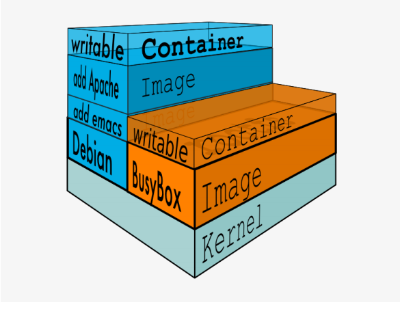
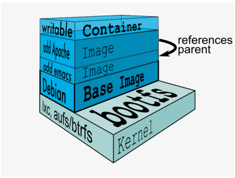

## docker镜像管理
Docker 镜像含有启动容器所需要的文件系统及所需要的内容，因此镜像主要用于创建并启动 docker 容器。

Docker 镜像含里面是一层层文件系统,叫做 Union FS（联合文件系统）,联合文件系统，可以将几层目录挂载到一起，形成一个虚拟文件系统,虚拟文件系统的目录结构就像普通 linux 的目录结构一样，docker 通过这些文件再加上宿主机的内核提供了一个 linux 的虚拟环境,每一层文件系统我们叫做一层 layer，联合文件系统可以对每一层文件系统设置三种权限，只读（readonly）、读写（readwrite）和写出（whiteout-able），但是 docker 镜像中每一层文件系统都是只读的,构建镜像的时候,从一个最基本的操作系统开始,每个构建的操作都相当于做一层的修改,增加了一层文件系统,一层层往上叠加,上层的修改会覆盖底层该位置的可见性，这也很容易理解，就像上层把底层遮住了一样,当使用镜像的时候，我们只会看到一个完全的整体，不知道里面有几层也不需要知道里面有几层，结构如下：


一个典型的 Linux 文件系统由 bootfs 和 rootfs 两部分组成，bootfs(boot filesystem) 主要包含 bootloader 和 kernel，bootloader 主要用于引导加载 kernel，当 kernel 被加载到内存中后 bootfs 会被 umount 掉，rootfs (root file system) 包含的就是典型 Linux 系统中的/dev，/proc，/bin，/etc 等标准目录和文件，下图就是 docker image 中最基础的两层结构，不同的 linux 发行版（如 ubuntu和 CentOS ) 在 rootfs 这一层会有所区别。

但是对于 docker 镜像通常都比较小，官方提供的 centos 基础镜像在 200MB 左右，一些其他版本的镜像甚至只有几 MB，docker 镜像直接调用宿主机的内核，镜像中只提供 rootfs，也就是只需要包括最基本的命令、工具和程序库就可以了，比如 alpine 镜像，在 5M 左右。

下图就是有两个不同的镜像在一个宿主机内核上实现不同的 rootfs。


容器、镜像父镜像



### docker命令的使用
docker 命令是最常使用的 docker 客户端命令，其后面可以加不同的参数以实
现响应的功能

1. 搜索镜像
在官方的 docker 仓库中搜索指定名称的 docker 镜像，也会有很多三方镜像。
```bash
#带指定版本号
[ root@localhost ~]# docker search centos:7.2.1511
s #不带版本号默认 latest
[ root@localhost ~]# docker search centos
```
2. 下载镜像
 docker pull 仓库服务器:端口/项目名称/镜像名称:tag(版本)号
```bash
[ root@localhost ~]# docker pull alpine
Using default tag: latest
latest: Pulling from library/alpine
921b31ab772b: Pull complete 
Digest: sha256:ca1c944a4f8486a153024d9965aafbe24f5723c1d5c02f4964c045a16d19dc54
Status: Downloaded newer image for alpine:latest
[ root@localhost ~]# docker pull nginx 
Using default tag: latest
latest: Pulling from library/nginx
fc7181108d40: Pull complete 
d2e987ca2267: Pull complete 
0b760b431b11: Pull complete 
Digest: sha256:96fb261b66270b900ea5a2c17a26abbfabe95506e73c3a3c65869a6dbe83223a
Status: Downloaded newer image for nginx:latest
```

3. 查看本地镜像
```bash
#下载完成的镜像比下载的大，因为下载完成后会解压
[ root@localhost ~]# docker images
REPOSITORY          TAG                 IMAGE ID            CREATED             SIZE
nginx               latest              f68d6e55e065        2 days ago          109MB
alpine              latest              4d90542f0623        2 weeks ago         5.58MB
```
REPOSITORY：镜像所属的仓库名称
TAG：镜像版本号（标识符），默认为 latest
IMAGE ID ：镜像唯一 ID 标示
CREATED ：镜像创建时间
VIRTUAL SIZE ：镜像的大小

4. 镜像导出
可以将镜像从本地导出问为一个压缩文件，然后复制到其他服务器进行导入使用。
```bash
# 导出方法1
[ root@localhost ~]# docker save nginx -o /opt/nginx.tar.gz
[ root@localhost ~]# ll /opt/nginx.tar.gz 
-rw-------. 1 root root 113087488 Jul  4 08:06 /opt/nginx.tar.gz

# 导出方法2
[ root@localhost ~]# docker save alpine > /opt/alpine.tar.gz
[ root@localhost ~]# ll /opt/alpine.tar.gz
-rw-r--r--. 1 root root 5853184 Jul  4 08:07 /opt/alpine.tar.gz
```

查看镜像内容
```bash
[ root@localhost ~]# tar xf nginx.tar.gz 

[ root@localhost ~]# ls
9de6aebfff35261996e4315105c546a002a8e42be30bc9189851384adc3abf6b       manifest.json
a4e2f1136e50ce782b4712f7f31628a9d8d973035072f6d7a2c5728c87270dc0       nginx.tar.gz
d5990701c3a040b2eb442c195e9d62a3936bb91d7ee918c66751b6f164ec490a       repositories
f68d6e55e06520f152403e6d96d0de5c9790a89b4cfc99f4626f68146fa1dbdc.json

#  manifest.json 文件包含了镜像的相关配置，配置文件、分层
[ root@localhost ~]# cat manifest.json 
[{"Config":"f68d6e55e06520f152403e6d96d0de5c9790a89b4cfc99f4626f68146fa1dbdc.json","RepoTags":["nginx:latest"],
"Layers":["a4e2f1136e50ce782b4712f7f31628a9d8d973035072f6d7a2c5728c87270dc0/layer.tar",
"d5990701c3a040b2eb442c195e9d62a3936bb91d7ee918c66751b6f164ec490a/layer.tar",
"9de6aebfff35261996e4315105c546a002a8e42be30bc9189851384adc3abf6b/layer.tar"]}]

# #分层为了方便文件的共用，即相同的文件可以共用
[{"Config":" 配置文件 .json","RepoTags":["docker.io/nginx:latest"],
"Layers":[" 分 层1/layer.tar","分层 2 /layer.tar","分层 3 /layer.tar"]}]
```
5. 镜像导入
将镜像导入到 docker
```bash
root@weiying:~# docker load < ~/alpine.tar.gz 
256a7af3acb1: Loading layer  5.844MB/5.844MB
Loaded image: alpine:latest
root@weiying:~# docker images
REPOSITORY          TAG                 IMAGE ID            CREATED             SIZE
nginx               latest              f68d6e55e065        2 days ago          109MB
alpine              latest              4d90542f0623        2 weeks ago         5.58MB
centos              latest              9f38484d220f        3 months ago        202MB
```

6. 删除镜像
docker rmi 镜像名称或ID

> 通过镜像启动容器的时候镜像不能被删除，除非将容器全部关闭
> docker rm 容器 ID/容器名称 #删除容器
> docker rm 容器 ID/容器名-f #强制删除正在运行的容器
```bash
root@weiying:~# docker images 
REPOSITORY          TAG                 IMAGE ID            CREATED             SIZE
nginx               latest              f68d6e55e065        2 days ago          109MB
alpine              latest              4d90542f0623        2 weeks ago         5.58MB
centos              latest              9f38484d220f        3 months ago        202MB
root@weiying:~# docker rmi alpine
Untagged: alpine:latest
Deleted: sha256:4d90542f0623c71f1f9c11be3da23167174ac9d93731cf91912922e916bab02c
Deleted: sha256:256a7af3acb11f89914205b6eef07e05e4196e898329575d97185758b450eb52

root@weiying:~# docker images 
REPOSITORY          TAG                 IMAGE ID            CREATED             SIZE
nginx               latest              f68d6e55e065        2 days ago          109MB
centos              latest              9f38484d220f        3 months ago        202MB
```

## 容器操作命令
命令格式：
docker run [选项] [镜像名] [shell 命令] [参数]
docker run [参数选项] [镜像名称，必须在所有选项的后面] [/bin/echo 'hellowold'] #单次执行，没有自定义容器名称
docker run centos /bin/echo 'hello wold' #启动的容器在执行完 shel 命令就退出了

1. 从镜像启动一个容器
会直接进入到容器，并随机生成容器 ID 和名称
```bash
[ root@localhost ~]# docker run -it nginx bash
root@23257d0fbd00:/#
# 输入exit后退出该容器，但是这样的话容器也就关闭了
# 退出容器不注销  "ctrl+p+q"
```

2. 显示正在运行的容器
```bash
[ root@localhost ~]# docker ps   
CONTAINER ID        IMAGE               COMMAND             CREATED             STATUS              PORTS               NAMES
23257d0fbd00        nginx               "bash"              2 minutes ago       Up 2 minutes        80/tcp              modest_goldstine
```

3. 显示所有的容器
```bash
[ root@localhost ~]# docker ps -a
CONTAINER ID        IMAGE               COMMAND             CREATED             STATUS                     PORTS               NAMES
23257d0fbd00        nginx               "bash"              2 minutes ago       Up 2 minutes               80/tcp              modest_goldstine
ae35e7b37814        nginx               "bash"              2 minutes ago       Exited (0) 2 minutes ago                       hardcore_jepsen
3fc8eda0d7e8        nginx               "bash"              3 minutes ago       Exited (0) 3 minutes ago                       angry_grothendieck
58e8b7024b67        nginx               "bash"              3 minutes ago       Exited (0) 3 minutes ago                       practical_jepsen
```


4. 删除运行中的容器
即使容正在运行当中，也会被强制删除掉
```bash
[ root@localhost ~]# docker ps
CONTAINER ID        IMAGE               COMMAND             CREATED             STATUS              PORTS               NAMES
23257d0fbd00        nginx               "bash"              4 minutes ago       Up 4 minutes        80/tcp              modest_goldstine
[ root@localhost ~]# docker rm -f 23257d0fbd00
23257d0fbd00
[ root@localhost ~]# docker ps
CONTAINER ID        IMAGE               COMMAND             CREATED             STATUS              PORTS               NAMES
```

5. 随机端口映射
将宿主机的端口映射到容器中的端口
```bash
# 随机的将前台的端口映射到容器中的80端口，默认是从32768开始
#前台启动的会话窗口无法进行其他操作，除非退出，但是退出后容器也会退出
[ root@localhost ~]# docker run -P nginx 

[ root@localhost ~]# docker ps
CONTAINER ID        IMAGE               COMMAND                  CREATED             STATUS              PORTS                   NAMES
fb5d2438eae7        nginx               "nginx -g 'daemon of…"   10 seconds ago      Up 9 seconds        0.0.0.0:32768->80/tcp   mystifying_buck
```

6. 指定端口映射
方式 1：本地端口 81 映射到容器 80 端口
```bash
# 加-d选项将容器放到后台运行
[ root@localhost ~]# docker run -p 81:80 --name nginx-test-port1 nginx
```

方式 2：本地 IP:本地端口:容器端口
```bash
[ root@localhost ~]# docker run -d -p 172.20.131.181:81:80 --name nginx-test-port2 nginx 
e5001324ea3896f97269366a7175717d282d195da2fce36cb1e9e476893f34ee
[ root@localhost ~]# docker ps
CONTAINER ID        IMAGE               COMMAND                  CREATED             STATUS              PORTS                       NAMES
e5001324ea38        nginx               "nginx -g 'daemon of…"   6 seconds ago       Up 5 seconds        172.20.131.181:81->80/tcp   nginx-test-port2
```

方式 3：本地 IP:本地随机端口:容器端口
```bash
[ root@localhost ~]# docker run -d -p 172.20.131.181::80 --name nginx-test-port3 nginx 
7b9ede9abd48d38bd7f36563f4672869d1b8150b9c472a0c2d6e57cdd7cbb6a4
[ root@localhost ~]# docker ps
CONTAINER ID        IMAGE               COMMAND                  CREATED             STATUS              PORTS                          NAMES
7b9ede9abd48        nginx               "nginx -g 'daemon of…"   9 seconds ago       Up 7 seconds        172.20.131.181:32770->80/tcp   nginx-test-port3
```
方式 4：本机 ip:本地端口:容器端口/协议，默认为 tcp 协议
```bash
[ root@localhost ~]# docker run -d -p 172.20.131.181:83:80/udp --name nginx-test-port4 nginx 
a79ef69d5d3b6160c96a41dde095bb76a37708000b212294b3c3c5ea31d203ba
[ root@localhost ~]# docker ps
CONTAINER ID        IMAGE               COMMAND                  CREATED              STATUS              PORTS                               NAMES
a79ef69d5d3b        nginx               "nginx -g 'daemon of…"   3 seconds ago        Up 1 second         80/tcp, 172.20.131.181:83->80/udp   nginx-test-port4
```
方式 5：一次性映射多个端口+协议
```bash
[ root@localhost ~]# docker run -d -p 172.20.131.181:80:80 -p 443:443/tcp -p 53:53/udp --name nginx-test-port3 nginx 
0cf914f2dab6ad40cb9ff497e48cb60350527171a4c33ce27e2bf92a41f9e8b8
[ root@localhost ~]# docker ps
CONTAINER ID        IMAGE               COMMAND                  CREATED             STATUS              PORTS                                                                 NAMES
0cf914f2dab6        nginx               "nginx -g 'daemon of…"   3 seconds ago       Up 2 seconds        0.0.0.0:53->53/udp, 172.20.131.181:80->80/tcp, 0.0.0.0:443->443/tcp   nginx-test-port3
```
查看nginx容器的访问日志
```bash
[ root@localhost ~]# docker logs -f nginx-test-port3
```

7. 查看容器已经映射的端口
```bash
[ root@localhost ~]# docker port nginx-test-port3 
53/udp -> 0.0.0.0:53
80/tcp -> 172.20.131.181:80
443/tcp -> 0.0.0.0:443
```

8. 自定义容器名称
```bash
[ root@localhost ~]# docker run -it -d --name nginx-`date +"%Y%m%d"` nginx
d16eccd5c139a3ace0f3f387e4b916726a0e428c1d068e68440d79cc697d57ed
[ root@localhost ~]# docker ps
CONTAINER ID        IMAGE               COMMAND                  CREATED             STATUS              PORTS               NAMES
d16eccd5c139        nginx               "nginx -g 'daemon of…"   9 seconds ago       Up 8 seconds        80/tcp              nginx-2019070
```
9. 后台启动容器
使用-d选线使容器在后台启动

10. 创建并进入容器
依赖-i和-t参数
```bash
#创建容器后直接进入，执行 exit 退出后容器关闭
[ root@localhost ~]# docker run -it --name centos-test centos
[root@a0e98444a7ec /]# ls
anaconda-post.log  dev  home  lib64  mnt  proc  run   srv  tmp  var
bin                etc  lib   media  opt  root  sbin  sys  usr
[root@a0e98444a7ec /]# exit
```

11. 单次运行
容器退出后自动删除:--rm
```bash
[ root@localhost ~]# docker run -it --rm centos
```

12. 传递运行命令
容器需要有一个前台运行的进程才能保持容器的运行，通过传递运行参数是一种方式，另外也可以在构建镜像的时候指定容器启动时运行的前台命令。
```bash
[ root@localhost ~]#  docker run centos /usr/bin/tail -f '/etc/hosts'
127.0.0.1	localhost
::1	localhost ip6-localhost ip6-loopback
fe00::0	ip6-localnet
ff00::0	ip6-mcastprefix
ff02::1	ip6-allnodes
ff02::2	ip6-allrouters
172.17.0.4	df323c4780ae
```

13. 容器的启动和关闭
docker stop 容器id
docker start 容器id

14. 进入到正在运行的容器

- 使用 attach 命令
使用方式为 docker attach 容器名，attach 类似于 vnc，操作会在各个容器界面显示，所有使用此方式进入容器的操作都是同步显示的且 exit 后容器将被关闭，且使用 exit 退出后容器关闭，不推荐使用，需要进入到有 shell 环境的容器

- 使用exec命令
执行单次命令与进入容器，不是很推荐此方式，虽然 exit 退出容器还在运行
```bash
[ root@localhost ~]# docker exec -it jovial_curie bash
[root@153f9d4b481a /]# 
```

- 使用 nsenter 命令
推荐使用此方式，nsenter 命令需要通过 PID 进入到容器内部，不过可以使用docker inspect 获取到容器的 PID
```bash
#安装nsenter命令
[ root@localhost ~]# yum install util-linux
#获取指定的容器的pid
# docker inspect 容器的id或名，可以显示容器完整的详细的运行信息
[ root@localhost ~]#  docker inspect -f "{{.State.Pid}}" jovial_curie 
29259
# 根据容器的pid进入容器
[ root@localhost ~]# nsenter -t 29259 -m -u -i -n -p
[root@153f9d4b481a /]# ls
anaconda-post.log  dev  home  lib64  mnt  proc  run   srv  tmp  var
bin                etc  lib   media  opt  root  sbin  sys  usr
[root@153f9d4b481a /]# exit
logout
```
docker inspect的使用
```
#docker inspect 容器的id或名，可以显示容器完整的详细的运行信息
例如，取指定容器的ip地址
[ root@localhost ~]# docker inspect -f "{{.NetworkSettings.Networks.bridge.IPAddress}}"  jovial_curie
172.17.0.2
```
- 脚本方式
将 nsenter 命令写入到脚本进行调用
```bash
[ root@localhost ~]# vim docker-in.sh
#!/bin/bash

docker_in(){
    NAME_ID=$1
    PID=$(docker inspect -f "{{.State.Pid}}" ${NAME_ID})
    nsenter -t ${PID} -m -u -i -n -p
}
docker_in $1

[ root@localhost ~]# bash docker-in.sh jovial_curie
[root@153f9d4b481a /]# exit
logout
```

15. 查看容器内部的hosts文件
```bash
[root@153f9d4b481a /]# cat /etc/hosts
127.0.0.1	localhost
::1	localhost ip6-localhost ip6-loopback
fe00::0	ip6-localnet
ff00::0	ip6-mcastprefix
ff02::1	ip6-allnodes
ff02::2	ip6-allrouters
172.17.0.2	153f9d4b481a #容器本身的ip和id
```

16. 批量关闭正在运行的容器
```bash
# 取出正在运行的容器id
[ root@localhost ~]# docker ps -a -q
#关闭所有
docker stop `docker ps -a -q`
docker start `docker ps -a -q`
```

17. 批量强制关闭正在运行的容器
```bash
[root@docker-server1 ~]# docker kill $(docker ps -a -q)
```

18. 批量删除已退出容器
```bash
 docker rm -fv `docker ps -aq -f status=exited`
```
> -fv：删除容器的同时，将数据目录也删除

19. 批量删除所有容器
```bash
docker rm -fv $(docker ps -a -q)
```

20. 指定容器的DNS
Dns 服务，默认采用宿主机的 dns 地址
一是将 dns 地址配置在宿主机
二是将参数配置在 docker 启动脚本里面 –dns=1.1.1.1
```bash
[root@docker-server1 ~]# docker run -it --rm --dns 223.6.6.6 centos bash
[root@afeb628bf074 /]# cat /etc/resolv.conf
nameserver 223.6.6.6
```