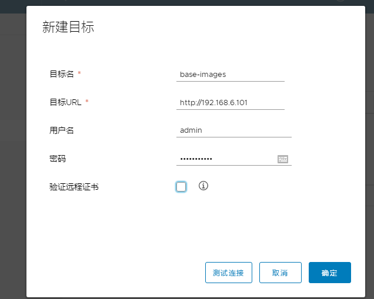

# 上传本地镜像到阿里云仓库

1. 创建阿里云镜像仓库


2. 上传镜像

- 登录阿里云Docker Registry
```bash
[ root@node1 nginx]# sudo docker login --username=tb813878399 registry.cn-hangzhou.aliyuncs.com
Password: 
WARNING! Your password will be stored unencrypted in /root/.docker/config.json.
Configure a credential helper to remove this warning. See
https://docs.docker.com/engine/reference/commandline/login/#credentials-store

Login Succeeded
```

- 给镜像打tag标签
```bash
[ root@node1 nginx]# docker tag centos:latest registry.cn-hangzhou.aliyuncs.com/weiying_test/20190709:v1

# docker tag [ImageId] registry.cn-hangzhou.aliyuncs.com/weiying_test/20190709:[镜像版本号]
```

- 上传镜像
```bash
[ root@node1 nginx]# docker push registry.cn-hangzhou.aliyuncs.com/weiying_test/20190709:v1 
The push refers to repository [registry.cn-hangzhou.aliyuncs.com/weiying_test/20190709]
d69483a6face: Pushed 
v1: digest: sha256:ca58fe458b8d94bc6e3072f1cfbd334855858e05e1fd633aa07cf7f82b048e66 size: 529
```


- 下载镜像
```bash
# docker pull registry.cn-hangzhou.aliyuncs.com/weiying_test/20190709:[镜像版本号]
[ root@node1 ~]# docker pull registry.cn-hangzhou.aliyuncs.com/weiying_test/20190709:v1
v1: Pulling from weiying_test/20190709
8ba884070f61: Pull complete 
Digest: sha256:ca58fe458b8d94bc6e3072f1cfbd334855858e05e1fd633aa07cf7f82b048e66
Status: Downloaded newer image for registry.cn-hangzhou.aliyuncs.com/weiying_test/20190709:v1
```


# docker 仓库之分布式 Harbor
Harbor 是一个用于存储和分发 Docker 镜像的企业级 Registry 服务器，由vmware 开源，其通过添加一些企业必需的功能特性，例如安全、标识和管理等，扩展了开源 Docker Distribution。作为一个企业级私有 Registry 服务器，Harbor 提供了更好的性能和安全。提升用户使用 Registry 构建和运行环境传输镜像的效率。Harbor 支持安装在多个 Registry 节点的镜像资源复制，镜像全部保存在私有 Registry 中， 确保数据和知识产权在公司内部网络中管控，另外，Harbor 也提供了高级的安全特性，诸如用户管理，访问控制和活动审计等，官网地址：https://vmware.github.io/harbor/cn/，官方 github 地址：https://github.com/vmware/harbor

## harbor的功能
基于角色的访问控制：用户与 Docker 镜像仓库通过“项目”进行组织管理，一个用户可以对多个镜像仓库在同一命名空间（project）里有不同的权限。

镜像复制：镜像可以在多个 Registry 实例中复制（同步）。尤其适合于负载均衡，高可用，混合云和多云的场景。

图形化用户界面：用户可以通过浏览器来浏览，检索当前 Docker 镜像仓库，管理项目和命名空间。

AD/LDAP 支：Harbor 可以集成企业内部已有的 AD/LDAP，用于鉴权认证管理。

审计管理：所有针对镜像仓库的操作都可以被记录追溯，用于审计管理。

国际化：已拥有英文、中文、德文、日文和俄文的本地化版本。更多的语言将会添加进来。

RESTful API - RESTful API ：提供给管理员对于 Harbor 更多的操控, 使得与其它管理软件集成变得更容易。

部署简单：提供在线和离线两种安装工具， 也可以安装到 vSphere 平台(OVA 方式)虚拟设备。

##  高可用 Harbor的部署
harbor1:192.168.6.101
harbor1:192.168.6.102

>前提:
>1 harbor依赖于docker和pyhton，尽量使用centos来安装harbor，因为Ubuntu的Python比较新可能会有问题
>2 harbor不是服务，而是基于docker起来的容器集群，数据会放到/var/lib/docker下，生成环境中使用harbor的话，要保证这个目录足够大
>3 所有的node节点，都会在harbor拉取镜像，那么要保证harbor服务器的性能足够好
>4 harbor是单机的编排工具，同时也依赖于docker 

1. 安装docker
> 这个步骤省略，详细看之前的docker安装

2. 安装docker-compose
```bash
#harbor会使用docker-compose来启动容器集群
[ root@node1 harbor]# yum -y install docker-compose
```

3. 下载离线harbor安装包
```bash
[ root@weiying ~]# wget https://storage.googleapis.com/harbor-releases/release-1.7.0/harbor-offline-installer-v1.7.5.tgz
# 如果不能下载，到http://upload.aishad.top/harbor-offline-installer-v1.7.5.tgz下载
```

4. 配置harbor
```bash
[ root@node1 src]# tar xvf harbor-offline-installer-v1.7.5.tgz 
[ root@node1 src]# ln -sv /usr/local/src/harbor /usr/local/
[ root@node1 harbor]# vim harbor.cfg 
hostname = 192.168.6.101  # 本机的ip地址，或者域名，要是启用https的话要写域名

# 默认只需要更改这一个选项
#harbor_admin_password = Harbor12345  harbor默认的admin密码，也可以到harborweb界面修改

```

4. 安装harbor
```bash
[ root@node1 harbor]# ./install.sh
```

5. 访问并登陆harbor的web界面


6. 创建公开的仓库base-images


7. 上传镜像
```bash
# 打tag标签
[ root@node1 ~]# docker tag tomcat-base:8.5.37 192.168.6.101/base-images/tomcat-base:8.5.37
# 登陆harbor
[ root@node1 ~]# docker login 192.168.6.101
Username: admin
Password: 
Error response from daemon: Get https://192.168.6.100/v2/: dial tcp 192.168.6.100:443: connect: connection refused
```
> 登陆harber失败，因为在docker启动的时候，没有指定docker内部的仓库，需要更改docker的启动参数，生成环境中通常只会有指定的服务器才能上传镜像，下载镜像也需要加这个参数，因为是非安全的仓库
```bash
[ root@node1 ~]# vim /lib/systemd/system/docker.service 
ExecStart=/usr/bin/dockerd -H fd:// --containerd=/run/containerd/containerd.sock --insecure-registry 192.168.6.101 --insecure-registry 192.168.6.102

# 在dockerd后面添加 --insecure-registry 192.168.6.101 --insecure-registry 192.168.6.102
[ root@node1 ~]# systemctl daemon-reload 
[ root@node1 ~]# systemctl restart docker
```
再次登陆上传镜像
```bash
# 登陆
[ root@node1 ~]# docker login 192.168.6.101
Username: admin   
Password: 
WARNING! Your password will be stored unencrypted in /root/.docker/config.json.
Configure a credential helper to remove this warning. See
https://docs.docker.com/engine/reference/commandline/login/#credentials-store

Login Succeeded
# 上传镜像
[ root@node1 ~]# docker push 192.168.6.101/base-images/tomcat-base:8.5.37 
The push refers to repository [192.168.6.101/base-images/tomcat-base]
f8198b033822: Pushed 
8074a9121daf: Pushed 
294bde6b9233: Pushed 
429a07392f5e: Pushed 
b08395f293d7: Pushed 
45bf5b29b48d: Pushed 
94949de8430a: Pushed 
b8d167e2c5b4: Pushed 
507e654ae049: Pushed 
7b21330eb779: Pushed 
d69483a6face: Pushed 
8.5.37: digest: sha256:eb84a4aecd62a147a99a7c80f37a1f6d2f6aa55d102e04bbb5488adf955a3215 size: 2621
```


### 配置镜像高可用
两台镜像服务器，可以再任意一台镜像服务器上传镜像，上传镜像后两台服务器会互相同步

1. 另一台服务器安装harbor并启动
192.168.6.102
2. 登录web界面，在仓库管理里面新建目标

3. 在复制管理中新建规则

4. 完成同步