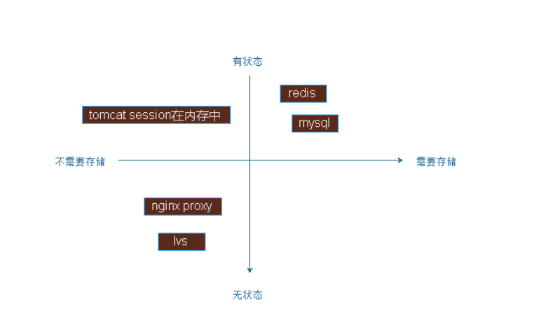

## docker 数据管理

如果改修运行中的容器产生了新的数据或者修改现有的一个已经存在的文件内容，那么新产术的数据将会被复制到读写层进行持久化的保存，这个读写层也就是容器的工作目录，这个就是**写时复制** 机制

 

### 数据类型

docker 镜像是分层设计的，底层是只读的，通过镜像启动的容器添加了一层可读写的文件系统能够，用户写入的数据都是保存在这一层的，如果要将写入的数据永久生效，需要将其提交为一个镜像，然后通过这个镜像启动实例，然后就会给这个启动的镜像添加一层可读写的文件系统，目前docker的数据类型分为两种，一种是数据库另一中是数据容器，数据卷类似于挂载一块硬盘，数据容器时将数据保存在另一个容器上面

```bash
# 查看运行中容器的详细信息
docker inspect distracted_napier
```
 

LowerDir：指向镜像层；
MergedDir：容器挂载点 ，lowerdir和upperdir整合起来提供统一的视图给容器，作为根文件系统；
UpperDir：指向容器层，在容器中创建文件后，文件出现在此目录；
WorkDir：用于实现copy_up操作


那么新产生的数据存放在哪里呢

1. 首先进入到容器中创建一个文件查看
```bash
root@client:~# docker exec -it distracted_napier bash
[root@d9eddde50dc0 /]# dd if=/dev/zero of=file bs=1M count=100
100+0 records in
100+0 records out
104857600 bytes (105 MB, 100 MiB) copied, 0.0693793 s, 1.5 GB/s
[root@d9eddde50dc0 /]# md5sum file 
2f282b84e7e608d5852449ed940bfc51  file

[root@d9eddde50dc0 /]# cp file /opt/ 
```

2. 进入到容器的数据目录查看
```bash
root@client:~# md5sum /var/lib/docker/overlay2/dbea96f98a66e514bb208c49d692f90f4390658dbc696d43aa8b71ab8a4b25a4/diff/file
2f282b84e7e608d5852449ed940bfc51  /var/lib/docker/overlay2/dbea96f98a66e514bb208c49d692f90f4390658dbc696d43aa8b71ab8a4b25a4/diff/file
```

从上面的操作中,可以看出容器中的数据存储在/var/lib/docker/overlay2/容器id/diff/ 的目录中

## 什么数据卷
数据卷实际上就是宿主机上的目录或者文件,可以被直接mount到容器当中使用

实际生产环境中,需要针对不同类型的服务,不同类型的数据存储要求做相应的规划,最终保证服务器的可扩展性,稳定性以及数据的安全性

 

1. 创建目录并生成web页面
```bash
root@client:~# 
root@client:~# mkdir html
root@client:~# echo "this is test page" >> html/index.htm
```

2. 启动容器并将创建的数据目录映射到容器中
```bash
docker run -d --name web1 -v /root/html/:/usr/share/nginx/html -p 8080:80 weiying_nginx:v1 nginx

# /root/html/:/usr/share/nginx/html 表示将本地的目录映射到容器中
# /root/html/:/usr/share/nginx/html:ro 默认为读写模式,可以更改为只读模式
```

3. 访问测试
```bash
root@client:~# curl 192.168.100.200:8080
this is test page
```

> 注意上面创建容器的时候使用的选项是-v,删除容器的时候,可以删除容器的数据目录 /var/lib/docker/containers/ ,但是不能删除数据卷的内容,也可以使用多个-v选项指定多个数据卷

### 数据卷的特点
1. 数据卷是目录或者文件,并且可以在多个容器之间共同使用
2. 对数据卷更改,容器里面会立即更新
3. 数据卷的数据可以持久化保存,即使删除使用该数据卷的容器也不会影响
4. 在容器里面写入数据不会影响到镜像本身

#### 数据卷的使用场景

1. 日志输出
2. 静态web页面
3. 应用的配置文件
4. 多容器间目录或者文件的共享

## 数据卷容器
数据卷容器的最大功能就是让数据在多个docker容器之间共享,即可以让B容器访问A容器的内容,而容器C也可以访问A容器的内容,即先要创建一个后台运行的容器作为server,用于卷提供,这个卷可以为其他容器提供数据存储服务,其他使用此卷的容器作为client端

1. 启动一个卷容器server
先启动一个容器,并挂载宿主机的数据目录
```bash
docker run -d --name volume-docker -v /root/testapp/:/usr/local/tomcat/webapps/testapp:ro -p 8080:8080 tomcat
```

2. 启动端容器client
```bash
docker run -d --name client1 -p 8081:8080 --volumes-from volume-docker tomcat
docker run -d --name client2 -p 8082:8080 --volumes-from volume-docker tomcat
```

### 数据卷容器的特点
1. 源数据卷容器即使被关闭了,依旧能通过其创建新的容器,而且能够正常使用
```bash
root@client:~# docker stop volume-docker 
volume-docker
root@client:~# docker run -d --name client3 -p 8083:8080 --volumes-from volume-docker tomcat
cde3c609717ef0fd0554504892065fe3f9a0956cb72af827a55cc22aad3282cd

```

2. 如果删除了源卷容器,,已经在运行的容器是不会受到影响的,但是不能通过其创建新的容器了,但是再把卷容器 Server 创建后即可正常创建卷容器 Client，此方式可以用于线上数据库、共享数据目录等环境，因为即使数据卷容器被删除了，其他已经运行的容器依然可以挂载使用
3. 数据卷容器可以作为共享的方式为其他容器提供文件共享，类似于 NFS 共享，可以在生产中启动一个实例挂载本地的目录，然后其他的容器分别挂载此容器的目录，即可保证各容器之间的数据一致性。