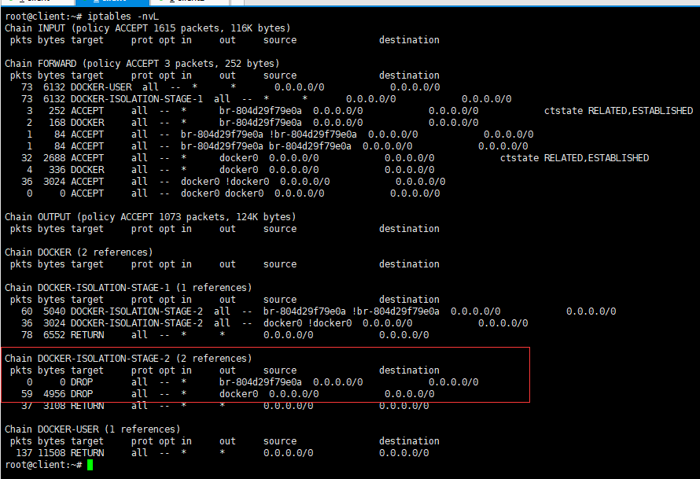

## 通过容器名称实现互联

即在同一个宿主机上的容器之间的访问可以通过自定义的容器名称互相访问,比如一个业务的前端静态页面使用的是Nginx,动态页面使用的是Tomcat,由于容器在启动的时候其内部ip地址是DHCP随机分配的,所以如果通过内部访问的话,自定义名词相对比较固定,因此比较适用于此场景


1. 先创建一个带有名称的容器,并进入到容器中查看容器的hosts解析文件
```bash
root@client:~# docker run -d --name nginx_web1 weiying_nginx:v1 nginx
efbc8e14781b7c2a3237e41f7b32d5aed4b1834e43a00bc8cd361435ad5896f2
root@client:~# docker ps 
CONTAINER ID        IMAGE               COMMAND             CREATED             STATUS              PORTS               NAMES
efbc8e14781b        weiying_nginx:v1    "nginx"             4 seconds ago       Up 3 seconds                            nginx_web1

# 查看容器的hosts解析文件,也可以进入到容器中查看
root@client:~# cat /var/lib/docker/containers/容器id/hosts
127.0.0.1	localhost
::1	localhost ip6-localhost ip6-loopback
fe00::0	ip6-localnet
ff00::0	ip6-mcastprefix
ff02::1	ip6-allnodes
ff02::2	ip6-allrouters
172.17.0.2	efbc8e14781b
```

2. 在创建一个容器,创建的时候使用 --link 选线指定其他容器的名称
```bash
root@client:~# docker run -d --name nginx_web2 --link nginx_web1 weiying_nginx:v1 nginx
93f15f19537173164967b9fe57e2355cc64e3f8b268e8371a0378b978db45c29
root@client:~# docker ps 
CONTAINER ID        IMAGE               COMMAND             CREATED             STATUS              PORTS               NAMES
93f15f195371        weiying_nginx:v1    "nginx"             4 seconds ago       Up 3 seconds                            nginx_web2
efbc8e14781b        weiying_nginx:v1    "nginx"             5 minutes ago       Up 5 minutes                            nginx_web1

# 查看第二个容器的hosts文件
root@client:~# cat /var/lib/docker/containers/93f15f19537173164967b9fe57e2355cc64e3f8b268e8371a0378b978db45c29/hosts
127.0.0.1	localhost
::1	localhost ip6-localhost ip6-loopback
fe00::0	ip6-localnet
ff00::0	ip6-mcastprefix
ff02::1	ip6-allnodes
ff02::2	ip6-allrouters
172.17.0.2	nginx_web1 efbc8e14781b
172.17.0.3	93f15f195371
```

> 注意:这个hosts解析只会加入到使用了--link创建的容器中,其他的容器不会添加这个记录

在上面的方法中,如果nginx_web1 被删除重建了话,那么ip地址会发生变化的,但是,nginx_web2 中的hosts文件是不会改变的,但是docker 的删除重建又是非常平常的操作,而且容器的名称也是可能发生变化的的,怎么才能保证容器之间使用名称来保证通信呢

### 通过自定义容器别名互联
命令格式
```bash
docker run -d --name 新容器名称 --link 目标容器名称:自定义的名称 -p 本地端口:容器端口 镜像名称 shell 命令
```

```bash
root@client:~# docker run -d --name nginx_web3 --link nginx_web1:www weiying_nginx:v1 nginx
73e2d8c0d42d0a9a23c660e9c74d358e93828785c2c03c988c16944c8cecc55e
root@client:~# cat /var/lib/docker/containers/73e2d8c0d42d0a9a23c660e9c74d358e93828785c2c03c988c16944c8cecc55e/hosts
127.0.0.1	localhost
::1	localhost ip6-localhost ip6-loopback
fe00::0	ip6-localnet
ff00::0	ip6-mcastprefix
ff02::1	ip6-allnodes
ff02::2	ip6-allrouters
172.17.0.2	www efbc8e14781b nginx_web1
172.17.0.4	73e2d8c0d42d
```

> 这种方式的话,主要用于容器中的程序使用的名称的方式调用别的容器,使用这种方式的好处就是即使容器的名称发生了变化,也不需要在容器中的程序做调整,只需要在创建容器的时候,指定新的名称和原来的别名即可

## docker 的网络类型

查看docker默认的网络类型
```bash
root@client:~# docker network list
NETWORK ID          NAME                DRIVER              SCOPE
2c0cc249c9fc        bridge              bridge              local
a59961ae58c6        host                host                local
5541414ba8f2        none                null                local
```

#### Host 模式
使用的参数: --net=host

启动的容器如果指定的网络是host模式的话,那么新创建的容器不会创建自己的虚拟网卡,而是直接使用宿主机的网卡和ip地址,因此在容器中看到的ip地址信息就是宿主机的信息,访问容器总的服务的话,只需要直接访问宿主机的ip+端口即可,不过容器的其他资源例如文件系统和系统进程等还是和宿主机保持隔离

这个模式下的网络性能最高,但是各个容器之间的端口不能相同,适用于端口比较固定的业务

```bash
# 创建容器指定使用 host网络
root@client:~# docker run --net=host -d weiying_nginx:v1 nginx
2516223873dab7638b3f65e31f0ce489cc36dcabc06f0565ea83cb04e5651ffb
# 进入到容器中查看ip信息
root@client:~# docker exec -it peaceful_lichterman bash
[root@client /]# ifconfig
docker0: flags=4163<UP,BROADCAST,RUNNING,MULTICAST>  mtu 1500
        inet 172.17.0.1  netmask 255.255.0.0  broadcast 172.17.255.255
        inet6 fe80::42:94ff:fe7b:50b3  prefixlen 64  scopeid 0x20<link>
        ether 02:42:94:7b:50:b3  txqueuelen 0  (Ethernet)
        RX packets 1  bytes 28 (28.0 B)
        RX errors 0  dropped 0  overruns 0  frame 0
        TX packets 5  bytes 446 (446.0 B)
        TX errors 0  dropped 0 overruns 0  carrier 0  collisions 0

eth0: flags=4163<UP,BROADCAST,RUNNING,MULTICAST>  mtu 1500
        inet 192.168.100.200  netmask 255.255.255.0  broadcast 192.168.100.255
        inet6 fe80::20c:29ff:fee5:f227  prefixlen 64  scopeid 0x20<link>
        ether 00:0c:29:e5:f2:27  txqueuelen 1000  (Ethernet)
        RX packets 9170  bytes 10046474 (9.5 MiB)
        RX errors 0  dropped 0  overruns 0  frame 0
        TX packets 3886  bytes 393625 (384.3 KiB)
        TX errors 0  dropped 0 overruns 0  carrier 0  collisions 0
        device interrupt 19  base 0x2000  

```


#### none 模式

None 模式使用参数: --net=none

在使用none模式后,docker 容器不会进行任何的网络配置,没有网卡,没有路由,没有ip,因此使用none模式的容器时无法与外界通信的,需要手动的添加网卡等配置ip等.所以极少使用

#### Container 模式
使用参数: --net=container:容器的名称或者id

使用此模式创建的容器,需要指定一个已经存在的容器的共享网络,而不是和宿主机的网络共享,新创建的容器自己不会创建网卡也不会配置自己的ip地址,而是和一个已存在的被指定的容器共享ip和端口,因此这个容器的端口不能和被指定的容器的端口冲突,除了网络之外的文件系统,进程信息等仍然保持相互隔离,两个容器的进程通过lo网卡保持通信

```bash
# 首先创建一个容器
root@client:~# docker run -d -it --name tomcat_app1 tomcat
cb65ef6a321cd753e4758fd7b28d014404e31e7284c6b65f6a0e101b14303f39

# 进入到容器中查看网络信息
root@cb65ef6a321c:/usr/local/tomcat# ip a
1: lo: <LOOPBACK,UP,LOWER_UP> mtu 65536 qdisc noqueue state UNKNOWN group default qlen 1000
    link/loopback 00:00:00:00:00:00 brd 00:00:00:00:00:00
    inet 127.0.0.1/8 scope host lo
       valid_lft forever preferred_lft forever
12: eth0@if13: <BROADCAST,MULTICAST,UP,LOWER_UP> mtu 1500 qdisc noqueue state UP group default 
    link/ether 02:42:ac:11:00:02 brd ff:ff:ff:ff:ff:ff link-netnsid 0
    inet 172.17.0.2/16 brd 172.17.255.255 scope global eth0
       valid_lft forever preferred_lft forever
root@cb65ef6a321c:/usr/local/tomcat# ss -tnl
State         Recv-Q        Send-Q               Local Address:Port                Peer Address:Port        
LISTEN        0             1                        127.0.0.1:8005                     0.0.0.0:*           
LISTEN        0             128                        0.0.0.0:80                       0.0.0.0:*           
LISTEN        0             100                        0.0.0.0:8080                     0.0.0.0:*           
LISTEN        0             128                           [::]:80

#再创建一个容器,网络使用刚才创建的容器的网络
root@client:~# docker run -d --name container_docker --net=container:tomcat_app1 weiying_nginx:v1 nginx
e7074547b364e4af788e53667d46e8e535c809dc898dc2c118d94445344699a3

# 进入到容器中查看网络
[root@cb65ef6a321c /]# ifconfig
eth0: flags=4163<UP,BROADCAST,RUNNING,MULTICAST>  mtu 1500
        inet 172.17.0.2  netmask 255.255.0.0  broadcast 172.17.255.255
        ether 02:42:ac:11:00:02  txqueuelen 0  (Ethernet)
        RX packets 14  bytes 1116 (1.0 KiB)
        RX errors 0  dropped 0  overruns 0  frame 0
        TX packets 0  bytes 0 (0.0 B)
        TX errors 0  dropped 0 overruns 0  carrier 0  collisions 0

lo: flags=73<UP,LOOPBACK,RUNNING>  mtu 65536
        inet 127.0.0.1  netmask 255.0.0.0
        loop  txqueuelen 1000  (Local Loopback)
        RX packets 0  bytes 0 (0.0 B)
        RX errors 0  dropped 0  overruns 0  frame 0
        TX packets 0  bytes 0 (0.0 B)
        TX errors 0  dropped 0 overruns 0  carrier 0  collisions 
```

> 上面的结果中可以看到,使用container模式创建的容器,其网络是完全共享于其指定的容器的

#### bridge 模式
docker 默认为此桥接模式,因此也是使用比较多的网络模式,此模式会为创建的容器分配自己的网络信息,并将容器连接到一个虚拟网桥与外界通信

查看网络信息
```bash
root@client:~# docker network inspect bridge 
[
    {
        "Name": "bridge",
        "Id": "2c0cc249c9fce39b380730025b43cf0b5f9210943a9a83ec0771e139f7431a1f",
        "Created": "2020-07-07T18:43:09.054144226+08:00",
        "Scope": "local",
        "Driver": "bridge",
        "EnableIPv6": false,
        "IPAM": {
            "Driver": "default",
            "Options": null,
            "Config": [
                {
                    "Subnet": "172.17.0.0/16",
                    "Gateway": "172.17.0.1"
                }
            ]
        },
        "Internal": false,
        "Attachable": false,
        "Ingress": false,
        "ConfigFrom": {
            "Network": ""
        },
        "ConfigOnly": false,
        "Containers": {
            "cb65ef6a321cd753e4758fd7b28d014404e31e7284c6b65f6a0e101b14303f39": {
                "Name": "tomcat_app1",
                "EndpointID": "ac3365bb481bd7afe664934cb3c05d2a2395b47db99b74186539f267c16c40e4",
                "MacAddress": "02:42:ac:11:00:02",
                "IPv4Address": "172.17.0.2/16",
                "IPv6Address": ""
            }
        },
        "Options": {
            "com.docker.network.bridge.default_bridge": "true",
            "com.docker.network.bridge.enable_icc": "true",
            "com.docker.network.bridge.enable_ip_masquerade": "true",
            "com.docker.network.bridge.host_binding_ipv4": "0.0.0.0",
            "com.docker.network.bridge.name": "docker0",
            "com.docker.network.driver.mtu": "1500"
        },
        "Labels": {}
    }
]

```

## docker跨主机网络通信的简单实现

docker 的默认网段是 172.17.0.X/16,而且每个宿主机都是一样的,因此要想实现跨主机的容器网络通信的各个网段就不能是一样的

现在有两台宿主机: 192.168.100.200 和192.168.100.201,我将192.168.100.201的docker默认网络改为 172.18.0.X/16
1. 修改默认的网段
```bash
vim /lib/systemd/system/docker.service
ExecStart=/usr/bin/dockerd -H fd:// --containerd=/run/containerd/containerd.sock --bip=172.18.0.1/16

# 重载守护进程
root@client:~# systemctl daemon-reload

# 重启docker并查看网络信息
root@client:~# systemctl restart docker
root@client:~# ifconfig docker0
docker0: flags=4099<UP,BROADCAST,MULTICAST>  mtu 1500
        inet 172.18.0.1  netmask 255.255.0.0  broadcast 172.18.255.255
        ether 02:42:57:d2:77:86  txqueuelen 0  (Ethernet)
        RX packets 0  bytes 0 (0.0 B)
        RX errors 0  dropped 0  overruns 0  frame 0
        TX packets 0  bytes 0 (0.0 B)
        TX errors 0  dropped 0 overruns 0  carrier 0  collisions **0**
```

2. 在两个宿主机分别启动一个容器
```bash
# 192.168.100.200
root@client:~# docker run -d --name nginx -it weiying_nginx:v1 nginx
8c26b12c8850e0b2cae9379669bc904f73598d799ff0d60cc37fa2647e47d1a2

# 查看网络信息
[root@8c26b12c8850 /]# ip a
1: lo: <LOOPBACK,UP,LOWER_UP> mtu 65536 qdisc noqueue state UNKNOWN group default qlen 1000
    link/loopback 00:00:00:00:00:00 brd 00:00:00:00:00:00
    inet 127.0.0.1/8 scope host lo
       valid_lft forever preferred_lft forever
4: eth0@if5: <BROADCAST,MULTICAST,UP,LOWER_UP> mtu 1500 qdisc noqueue state UP group default 
    link/ether 02:42:ac:11:00:02 brd ff:ff:ff:ff:ff:ff link-netnsid 0
    inet 172.17.0.2/16 brd 172.17.255.255 scope global eth0
       valid_lft forever preferred_lft forever

# 192.168.100.201
root@client:~# docker run -d --name nginx -it weiying_nginx:v1 nginx
b98a0dcb61824f63bd3abdb73b024529056ab634964cef27e32b287a19da32a5

# 查看网络信息
[root@b98a0dcb6182 /]# ip a 
1: lo: <LOOPBACK,UP,LOWER_UP> mtu 65536 qdisc noqueue state UNKNOWN group default qlen 1000
    link/loopback 00:00:00:00:00:00 brd 00:00:00:00:00:00
    inet 127.0.0.1/8 scope host lo
       valid_lft forever preferred_lft forever
4: eth0@if5: <BROADCAST,MULTICAST,UP,LOWER_UP> mtu 1500 qdisc noqueue state UP group default 
    link/ether 02:42:ac:12:00:02 brd ff:ff:ff:ff:ff:ff link-netnsid 0
    inet 172.18.0.2/16 brd 172.18.255.255 scope global eth0
       valid_lft forever preferred_lft forever

```

3. 添加静态路由
```bash
# 这里的前提是iptables上的FORWARD链上要允许两个宿主机通信
root@client:~# iptables -A FORWARD -S 192.168.100.0/24 -j ACCEPT

# 192.168.100.200
root@client:~# route add -net 172.18.0.0/16 gw 192.168.100.201

# 192.168.100.201
root@client:~# route add -net 172.17.0.0/16 gw 192.168.100.200
```

4. 进入到容器中测试两个不同主机上的容器的通信

5. 抓包分析
```bash
root@client:~# tcpdump -i eth0 -vnn icmp
tcpdump: listening on eth0, link-type EN10MB (Ethernet), capture size 262144 bytes
21:42:58.061108 IP (tos 0x0, ttl 63, id 2622, offset 0, flags [DF], proto ICMP (1), length 84)
    192.168.100.201 > 172.17.0.2: ICMP echo request, id 26, seq 17, length 64
21:42:58.061242 IP (tos 0x0, ttl 63, id 13441, offset 0, flags [none], proto ICMP (1), length 84)
    172.17.0.2 > 192.168.100.201: ICMP echo reply, id 26, seq 17, length 64
21:42:59.081078 IP (tos 0x0, ttl 63, id 2815, offset 0, flags [DF], proto ICMP (1), length 84)
    192.168.100.201 > 172.17.0.2: ICMP echo request, id 26, seq 18, length 64
21:42:59.081223 IP (tos 0x0, ttl 63, id 13669, offset 0, flags [none], proto ICMP (1), length 84)
    172.17.0.2 > 192.168.100.201: ICMP echo reply, id 26, seq 18, length 64
21:43:00.105124 IP (tos 0x0, ttl 63, id 2937, offset 0, flags [DF], proto ICMP (1), length 84)
    192.168.100.201 > 172.17.0.2: ICMP echo request, id 26, seq 19, length 64
21:43:00.105283 IP (tos 0x0, ttl 63, id 13910, offset 0, flags [none], proto ICMP (1), length 84)
    172.17.0.2 > 192.168.100.201: ICMP echo reply, id 26, seq 19, length 64
21:43:01.129006 IP (tos 0x0, ttl 63, id 3129, offset 0, flags [DF], proto ICMP (1), length 84)
    192.168.100.201 > 172.17.0.2: ICMP echo request, id 26, seq 20, length 64
21:43:01.129207 IP (tos 0x0, ttl 63, id 13977, offset 0, flags [none], proto ICMP (1), length 84)
    172.17.0.2 > 192.168.100.201: ICMP echo reply, id 26, seq 20, length 64
```

## docker中实现自定义网络

创建网络使用的命令
```bash
docker network create -d 网络类型 --subnet 子网 --gateway 网关 网络名称
```

1. 创建一个自定义网络
```bash
root@client:~# docker network create -d bridge --subnet 172.19.0.0/16 --gateway 172.19.0.1 mynetwork
804d29f79e0a5622cbdeb3c8a665d1811f70fc277950dfc6617403e975c41be8

# 查看网络
root@client:~# docker network list
NETWORK ID          NAME                DRIVER              SCOPE
9d9355bde19f        bridge              bridge              local
a59961ae58c6        host                host                local
804d29f79e0a        mynetwork           bridge              local
5541414ba8f2        none                null                local
```

2. 查看创建的网络的详细信息
```bash
root@client:~# docker network inspect mynetwork 
[
    {
        "Name": "mynetwork",
        "Id": "804d29f79e0a5622cbdeb3c8a665d1811f70fc277950dfc6617403e975c41be8",
        "Created": "2020-07-07T21:51:00.879535531+08:00",
        "Scope": "local",
        "Driver": "bridge",
        "EnableIPv6": false,
        "IPAM": {
            "Driver": "default",
            "Options": {},
            "Config": [
                {
                    "Subnet": "172.19.0.0/16",
                    "Gateway": "172.19.0.1"
                }
            ]
        },
        "Internal": false,
        "Attachable": false,
        "Ingress": false,
        "ConfigFrom": {
            "Network": ""
        },
        "ConfigOnly": false,
        "Containers": {},
        "Options": {},
        "Labels": {}
    }
]
```

3. 使用自定义的网络创建一个容器
```bash
root@client:~# docker run -d -it --name nginx2 --network mynetwork weiying_nginx:v1 nginx
78bd3a451da95314f49a8cb65ffa436caa4418d723fb6ebe2f0d1da9694ee9e
```

4. 进入到容器中测试网络的联通性
```bash
# 测试与宿主机的联通性
[root@78bd3a451da9 /]# ping -c2 192.168.100.200
PING 192.168.100.200 (192.168.100.200) 56(84) bytes of data.
64 bytes from 192.168.100.200: icmp_seq=1 ttl=64 time=0.070 ms
64 bytes from 192.168.100.200: icmp_seq=2 ttl=64 time=0.066 ms

# 测试与网络的联通性
[root@78bd3a451da9 /]# ping -c2 172.19.0.1
PING 172.19.0.1 (172.19.0.1) 56(84) bytes of data.
64 bytes from 172.19.0.1: icmp_seq=1 ttl=64 time=0.052 ms
64 bytes from 172.19.0.1: icmp_seq=2 ttl=64 time=0.071 ms

--- 172.19.0.1 ping statistics ---
2 packets transmitted, 2 received, 0% packet loss, time 5ms
rtt min/avg/max/mdev = 0.052/0.061/0.071/0.012 ms

# 测试与使用同样网络的通信
[root@78bd3a451da9 /]# ping -c2 172.19.0.3
PING 172.19.0.3 (172.19.0.3) 56(84) bytes of data.
64 bytes from 172.19.0.3: icmp_seq=1 ttl=64 time=0.087 ms
64 bytes from 172.19.0.3: icmp_seq=2 ttl=64 time=0.076 ms

--- 172.19.0.3 ping statistics ---
2 packets transmitted, 2 received, 0% packet loss, time 31ms
rtt min/avg/max/mdev = 0.076/0.081/0.087/0.010 ms
```

> 自定义创建的网络默认是不能与docker0 网卡通信的,查看iptable规则即可看出来

 

修改iptable 规则即可
```bash
# 导出iptables规则
root@client:~# iptables-save > iptable-rule

# 编写iptables规则
-A DOCKER-ISOLATION-STAGE-2 -o br-804d29f79e0a -j DROP
-A DOCKER-ISOLATION-STAGE-2 -o docker0 -j DROP

#将上面两行中的DROP改为ACCEPT
-A DOCKER-ISOLATION-STAGE-2 -o br-804d29f79e0a -j ACCEPT
-A DOCKER-ISOLATION-STAGE-2 -o docker0 -j ACCEPT
# 重载iptables规则
root@client:~# iptables-restore < iptable-rule
```

重新测试与docker0网段容器的通信
```bash
[root@78bd3a451da9 /]# ping -c2 172.17.0.2
PING 172.17.0.2 (172.17.0.2) 56(84) bytes of data.
64 bytes from 172.17.0.2: icmp_seq=1 ttl=63 time=0.052 ms
64 bytes from 172.17.0.2: icmp_seq=2 ttl=63 time=0.071 ms

--- 172.17.0.2 ping statistics ---
2 packets transmitted, 2 received, 0% packet loss, time 26ms
rtt min/avg/max/mdev = 0.052/0.061/0.071/0.012 ms
```