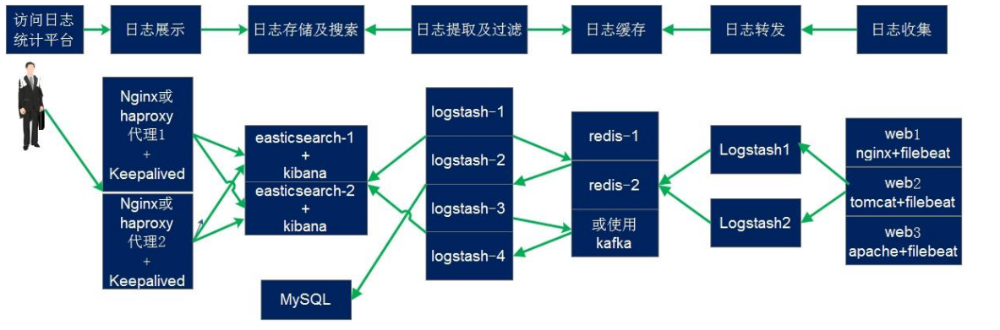
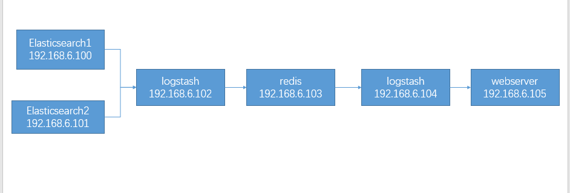
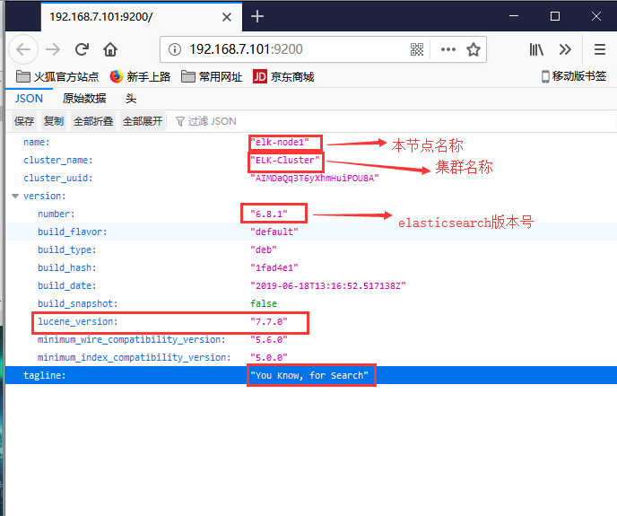
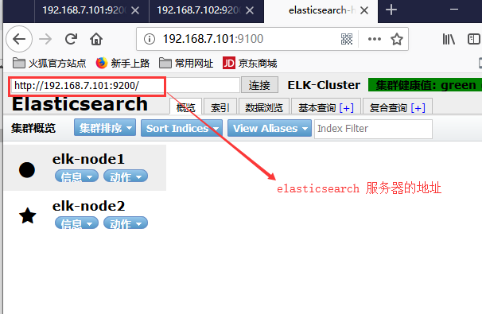
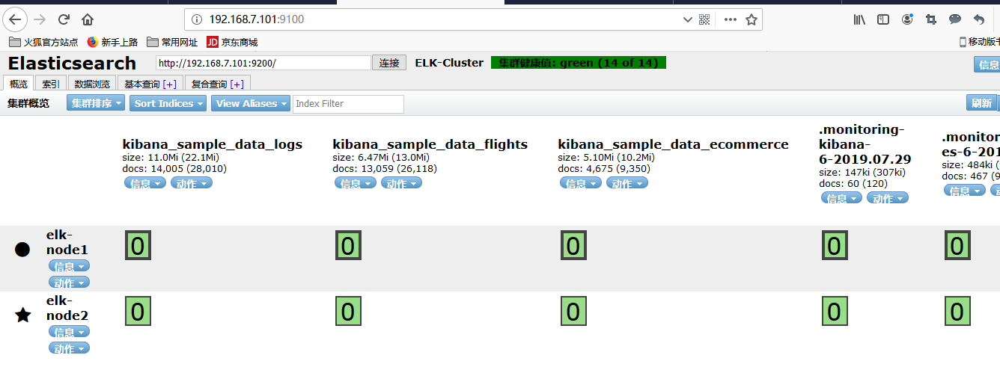
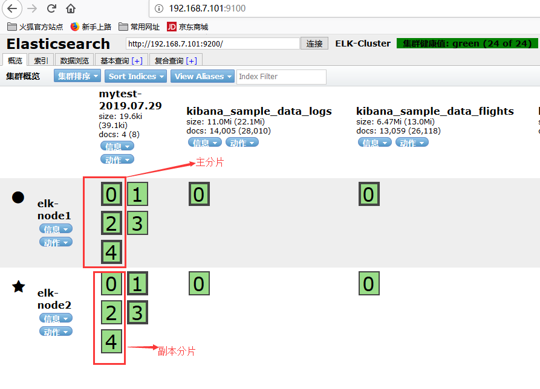
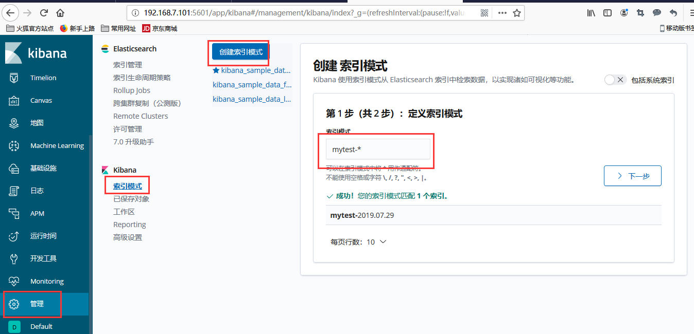
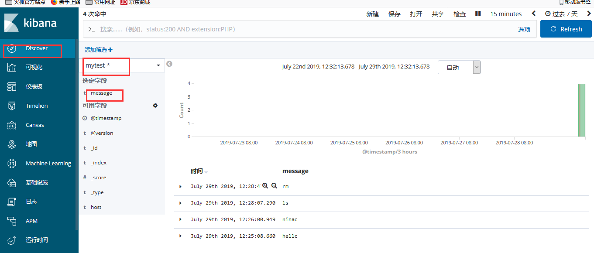

# 什么是ELK
简单来说，ELK是有Elasticsearch、logstash、filebeat三个开源软件的组成的一个组合体，这三个软件中，每个软件用于完成不同的供功能，ELK又称为ELK stack，官方域名为 elastic.co，ELK stack 的主要优点有如下几个：

处理方式灵活： elasticsearch 是实时全文索引，具有强大的搜索功能

配置相对简单：elasticsearch 全部使用 JSON 接口，logstash 使用模块配置，kibana 的配置文件部分更简单。

检索性能高效：基于优秀的设计，虽然每次查询都是实时，但是也可以达到百亿级数据的查询秒级响应。

集群线性扩展：elasticsearch 和 logstash 都可以灵活线性扩展

前端操作绚丽：kibana 的前端设计比较绚丽，而且操作简单

1. Elasticsearch
是一个高度可扩展的开源全文搜索和分析引擎，它可实现数据的实时全文搜索搜索、支持分布式可实现高可用、提供 API 接口，可以处理大规模日志数据，比如 Nginx、Tomcat、系统日志等功能。两个端口，90200短空供客户端使用，9300端口用来在Elasticsearch集群之间同步数据以及集群的状态通知

Elasticsearch会将数据分片存储，这些数据分片中有master和slave，每个Elasticsearch服务器上都有这些分片，master分片用来写数据，每个master分片都在另一台Elasticsearch服务器上有一个slave分片，每个slave分片也会在另外的Elasticsearch服务器上有对应的master分片，单台服务器的分片固定为5个，master分片挂掉后，对应的slave分片会提升为master

2. Logstach
可以通过插件实现日志收集和转发，支持日志过滤，支持普通 log、自定义 json格式的日志解析。

收集日志的流程：在apache等服务器安装logstach，就会收集对应的日志，可以对日志进行匹配和处理，收集指定的字段，并进行判断，处理之后将日志输出到指定的目标，可以输出到Elasticsearch、文件或者数据库中，可以通过GeoIP模块实现对访问ip判断ip地域来源等统计

3. kibana
主要是通过接口调用(9200)Elasticsearch的数据，并进行前端数据可视化的展示


## 为什么要使用ELK
ELK 组件在海量日志系统的运维中，可用于解决以下主要问题：

1. 分布式日志数据统一收集，实现集中式的查询和管理

2. 故障排查
会将所有日志保存到ELK中，可以再ELK集中查看各个服务的日志，查看的是所有同类型的服务的日志，而不是单个服务的日志

3. 安全信息和时间管理

4. 报表功能

ELK 组件在大数据运维系统中，主要可解决的问题如下：

1. 日志查询、问题排查、故障恢复、故障自愈

2. 应用日志分析、错误报警

3. 性能分析，用户行为分析

使用场景：


在后端服务器安装filebeat收集日志，然后通过logsatsh进行日志处理，然后logstash将日志写到缓存层的redis或者kafka，然后由logstash将日志提取出来，交给Elasticsearch

# 搭建环境准备


关闭防火墙和selinux，各个服务器同步时间

各个服务器配置hosts解析
```bash
cat >> /etc/hosts <<EOF
192.168.7.101 elasticsearch1
192.168.7.102 elasticsearch2
192.168.7.103 logstash1
192.168.7.104 redis-kafka
192.168.7.105 logstash2
192.168.7.106 web1
192.168.7.107 web1
EOF
```

设置最大文件连接数
```bash
# Centos
vim /etc/security/limits.conf
elasticsearch                 soft    core               unlimited
elasticsearch                 hard    core             unlimited
elasticsearch                 soft    nproc            1000000
elasticsearch                 hard    nproc          1000000
elasticsearch                 soft    nofile            1000000
elasticsearch                 hard    nofile          1000000
elasticsearch                 soft    memlock      32000
elasticsearch                 hard    memlock    32000
elasticsearch                 soft    msgqueue    8192000
elasticsearch                 hard    msgqueue  8192000
# Ubuntu
# 重启后查看
```

## Elasticsearch 的部署 6.8.1

1. 两台Elasticsearch 准备java环境
```bash
ln -sv /usr/local/jdk/bin/java /usr/bin

vim /etc/profile
export HISTTIMEFORMAT="%F %T `whoami` "
export JAVA_HOME=/usr/local/jdk
export CLASSPATH=.:$JAVA_HOME/jre/lib/rt.jar:$JAVA_HOME/lib/dt.jar:$JAVA_HOME/lib/tools.jar
export PATH=$PATH:$JAVA_HOME/bin

source /etc/profile
```
> elasticsearch 需要 JAVA_HOME 这个变量，如果没有在环境变量中找到java命令和这个变量会导致无法启动

2. 在两台Elasticsearch 服务器添加单独的磁盘用来保存数据
```bash
mkfs.xfs /dev/sdb

echo "/dev/sdb /elk/ xfs defaults 0 0" >> /etc/fstab

mount -a
```

3. 两台服务器分别安装 elasticsearch
```bash
dpkg -i elasticsearch-6.8.1.deb
```

4. 编辑各 elasticsearch 服务器的服务配置文件
```bash
vim /etc/elasticsearch/elasticsearch.yml
cluster.name: ELK-Cluster #ELK 的集群名称，同一个子网内名称相同即属于是同一个集群
node.name: elk-node1 #本机在集群内的节点名称
path.data: /elk/data #数据保存目录
path.logs: /elk/logs #日志保存目
bootstrap.memory_lock: true #服务启动的时候锁定足够的内存，防止数据写入,内存大小定义在/etc/elasticsearch/jvm.options文件中
swap
network.host: 0.0.0.0 #监听 IP
http.port: 9200
discovery.zen.ping.unicast.hosts: ["elasticsearch1", "elasticsearch2"] # 用组播来发现集群内的主机
```

5. 更改数据目录的权限
```bash
mkdir /elk/{data,logs}
chown elasticsearch:elasticsearch -R /elk
```

6. 修改内存限制，并同步配置文件
```bash
vim /usr/lib/systemd/system/elasticsearch.service
LimitMEMLOCK=infinity #无限制使用内存

vim /etc/elasticsearch/jvm.options
-Xms2g
-Xmx2g
#最小和最大内存限制，最小和最大要设置一样大，且不能超过物理机的50%，建议最大不要超过32G
```

7. 启动 elasticsearch 服务并验证
```bash
systemctl start elasticsearch.service
# 监听了9200和9300端口
root@elasticsearch1:~# ss -tnl

LISTEN   0         128                       *:9200                   *:*
LISTEN   0         128                       *:9300                   *:

# 查看日志文件，日志文件名称为集群名称的日志文件
tail -f /elk/logs/ELK-Cluster.log
```
通过浏览器访问 elasticsearch 服务端口


8. 监控elasticsearch 集群状态
```bash
# 使用curl命令查看集群状态
curl -sXGET http://192.168.7.101:9200/_cluster/health?pretty=true
{
  "cluster_name" : "ELK-Cluster",
  "status" : "green",
  "timed_out" : false,
  "number_of_nodes" : 1,
  "number_of_data_nodes" : 1,
  "active_primary_shards" : 0,
  "active_shards" : 0,
  "relocating_shards" : 0,
  "initializing_shards" : 0,
  "unassigned_shards" : 0,
  "delayed_unassigned_shards" : 0,
  "number_of_pending_tasks" : 0,
  "number_of_in_flight_fetch" : 0,
  "task_max_waiting_in_queue_millis" : 0,
  "active_shards_percent_as_number" : 100.0
}
#获取到的是一个 json 格式的返回值，那就可以通过 python 对其中的信息进行分析，例如对 status 进行分析，如果等于 green(绿色)就是运行在正常，等于yellow(黄色)表示副本分片丢失，red(红色)表示主分片丢失
```
python脚本
```bash
vim  els-cluster-monitor.py 

#!/usr/bin/env python
#coding:utf-8
#Author weiying
import smtplib
from email.mime.text import MIMEText
from email.utils import formataddr
import subprocess
body = ""
false="false"
obj = subprocess.Popen(("curl -sXGET http://192.168.7.101:9200/_cluster/health?pretty=true"),shell=True,stdout=subprocess.PIPE)
data = obj.stdout.read()
data1 = eval(data)
status = data1.get("status")
if status == "green":
    print("50")
else:
    print("100")

python3 els-cluster-monitor.py 
50
```

## 安装 elasticsearch 插件之 head
插件是为了完成不同的功能，官方提供了一些插件但大部分是收费的，另外也有一些开发爱好者提供的插件，可以实现对 elasticsearch 集群的状态监控与管理配置等功能。

1. 安装head：方式一
在 elasticsearch 5.x 版本以后不再支持直接安装 head 插件，而是需要通过启动一个服务方式，git 地址：https://github.com/mobz/elasticsearch-head
```bash
apt  install -y npm
# NPM 的全称是 Node Package Manager，是随同 NodeJS 一起安装的包管理和分发工具，它很方便让 JavaScript 开发者下载、安装、上传以及管理已经安装的包。
cd /usr/local/src/
git clone git://github.com/mobz/elasticsearch-head.git 
cd elasticsearch-head/
npm install grunt -save
ll node_modules/grunt #确认生成文件
npm install #执行安装
npm run start & #后台启动服务
```

2. 安装方式二：使用docker镜像的方式
```bash
# 安装docker
curl -fsSL https://get.docker.com | bash -s docker --mirror Aliyun
# 导入镜像
docker load -i elasticsearch-head-5.tar.gz
```

3. 更改Elasticsearch的配置文件
开启跨域访问支持，然后重启 elasticsearch 服务
```bash
vim /etc/elasticsearch/elasticsearch.yml
http.cors.enabled: true
http.cors.allow-origin: "*"

# 重启elasticsearch
```
4. 启动head镜像
```bash
docker run -d -p 9100:9100 mobz/elasticsearch-head:5
```
5. 网页访问查看


### Master 与 Slave 的区别

1. Master 的职责：统计各 node 节点状态信息、集群状态信息统计、索引的创建和删除、索引分配的管理、关闭 node 节点等

2. Slave 的职责：从 master 同步数据、等待机会成为 Master

## Kibana 的安装配置
kibana可以与elasticsearch不再相同的服务器，但是版本必须相同

1. 安装kibana
```bash
dpkg -i kibana-6.8.1-amd64.deb
```

2. 配置kibana
```bash
vim /etc/kibana/kibana.yml

# 监听的端口
server.port: 5601
# 监听的地址
server.host: "0.0.0.0"
# elasticsearch的地址
elasticsearch.hosts: ["http://192.168.7.101:9200"]
```

3. 启动kibana
```bash
systemctl start kibana.service 
systemctl enable kibana.service 
```
4. 访问kibana的web界面


添加数据测试，会往配置的elasticsearch 中插入数据


elasticsearch 的 查看插入的数据


kibana 更改界面为中文
```bash
vim /etc/kibana/kibana.yml
i18n.locale: "zh-CN"
systemctl restart kibana.service
```

# 部署 logstash
Logstash 是一个开源的数据收集引擎，可以水平伸缩，而且 logstash 整个 ELK当中拥有最多插件的一个组件，其可以接收来自不同来源的数据并统一输出到指定的且可以是多个不同目的地。

1. 安装环境的准备
关闭防火墙和 selinux，并且安装 java 环境
```bash
ln -sv /usr/local/jdk/bin/java /usr/bin

vim /etc/profile
export HISTTIMEFORMAT="%F %T `whoami` "
export JAVA_HOME=/usr/local/jdk
export CLASSPATH=.:$JAVA_HOME/jre/lib/rt.jar:$JAVA_HOME/lib/dt.jar:$JAVA_HOME/lib/tools.jar
export PATH=$PATH:$JAVA_HOME/bin

source /etc/profile
```

2. 安装logstash
要和elasticsearch版本相同
```bash
dpkg -i logstash-6.8.1.deb
```

3. 测试标准输入和输出
```bash
# input 输入为stdin(从终端输入)，output输出为stdout(从终端输出)
# codec => rubydebug 编码为rubydebug ，即debug模式，会序列化输出
 /usr/share/logstash/bin/logstash -e 'input { stdin{} } output { stdout{ codec => rubydebug }}'

# 从终端输入
hello
# 输出
{
          "host" => "logstash1",    #标记事件发生在哪里
    "@timestamp" => 2019-07-29T04:16:11.650Z,   #当前事件的发生时间
       "message" => "hello",   #消息的具体内容
      "@version" => "1"   , #事件版本号，一个事件就是一个 ruby 对象
}
```

4. 测试输出到文件
```bash
/usr/share/logstash/bin/logstash -e 'input { stdin{} } output { file { path => "/tmp/log-%{+YYYY.MM.dd}messages.gz"}}'
# 输入
hello
# 输出到文件
[INFO ] 2019-07-29 12:20:56.619 [[main]>worker0] file - Opening file {:path=>"/tmp/log-2019.07.29messages.gz"}
# 验证文件
ll /tmp/log-2019.07.29messages.gz
tail /tmp/log-2019.07.29messages.gz
{"message":"hello","@timestamp":"2019-07-29T04:20:56.084Z","@version":"1","host":"logstash1"}
```
5. 测试输出到 elasticsearch
```bash
/usr/share/logstash/bin/logstash -e 'input { stdin{} } output { elasticsearch {hosts => ["192.168.7.101:9200"] index => "mytest-%{+YYYY.MM.dd}" }}'
# 输入
hello
# 输入到elasticsearch

```
elasticsearch 服务器验证收到数据


6. kibana中创建对应的索引



kibana查看传递的数据
