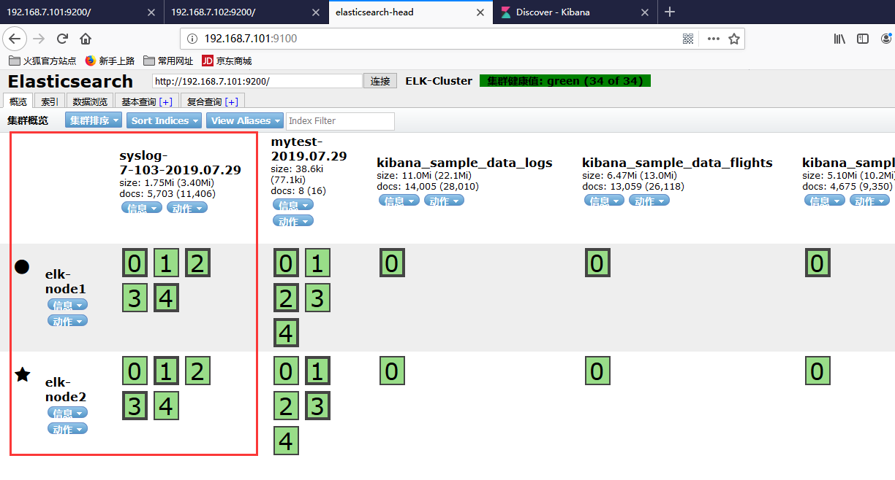
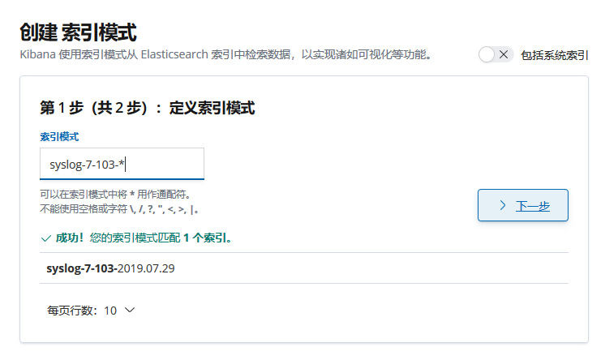
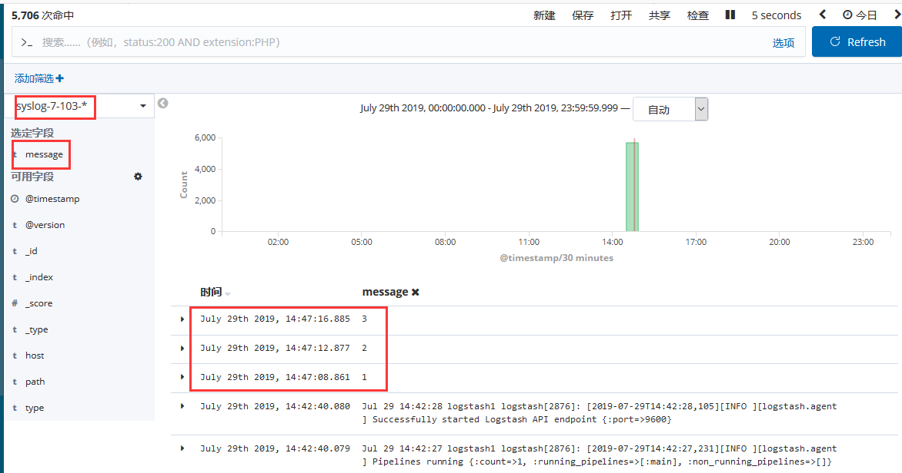
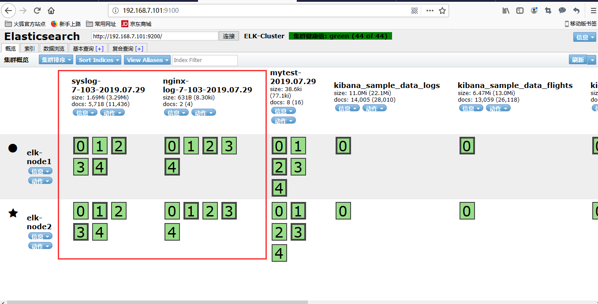
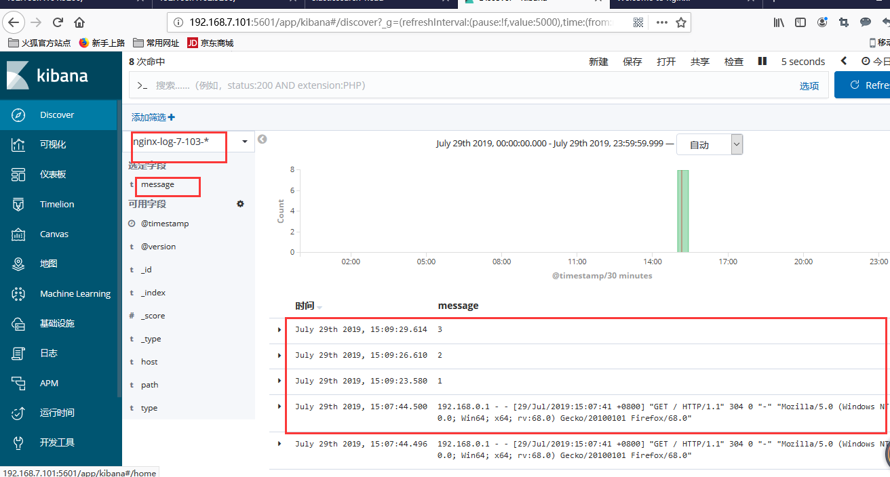
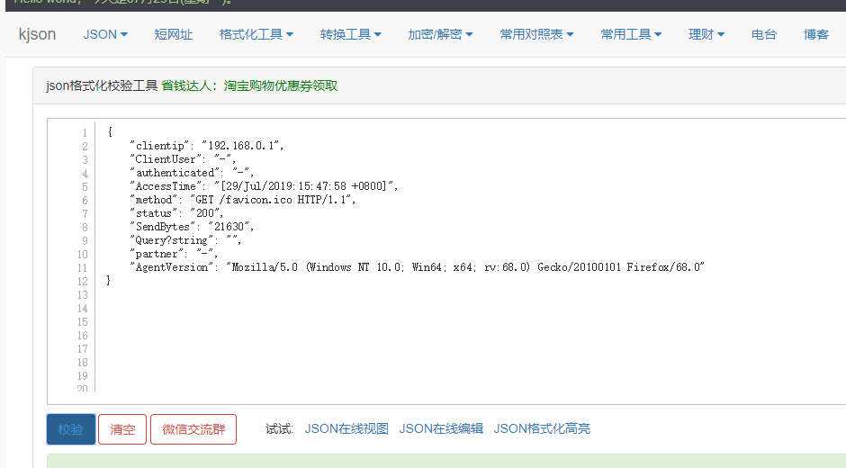
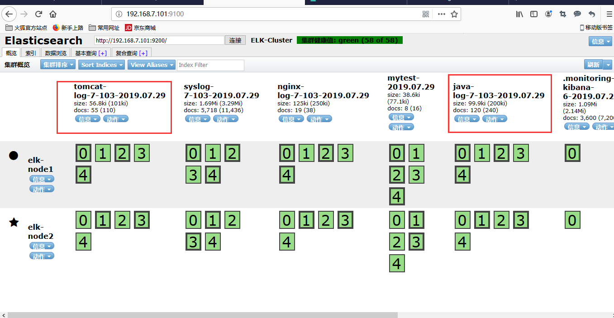
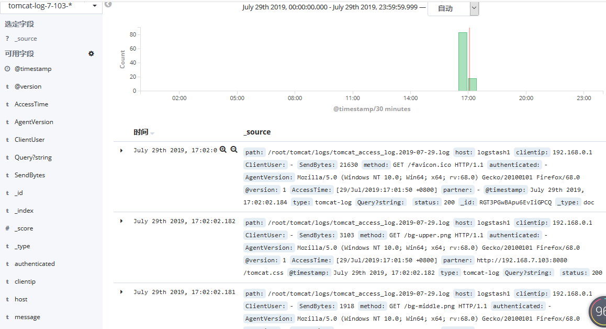
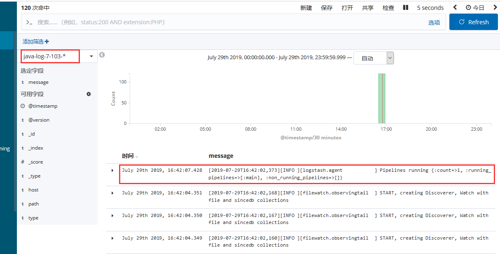
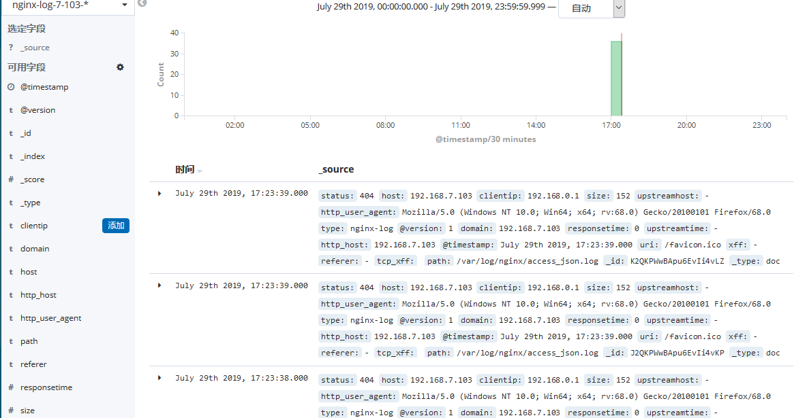

# 收集单个系统日志并输出至文件
前提需要 logstash 用户对被收集的日志文件有读的权限并对写入的文件有写权限。

1. 将系统日志给logstash用户的读权限
```bash
setfacl -R -m u:logstash:r /var/log/syslog
```

2. lohstash配置文件
```bash
vim /etc/logstash/conf.d/syslog.conf
# 输入模块
input {
  file {  # 基于监听文件来传输日志，可以有多个file
    type => "syslogs"    #用于收集多个日志的时候，表示日志类型
    path => "/var/log/syslog" # 日志文件的路径
    start_position => "beginning"  # beginning为第一次从头收集，之后从新添加的收集日志，end为只要新的日志
    stat_interval => "3" # 每隔3秒钟采集一次数据
  }
}
# 输出模块
output {
  file {
    path => "/tmp/%{type}.%{+yyyy.MM.dd}"
  }
}
```

3. 检测配置文件语法是否正确
```bash
/usr/share/logstash/bin/logstash -f /etc/logstash/conf.d/syslog.conf -t
....
[INFO ] 2019-07-29 14:17:49.710 [LogStash::Runner] runner - Using config.test_and_exit mode. Config Validation Result: OK. Exiting Logstash
```
4. 生成数据并验证
```bash
tail -n 3 /tmp/syslogs.2019.07.29 
{"message":"test2","@version":"1","host":"logstash1","@timestamp":"2019-07-29T06:31:43.006Z","path":"/var/log/syslog","type":"syslogs"}
{"message":"Jul 29 14:33:12 logstash1 systemd[1]: Started Session 14 of user root.","@version":"1","host":"logstash1","@timestamp":"2019-07-29T06:33:12.194Z","path":"/var/log/syslog","type":"syslogs"}
{"message":"test3","@version":"1","host":"logstash1","@timestamp":"2019-07-29T06:33:23.216Z","path":"/var/log/syslog","type":"syslogs"}
```

# 收集系统日志文件输出到elasticsearch
输出日志的时候根据type类型做判断
1. lohstash配置文件
```bash
vim /etc/logstash/conf.d/syslog.conf
# 输入模块
input {
  file {  # 基于监听文件来传输日志，可以有多个file
    type => "syslogs"    #用于收集多个日志的时候，表示日志类型
    path => "/var/log/syslog" # 日志文件的路径
    start_position => "beginning"  # beginning为第一次从头收集，之后从新添加的收集日志，end为只要新的日志
    stat_interval => "3" # 每隔3秒钟采集一次数据
  }
}
# 输出模块
output {
  elasticsearch {
    hosts => ["192.168.7.101:9200"]   # elasticsearch服务器的地址，可以写多个
    index => "syslog-7-103-%{+yyyy.MM.dd}"   # 添加到elasticsearch服务器后的索引名
  }
}
```

2. 检测配置文件语法是否正确
```bash
/usr/share/logstash/bin/logstash -f /etc/logstash/conf.d/syslog.conf -t
....
[INFO ] 2019-07-29 14:17:49.710 [LogStash::Runner] runner - Using config.test_and_exit mode. Config Validation Result: OK. Exiting Logstash
```

3. 启动logstash
```bash
systemctl enable logstash.service
systemctl start logstash.service
```

4. 到elasticsearchdaunt验证


5. 在 kibana 界面添加 syslogs 的索引:


6. kibana 界面查看系统日志信息


## 多个文件收集，并输出到elasticsearch

1. 更改logstash的配置文件
```bash
vim /etc/logstash/conf.d/syslog.conf

input {
  file {
    type => "syslogs"
    path => "/var/log/syslog"
    start_position => "beginning"
  }
  file {
    type => "nginx-log"
    path => "/var/log/nginx/access.log"
    start_position => "beginning"
    stat_interval => "3"
  }
}

output {
  if [type] == "syslog" {
  elasticsearch {
    hosts => ["192.168.7.101:9200"]
    index => "syslog-7-103-%{+yyyy.MM.dd}"
  }
  file {
    path => "/tmp/%{type}.%{+yyyy.MM.dd}"
  }
  }
  if [type] == "nginx-log"{
  elasticsearch {
    hosts => ["192.168.7.101:9200"]
    index => "nginx-log-7-103-%{+yyyy.MM.dd}"
  }
  }
}
```

2. 重启logstash
```bash
# 启动nginx
systemctl start nginx
# 更改nginx日志文件的权限
chmod 644 /var/log/nginx/access.log
# 重启logstash
systemctl restart logstash
```

3. 访问nginx，查看是否写入到elasticsearch


4. 将nginx日志添加到kidana并查看



# 通过 logtsash 收集 tomcat 和 java 日志
收集 Tomcat 服务器的访问日志以及 Tomcat 错误日志进行实时统计，在 kibana页面进行搜索展现，每台 Tomcat 服务器要安装 logstash 负责收集日志，然后将日志转发给 elasticsearch 进行分析，在通过 kibana 在前端展现，配置过程如下

## 将tomcat日志转化为json格式并收集

1. 配置 java 环境并部署 tomcat
```bash
tar xf jdk-8u212-linux-x64.tar.gz
mv jdk1.8.0_212 /usr/local/jdk
ln -sv /usr/local/jdk/bin/java /usr/bin

vim /etc/profile
export HISTTIMEFORMAT="%F %T `whoami` "
export JAVA_HOME=/usr/local/jdk
export CLASSPATH=.:$JAVA_HOME/jre/lib/rt.jar:$JAVA_HOME/lib/dt.jar:$JAVA_HOME/lib/tools.jar
export PATH=$PATH:$JAVA_HOME/bin

source /etc/profile

tar xvf apache-tomcat-8.5.42.tar.gz
ln -sv apache-tomcat-8.5.42 tomcat
tomcat/bin/catalina.sh start
```

2. 更改日志类型为json格式的日志
```bash
vim tomcat/conf/server.xml
<Valve className="org.apache.catalina.valves.AccessLogValve" directory="logs"
               prefix="tomcat_access_log" suffix=".log"
               pattern="{"clientip":"%h","ClientUser":"%l","authenticated":"%u","AccessTime":"%t","method":"%r","status":"%s","SendBytes":"%b","Query?string":"%q","partner":"%{Referer}i","AgentVersion":"%{User-Agent}i"}"/>

# 重启tomcat
tomcat/bin/catalina.sh stop
tomcat/bin/catalina.sh start
```

3. 验证日志格式是否给json格式
```bash
cat tomcat/logs/tomcat_access_log.2019-07-29.log 
{"clientip":"192.168.0.1","ClientUser":"-","authenticated":"-","AccessTime":"[29/Jul/2019:15:47:58 +0800]","method":"GET /favicon.ico HTTP/1.1","status":"200","SendBytes":"21630","Query?string":"","partner":"-","AgentVersion":"Mozilla/5.0 (Windows NT 10.0; Win64; x64; rv:68.0) Gecko/20100101 Firefox/68.0"}
```


## 配置收集java日志，多行合并，以logstash日志为例
使用 codec 的 multiline 插件实现多行匹配，这是一个可以将多行进行合并的插件，而且可以使用 what 指定将匹配到的行与前面的行合并还是和后面的行合并，https://www.elastic.co/guide/en/logstash/current/plugins-codecs-multiline.html


1. 配置logstash收集logstash自己的日志和tomcat的日志
```bash
vim /etc/logstash/conf.d/java-to-es.conf
input {
  file {
    type => "java-log"
    path => "/var/log/logstash/logstash-plain.log"
    start_position => "beginning"
    stat_interval => "3"
    codec => multiline {
      pattern => "^\["    #当遇到[开头的行时候将多行进行合并
      negate => true      #true 为匹配成功进行操作，false 为不成功进行操作
      what => "previous"   #与以前的行合并，如果是下面的行合并就是 next
    }
 }
  file {
    type => "tomcat-log"
    path => "/root/tomcat/logs/tomcat_access_log.*.log"
    start_position => "beginning"
    stat_interval => "3"
	codec => "json"
 }
}

output {
  if [type] == "java-log" {
   elasticsearch {
    hosts => ["192.168.7.101:9200"]
    index => "java-log-7-103-%{+yyyy.MM.dd}"
   }
 }
 if [type] == "tomcat-log" {
  elasticsearch {
    hosts => ["192.168.7.101:9200"]
    index => "tomcat-log-7-103-%{+yyyy.MM.dd}"
  }
 }
}
```

2. 更改各个日志的权限
```bash
chmod 644 /root/tomcat/logs -R
chmod 644 /var/log/logstash -R
```

3. 重启logstash验证
```bash
systemctl restart logstash.service
```


4. 在kibana添加索引




# 关于 sincedb
记录了收集文件的 inode 信息
```bash
 cat /var/lib/logstash/plugins/inputs/file/.sincedb_*
393227 0 64768 21820 1564389871.24723 /root/tomcat/logs/tomcat_access_log.2019-07-29.log
1048585 0 64768 23972 1564389727.435838 /var/log/logstash/logstash-plain.log
1051647 0 64768 2564 1564389723.76836 /var/log/nginx/access.log
1051326 0 64768 902935 1564389725.1468618 /var/log/syslog
```
## 收集json格式的nginx格式的日志

1. 更改nginx的日志为json格式
```bash
vim /etc/nginx/nginx.conf 

log_format access_json '{"@timestamp":"$time_iso8601",'
    '"host":"$server_addr",'
    '"clientip":"$remote_addr",'
    '"size":$body_bytes_sent,'
    '"responsetime":$request_time,'
    '"upstreamtime":"$upstream_response_time",'
    '"upstreamhost":"$upstream_addr",'
    '"http_host":"$host",'
    '"uri":"$uri",'
    '"domain":"$host",'
    '"xff":"$http_x_forwarded_for",'
    '"referer":"$http_referer",'
    '"tcp_xff":"$proxy_protocol_addr",'
    '"http_user_agent":"$http_user_agent",'
    '"status":"$status"}';

access_log /var/log/nginx/access_json.log access_json;

nginx -s reload
```

2. 更改logstash配置文件
```bash
vim /etc/logstash/conf.d/logstash-to-es.conf
input {
  file {
    type => "java-log"
    path => "/var/log/logstash/logstash-plain.log"
    start_position => "beginning"
    stat_interval => "3"
    codec => multiline {
      pattern => "^\["
      negate => true
      what => "previous"
    }
 }
  file {
    type => "tomcat-log"
    path => "/root/tomcat/logs/tomcat_access_log.*.log"
    start_position => "beginning"
    stat_interval => "3"
    codec => "json"
 }
  file {
    type => "nginx-log"
    path => "/var/log/nginx/access_json.log"
    start_position => "beginning"
    stat_interval => "3"
    codec => "json"
 }
}

output {
  if [type] == "java-log" {
   elasticsearch {
    hosts => ["192.168.7.101:9200"]
    index => "java-log-7-103-%{+yyyy.MM.dd}"
   }
 }
 if [type] == "tomcat-log" {
  elasticsearch {
    hosts => ["192.168.7.101:9200"]
    index => "tomcat-log-7-103-%{+yyyy.MM.dd}"
  }
 }
 if [type] == "nginx-log" {
  elasticsearch {
    hosts => ["192.168.7.101:9200"]
    index => "nginx-log-7-103-%{+yyyy.MM.dd}"
  }
 }
}
```

3. 重启logstash，并添加到kidana



# 收集 TCP/UDP 日志
通过 logstash 的 tcp/udp 插件收集日志，通常用于在向 elasticsearch 日志补录丢失的部分日志，可以将丢失的日志写到一个文件，然后通过 TCP 日志收集方式直接发送给 logstash 然后再写入到 elasticsearch 服务器。
https://www.elastic.co/guide/en/logstash/5.6/input-plugins.html

1. logstash 配置文件，先进行收集测试
```bash
vim /opt/test.conf

input {
  tcp {
    port => 5044    # 监听的地址
    codec => "json"
    type => "tcplog"
    mode => "server" # server端，用来监听用户传过来的日志
  }
}
output {
  stdout {
    codec => rubydebug
  }
}
```

2. 验证端口启动成功
```bash
 /usr/share/logstash/bin/logstash -f /opt/test.conf
 # 监听了指定的端口
```

3. 在其他服务器安装 nc 命令 测试
NetCat 简称 nc，在网络工具中有“瑞士军刀”美誉，其功能实用，是一个简单、可靠的网络工具，可通过 TCP 或 UDP 协议传输读写数据，另外还具有很多其他功能。
```bash
apt install netcat
# yum instll nc –y
# 其他服务器测试
echo "test" | nc -q 1 192.168.7.103 5044
# 或者 

# logstash端收到消息
{
          "type" => "tcplog",
      "@version" => "1",
    "@timestamp" => 2019-07-29T09:37:36.256Z,
          "host" => "web1",
       "message" => "test",
          "tags" => [
        [0] "_jsonparsefailure"
    ],
          "port" => 42192
}

```

通过 nc 命令发送一个文件
```bash
nc -q 1 192.168.7.103 5044 < /etc/passwd
```
验证logstash端是否收到消息


4. logstash 配置文件，传输到elasticsearch
```bash
input {
  tcp {
    port => 5044    # 监听的地址
    codec => "json"
    type => "tcplog"
    mode => "server" # server端，用来监听用户传过来的日志
  }
}
output {
  elasticsearch {
    hosts => ["192.168.7.101:9200"]
	index => "tcp-log-7-103-%{+yyyy.ww}"   # 以每年的多少周显示
  }
}
```