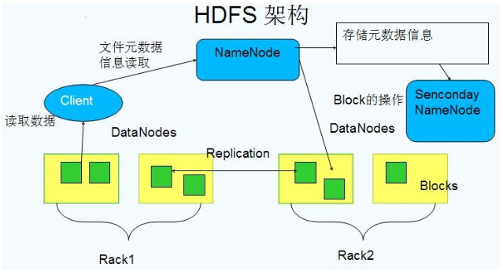
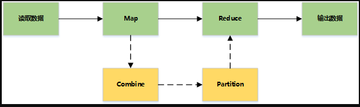
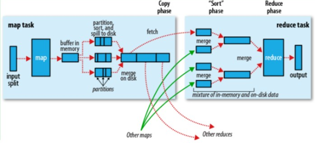
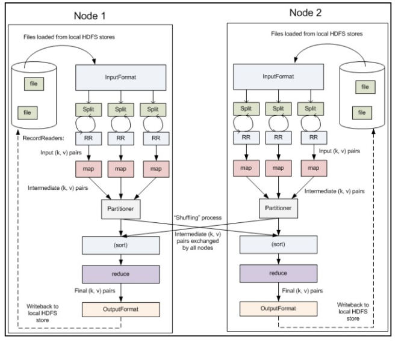
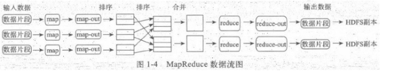
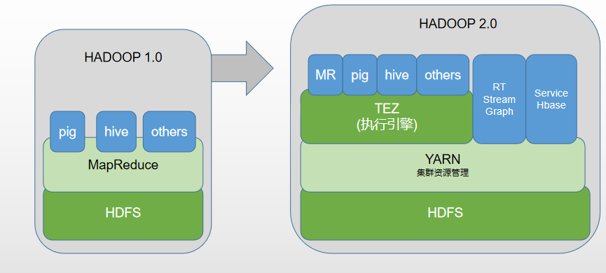
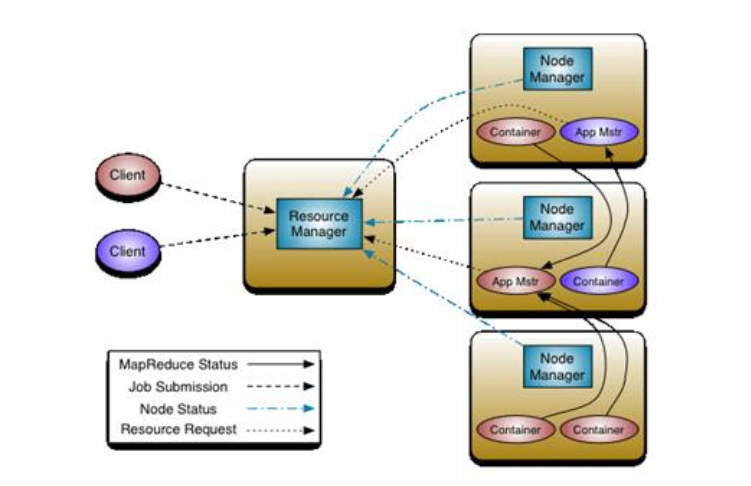

# 大数据的相关概念

数据分为结构化数据,半结构化数据和非结构化数据,结构化的数据是有严格的约束的,半结构化数据有元数据但是没有约束,非结构化的数据是没有元数据的

海量数据都是通过爬虫程序爬取而来,但是爬取下来的数据都是非结构化或者半结构化的数据,因此不能将数据存储在传统的RDBMS中,那么数据要是想检索的话,那么就需要通过搜索引擎将它们构建倒排索引格式,通过关键词基于精确或者模糊匹配按顺序展示,那么这个数据要想实现被检索,首先是需要被分析的,经由分析器的数据会被分词等将数据正规化,被正规化后的数据才能被创建索引,并被存储起来,最后才能面向用户做检索的操作,那么当面对海量数据的时候,为了完成高效的数据分析和检索等,那么就需要用到分布式系统来完成

那么面对海量的数据,必须的组件就是高效的存储平台和高效的分析处理平台

## google对大数据领域的影响
2003年:google发表论文 The google File System ,介绍了google内部是怎么完成海量数据的存储的(GFS文件系统),阐述了使用主机集群完成并行的或者分布式的方式高效的存储海量数据,用来支持大规模数据密集型的海量数据,这个集群的分布式文件系统可以扩展到上千或者上万的节点,比较适合流式数据处理,一次写,多次读,数据很少修改的场景

2004年:google发表论文 MapReduce,阐述了MapReduce的运行模型和机制,可以将某个处理任务分割成多个处理单元,然后并行的运行在集群的各个节点上,然后收集各个节点的运行结果做二次的并行处理,直至得到最终结果

2006年:google发表论文 BigTable,用于存储结构化数据的分布式文件系统,不支持传统关系型数据的范式和约束等,仅仅能以键值对的方式来实现数据存储的

## Hadoop

根据google的三篇论文,使用java语言研发的大数据处理框架,GFS被研发成了HDFS,MapReduce还是MapReduce,BigTable被研发成了Hbase

Hadoop=HDFS(分布式文件系统,负责底层的存储)+MapReduce(批处理系统,负责处理数据)

## HDFS分布式文件系统

### block
1. 基本存储单元,一般大小为64M,配置大的块主要是可以减少搜寻时间和减少块管理的数据开销

2. 一个大文件会被拆分成一个个的块,然后存储于不同的节点上,如果一个文件少于block大小,那么时间占用的空间为其文件的大小

3. 每个块都会被复制到多台机器,默认复制三分

### NameNode(NN)
1. 存储文件的元数据,运行时所有的数据存储在内存中,整个HDFS可存储的文件数受限于NN的内存大小

2. 一个block在NameNode中对应一条记录(一般一个block占用150字节),如果是大量的小的小文件,会消耗大量的内存,同时map task的数量由splits来决定,所以用MapReduce处理大量的小文件时,就会产生过多的map task,线程管理开销将会增加作业时间。处理大量小文件的速度远远小于处理同等大小的大文件的速度。因此Hadoop建议存储大文件

3. 数据会定时的持久化到本地磁盘,但是不保存block的位置信息,而是邮DataNode注册是上报和运行时维护（NameNode中与DataNode相关的信息并不保存到NameNode的文件系统中，而是NameNode每次重启后，动态重建）

4. NameNode失效则整个HDFS都失效了，所以要保证NameNode的高可用性

### DataNode
1. 负责具体保存block数据

2. 负责数据的读写操作和复制操作

3. DataNode启动时会向NameNode报告当前存储的数据块信息,后续也会定时报告修改的信息

4. DataNode之前会进行通信,复制数据块,保证数据的冗余性

### Secondary NameNode辅助名称存储
定时与NameNode进行通信(定期合并文件系统镜像和编辑日志(类似于二进制日志)),然后把合并后的数据传给NameNode,替换其镜像,并清空编辑日志,类似于checkpoint机制,但是NameNode失效后仍需要手动将其设置为主机

## Hadoop的Mapreduce
一种分布式的计算方式,指定一个Map（映射）函数,用来把一组键值对映射成一组新的键值对,指定并发的Reduce(归约)函数,用来保证所有映射的键值对中的每一个共享相同的键组

MapReduce可以拆分为mapper和reducer,每个mapper都是一个在TaskTracker上运行的实例,每一个mapper处理完成后要生成一个结构列表对应的元素,只有当所有的mapper都处理完成后,列表元素才会完整,才能去执行reducer

> 对于MapReduce集群来说,任务的总控节点成为JobTracker,作业的运行节点成为TaskTracker,较小集群的环境下JobTracker可以运行在NameNode节点上,TaskTracker运行在DataNode上,为了防止某个节点上运行过多的TaskTracker,使用任务槽来限定运行的任务个数

### 基本流程
Mapreduce 主要是先读取文件数据,然后Map处理,接着是Reduce处理,最后把处理结果写到文件中

详细流程

多节点下的流程

主要过程

1. Record reader
记录阅读器会将翻译由输入格式生成的记录,记录阅读器用于将数据解析给记录,并不分析记录自身,记录读取器的目的是将数据解析成记录,但不分析记录本身,他将数据以键值对的形式传输非mapper,通常键是位置信息,值是构成记录的数据存储块,自定义记录不在文本套路范围内

2. mapper
在映射器中用户提供的代码称为中间对。对于键值的具体定义是慎重的，因为定义对于分布式任务的完成具有重要意义.键决定了数据分类的依据，而值决定了处理器中的分析信息.同一个键对应的数据只能发给同一个reducer,具体哪个键发送给哪个reducer,由partitioner来决定,如果需要在键值对发送给reducer之前先将相同的键对应的值合并起来,那么在mapper和partitioner之间应该还有combiner先将数据合并,再由partitioner决定发送给哪个reducer

3. Shuffle and Sort
ruduce任务以随机和排序步骤开始。此步骤写入输出文件并下载到本地计算机。这些数据采用键进行排序以把等价密钥组合到一起。

4. Reduce
reducer采用分组数据作为输入。该功能传递键和此键相关值的迭代器。可以采用多种方式来汇总、过滤或者合并数据。当ruduce功能完成，就会发送0个或多个键值对。

5. 输出格式
输出格式会转换最终的键值对并写入文件。默认情况下键和值以tab分割，各记录以换行符分割。因此可以自定义更多输出格式，最终数据会写入HDFS。类似记录读取，自定义输出格式不在本书范围。

## Hadoop2的MapReduce

hadoop1中,MapReduce负责集群资源管理和数据处理

hadoop2中,MapReduce被分为了两大部分,yarn负责集群管理,MRv2负责数据处理

MRv2又分为了TEZ(执行引擎,负责提供运行时环境的组件)和MR(只负责处理批处理作业)

### hadoop2 中作业任务的运行方式

在yarn中,将整个管理分为了ResourceManager(资源管理)和NodeManager(节点管理)

#### ResourceManager 资源管理器
负责全局的资源管理和任务调度,把整个集群当做整体,只关注分配,不负责应用,也不负责容错
资源管理中,每启动一个作业,每个作业自己有一个application master,app master负责管理该作业内部的Container(容器)

1. 以前资源是每个节点分成一个个的Map slot和Reduce slot，现在是一个个Container，每个Container可以根据需要运行ApplicationMaster、Map、Reduce或者任意的程序

2. 以前的资源分配是静态的，目前是动态的，资源利用率更高

3. Container是资源申请的单位,向app master发送运行状态,如果某个container除了故障由app master管理,而不是ResourceManager

4. 用户提交作业到ResourceManager,然后在某个NodeManager上分配container来运行applicationMaster,ApplicationMaster再根据自身程序需要向ResourceManager申请资源,app master就可以使用container来运行作业,任务运行完成后app master向ResourceManager报告,然后由ResourceManager将container的资源回收

#### NodeManager
1. 周期性的向 ResourceManager 报告节点信息,等待 ResourceManager 的指令

2. 监控container的运行,维护container的生命周期,监控container的资源使用情况

3. 启动或停止container,管理任务运行时的依赖根据ApplicationMaster的需要，启动Container之前将需要的程序及其依赖包、配置文件等拷贝到本地）

#### ApplicationMaster

1. 计算应用的资源需求,资源可以是静态或动态计算的,静态的一般是client申请时就指定了,动态的则需要ApplicationMaster根据应用的运行状态来决定

2. 根据数据来申请对应位置的资源(通过HDFS的block分片信息获取)

3. 向ResourceManager申请资源,与NodeManager进行交互进程的运行和监控,监控申请的资源的使用情况,监控作业进度

4. 跟踪任务状态和进度,定时向ResourceManager发送心跳信息,报告资源的使用情况和应用的进度信息

5. 负责本做业内的任务的容错

> 一般的MapReduce是根据block数量来定Map和Reduce的计算数量，然后一般的Map或Reduce就占用一个Container