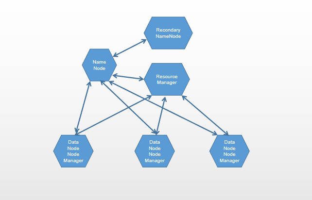
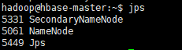
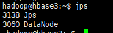
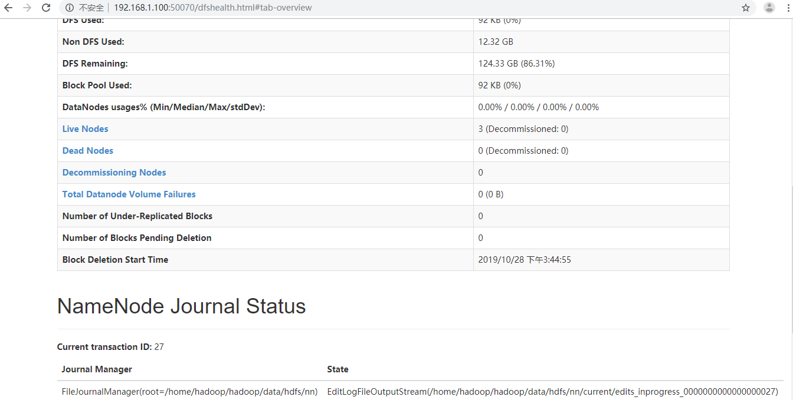
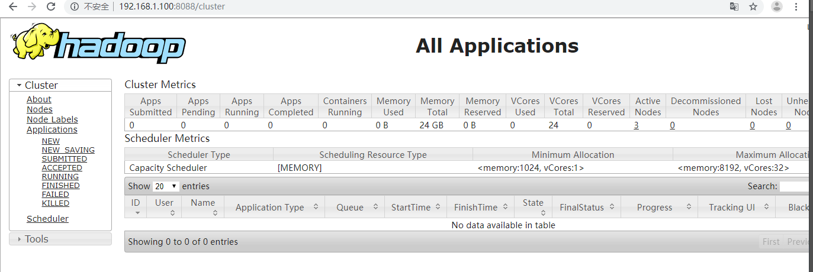

# Hadoop集群的守护进程
Hadoop集群主要分为两大集群,分布式HDFS集群和YARN集群

## HDFS集群
NameNode:hadoop-daemon.sh (start|stop) namenode 
DataNode:hadoop-daemon.sh (start|stop) datanode
Secondary NameNode:hadoop-daemon.sh (start|stop) secondarynamenode

1. NameNode
主要包括了fsimage和editlog,在内存中存放元数据,元数据存储了有哪些DataNode和哪些block存储在哪个DataNode上,对于元数据的变化会先写入到editlog中,会周期性的将editlog于fsimage合并

2. RecondaryNameNode
定时与NameNode进行通信(定期合并文件系统镜像和编辑日志(类似于二进制日志)),然后把合并后的数据传给NameNode,替换其镜像,并清空编辑日志,类似于checkpoint机制,应该和NameNode部署在不同的节点

3. DataNode

## YRAN集群
ResourceManager:yarn-daemon.sh (start|stop) resourcemanager
NodeManager:yarn-daemon.sh (start|stop) nodemanager

1. ResourceManager

2. NodeManager
用于管理用于ResourceManager分配的运行在各个从节点上的container中的作业任务

# 完全分布式部署Hadoop集群


master节点(NameNode,ResourceManager,RecondaryNameNode):192.168.1.100
DataNode节点1:192.168.1.101
DataNode节点2:192.168.1.102
DataNode节点3:192.168.1.103

此处部署的话,因为实验环境的问题,我将NameNode,ResourceManager和RecondaryNameNode部署在一个节点

1. 各个服务器配置java环境和hadoop用户
```bash
# 创建hadoop用户
root@hbase1:~# useradd hadoop -m
root@hbase1:~# echo hadoop:admin123 | chpasswd

# 配置java环境

root@hbase1:~# tar -xvf jdk-8u212-linux-x64.tar.gz -C /usr/local/src/
root@hbase1:~# chown hadoop:hadoop /usr/local/src/jdk1.8.0_212 -R
root@hbase1:~# ln -sv /usr/local/src/jdk1.8.0_212 /usr/local/src/jdk

root@hbase1:~# vim /etc/profile

export HISTTIMEFORMAT="%F %T `whoami` "
export export LANG="en_US.utf-8"
export JAVA_HOME=/usr/local/src/jdk
export CLASSPATH=.:$JAVA_HOME/jre/lib/rt.jar:$JAVA_HOME/lib/dt.jar:$JAVA_HOME/lib/tools.jar
export HBASE_HOME=/root/hbase 
export PATH=$PATH:$JAVA_HOME/bin:$HBASE_HOME/bin


source /etc/profile
```

2. master节点(NameNode节点)的hadoop用户配置与DataNode节点的hadoop用户免秘钥登录
```bash
# 设置各个节点的hosts解析
vim /etc/hosts
192.168.1.100 hbase-master
192.168.1.101 hbase1
192.168.1.102 hbase2
192.168.1.103 hbase3


root@hbase-master:~# su - hadoop 
hadoop@hbase-master:~$ ssh-keygen 
Generating public/private rsa key pair.
Enter file in which to save the key (/home/hadoop/.ssh/id_rsa): 
Enter passphrase (empty for no passphrase): 
Enter same passphrase again: 
Your identification has been saved in /home/hadoop/.ssh/id_rsa.
Your public key has been saved in /home/hadoop/.ssh/id_rsa.pub.
The key fingerprint is:
SHA256:xlI1t+MUsEaO0THwIoU30+gZ+/oi6vMNw/EHwlqfSao hadoop@hbase-master
The key's randomart image is:
+---[RSA 2048]----+
|       .+=Boo    |
|      ..*Bo= o   |
|      .o+*= +    |
|     . ++o o .   |
|      * S.  .    |
|     + X +.      |
|    . = =..      |
|    ...+o.       |
|   .E+...o.      |
+----[SHA256]-----+

hadoop@hbase-master:~$ ssh-copy-id hadoop@hbase1
hadoop@hbase-master:~$ ssh-copy-id hadoop@hbase2
hadoop@hbase-master:~$ ssh-copy-id hadoop@hbase3

```

3. 各个节点同步时间
最好是有内网的ntp服务器或者在master节点部署ntps服务器做时间同步
```bash
root@hbase-master:~# ntpdate ntp.aliyun.com
```

4. 各个节点解压hadoop
```bash
root@hbase1:~# tar -xvf hadoop-2.7.7.tar.gz -C /home/hadoop/
root@hbase1:~# ln -sv /home/hadoop/hadoop-2.7.7 /home/hadoop/hadoop

# 创建hadoop数据目录和日志目录,DataNode上值创建dn即可,NameNode上创建nn和snn
root@hbase1:~# mkdir -pv /home/hadoop/hadoop/data/hdfs/{nn,snn,dn}
root@hbase1:~# mkdir /home/hadoop/hadoop/logs

# 更改目录的属主
root@hbase1:~# chown hadoop:hadoop /home/hadoop/hadoop-2.7.7 -R
```

5. 各个节点配置hadoop的环境变量
```bash
vim /etc/profile.d/hadoop.sh

export HADOOP_PREFIX=/home/hadoop/hadoop
export PATH=$PATH:${HADOOP_PREFIX}/bin:${HADOOP_PREFIX}/sbin
export HADOOP_YARN_HOME=${HADOOP_PREFIX}
export HADOOP_MAPPRED_HOME=${HADOOP_PREFIX}
export HADOOP_COMMON_HOME=${HADOOP_PREFIX}
export HADOOP_HDFS_HOME=${HADOOP_PREFIX}

# 载入配置文件
source /etc/profile.d/hadoop.sh
```

## 修改主节点的配置文件

1. 修改 core-site.xml 配置文件
```bash
# 指定hdfs的访问入口为master节点
hadoop@hbase-master:~$ vim hadoop/etc/hadoop/core-site.xml

<configuration>
        <property>
                <name>fs.defaultFS</name>
                <value>hdfs://hbase-master:8020</value>
                <final>true</final>
        </property>
</configuration>
```

2. 修改yarn-site.xml配置文件
```bash
# 指定yarn的访问入口为master节点
hadoop@hbase-master:~$ vim hadoop/etc/hadoop/yarn-site.xml
<configuration>

<!-- Site specific YARN configuration properties -->
        <property>
                <name>yarn.resourcemanager.address</name>
                <value>hbase-master:8032</value>
        </property>
        <property>
                <name>yarn.resourcemanager.scheduler.address</name>
                <value>hbase-master:8030</value>
        </property>
        <property>
                <name>yarn.resourcemanager.resource-tracker.address</name>
                <value>hbase-master:8031</value>
        </property>
        <property>
                <name>yarn.resourcemanager.admin.address</name>
                <value>hbase-master:8033</value>
        </property>
        <property>
                <name>yarn.resourcemanager.webapp.address</name>
                <value>192.168.1.100:8088</value>
        </property>
        <property>
                <name>yarn.nodemanager.aux-services</name>
                <value>mapreduce_shuffle</value>
        </property>
        <property>
                <name>yarn.nodemanager.auxservices.mapreduce_shuffle.class</name>
                <value>org.apache.hadoop.mapred.ShuffleHandler</value>
        </property>
        <property>
                <name>yarn.resourcemanager.scheduler.class</name>
                <value>org.apache.hadoop.yarn.server.resourcemanager.scheduler.capacity.CapacityScheduler</value>
        </property>

</configuration>
```

3. 修改hdfs-site.xml配置文件指定副本数,默认为3个
```bash
hadoop@hbase-master:~$ vim hadoop/etc/hadoop/hdfs-site.xml

<configuration>
        <property>
                <name>dfs.replication</name>
                <value>2</value>
        </property>
        <property>
                <name>dfs.namenode.name.dir</name>
                <value>file:///home/hadoop/hadoop/data/hdfs/nn</value>
        </property>
        <property>
                <name>dfs.datanode.data.dir</name>
                <value>file:///home/hadoop/hadoop/data/hdfs/dn</value>
        </property>
        <property>
                <name>fs.checkpoint.dir</name>
                <value>file:///home/hadoop/hadoop/data/hdfs/snn</value>
        </property>
        <property>
                <name>fs.checkpoint.edits.dir</name>
                <value>file:///home/hadoop/hadoop/data/hdfs/snn</value>
        </property>
        <property>
                <name>dfs.permissions</name>
                <value>false</value>
        </property>
</configuration>
```

4. 修改mapred-site.xml 配置文件,定义MapReduce运行在yarn上
```bash
vim /home/hadoop/hadoop/etc/hadoop/mapred-site.xml

<configuration>
        <property>
                <name>mapreduce.framework.name</name>
                <value>yarn</value>
        </property>
</configuration>
```

5. 修改slaves文件,指定从节点
```bash
hadoop@hbase-master:~$ vim hadoop/etc/hadoop/slaves
# 可以填写ip地址,尽量使用主机名,要能解析到
hbase1
hbase2
hbase3
```

6. 配置环境变量
```bash
hadoop@hbase-master:~$ vim hadoop/etc/hadoop/hadoop-env.sh

export JAVA_HOME=/usr/local/src/jdk
```

## 配置从节点
1. 将主节点的配置文件分别复制到从节点
```bash
hadoop@hbase-master:~$ scp hadoop/etc/hadoop/* hbase1:/home/hadoop/hadoop/etc/hadoop/
hadoop@hbase-master:~$ scp hadoop/etc/hadoop/* hbase2:/home/hadoop/hadoop/etc/hadoop/
hadoop@hbase-master:~$ scp hadoop/etc/hadoop/* hbase3:/home/hadoop/hadoop/etc/hadoop/
```

## 启动集群

1. 格式化hdfs
```bash
root@hbase-master:~# su - hadoop
hdfs namenode -format

# 显示一下信息初始化成功
INFO common.Storage: Storage directory /home/hadoop/hadoop/data/hdfs/nn has been successfully formatted
# 验证信息
ls hadoop/data/hdfs/nn/current/
fsimage_0000000000000000000  fsimage_0000000000000000000.md5  seen_txid  VERSION
```

2. 先启动hdfs守护进程
启动进程有两种方式,一是分别到主节点执行hadoop-daemon.sh start namenode|secondarynamenode ,然后在各个从节点执行hadoop-daemon.sh start datanode,二是在主节点通过集群启动脚本来执行
```bash
hadoop@hbase-master:~$ start-dfs.sh
Starting namenodes on [hbase-master]
hbase-master: starting namenode, logging to /home/hadoop/hadoop-2.7.7/logs/hadoop-hadoop-namenode-hbase-master.out
hbase3: starting datanode, logging to /home/hadoop/hadoop-2.7.7/logs/hadoop-hadoop-datanode-hbase3.out
hbase2: starting datanode, logging to /home/hadoop/hadoop-2.7.7/logs/hadoop-hadoop-datanode-hbase2.out
hbase1: starting datanode, logging to /home/hadoop/hadoop-2.7.7/logs/hadoop-hadoop-datanode-hbase1.out
Starting secondary namenodes [0.0.0.0]
0.0.0.0: starting secondarynamenode, logging to /home/hadoop/hadoop-2.7.7/logs/hadoop-hadoop-secondarynamenode-hbase-master.out
```
主节点验证启动 SecondaryNode,NameNode


从节点验证启动DataNode


3. 启动yarn
启动方式同样有两种
```bash
hadoop@hbase-master:~$ start-yarn.sh
starting yarn daemons
starting resourcemanager, logging to /home/hadoop/hadoop/logs/yarn-hadoop-resourcemanager-hbase-master.out
hbase1: starting nodemanager, logging to /home/hadoop/hadoop-2.7.7/logs/yarn-hadoop-nodemanager-hbase1.out
hbase2: starting nodemanager, logging to /home/hadoop/hadoop-2.7.7/logs/yarn-hadoop-nodemanager-hbase2.out
hbase3: starting nodemanager, logging to /home/hadoop/hadoop-2.7.7/logs/yarn-hadoop-nodemanager-hbase3.out
```

## 通过hadoop提供的web界面查看hadoop集群

hdfs状态信息查看web界面:http://master-ip:50070


yarn状态信息查看web界面:http://master-ip:8088


# YARN集群的管理命令
yarn命令有许多的子命令,大体分为用户命令和管理命令两类,直接运行yarn 命令可显示其简单的使用语法及各个子命令的简单使用
```bash
hadoop@hbase-master:~$ yarn
Usage: yarn [--config confdir] [COMMAND | CLASSNAME]
  CLASSNAME                             run the class named CLASSNAME
 or
  where COMMAND is one of:
  resourcemanager -format-state-store   删除RMStateStore存储(存储了运行的作业的信息)
  resourcemanager                       run the ResourceManager
  nodemanager                           run a nodemanager on each slave
  timelineserver                        run the timeline server(主要用于做任务编排)
  rmadmin                               admin tools
  sharedcachemanager                    run the SharedCacheManager daemon
  scmadmin                              SharedCacheManager admin tools
  version                               print the version
  jar <jar>                             run a jar file
  application                           prints application(s)
                                        report/kill application
  applicationattempt                    prints applicationattempt(s)
                                        report
  container                             prints container(s) report
  node                                  prints node report(s)
  queue                                 prints queue information
  logs                                  dump container logs
  classpath                             prints the class path needed to
                                        get the Hadoop jar and the
                                        required libraries
  cluster                               prints cluster information
  daemonlog                             get/set the log level for each
                                        daemon

Most commands print help when invoked w/o parameters.
```
这些命令中,jar,application,node,logs,classpath和version是常用的用户命令,而resourcemanager.nodemanager,proxyserver,rmadmin和daemonlog是较为常用的管理类命令

## 用户命令
用户命令为hadoop-yarn客户端命令,这些客户端根据yarn-site.xml中配置的参数连接至yarn服务,并按需运行指定的命令

1. jar
jar命令通过yarn 代码运行jar文件,即想RM提交YARN应用程序,运行时,其会启动runJar类的主要方法,检查参数列表并校验jar文件,而后展开jar文件并将其运行
```bash
hadoop@hbase-master:~$ yarn jar /home/hadoop/hadoop/share/hadoop/mapreduce/hadoop-mapreduce-examples-2.7.7.jar
```

2. application
管理yarn中各个application,使用--help可以获取帮助
```bash
hadoop@hbase-master:~$ yarn application --help

## 列出处于活动中的application列表
hadoop@hbase-master:~$ yarn application -list
19/10/28 16:40:12 INFO client.RMProxy: Connecting to ResourceManager at hbase-master/192.168.1.100:8032
Total number of applications (application-types: [] and states: [SUBMITTED, ACCEPTED, RUNNING]):1
                Application-Id	    Application-Name	    Application-Type	      User	     Queue	             State	       Final-State	       Progress	                       Tracking-URL
application_1572249277790_0001	          word count	           MAPREDUCE	    hadoop	   default	           RUNNING	         UNDEFINED	            50%	                http://hbase3:41259


## 列出所有application列表
hadoop@hbase-master:~$ yarn application -list -appStates=all

## 查看application的状态
hadoop@hbase-master:~$ yarn application -status application_1572249277790_0001
19/10/28 16:41:17 INFO client.RMProxy: Connecting to ResourceManager at hbase-master/192.168.1.100:8032
Application Report : 
	Application-Id : application_1572249277790_0001
	Application-Name : word count
	Application-Type : MAPREDUCE
	User : hadoop
	Queue : default
	Start-Time : 1572251982818
	Finish-Time : 1572252022193
	Progress : 100%
	State : FINISHED
	Final-State : SUCCEEDED
	Tracking-URL : http://hbase3:19888/jobhistory/job/job_1572249277790_0001
	RPC Port : 42371
	AM Host : hbase3
	Aggregate Resource Allocation : 115172 MB-seconds, 66 vcore-seconds
	Diagnostics :

## 杀死处于运行中的application
hadoop@hbase-master:~$ yarn application -kill application_id
```

3. node
node子命令可以获取ResourceManager记录的各个节点的信息
```bash
# 获取node列表和当前状态
hadoop@hbase-master:~$ yarn node -list
19/10/28 16:45:48 INFO client.RMProxy: Connecting to ResourceManager at hbase-master/192.168.1.100:8032
Total Nodes:3
         Node-Id	     Node-State	Node-Http-Address	Number-of-Running-Containers
    hbase2:35895	        RUNNING	      hbase2:8042	                           0
    hbase3:39283	        RUNNING	      hbase3:8042	                           0
    hbase1:44921	        RUNNING	      hbase1:8042							   0

## -list可结合-states子选项过滤及诶点,而-all子命令选线用于控制显示所有节点,常用状态有NEW,RUNNING,UNHEALTHY,DECOMMISSIONED,LOST和REBOOTED

## 以节点报告格式打印指定节点的信息
-status NodeID

## logs
用于从已经完成的yarn应用程序上获取日志信息
```

4. classpath
用于显示yarn集群classpath的值
```bash
hadoop@hbase-master:~$ yarn classpath
/home/hadoop/hadoop/etc/hadoop:/home/hadoop/hadoop/etc/hadoop:/home/hadoop/hadoop/etc/hadoop:/home/hadoop/hadoop/share/hadoop/common/lib/*:/home/hadoop/hadoop/share/hadoop/common/*:/home/hadoop/hadoop/share/hadoop/hdfs:/home/hadoop/hadoop/share/hadoop/hdfs/lib/*:/home/hadoop/hadoop/share/hadoop/hdfs/*:/home/hadoop/hadoop/share/hadoop/yarn/lib/*:/home/hadoop/hadoop/share/hadoop/yarn/*:/home/hadoop/hadoop/share/hadoop/mapreduce/lib/*:/home/hadoop/hadoop/share/hadoop/mapreduce/*:/contrib/capacity-scheduler/*.jar:/home/hadoop/hadoop/share/hadoop/yarn/*:/home/hadoop/hadoop/share/hadoop/yarn/lib/*
```

## 管理命令

1. resourcemanager
主要用于启动节点的resourcemanager服务

2. nodemanager
主要用于启动节点上的nodemanager服务

3. timelineserver
主要用于启动节点上的timelineserver服务

4. rmadmin
是ResourceManager的客户端程序,可用于刷新访问控制策略,调度器队列及注册到RM节点等,刷新之后结果无需重启集群即可生效
```bash
-refreshQueues: 重载队列的ACL,状态及调用器队列

-refreshNodes :刷新RM主机信息,通过读取RM节点的include和exclude文件来更新集群需要包含或者排除的节点列表

-refreshSuperUserGroupsConfiguration :刷新超级用户代理组映射,以及更新代理主机和core-site.xml文件中的hadoop.proxyuser属性定义的代理组

-refreshUserToGroupsMappings:根据配置的hadoop安全组映射,通过刷新组缓存中的信息来更新用户和组之间的映射关系

-refreshAdminAcls:根据yarn站点配置文件或者默认配置文件中的yarn.admin.acl属性刷新RM的管理ACL

-refreshServiceAcl: 重载服务级别授权策略文件
```

5. daemonlog
用于查看或更新RM及NM守护进程的日志级别
```bash
# 显示指定守护进程的日志级别
[-getlevel <host:httpPort> <name>]

hadoop@hbase-master:~$ yarn daemonlog -getlevel hbase2:8042 datanode
Connecting to http://hbase2:8042/logLevel?log=datanode
Submitted Log Name: datanode
Log Class: org.apache.commons.logging.impl.Log4JLogger
Effective level: INFO

# 设置日志级别
[-setlevel <host:httpPort> <name> <level>]

```

## yran 运行application的过程

1. application初始及化提交(由客户端完成)

2. 分配内存并启动AM(由RM完成)

3. AM注册及资源分配(AM在对应的NodeManager来完成)

4. 启动并监控容器(NM结合RM进行)

5. application进度报告(AM进行)

6. application运行完成

# hadoop自动部署工具 Ambari
https://ambari.apache.org/