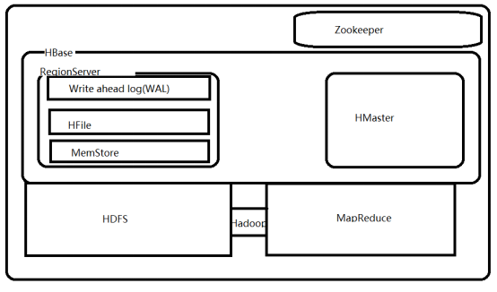

# HBase的概述
HBase是建立在hadoop文件系统（HDFS）之上的分布式、面向列的数据库，通过利用hadoop的文件系统提供容错能力


HBase作为Google Bigtable的开源实现，Google Bigtable利用GFS作为其文件存储系统类似，则HBase利用Hadoop HDFS作为其文件存储系统；Google通过运行MapReduce来处理Bigtable中的海量数据，同样，HBase利用Hadoop MapReduce来处理HBase中的海量数据；Google Bigtable利用Chubby作为协同服务，HBase利用Zookeeper作为对应。

## Hbase处理数据
虽然Hadoop是一个高容错、高延时的分布式文件系统和高并发的批处理系统，但是他并不适用于提供实时计算，hbase是一个可以通过实时计算的分布式数据库，数据被保存在HDFS分布式文件系统上，由HDFS保证其高容错性，但是在生产环境中，hbase是如何基于Hadoop提供实时性的呢？

Hbase上的数据是以StoreFile(HFile)二进制流的形式存储在HDFS的block块中，但是HDFS并不知道Hbase用于存储什么，它只是把存储文件认为是二进制文件，也就是说。Hbase的存储数据对于HDFS文件系统是透明的

## hbase和HDFS的区别

[table id=10 /]

## hbase的存储机制

hbase是面向列族的数据库，适用于海量数据的随机读写

hbase 中的一些术语：

1. table：表，是row的集合

2. row：行，是列族的集合

3. column family：列族，是列的集合

4. column：列，是key-value对的集合

### 面向行和面向列的区别
[table id=11 /]

### hbase和RDBMS的区别
[table id=12 /]

### Hbase的特征

1. 线性可扩展
HBase支持横向扩展，这就意味着如果现有服务器硬件性能出现瓶颈，不需要停掉现有集群提升硬件配置，而只需要在现有的正在运行的集群中添加新的机器节点即可，而且新的RegionServer一旦建立完毕，集群会开始重新调整

2. 自动故障处理和负载均衡
HBase运行在HDFS上，所以HBase中的数据以多副本形式存放，数据也服从分布式存放，数据的恢复也可以得到保障。另外，HMaster和RegionServer也是多副本的。

3. 自动分区
HBase表是由分布在多个RegionServer中的region组成的，这些RegionServer又分布在不同的DataNode上，如果一个region增长到了一个阈值，为了负载均衡和减少IO，HBase可以自动或手动干预的将region切分为更小的region，也称之为subregion。

4. 集成Hadoop/HDFS
虽然HBase也可以运行在其他的分布式文件系统之上，但是与HDFS结合非常之方便，而且HDFS也非常之流行。

5. 实时随机大数据访问
HBase采用log-structured merge-tree作为内部数据存储架构，这种架构会周期性地将小文件合并成大文件以减少磁盘访问同时减少NameNode压力。

6. Java API
HBase提供原声的Java API支持，方便开发。


### hbase的架构



1. master-salve：主从架构

2. table从垂直方向进行切割，分割若干个区域(region)，通过列族分配到存储上去（HDFS），由regionserver进行处理
当一个表的大小增长到一个阈值的时候，hbase会自动的或者手动的将表进行切割成不通的区域，分配到不同的regionserver上，每个区域对应HDFS上的一个文件，从HDFS上来看，一个表会对应HDFS上的若干个文件

自动切割有可能会造成切割风暴：当多个表同时到达阈值的时候，这些表需要同时进行切割，会同时产生太多个区域，这样就会造成同一时间的网络性能会出现问题，要在优化中将切割的阈值设置到不可能达到的大小，过一段时间手动的进行切割

#### hbase的重要组件

1. master server
负责指定region给regionserver，通过zookeeper获得任务帮助
处理跨regionserver的region的负载均衡问题
从繁忙服务器到空闲服务器之间的数据转载问题
通过裁定负载均衡判断集群的状态

2. region
被切割的表,可以跨regionserver

3. region server
包含region的集合以及存储(内存存储和HDFS文件存储)
负载和客户端通信,并且处理相关的数据操作
处理在regionserver上的所有region的读写请求
通过阈值确定region的大小

4. client lib


## 本地模式安装Hbase

1. 下载hbase的软件包
下载地址:https://archive.apache.org/dist/hbase/
清华下载地址:https://mirrors.tuna.tsinghua.edu.cn/apache/hbase/

2. 解压压缩包
```bash
root@ubuntu:~# tar -xvf hbase-1.3.5-bin.tar.gz
root@ubuntu:~# ln -sv hbase-1.3.5 hbase
```

3. 配置环境变量
```bash
root@hbase-master:~# vim /etc/profile
export HISTTIMEFORMAT="%F %T `whoami` "
export export LANG="en_US.utf-8"
export JAVA_HOME=/usr/local/src/jdk
export CLASSPATH=.:$JAVA_HOME/jre/lib/rt.jar:$JAVA_HOME/lib/dt.jar:$JAVA_HOME/lib/tools.jarexport HBASE_HOME=/root/hbase 
export PATH=$PATH:$JAVA_HOME/bin:$HBASE_HOME/bin

root@hbase-master:~# source /etc/profile
```

4. 修改配置文件,配置hbase的本地模式
```bash
root@hbase-master:~# vim /root/hbase/conf/hbase-site.xml
# 添加rootdir属性,hbase既可以基于HDFS,也可以基于任何分布式文件系统,具体取决于rootdir定义的文件系统
# 天机zookeeper信息,暂时使用hbase内置的zookeeper
<configuration>
        <property>
                <name>hbase.rootdir</name>
                <value>file:///root/hbase_data</value>
        </property>
        <property>
                <name>hbase.zookeeper.property.dataDir</name>
                <value>/root/hbase_zk</value>
        </property>

</configuration>

# 如果使用的是jdk8 ,要在hbase的配置文件hbase-env.sh,中做响应的更改,不然启动的时候会会有相关的警告信息

root@hbase-master:~# vim hbase/conf/hbase-env.sh 
# Configure PermSize. Only needed in JDK7. You can safely remove it for JDK8+
# 注释一下两行
export HBASE_MASTER_OPTS="$HBASE_MASTER_OPTS -XX:PermSize=128m -XX:MaxPermSize=128m -XX:ReservedCodeCacheSize=256m"
export HBASE_REGIONSERVER_OPTS="$HBASE_REGIONSERVER_OPTS -XX:PermSize=128m -XX:MaxPermSize=128m -XX:ReservedCodeCacheSize=256m"
```

5. 创建对应的rootdir和zookeeper的目录
```bash
root@hbase-master:~# mkdir hbase_data
root@hbase-master:~# mkdir hbase_zk
```

6. 启动服务
```bash
root@hbase-master:~# start-hbase.sh
starting master, logging to /root/hbase/logs/hbase-root-master-hbase-master.out

root@hbase-master:~# jps
2120 HMaster  (Hbase进程)
2351 Jps
```