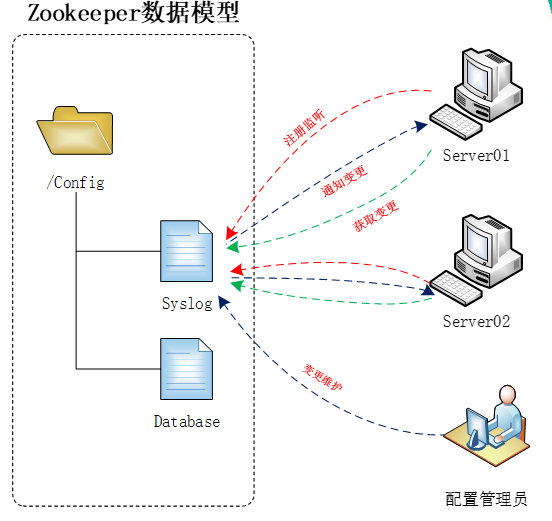
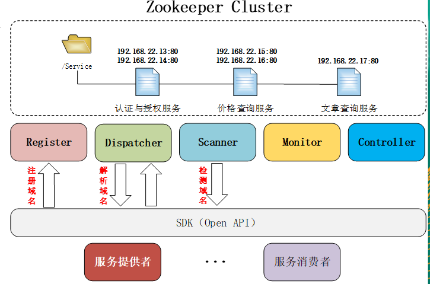
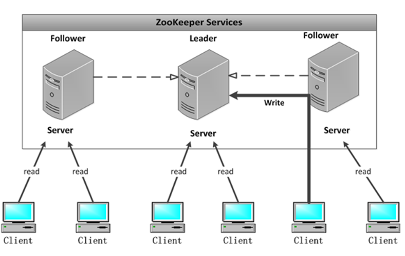

# 分布式系统
分布式系统是一个硬件活软件分布在网络中的不同的计算机上,彼此间仅通过消息传递进行通信和协作的系统

分布式系统具有以下特点:分布性、对等性、并发性、缺乏全局时钟、故障必然会发生

典型问题：通信异常、网络分区、三态（成功、失败、超时）、节点故障


保证分布式系统的一致性多挣协议：

1. 2PC（2段是提交，请求和执行）

2. 3PC（3段是提交，请求-预提交-执行）

3. Paxos

4. Google chubby：分布式锁服务，GFS/BigTable都用到了chubby
分布式协作、元数据存储、master选举等


# zookeeper的简介
zookeeper是一个开源的分布式的，为分布式应用提供协调服务的Apache项目，是Google的chubby开源实现的，简称zk，是一个典型的分布式数据一致性的解决方案，分布式应用程序开源基于它实现数据的发布、订阅、负载均衡、名称服务、分布式协调/通知、集群管理、master选举、分布式锁和分布式队列

zookeeper从设计摸角度来理解，是一个基于观察者模式设计的分布式服务管理框架，它负责存储和管理大家都关心的数据，然后接受观察者的注册，一旦这些数据的状态发生变化，zookeeper就将负责通知已经在zookeeper上注册的那些观察者做出响应和的反应，从而实现集群中类似Master/Slave管理模式

zookeeper=文件系统+通知机制，存放小的核心关键的配置管理型文件，大小不超过1M

## zookeeper的基本概念

1. 集群角色：leader（选举产生，提供读写服务）、follower、Observer（follower和Observer都只提供读服务，在选举的时候参与投票选举leader，但是Observer不能成为被选举者）

2. 会话：zk中，为了保证分布式系统之间彼此能够协调，每个节点都会与zk 服务器建立持久会话连接，每个节点会通过这个会话更新自己在zk集群中自己状态的信息，其它节点正是通过这个状态信息来判断节点是否存活，这个连接会一直存在，只有当客户端不在参与分布式系统，或者客户端宕机才会关闭（客户端与服务端之间的TCP长连接，也可以设置sessionTimeout来设置会话的超时时长）

3. 数据节点（zNode）：zk中是类似unix的倒置的树状结构，每个数据节点指的是这个倒置的树状结构上的每个分支节点，即zk数据模型中的数据单元，zk中的数据都存储在内存中，每个znode都会保存在即的数据于内存中
	持久节点：一直存在，仅显式删除才消失
	临时节点：会话终止即自动消失

4. 版本（vsersion）：数据的版本，zk会为每个znode维护一个称之为stat的数据结构，记录了当前znode的三个数据版本
	version：当前版本
	cversion：当前znode子节点的版本
	aversion：当前znode的ACL版本

5. ACL：zk使用ACL机制进行权限控制
	create、read、write、delete、admin

6. 事件监听器（Watcher）：zk上由用户指定的触发机制，在某些事件产生是，zk能够将通知给相关的客户端

7. ZAB协议zookeeper atomic broadcast（zookeeper原子广播协议）
用于支持崩溃恢复机制，保证在leader进程崩溃是能够重新选举出新的leader，并且保证数据的完整性和一致性，Zk中的ZAB存在三种状态：
	looking：刚启动或者leader崩溃以后，正处于选举过程的装填
	following：已经存在了leader
	leading

## zk集群工作过程中的四个阶段

1. 选举：election

2. 发现：discovery

3. 同步：sync

4. 广播：broadcast


# zookeeper的应用场景

分布式消息同步和协调、服务器节点动态上下线、统一配置管理、负载均衡、集群管理等

典型应用场景：
1. 数据的发布和订阅

集中配置中心（推+拉）
zookeeper保存配置信息，应用启动时主动到zookeeper上获取配置信息，并注册watcher监听
配置管理员变更zookeeper配置节点的内容
zookeeper推送变更到应用，触发watcher回调函数
应用根据逻辑，主动获取新的配置信息，更改自身的逻辑

2. 软负责均衡


register负责域名注册，服务启动后将域名信息通过register注册到zookeeper对应的域名服务器下
dispatcher负责域名的解析，可以实现软负载均衡

scanner通过定时监测服务状态，动态更新节点地址信息

montor负责收集服务器信息与状态监控

controller提供后台console，提供配置管理功能

3. 集群管理


集群每个节点的工作状态、对集群中设备的动态上下线、分布式任务的状态汇报

# zookeeper的安装与配置
官网地址：http://zookeeper.apache.org/
https://apache.org/dist/zookeeper/

## 本地模式的安装部署

1. 安装jdk

将jdk的程序包解压到制定的目录
```bash
tar xvf jdk-8u212-linux-x64.tar.gz -C /usr/local/src/
ln -sv /usr/local/src/jdk1.8.0_212 /usr/local/src/jdk
```
设置环境变量
```bash
vim /etc/profile
export HISTTIMEFORMAT="%F %T `whoami` "
export export LANG="en_US.utf-8"
export JAVA_HOME=/usr/local/src/jdk
export CLASSPATH=.:$JAVA_HOME/jre/lib/rt.jar:$JAVA_HOME/lib/dt.jar:$JAVA_HOME/lib/tools.jar
export PATH=$PATH:$JAVA_HOME/bin
```
2. 安装zookeeper

解压zookeeper程序包到制定位置
```bash
tar -xvf zookeeper-3.4.14.tar.gz -C /usr/local/src/
ln -sv /usr/local/src/zookeeper-3.4.14 /usr/local/src/zookeeper
useradd -u 2002 zookpper -s /sbin/nologin
chown zookpper:zookpper /usr/local/src/zookeeper -R
```
配置zookeeper，修改zookeeper的数据目录
```bash
 cp /usr/local/src/zookeeper/conf/zoo_sample.cfg /usr/local/src/zookeeper/conf/zoo.cfg
vim /usr/local/src/zookeeper/conf/zoo.cfg
# The number of milliseconds of each tick
tickTime=2000
# The number of ticks that the initial 
# synchronization phase can take
initLimit=10
# The number of ticks that can pass between 
# sending a request and getting an acknowledgement
syncLimit=5
# the directory where the snapshot is stored.
# do not use /tmp for storage, /tmp here is just 
# example sakes.
dataDir=/usr/local/src/zookeeper/data/zookeeper_data
# the port at which the clients will connect
clientPort=2181
# 创建数据目录
mkdir -pv /usr/local/src/zookeeper/data/zookeeper_data
```

3. 启动zookeeper
```bash
ll /usr/local/src/zookeeper/bin/
total 44
-rwxr-xr-x 1 zookpper zookpper  232 Mar  7 00:50 README.txt
-rwxr-xr-x 1 zookpper zookpper 1937 Mar  7 00:50 zkCleanup.sh
-rwxr-xr-x 1 zookpper zookpper 1056 Mar  7 00:50 zkCli.cmd
-rwxr-xr-x 1 zookpper zookpper 1534 Mar  7 00:50 zkCli.sh   #客户端脚本文件
-rwxr-xr-x 1 zookpper zookpper 1759 Mar  7 00:50 zkEnv.cmd  # 客户端命令行工具
-rwxr-xr-x 1 zookpper zookpper 2919 Mar  7 00:50 zkEnv.sh
-rwxr-xr-x 1 zookpper zookpper 1089 Mar  7 00:50 zkServer.cmd  # 服务端命令行工具
-rwxr-xr-x 1 zookpper zookpper 6773 Mar  7 00:50 zkServer.sh  # 服务端脚本文件
-rwxr-xr-x 1 zookpper zookpper  996 Mar  7 00:50 zkTxnLogToolkit.cmd
-rwxr-xr-x 1 zookpper zookpper 1385 Mar  7 00:50 zkTxnLogToolkit.sh

# 启动
/usr/local/src/zookeeper/bin/zkServer.sh start
ZooKeeper JMX enabled by default
Using config: /usr/local/src/zookeeper/bin/../conf/zoo.cfg
Starting zookeeper ... STARTED

# 查看正在运行的虚拟机进程
[ root@openstack-master1 ~]# jps
6661 QuorumPeerMain   # 这个进程是zookeeper的进程
6683 Jps
# 查看zookeeper的状态
/usr/local/src/zookeeper/bin/zkServer.sh status
ZooKeeper JMX enabled by default
Using config: /usr/local/src/zookeeper/bin/../conf/zoo.cfg  # 读取的配置文件
Mode: standalone    # 本地模式启动
```

## zookeeper配置文件的参数说明

配置文件：/usr/local/src/zookeeper/conf/zoo.cfg

1. tickTime=2000

通信心跳数：客户端和服务端通信之间的心跳检测时长，默认单位是毫秒，2s
在规定时间内检测失败，服务端认为客户端下线

2. initLimit=10
follower连入leader并完成数据同步的时长
集群中的follower服务器(F)与leader服务器(L)之间 初始通信时限
此配置表示，允许 follower （相对于 leader 而言的“客户端”）连接 并同步到  leader 的初始化连接时间，它以 tickTime 的倍数来表示。当超过设置倍数的 tickTime 时间，则连接失败。
Follower在启动过程中，会从Leader同步所有最新数据，然后确定自己能够对外服务的起始状态。

3. syncLimit=5

集群中Leader与Follower之间的最大响应时间单位，假如响应超过syncLimit * tickTime，Leader认为Follwer死掉，从服务器列表中删除Follwer。

在运行过程中，Leader负责与ZK集群中所有机器进行通信，例如通过一些心跳检测机制，来检测机器的存活状态。

如果L发出心跳包在syncLimit之后，还没有从F那收到响应，那么就认为这个F已经不在线了。


4. dataDir=/usr/local/src/zookeeper/data/zookeeper_data

数据文件目录+数据持久化路径
保存内存数据库快照信息的位置，如果没有其他说明，更新的事务日志也保存到数据库。

5. dataLogDir=/usr/local/src/zookeeper/log

事务日志的保存目录，aof格式的

6. clientPort=2181
监听客户端连接的端口

7. maxClientCnxns=60
每客户端ip的最大并发连接数

8. preAllocSize
为事务日志预先分配的磁盘空间量，默认是65535KB（63M）

9. snapCount
每多少次事务后进行执行一次快照操作，每次事务的平均大小在100字节左右

10. autopurget.snapRetainCount
自动清理快照及日志文件时，需要保留的快照文件数及各个快照文件对应的事务日志文件个数

11. autopurget.purgeInterval
purge操作的时间间隔，0表示不启用


12. fsync.warningthresholdms
zk进行事务日志fsync操作时小号的时长报警阈值

13. weight.X=N
判定quorum时的投票权重，默认为1

14. clientPortAddress
zk监听的ip地址，默认是本机的所有地址

15. minSessionTimeout
会话的最短超时时长

16. maxSessionTimeout
会话最大超时时长

17. leaderServers
默认leader接收读写请求操作，额外还要负责协调各follower发来的事务，因此，为使得leader集中处理zk集群信息，建议leader不直接提供服务

18. cnxTimeout
leader选举期间，各个服务器创建tcp连接的超时时长

19. electionAlg
选举算法，目前仅支持FastLeaderElection一种算法

20. server.id=ip:port1:port2[:observer]
配置集群的各个服务器的属性信息
id：各个服务器的id值，在dataDir目录下的myid文件中定义
port1：follower与leader进行通信和数据同步是使用的端口
port2：leader选举时使用的端口
observer：定义指定的服务器为观察员