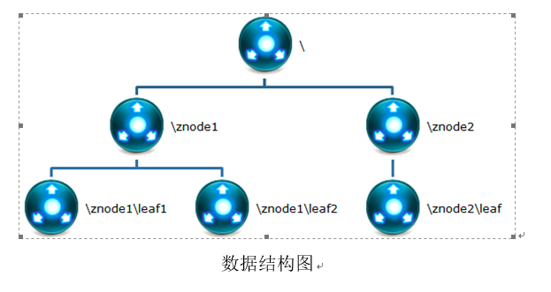
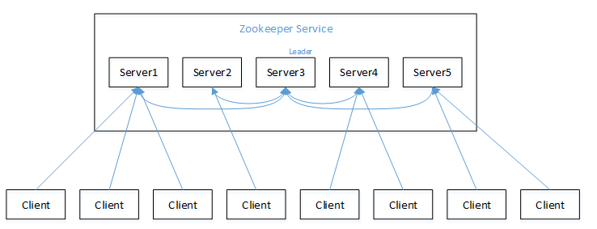
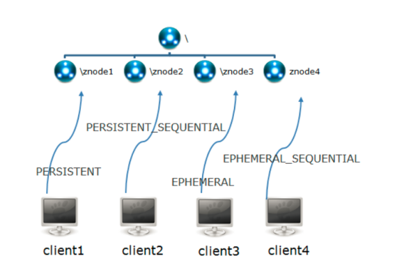

# zookeeper的数据结构
ZooKeeper数据模型的结构与Unix文件系统很类似，整体上可以看作是一棵树，每个节点称做一个ZNode。

很显然zookeeper集群自身维护了一套数据结构。这个存储结构是一个树形结构，其上的每一个节点，我们称之为"znode"，每一个znode默认能够存储1MB的数据，每个ZNode都可以通过其路径唯一标识

因为能存储的数据量不是很大,那么应该存储的是分布式的,协调的配置信息

# zookeeper的特点

1. zookeeper:一个领导者(leader),多个跟随者(follower)组成的集群

2. leader负责进行投票的发起和决议,更新系统状态

3. follower用于接收客户请求并向客户端返回结果,早选举leader过程中参与投票

4. 集群中只要值半数以上的节点存活,zookeeper集群就能正常工作

5. 全局数据一致:每个server一份相同的数据副本,client无论连接到哪个server数据都是一致的

6. 更新请求顺序进行,来自同一个client的更新请求,按照其发送顺序依次执行

7. 数据更新原子性,一次数据更新只能有成功和失败两种状态

8. 实时性,在一定的时间范围内,client能读取到最新的数据

## zookeeper的选举机制

1. 半数机制:集群中半数**以上**的机器存活,集群可用,所以zookeeper更适合装在奇数台机器上

2. zookeeper虽然在配置文件中没有指定master和slave,但是,zookeeper工作时,是有一个节点为leader,其它节点为follower,leader通过内部的选举机制临时产生的

### 选举的过程

1. server1 启动,此时只有它一台服务器启动了,它发送出去的包没有任何响应,所以它的选举状态一直都是looking

2. server2 启动,它与最开始启动的的server1进行通信,互相交换自己的选举结果,由于两者都没有历史数据,所以id值较大的server2胜出,但是由于没有达到半数以上的服务器的支持,所以server1和server2还都保持looking的状态

3. server3启动,根据前面的分析,server3的id值大,并且有三台服务器选择server3,那么server3 选举leader成功

4. 当server4和server5 启动后,虽然说id的值比较大,但是前面的server3已经有了超过半数的节点的选举,那么server3 依旧为leader

## 节点类型

### ZNODE的类型

1. 短暂(ephemeral):客户端和服务器端断开连接后,创建的节点自己删除

2. 持久(persistent):客户端和服务器端断开连接后,创建的节点不能删除

## Znode的四种目录节点

1. 持久化目录节点(persistent, 默认)

客户端与zookeeper断开连接后,该节点依旧存在

2. 持久化编号目录节点(persistent_sequential)

客户端与zookeeper断开连接后,该节点依旧存在,只是zookeeper给该节点名称进行顺序编号

3. 临时目录节点(ephemeral)

客户端与zookeeper断开连接后,该节点被删除

4. 临时顺序编号节点目录(ephemeral_sequential)

客户端已zookeeper断开连接后,该节点被删除,只是zookeeper给该节点名称进行顺序编号

创建znode的时候,设置顺序标识,znode名称后会附加一个值,顺序号是一个单调递增的计数器,由父节点维护

在分布式系统中,顺序号可以被用于所有的事件进行全局排序,这样客户端可以通过顺序号推断事件的顺序