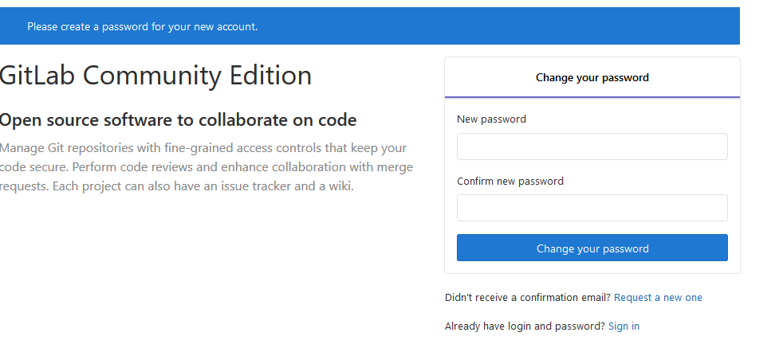

# Devops
DevOps是Development和Operations的组合，也就是开发和运维的简写

DevOps 是针对企业中的研发人员、运维人员和测试人员的工作理念，是他们在应用开发、代码部署和质量测试等整条生命周期中协作和沟通的最佳实践，DevOps 强调整个组织的合作以及交付和基础设施变更的自动化、从而实现持续集成、持续部署和持续交付。

DevOps 四大平台：代码托管(gitlab/svn)、项目管理(jira)、运维平台(腾讯蓝鲸/开源平台)、持续交付(Jenkins/gitlab)


## 相关技术概述

1. 持续集成
持续集成是指多名开发者在开发不同功能代码的过程当中，可以频繁的将代码行合并到一起并相互不影响工作

2. 持续部署
是基于某种工具或平台实现代码自动化的构建、测试和部署到线上环境以实现交付高质量的产品,持续部署在某种程度上代表了一个开发团队的更新迭代速率。

3. 持续交付
持续交付是在持续部署的基础之上，将产品交付到线上环境，因此持续交付是产品价值的一种交付，是产品价值的一种盈利的实现。

## 常见的持续集成开源工具

1. CSV
早起的集中式版本控制系统，现在基本已经淘汰，会出现数据提交后不完整的情况

2. SVN
2000 年开始开发，目标就是替代 CVS 集中式管理，依赖于网络，一台服务器集中管理目前依然有部分公司在使用

任何的提交和回滚都依赖于连接服务器 SVN 服务器是单点


3. gitlab
分布式版本控制系统，Git 在每个用户都有一个完整的服务器，然后在有一个中央服务器，用户可以先将代码提交到本地，没有网络也可以先提交到本地，然后在有网络的时候再提交到中央服务器，这样就大大方便了开发者，而相比 CVS 和 SVN 都是集中式的版本控制系统，工作的时候需要先从中央服务器获 取最新的代码，改完之后需要提交，如果是一个比较大的文件则需要足够快的网络才能快速提交完成，而使用分布式的版本控制系统，每个用户都是一个完整的版本库，即使没有中央服务器也可以提交代码或者回滚，最终再把改好的代码提交至中央服务器进行合并即可。


# GitLab的部署与使用
https://about.gitlab.com/install/ # Gitlab 服务的安装文档
https://docs.gitlab.com/ee/install/requirements.html #环境要求

## 配置Ubuntu系统环境准备

1. 在ubuntu下载并使用gitlab

安装包下载地址：https://packages.gitlab.com/gitlab/gitlab-ce
rpm 包国内下载地址：https://mirrors.tuna.tsinghua.edu.cn/gitlab-ce/yum/

```bash
# 下载gitlab-ce的deb文件
wget --content-disposition https://packages.gitlab.com/gitlab/gitlab-ce/packages/ubuntu/bionic/gitlab-ce_11.11.5-ce.0_amd64.deb/download.deb
# 安装
dpkg -i gitlab-ce_11.11.5-ce.0_amd64.deb
# 默认安装到/opt/gitlab
# 配置文件/etc/gitlab/gitlab.rb
```


安装后会生成的目录：
/etc/gitlab #配置文件目录
/run/gitlab #运行 pid 目录
/opt/gitlab #安装目录
/var/opt/gitlab #数据目录
/var/log/gitlab #日志目录

## gitlab的配置和使用
```bash
vim /etc/gitlab/gitlab.rb
# 通过哪个地址访问gitlab服务器，可以是域名
external_url 'http://192.168.2.1'
# 可选邮件通知设置
gitlab_rails['smtp_enable'] = true
gitlab_rails['smtp_address'] = "smtp.qq.com"
gitlab_rails['smtp_port'] = 465
gitlab_rails['smtp_user_name'] = "2973707860@qq.com"
gitlab_rails['smtp_password'] = "授权码"
gitlab_rails['smtp_domain'] = "qq.com"
gitlab_rails['smtp_authentication'] = :login
gitlab_rails['smtp_enable_starttls_auto'] = true
gitlab_rails['smtp_tls'] = true
gitlab_rails['gitlab_email_from'] = "2973707860@qq.com"
user["git_user_email"] = "2973707860@qq.com"
```

初始化服务
```bash
# gitlab-ctl reconfigure #修改完配置文件要执行此操作,初始化后会自动启动服务
gitlab-ctl reconfigure
# 监听了80端口,80 端口是在初始化 gitlib 的时候启动的，因此如果之前的有程序占用会导致初始
```
## 登录到web界面进行配置

1. 设置新的密码

2. 登录，默认用户名为root，密码为刚才设置的

关闭账号注册

3. 创建group(项目)
使用管理员 root 创建组，一个组里面可以有多个项目分支，可以将开发添加到组里面进行设置权限，不同的组就是公司不同的开发项目或者服务模块，不同的组添加不同的开发即可实现对开发设置权限的管理。

4. 新建账号

创建账号之后，到用户的编辑中给用户设置密码

测试通过邮箱重设密码成功

5. 将组授权给user1用户

登录user1查看


6. 创建项目web1，并在web1下新建一个index.html测试使用


7. 基于https的方式克隆项目测试
```bash
# 因为是私有的，需要输入账号和密码
root@jenkins-master:~# git clone http://192.168.2.1/linux_test/web1.git
Cloning into 'web1'...
Username for 'http://192.168.2.1': user1
Password for 'http://user1@192.168.2.1': 
remote: Enumerating objects: 3, done.
remote: Counting objects: 100% (3/3), done.
remote: Total 3 (delta 0), reused 0 (delta 0)
Unpacking objects: 100% (3/3), done.

root@jenkins-master:~# tree web1
web1
└── index.html

0 directories, 1 file
```

8. 上传本地代码到gitlab
```bash
# 先将变更的文件提交到本地暂存区
git add  index.html
# 设置全局的用户名和邮箱
git config --global user.name "user1"
git config --global user.email 2286416563@qq.com
# 添加描述信息
git commit -m "add v2"
# 上传到gitlab
git push
Username for 'http://192.168.2.1': user1
Password for 'http://user1@192.168.2.1': 
Counting objects: 3, done.
Writing objects: 100% (3/3), 247 bytes | 247.00 KiB/s, done.
Total 3 (delta 0), reused 0 (delta 0)
To http://192.168.2.1/linux_test/web1.git
   5eb4736..7618b9a  master -> master
```
web端验证


## gitlib常用命令

> 在更改gitlab的配置后，要使用gitlab-ctl reconfigure 使配置生效

1. gitlab-ctl：gitlab命令行客户端
```bash
gitlab-ctl #客户端命令行操作行
gitlab-ctl stop #停止 gitlab
gitlab-ctl start #启动 gitlab
gitlab-ctl restar #重启 gitlab
gitlab-ctl status #查看组件运行状态
gitlab-ctl tail nginx #查看某个组件的日志
```
2. gitlab-psql：用来操作或链接到gitlab数据库中进行操作
```bash
gitlab-psql 
psql (9.6.11)
Type "help" for help.

gitlabhq_production=# \db
         List of tablespaces
    Name    |    Owner    | Location 
------------+-------------+----------
 pg_default | gitlab-psql | 
 pg_global  | gitlab-psql | 
(2 rows)

gitlabhq_production=# \q
```
3. gitlab-rails：用于启动控制台进行特殊操作，比如修改管理员密码、打开数据库控制台( gitlab-rails dbconsole)等

4. gitlab-rake：数据备份恢复等数据操作

## git常用命令的使用
```bash
git config --global user.name "name" # 设置全局用户名
git config --global user.email xxx@xxx.com # 设置全局邮箱
# 会在当前用户的家目录下生成文件存放这些全局内容
	cat .gitconfig 
	[user]
		name = user1
		email = 2286416563@qq.com

git config --global --list #列出用户全局设置
git add index.html  #添加指定的文件、目录或当前目录下的所有数据到暂存区
git commit -m "test" # 添加描述信息,并提交文件到工作区
git status #查看工作区的状态
git push #提交代码到服务器
git pull #获取代码到本地
git log #查看操作日志
vim .gitignore #定义忽略文件
git reset --hard HEAD^^ #git 版本回滚， HEAD 为当前版本，加一个^为上一个，^^为上上一个版本
git reflog # #获取每次提交的 ID，可以使用--hard 根据提交的 ID 进行版本回退
git reset --hard 5ae4b06 #回退到指定 id 的版本  可在克隆下来的项目目录下使用get log 查看id
# git branch #查看当前所处的分支，默认是master
#生产中研发一般都是将代码部署到开发的分支，只有当代码测试没有问题了，才会有指定权限的人将代码合并到master分支
#git checkout -b develop #创建并切换到一个新分支
#git checkout develop #切换分支
```

## gitlab数据的备份和恢复

数据备份
```bash
# 停止gitlab数据服务
gitlab-ctl stop unicorn
gitlab-ctl stop sidekiq
# 手动备份数据，该命令可在任意目录执行，成功后会生成/var/opt/gitlab/backup/unix时间戳_年月日_gitlab的版本号_gitlab_backup.tar
gitlab-rake gitlab:backup:create
# 启动服务
gitlab-ctl start
```
数据恢复
```bash
# 先停止数据服务
gitlab-ctl stop unicorn
gitlab-ctl stop sidekiq
# 数据还原
gitlab-rake gitlab:backup:restore BACKUP=备份文件名
# 备份文件名不是文件全面，而是unix时间戳_年月日_gitlab的版本号
```
## 导入ssh key
将用于git 克隆项目到本地的时候，基于ssh免秘钥下载
```bash
# 生成密钥对
ssh-keygen
# 查看公钥文件
cat .ssh/id_rsa.pub 
ssh-rsa AAAAB3NzaC1yc2EAAAADAQABAAABAQDWExJDpVp22gVCdHAwDZI1q7dLnvL0SxI4iOUin9d+jEBY0BD8yfGRI3/EGn8bTTax5dHG7ik3FYYRuae4Od1+3RwWCzAu5ZnXFgbFCKqgJk6BYeAWQhwkcV71BZawfQCU77h4R4zyofgFCFK8I6bojuPGB/MenDfG3OnUFK6YlaS+Ppvs/GSLBDJNxu5w359Xngw9E8gygIC/G0EAq5I7f9ZpRiEtBSfYOAwKW9IF8BvIk6z5vt3ngoHTaWNT9u9HWLcjAdWfuL2m3+mb1cHBtUWxVg0bVfn2S1wpwRpsp+sRO9vRjiDqsTbtDF9wj8jFQHw3a/h1RU4iAh2AYWtV root@jenkins-master
```
将公钥导入到用户设置的ssh-key中

放到哪个用户，这个key的主机就能克隆账号有权限的项目


基于ssh-key克隆测试
```bash
git clone git@192.168.2.1:linux_test/web1.git
Cloning into 'web1'...
remote: Enumerating objects: 9, done.
remote: Counting objects: 100% (9/9), done.
remote: Compressing objects: 100% (3/3), done.
Receiving objects: 100% (9/9), 661 bytes | 165.00 KiB/s, done.
remote: Total 9 (delta 0), reused 0 (delta 0)
```
> 仅用于克隆代码，提交不可用


# 汉化gitlab
https://gitlab.com/xhang/gitlab/-/archive/v11.11.5-zh/gitlab-v11.11.5-zh.tar

1. 下载汉化包
```bash
wget https://gitlab.com/xhang/gitlab/-/archive/v11.11.5-zh/gitlab-v11.11.5-zh.tar
```
2. 停止服务并替换对应的文件
```bash
gitlab-ctl stop
tar xf gitlab-v11.11.5-zh.tar
#备份源文件
cp -rp /opt/gitlab/embedded/service/gitlab-rails /opt/gitlab-rails.bak
# 替换文件
cp -rf gitlab-v11.11.5-zh/* /opt/gitlab/embedded/service/gitlab-rails/
# 初始化并启动程序
gitlab-ctl reconfigure
gitlab-ctl start
```

3. web界面更改语言
右上角的账户下拉框选 Settings 然后左侧 Preferences 设置项，然后语言选择中文