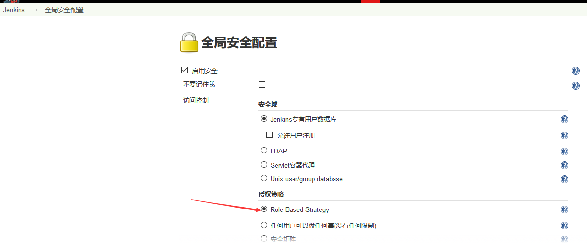

# 要实现的 jenkins+gitlab 的实现
gitlab:192.168.2.1
jenkins-master:192.168.2.2
jenkins-slave:192.168.2.3
lb1:192.168.2.4
lb2:192.168.2.5
tomcat1:192.168.2.6
tomcat1:192.168.2.7

## 准备tomcat的web环境

1. 先在两台web服务器配置jdk环境
```bash
useradd www -u 2019 -m -s /bin/bash
tar xf jdk-8u212-linux-x64.tar.gz
mv jdk1.8.0_212 /usr/local/jdk

# 配置jdk的环境变量
vim /etc/profile
export HISTTIMEFORMAT="%F %T `whoami` "
export export LANG="en_US.utf-8"
export JAVA_HOME=/usr/local/jdk
export CLASSPATH=.:$JAVA_HOME/jre/lib/rt.jar:$JAVA_HOME/lib/dt.jar:$JAVA_HOME/lib/tools.jar
export PATH=$PATH:$JAVA_HOME/bin

 source /etc/profile && java -version
 ln -sv /usr/local/jdk/bin/java /usr/bin/
```

2. 准备tomcat
```bash
tar xf apache-tomcat-8.5.42.tar.gz
mv apache-tomcat-8.5.42 /apps/
ln -sv /apps/apache-tomcat-8.5.42 /apps/tomcat
chown -R www:www /apps/apache-tomcat-8.5.42
# 准备tomcat目录，app_dir用来存放jenkins在gitlab下载的代码压缩包，web_dir用来存放主站点
mkdir /data/{app_dir,web_dir} -pv
chown -R www:www /data
# 创建应用
mkdir /data/web_dir/myapp
echo tomcat1 > /data/web_dir/myapp/index.html
# 更改tomcat配置文件，将数据目录指向创建创建的数据目录
vim /apps/tomcat/conf/server.xml
 <Host name="localhost"  appBase="/data/web_app"
            unpackWARs="true" autoDeploy="true">
```

3. 配置脚本，让www用户启动tomcat
```bash
vim /etc/init.d/tomcat 
#!/bin/bash

JDK_HOME=/usr/local/jdk
CATALINA_HMOE=/apps/tomcat
export JDK_HOME CATALINA_HMOE
source /etc/profile

start() {
	echo "正在判断服务状态，请稍等！"
	echo "请等待3秒钟"
	echo "3";sleep 1;echo "2";sleep 1;echo "1";sleep 1
	if netstat -an | grep 8080 | grep LISTEN >/dev/null
	then
		echo "tomcat服务已经运行了！"
	else
		echo "Tomcat没有运行，正在启动"
		sleep 1
		$CATALINA_HMOE/bin/catalina.sh start
		echo "tomcat 已经启动，正在验证"
		echo "请稍等3秒钟";sleep 3
		if netstat -an| grep 8080|grep LISTEN >/dev/null
		then
			PID=`ps -ef|grep tomcat|grep jdk|awk '{print $2}'`
			NUM=`ps -ef|grep tomcat|grep jdk|awk '{print $2}'|wc -l`
			echo "Tomcat已经成功启动${NUM}个Tomcat进程！，PID为${PID}"
		else
			echo "Tomcat启动失败，请重新启动"
			echo 1
		fi
	fi
}
stop() {
	PID=`ps -ef|grep tomcat|grep jdk|awk '{print $2}'`
	NUM=`ps -ef|grep tomcat|grep jdk|awk '{print $2}'|wc -l`
	echo "正在判断服务状态，请稍等！"
	echo "请等待3秒钟";sleep 3
	if netstat -an| grep 8080|grep LISTEN >/dev/null
	then
		echo "Tomcat正在运行中，正在关闭"
		$CATALINA_HMOE/bin/catalina.sh stop;echo "已经执行了关闭命令，正在检查关闭了多少Tomcat程序，请稍等"
		sleep 5
		pkill java && pkill tomcat
		if netstat -an| grep 8080|grep LISTEN >/dev/null;then
			PID=`ps -ef|grep tomcat|grep jdk|awk '{print $2}'`
			NUM=`ps -ef|grep tomcat|grep jdk|awk '{print $2}'|wc -l`
			kill -9 $PID ;echo "已经成功关闭${NUM}个tomcat进程"
		else
			echo "Tomcat已经成功关闭"
		fi
	else
		echo "tomcat 没有运行"
	fi	
	if netstat -an| grep 8080|grep LISTEN >/dev/null;then
		PID=`ps -ef|grep tomcat|grep jdk|awk '{print $2}'`
		echo "关闭失败，即将强制删除tomcat进程"
		pkill tomcat;sleep 2
		if netstat -an| grep 8080|grep LISTEN >/dev/null;then
			echo "关闭失败，即将强制删除tomcat进程"
			pkill java;sleep2
		fi
	fi
}

restart() {
	stop
	start
}

case "$1" in
	start)
		start
		;;
	stop)
		stop
		;;
	restart)
		restart
		;;
	*)
		echo $"Usage: $0 {start|stop|restart|status}"
esac

chmod +x /etc/init.d/tomcat
# 执行脚本测试
```
# 部署haproxy+keepalived
1. 安装部署keepalived
```bash
apt install keepalived
vim /etc/keepalived/keepalived.conf 

! Configuration File for keepalived

global_defs {
   notification_email {
     acassen
   }
   notification_email_from Alexandre.Cassen@firewall.loc
   smtp_server 192.168.200.1
   smtp_connect_timeout 30
   router_id LVS_DEVEL
}

vrrp_instance VI_1 {
    state MASTER
    interface eth0
    garp_master_delay 10
    smtp_alert
    virtual_router_id 51
    priority 100
    advert_int 1
    authentication {
        auth_type PASS
        auth_pass 1111
    }
    virtual_ipaddress {
        192.168.2.248 dev eth0 label eth0:0
    }
}

systemctl enable keepalived.service
systemctl start keepalived.service
```

2. 安装部署haproxy
```bash
vim /etc/haproxy/haproxy.cfg
listen web_app
        bind 192.168.2.248:8080
        mode http
        server 192.168.2.6 192.168.2.6:8080 check inter 3000 fall 2 rise 5
        server 192.168.2.7 192.168.2.7:8080 check inter 3000 fall 2 rise 5

vim /etc/sysctl.conf 
net.ipv4.ip_nonlocal_bind = 1

sysctl -p

systemctl start haproxy
systemctl enable haproxy
# 测试能够通过地址访问：http://192.168.2.248:8080/myapp/
```

# jenkins的部署与基础配置
jenkins完全依赖java8或者java11的环境
jenkins使用8080端口，如果端口被占用，进程将不能启动

1. java环境配置
```bash
tar xf jdk-8u212-linux-x64.tar.gz
mv jdk1.8.0_212  /usr/local/jdk
ln -sv /usr/local/jdk/bin/java /usr/bin/
vim /etc/profile
export HISTTIMEFORMAT="%F %T `whoami` "
export export LANG="en_US.utf-8"
export JAVA_HOME=/usr/local/jdk
export CLASSPATH=.:$JAVA_HOME/jre/lib/rt.jar:$JAVA_HOME/lib/dt.jar:$JAVA_HOME/lib/tools.jar
export PATH=$PATH:$JAVA_HOME/bin

source /etc/profile
# jenkins 要求必须有/usr/bin/java
ln -sv /usr/local/jdk/bin/java /usr/bin/
```

## 部署jenkins的三种方式

1. 下载war包通过java命令启动
```bash
# 下载
wget http://mirrors.jenkins.io/war-stable/2.164.3/jenkins.war
# 启动
java -jar jenkins.war
# 会在当前的用户的家目录下生成文件.jenkins，用来保存配置
# 可以传递参数
java \
-Dcom.sun.management.jmxremote \
-Dcom.sun.management.jmxremote.port=12345 \
-Dcom.sun.management.jmxremote.authenticate=false \
-Dcom.sun.management.jmxremote.ssl=false \
-Djava.rmi.server.hostname="192.168.8.2 " \
-jar jenkins-2.138.3.war &
```

2. 将下载的war包放到tomcat的目录，启动tomcat

3. 使用deb包或者rpm包安装
```bash
# 下载包并安装
wget https://pkg.jenkins.io/debian-stable/binary/jenkins_2.164.3_all.deb
# 安装
apt install daemon
dpkg -i jenkins_2.164.3_all.deb
# 安装之后能自动启动kenjins，数据全部放在/var/lib/jenkins
```

4. 配置jenkins
```bash
vim /etc/default/jenkins 

NAME=jenkins
JAVA_ARGS="-Djava.awt.headless=true"
# 可选优化参数
JAVA_ARGS="-Djava.awt.headless=true"
JENKINS_JAVA_OPTIONS="-server -Xms1g -Xmx1g -Xss512k -Xmn1g \
-XX:CMSInitiatingOccupancyFraction=65 \
-XX:+UseFastAccessorMethods \
-XX:+AggressiveOpts -XX:+UseBiasedLocking \
-XX:+DisableExplicitGC -XX:MaxTenuringThreshold=10 \
-XX:NewSize=2048M -XX:MaxNewSize=2048M -XX:NewRatio=2 \
-XX:PermSize=128m -XX:MaxPermSize=512m -XX:CMSFullGCsBeforeCompaction=5 \
-XX:+ExplicitGCInvokesConcurrent -XX:+UseConcMarkSweepGC -XX:+UseParNewGC \
-XX:+CMSParallelRemarkEnabled -Djava.awt.headless=true \
-Dcom.sun.management.jmxremote \
-Dcom.sun.management.jmxremote.port=12345 \
-Dcom.sun.management.jmxremote.authenticate=false \
-Dcom.sun.management.jmxremote.ssl=false \
-Djava.rmi.server.hostname="192.168.2.2" "

PIDFILE=/var/run/$NAME/$NAME.pid
JENKINS_USER=$NAME
JENKINS_GROUP=$NAME
JENKINS_WAR=/usr/share/$NAME/$NAME.war
JENKINS_HOME=/var/lib/$NAME
RUN_STANDALONE=true
JENKINS_LOG=/var/log/$NAME/$NAME.log
JENKINS_ENABLE_ACCESS_LOG="no"
MAXOPENFILES=8192
HTTP_PORT=8080
PREFIX=/$NAME
JENKINS_ARGS="--webroot=/var/cache/$NAME/war --httpPort=$HTTP_PORT"
# 重启jenkins
systemctl restart jenkins
```

5. web端配置


安装推荐的插件

创建管理员用户

配置jenkins访问地址


## jenkins插件管理
插件会安装到/var/lib/jenkins/plugins/ 目录中

1. 安装gitlab相关的插件GitLab，安装后重启

2. 安装显示插件Blue Ocean

## 配置jenkins的权限
jenkins默认用户具有所有权限，要配置好权限管理
基于角色的权限管理，先创建角色和用户，给角色授权，然后把用户管理到角色。

1. 安装需要的插件	Role-based Authorization Strategy
安装插件后重启服务

2. 创建用户
Jenkins—系统管理—管理用户


3. 更改认证方式
Jenkins—系统管理—全局安全配置

默认创建的用户登录后可以做任何操作，取决于默认的认证授权方式。更改为角色认证


4. 创建角色
Jenkins—系统管理--Manage and Assign Roles


5. 将用户关联到角色


6. 普通用户登录测试


## 邮箱配置


## 基于 ssh key 拉取代码

让jenkins可以自动到gitlab拉取代码

这里需要的是gitlab的私钥

1. jenkins 服务器添加证书
Jenkins-凭据-jenkins—全局凭据—添加凭据


2. jenkins 创建 project


3. 测试构建项目
构建后查看控制台


> 构建成功后将gitlab上的代码克隆到了本地的 /var/lib/jenkins/workspace/linux_test

4. 将代码部署至后端服务器
将这个目录下的代码，拷贝到后端服务器的tomcat目录下，后端服务器tomcat是通过www用户起来的，要是要证文件的属主和属组为www用户，那么就要使用www用户scp拷贝，那么要做www用户的免秘钥认证
```bash
# 免秘钥认证
ssh-copy-id www@192.168.2.6
ssh-copy-id www@192.168.2.7
```
web端配置将代码分发下去


5. 构建项目


6. web端访问测试