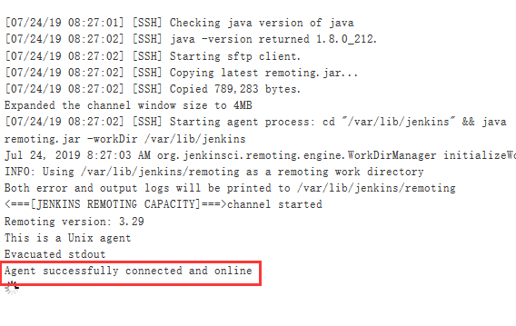

# 配置jenkins基于构建触发器自动拉取代码并部署
构建触发器(webhook)，有的人称为钩子，实际上是一个 HTTP 回调,其用于在开发人员向 gitlab 提交代码后能够触发 jenkins 自动执行代码构建操作。

以下为新建一个开发分支，只有在开发人员向开发(develop)分支提交代码的时候才会触发代码构建，而向主分支提交的代码不会自动构建，需要运维人员手动部署代码到生产环境。


1. gitlab新建develop分支


2. jenkins安装需要的插件
系统管理-管理插件-可选插件-Gitlab Hook 和 Gitlab Authentication
安装插件后重启jenkins

对jenkins进行设置

在 jenkins 系统管理--全局安全设置，认证改为登录用户可以做任何事情并取消跨站请求伪造保护


> 警告：Gitlab Hook Plugin 以纯文本形式存储和显示 GitLab API 令牌，不建议在生产环境使用

3. jenkins新建 develop job并设置为gitlab的develop分支


生产tocken认证
```bash
openssl rand -hex 12
3d744b7568daf3eef885bfce
```


jenkins 构建 shell 命令,构建命令为简单的测试命令，比如输出当前的账户信息：


jenkins 验证分支 job 配置文件
```bash
vim /var/lib/jenkins/jobs/develop/config.xml 
```


4. curl 命令测试触发并验证远程触发构建
使用浏览器直接访问 URL 地址
使用 curl 命令访问 URL
```bash
curl http://192.168.2.2:8080/job/develop/build?token=3d744b7568daf3eef885bfce
```

jenkins 验证 job 是否自动构建


5. gitlab 配置 webhook（系统勾子）
Admin area---groups/project—System Hooks


测试，返回值必须为201


6. jenkins将开发分支的执行 shell 命令更改为正式脚本
构建是jenkins下载的代码会下载到/var/lib/jenkins/workspace/ 目录下与job同名的目录

```bash
 cd /var/lib/jenkins/workspace/develop
tar czvf code.tar.gz index.html 
scp code.tar.gz www@192.168.2.7:/data/app_dir/

ssh www@192.168.2.7 "/etc/init.d/tomcat  stop && rm -rf /data/web_app/myapp/* && cd /data/app_dir/ &&  tar xvf code.tar.gz  -C /data/web_app/myapp/"

ssh www@192.168.2.7 "/etc/init.d/tomcat  start"
```

7. gitlab 开发分支 develop 测试提交代码
```bash
git clone http://192.168.2.1/linux_test/web1.git -b develop
vim index.html 
git add  ./*
git commit -m "develop test"
git push
```
jenkins 验证 develop job 自动构建


## 构建后项目关联
用于多个 job 相互关联，需要穿行执行多个 job 的场景。

1. 配置构建后操作


2. 重新上传develop分支代码，查看master是否构建

master验证


# jenkins 分布式
在众多 Job 的场景下，单台 jenkins master 同时执行代码 clone、编译、打包及构建，其性能可能会出现瓶颈从而会影响代码部署效率，影响 jenkins 官方提供了 jenkins 分布式构建，将众多 job 分散运行到不同的 jenkins slave 节点，大幅提高并行 job 的处理能力。

1. 配置 slave 节点 java 环境
```bash
tar xvf jdk-8u212-linux-x64.tar.gz
mv jdk1.8.0_212 /usr/local/jdk
ln -sv /usr/local/jdk/bin/java /usr/bin/java

vim /etc/profile
export HISTTIMEFORMAT="%F %T `whoami` "
export export LANG="en_US.utf-8"
export JAVA_HOME=/usr/local/jdk
export CLASSPATH=.:$JAVA_HOME/jre/lib/rt.jar:$JAVA_HOME/lib/dt.jar:$JAVA_HOME/lib/tools.jar
export PATH=$PATH:$JAVA_HOME/bin
```

2. 创建 slave 节点的工作目录
Slave 服务器创建工作目录，如果 slave 需要执行编译 job，则也需要配置 java 环境并
且安装 git、svn、maven 等与 master 相同的基础运行环境，另外也要创建与 master 相
同的数据目录，因为脚本中调用的路径只有相对一 master 的一个路径，此路径在
master 与各 node 节点必须保持一致。
```bash
mkdir -pv /var/lib/jenkins/workspace

```

> slave 节点和 master 节点时间必须同步

配置 master 节点和 slave 节点的基于密钥登录
```bash

```

3. master 配置 slave 节点
Jenkins—系统管理—节点管理—新建节点


验证方式基于用户名和密码

查看添加结果

验证日志


4. 创建指定目录并将java软连接到此处
```bash
mkdir /var/lib/jenkins/jdk/bin/ -pv
ln -sv /usr/local/jdk/bin/java /var/lib/jenkins/jdk/bin/
```