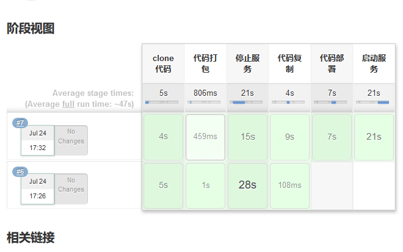

# pipline
pipline 是帮助 Jenkins 实现 CI 到 CD 转变的重要角色，是运行在 jenkins 2.X 版本的核心插件，简单来说 Pipline 就是一套运行于 Jenkins 上的工作流框架，将原本独立运行于单个或者多个节点的任务连接起来，实现单个任务难以完成的复杂发布流程，从而实现单个任务很难实现的复杂流程编排和任务可视化，Pipeline 的实现方式是一套Groovy DSL，任何发布流程都可以表述为一段 Groovy 脚本。

## pipline 语法

Stage：阶段，一个 pipline 可以划分为若干个 stage，每个 stage 都是一个操作，比如clone 代码、代码编译、代码测试和代码部署，阶段是一个逻辑分组，可以跨多个 node执行。

Node：节点，每个 node 都是一个 jenkins 节点，可以是 jenkins master 也可以是jenkins agent，node 是执行 step 的具体服务器。

Step：步骤，step 是 jenkins pipline 最基本的操作单元，从在服务器创建目录到构建容器镜像，由各类 Jenkins 插件提供实现，例如： sh “make”

## pipline 的优势
可持续性：jenkins 的重启或者中断后不影响已经执行的 Pipline Job

支持暂停：pipline 可以选择停止并等待人工输入或批准后再继续执行。

可扩展：通过 groovy 的编程更容易的扩展插件。

并行执行：通过 groovy 脚本可以实现 step，stage 间的并行执行，和更复杂的相互依赖关系。

# 创建 pipline

1. 新建 pipline 任务


2. 测试简单 pipline job 运行

构建后查看


3. 配置代码克隆
可以直接写shell命令，也可以使用Groovy语法构建

将构建生成的代码放到流水线脚本中

构建测试

到构建的节点查看代码信息
```bash
ls /var/lib/jenkins/workspace/pipline-test/
index.html  test2
```

4. 完成其余的配置

如果有slave节点的话，先配置slave节点和后端服务器的免秘钥认证
```bash
ssh-copy-id www@192.168.2.6
ssh-copy-id www@192.168.2.7
```

配置pipline job
```bash
node {
 stage("clone 代码"){
 git credentialsId: 'b588086b-060e-48b9-981e-bf8c185985e8', url: 'git@192.168.2.1:linux_test/web1.git'
 echo "代码 clone 完成"
 }
 stage("代码打包"){
 sh 'cd /var/lib/jenkins/workspace/pipline-test/ && tar czvf code.tar.gz ./* '
 echo "代码打包完成"
 }
stage("停止服务"){
 sh 'ssh www@192.168.2.6 "/etc/init.d/tomcat  stop"'
 sh 'ssh www@192.168.2.7 "/etc/init.d/tomcat  stop"'
 echo "服务停止"
 }

 stage("代码复制"){
 sh 'cd /var/lib/jenkins/workspace/pipline-test/ && scp code.tar.gz www@192.168.2.6:/data/app_dir/'
 sh 'cd /var/lib/jenkins/workspace/pipline-test/ && scp code.tar.gz www@192.168.2.7:/data/app_dir/'
 echo "代码复制完成"
 }
 stage("代码部署"){
 sh 'ssh www@192.168.2.6 "rm -rf /data/web_app/myapp/* && cd /data/app_dir/ &&  tar xvf code.tar.gz  -C /data/web_app/myapp/"'
 sh 'ssh www@192.168.2.7 "rm -rf /data/web_app/myapp/* && cd /data/app_dir/ &&  tar xvf code.tar.gz  -C /data/web_app/myapp/"'
 echo "代码部署完成"
 }
 stage("启动服务"){
 sh 'ssh www@192.168.2.6 "/etc/init.d/tomcat  start"'
 sh 'ssh www@192.168.2.7 "/etc/init.d/tomcat  start"'
 echo "服务启动"
 }
 }
```

构建测试


## 指定 node 节点 运行 job
node 节点需要安装 git 命令,node 节点需要打通与 web server 免密钥登录
在node后面加括号，括号内指定节点
```bash
node(slave) {
 stage("clone 代码"){
 git credentialsId: 'b588086b-060e-48b9-981e-bf8c185985e8', url: 'git@192.168.2.1:linux_test/web1.git'
 echo "代码 clone 完成"
 }
 stage("代码打包"){
 sh 'cd /var/lib/jenkins/workspace/pipline-test/ && tar czvf code.tar.gz ./* '
 echo "代码打包完成"
 }
stage("停止服务"){
 sh 'ssh www@192.168.2.6 "/etc/init.d/tomcat  stop"'
 sh 'ssh www@192.168.2.7 "/etc/init.d/tomcat  stop"'
 echo "服务停止"
 }

 stage("代码复制"){
 sh 'cd /var/lib/jenkins/workspace/pipline-test/ && scp code.tar.gz www@192.168.2.6:/data/app_dir/'
 sh 'cd /var/lib/jenkins/workspace/pipline-test/ && scp code.tar.gz www@192.168.2.7:/data/app_dir/'
 echo "代码复制完成"
 }
 stage("代码部署"){
 sh 'ssh www@192.168.2.6 "rm -rf /data/web_app/myapp/* && cd /data/app_dir/ &&  tar xvf code.tar.gz  -C /data/web_app/myapp/"'
 sh 'ssh www@192.168.2.7 "rm -rf /data/web_app/myapp/* && cd /data/app_dir/ &&  tar xvf code.tar.gz  -C /data/web_app/myapp/"'
 echo "代码部署完成"
 }
 stage("启动服务"){
 sh 'ssh www@192.168.2.6 "/etc/init.d/tomcat  start"'
 sh 'ssh www@192.168.2.7 "/etc/init.d/tomcat  start"'
 echo "服务启动"
 }
 }
```

# 视图
视图可用于归档 job 进行分组显示，比如将一个业务的视图放在一个视图显示，安装完成插件之后将会有一个+号用于创建视图

插件 Build Pipeline


创建视图

定义视图配置信息

web界面显示


> 点击run会指向指定的第一个job

## 列表视图
列表视图使用场景比较多，用于将一个业务的job保存至一个列表视图进行分类管理，
即不同业务的 job 放在不同的列表视图中。

定义视图名称

选择任务


## 我的视图
我的视图会显示当前账户有权限访问的 job，因此需要提前划分好权限。

创建后点保存，就会直接看到当前账户有权限的 job。
