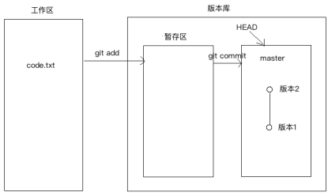

# Git 简介

Git 是目前世界上最先进的分布式版本控制系统

git 是免费的分布式版本控制工具,也是目前最快速的源代码管理工具,最初被 linus 开发出来用于管理 Linux 内核的开发,每个 git 的工作目录都是一个完全独立的代码库,并拥有完整的历史记录和版本追踪能力,不依赖于网络和中心服务器

Git的出现减轻了许多开发者和开源项目对于管理分支代码的压力，由于对分支的良好控制，更鼓励开发者对自己感兴趣的项目做出贡献。其实许多开源项目 包括Linux kernel, Samba, X.org Server, Ruby on Rails，都已经过渡到使用Git作为自己的版本控制工具。对于我们这些喜欢写代码的开发者嘛，有两点最大的好处，我们可以在任何地点(在上班的地铁 上)提交自己的代码和查看代码版本;我们可以开许许多多个分支来实践我们的想法，而合并这些分支的开销几乎可以忽略不计。

### git 和 svn 的比较
[https://www.cnblogs.com/dazhidacheng/p/7478438.html](https://www.cnblogs.com/dazhidacheng/p/7478438.html)

## git 的特点

1. 版本控制
可以解决多人同时开发的代码问题,也可以解决找回历史代码的问题

2. 分布式
git 是分布式的版本控制系统,同一个 git 仓库,可以分布到不同的机器上,首先找一台电脑充当服务器的角色，每天24小时开机，其他每个人都从这个“服务器”仓库克隆一份到自己的电脑上，并且各自把各自的提交推送到服务器仓库里，也从服务器仓库中拉取别人的提交。可以自己搭建这台服务器，也可以使用GitHub网站。

## git 的安装

```bash
# Ubuntu系列的系统
apt-get install git

# CentOS系列的系统
yum -y install git
```


### git 命令的使用
安装好 git 之后,系统中就有了可用的 git 命令
```bash
     p.p1 {margin: 0.0px 0.0px 0.0px 0.0px; font: 11.0px Menlo; color: #9fa01c} p.p2 {margin: 0.0px 0.0px 0.0px 0.0px; font: 11.0px Menlo; color: #000000} p.p3 {margin: 0.0px 0.0px 0.0px 0.0px; font: 11.0px Menlo; color: #000000; min-height: 13.0px} span.s1 {font-variant-ligatures: no-common-ligatures} span.s2 {font-variant-ligatures: no-common-ligatures; color: #b42419} span.s3 {font-variant-ligatures: no-common-ligatures; color: #000000} 

**weiying@weiyingdeMacBook-Air** **~$** git --help

usage: git \[--version\] \[--help\] \[-C <path>\] \[-c <name>=<value>\]

 \[--exec-path\[=<path>\]\] \[--html-path\] \[--man-path\] \[--info-path\]

 \[-p | --paginate | -P | --no-pager\] \[--no-replace-objects\] \[--bare\]

 \[--git-dir=<path>\] \[--work-tree=<path>\] \[--namespace=<name>\]

 <command> \[<args>\]

 clone : 克隆一个版本库到新目录

 init    : 创建一个空的 git 版本库或者重新初始化一个已存在的版本库

 add : 添加指定的文件,目录或当前目录下的所有数据到暂存区

 mv : 移动或者重命名一个文件,目录或符号链接

 rm :从当前的工作空间中和索引中删除文件，例如'git rm app/model/user.rb'，移除暂存区

 bisect 

 grep 
 
 log    :查看操作日志,--stat 具体文件的变动 --graph 可以查看分支的合并图形
 
 reflog : 记录丢失的历史

 show     : 显示各种类型的对象

 status : 查看工作区的状态
 
 checkout : 检出一个分支或路径到工作区

 commit  -m "dis"  :  添加描述信息,并提交文件到工作区

 diff :显示提交之前,提交和工作区之间的差异
 
 merge :合并两个或更多的开发历史, --squash 把分支所有提交合并成一个提交

 rebase : 本地提交转移到更新后的上游分支中

 tag    : 将某一个版本打上一个标签 
 
 fetch : 从另外的一个版本库下载对象和引用

 pull :获取代码到本地

 push    : 提交代码到服务器
 
 .gitignore    : 定义忽略文件
 
 git reset --hard HEAD^^ :git 版本回滚， HEAD 为当前版本，加一个^为上一个，^^为上上一个版本 ,也可以使用HEAD~1表示当前版本的前一个版本,HEAD~100表示当前版本的前100版本。

git reflog # :获取每次提交的 ID，可以使用--hard 根据提交的 ID 进行版本回退

git reset --hard 5ae4b06 :回退到指定 id 的版本  可在克隆下来的项目目录下使用get log 查看id

git branch :查看当前所处的分支，默认是master


git revert ：还原一个版本的修改，必须提供一个具体的Git版本号，例如'git revert bbaf6fb5060b4875b18ff9ff637ce118256d6f20'，Git的版本号都是生成的一个哈希值

#生产中研发一般都是将代码部署到开发的分支，只有当代码测试没有问题了，才会有指定权限的人将代码合并到master分支
git checkout -b develop :创建并切换到一个新分支
git checkout develop :切换分支
  

'git help -a' and 'git help -g' list available subcommands and some

concept guides. See 'git help <command>' or 'git help <concept>'

to read about a specific subcommand or concept.
```

#### 创建一个版本库

创建一个 git 仓库,或者初始化一个已存在的仓库
```bash
weiying@weiyingdeMacBook-Air ~$ git init git_test
Initialized empty Git repository in /Users/weiying/git_test/.git/

# 查看初始化的目录,多了一个 .git 的隐藏文件
weiying@weiyingdeMacBook-Air ~$ tree git_test/ -a
git_test/
└── .git
    ├── HEAD
    ├── config
    ├── description
    ├── hooks
    │   ├── applypatch-msg.sample
    │   ├── commit-msg.sample
    │   ├── fsmonitor-watchman.sample
    │   ├── post-update.sample
    │   ├── pre-applypatch.sample
    │   ├── pre-commit.sample
    │   ├── pre-push.sample
    │   ├── pre-rebase.sample
    │   ├── pre-receive.sample
    │   ├── prepare-commit-msg.sample
    │   └── update.sample
    ├── info
    │   └── exclude
    ├── objects
    │   ├── info
    │   └── pack
    └── refs
        ├── heads
        └── tags

```

### 版本的创建与回退
在创建的版本仓库下面创建简单的文件
```bash
weiying@weiyingdeMacBook-Air git_test$ echo "这是第一个版本" > code.txt

```

创建一个简单的版本
```bash
# 将指定的文件存放在暂存区
git add code.txt 
# 添加描述信息
git commit -m "v1"
 1 file changed, 1 insertion(+)
 create mode 100644 code.txt


# 上面在执行 commit 的时候,可能会出现让设置全局的邮箱和用户名
git config --global user.name "weiying"
git config --global user.email "15324165633@163.com"

# 配置上面的全局的邮箱和用户名以后,会在当前用户的家目录下生成文件来存储这些信息
cat ~/.gitconfig 
[user]
        name = weiying
        email = 15324165633@163.com


```

查看提交的历史
```bash
git log
commit cc04c0109148ef594b57bb34f6e8b1b99af040f5 (HEAD -> master)
Author: 魏颖 <weiying@weiyingdeMacBook-Air.local>
Date:   Wed Jun 10 09:43:51 2020 +0800

    v1

```

继续向文件中追加一行代码,然后在创建一个版本
```bash
weiying@weiyingdeMacBook-Air git_test$ echo "这是第二个版本" >> code.txt 
weiying@weiyingdeMacBook-Air git_test$ git add code.txt 
weiying@weiyingdeMacBook-Air git_test$ git commit -m "v2"
[master bc5c68c] v2
 1 file changed, 1 insertion(+)
weiying@weiyingdeMacBook-Air git_test$ git log
commit bc5c68c0e2dbd76d76f301e5f5c3c5eaeb8b0117 (HEAD -> master)
Author: weiying <15324165633@163.com>
Date:   Wed Jun 10 10:32:59 2020 +0800

    v2

commit cc04c0109148ef594b57bb34f6e8b1b99af040f5
Author: 魏颖 <weiying@weiyingdeMacBook-Air.local>
Date:   Wed Jun 10 09:43:51 2020 +0800

    v1

```

然代码回滚到之前的版本,然后查看
```bash
weiying@weiyingdeMacBook-Air git_test$ git reset --hard HEAD^
HEAD is now at cc04c01 v1
weiying@weiyingdeMacBook-Air git_test$ git log
commit cc04c0109148ef594b57bb34f6e8b1b99af040f5 (HEAD -> master)
Author: 魏颖 <weiying@weiyingdeMacBook-Air.local>
Date:   Wed Jun 10 09:43:51 2020 +0800

    v1

```

>回滚到上一个版本之后,发现现在只有一个版本,而且 code.txt 文件中也之有之前版本的数据

再次回到 v2 版本,需要用到的是 v2 版本的版本号
```bash
weiying@weiyingdeMacBook-Air git_test$ git reset --hard  bc5c68c0e2dbd76d76f301e5f5c3c5eaeb8b0117
HEAD is now at bc5c68c v2
weiying@weiyingdeMacBook-Air git_test$ git log
commit bc5c68c0e2dbd76d76f301e5f5c3c5eaeb8b0117 (HEAD -> master)
Author: weiying <15324165633@163.com>
Date:   Wed Jun 10 10:32:59 2020 +0800

    v2

commit cc04c0109148ef594b57bb34f6e8b1b99af040f5
Author: 魏颖 <weiying@weiyingdeMacBook-Air.local>
Date:   Wed Jun 10 09:43:51 2020 +0800

    v1

```

那么怎么能获取到v2版本号呢,因为在 log 中我们已经不能看到 v2 版本了

git reflog 命令可以获取每次提交的 ID
```bash
weiying@weiyingdeMacBook-Air git_test$ git reflog
cc04c01 (HEAD -> master) HEAD@{0}: reset: moving to HEAD^
bc5c68c HEAD@{1}: reset: moving to bc5c68c0e2dbd76d76f301e5f5c3c5eaeb8b0117
cc04c01 (HEAD -> master) HEAD@{2}: reset: moving to HEAD^
bc5c68c HEAD@{3}: commit: v2
cc04c01 (HEAD -> master) HEAD@{4}: commit (initial): v1

```

## git 的工作区与暂存区

### 工作区
电脑中的目录,比如 git_test 就是一个工作区

### 版本库
工作区中有一个隐藏的 .git 目录,这不是工作区,而是 git 的版本库
```bash
├── .git
│   ├── COMMIT_EDITMSG
│   ├── HEAD
│   ├── ORIG_HEAD
│   ├── config
│   ├── description
│   ├── hooks
│   │   ├── applypatch-msg.sample
│   │   ├── commit-msg.sample
│   │   ├── fsmonitor-watchman.sample
│   │   ├── post-update.sample
│   │   ├── pre-applypatch.sample
│   │   ├── pre-commit.sample
│   │   ├── pre-push.sample
│   │   ├── pre-rebase.sample
│   │   ├── pre-receive.sample
│   │   ├── prepare-commit-msg.sample
│   │   └── update.sample
│   ├── index
│   ├── info
│   │   └── exclude
│   ├── logs
│   │   ├── HEAD
│   │   └── refs
│   │       └── heads
│   │           └── master
│   ├── objects
│   │   ├── 13
│   │   │   └── dc60671e9ca615fd92c6992d54a3f66fd559f3
│   │   ├── 4d
│   │   │   └── 74bf1c8f4274f0cf1a8f0e214309f4c1d4aeca
│   │   ├── bc
│   │   │   └── 5c68c0e2dbd76d76f301e5f5c3c5eaeb8b0117
│   │   ├── c2
│   │   │   └── 6aa45f11f42c0f0464d72a1bf1ad4a0a1039ba
│   │   ├── ca
│   │   │   └── 301fafa9231b733a8986022798a7d9b14516e2
│   │   ├── cc
│   │   │   └── 04c0109148ef594b57bb34f6e8b1b99af040f5
│   │   ├── info
│   │   └── pack
│   └── refs
│       ├── heads
│       │   └── master
│       └── tags
└── code.txt

```

git 的版本库中存放了很多的东西,其中最重要的就是 index 或者是 stage的暂存区,还有 git 为我们自动创建的第一个分支 master,以及指向 master 的指针 HEAD

因为我们创建 Git 版本库的时候,Git 为我们自动创建了一个唯一的 master 分支,所以现在 git commit 就是往 master 分支上提交更改

> 可以简单的理解为,需要提交的文件通常放在暂存区,然后一次性提交暂存区中所有的修改

 

也就是说我们把文件往 git 库中提交的时候,是分两步执行的

- 第一步:是用 git add 把文件添加到暂存区中
- 第二步:用 git commit 提交更改,实际上就是吧暂存区的所有内容提交到当前的分支

> 一旦代码提交到了分支中,那么工作区就没有数据了,可以通过 git status 查看当前工作区的状态

```bash
# 工作区中的代码为提交到分支中
weiying@weiyingdeMacBook-Air git_test$ git status
On branch master
Changes to be committed:
  (use "git reset HEAD <file>..." to unstage)

        modified:   code.txt
        new file:   code2.txt


# 提交以后
weiying@weiyingdeMacBook-Air git_test$ git status
On branch master
nothing to commit, working tree clean

```

## git 管理修改
git 管理的文件的修改,它只会提交暂存区的修改来创建版本

> 也就是说,只有我们将代码通过 git add 命令添加到暂存区了,它才会向分支中提交

如果我们的代码为提交到暂存区中,是不会被提交的

#### 将工作区中的修改撤销
```bash
weiying@weiyingdeMacBook-Air git_test$ git status
On branch master
Changes not staged for commit:
  (use "git add <file>..." to update what will be committed)
  (use "git checkout -- <file>..." to discard changes in working directory)

        modified:   code.txt

no changes added to commit (use "git add" and/or "git commit -a")


# 当我们使用 status 命令查看工作区中的代码的时候
# 发现所做的修改不需要了,那么我们可以丢弃工作区中的数据
weiying@weiyingdeMacBook-Air git_test$ git checkout -- code.txt 
```

#### 将暂存区中的数据放到工作区中
```bash
# 查看状态,显示 code.txt 已经在z暂存区中
weiying@weiyingdeMacBook-Air git_test$ git status
On branch master
Changes to be committed:
  (use "git reset HEAD <file>..." to unstage)

        modified:   code.txt

# 将数据重新方法工作区中
weiying@weiyingdeMacBook-Air git_test$ git reset HEAD code.txt 
Unstaged changes after reset:
M       code.txt

# 查看状态
weiying@weiyingdeMacBook-Air git_test$ git status
On branch master
Changes not staged for commit:
  (use "git add <file>..." to update what will be committed)
  (use "git checkout -- <file>..." to discard changes in working directory)

        modified:   code.txt

no changes added to commit (use "git add" and/or "git commit -a")


```

> 如果更改错了东西,而且还从暂存区中提交到了版本库中,那么需要使用版本的回滚来实现


## 比较文件的不同

对比工作区中的文件与版本库中的文件的不同
```bash
weiying@weiyingdeMacBook-Air git_test$ git diff HEAD -- code.txt 
diff --git a/code.txt b/code.txt
index 11e9498..a866c65 100644
--- a/code.txt            # 这里的 --- 表示 HEAD 版本中的内容
+++ b/code.txt            # 这里的 +++ 表示工作区中的内容
@@ -1,2 +1,3 @@
 第三个版本
 aaa
+bbb                    # 表示工作区的文件比 HEAD 版本的文件多的内容
```

对比代码库中不同版本之间文件的不同
```bash
# 比较两个版本中 code.txt 文件的差异
weiying@weiyingdeMacBook-Air git_test$ git diff HEAD HEAD^ -- code.txt
diff --git a/code.txt b/code.txt   
index 11e9498..64ea4b4 100644
--- a/code.txt            # --- 表示前面指定的版本
+++ b/code.txt            # +++ 表示后面指定的版本
@@ -1,2 +1 @@
 第三个版本
-aaa                       # - 表示前面的版本比后面的版本多的内容
                           # + 表示前面的版本比后面的版本少的内容

```

## 删除文件
如果我们直接将工作区中的文件删除,git 是可以知道哪些文件被删除了
```bash
weiying@weiyingdeMacBook-Air git_test$ rm -rf code2.txt 
weiying@weiyingdeMacBook-Air git_test$ git status
On branch master
Changes not staged for commit:
  (use "git add/rm <file>..." to update what will be committed)
  (use "git checkout -- <file>..." to discard changes in working directory)

        deleted:    code2.txt

no changes added to commit (use "git add" and/or "git commit -a")

```

当有文件被删除了之后,有两中选择

一:用 git rm 命令删除文件
```bash
weiying@weiyingdeMacBook-Air git_test$ git rm code2.txt
rm 'code2.txt'
weiying@weiyingdeMacBook-Air git_test$ git status
On branch master
Changes to be committed:
  (use "git reset HEAD <file>..." to unstage)

        deleted:    code2.txt
```

二: 是删错了,可以找回文件
```bash
weiying@weiyingdeMacBook-Air git_test$ git status
On branch master
Changes to be committed:
  (use "git reset HEAD <file>..." to unstage)

        deleted:    code2.txt

Changes not staged for commit:
  (use "git add/rm <file>..." to update what will be committed)
  (use "git checkout -- <file>..." to discard changes in working directory)

        deleted:    code.txt

weiying@weiyingdeMacBook-Air git_test$ git checkout -- code.txt

```

对于使用了 git rm 删除了的文件也是可以找回的
```bash
weiying@weiyingdeMacBook-Air git_test$ git status
On branch master
Changes to be committed:
  (use "git reset HEAD <file>..." to unstage)

        deleted:    code2.txt

# 找回文件
weiying@weiyingdeMacBook-Air git_test$ git reset HEAD code2.txt
Unstaged changes after reset:
D       code2.txt
weiying@weiyingdeMacBook-Air git_test$ git checkout -- code2.txt

```