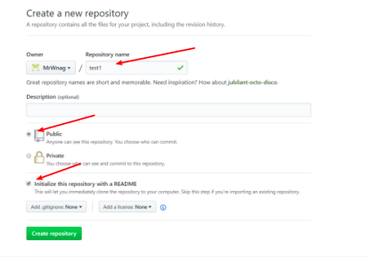
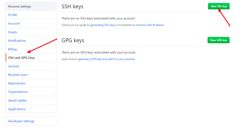

## git 的分支管理
git 把我们之前每次提交的版本串成时间线,这条时间线就是一个分支,截止到当前只有一条时间线,在 git 里面这个分支叫做主分支,即 master 分支,HEAD 严格的来说并不是指向提交,而是指向 master,master 才是指向提交的,所以,HEAD 指向的就是当前分支

新的分支会完全继承与 master 分支 的代码,而且在其他的分支上提交代码并不会影响 master 分支,只有当把其他分支的代码与 master 分支合并的时候,才会影响 master 分支

1. 查看当前的分支, "*"号表示当前所在的分支
```bash
weiying@weiyingdeMacBook-Air git_test$ git branch
* master
```

2. 创建新的分支
```bash
weiying@weiyingdeMacBook-Air git_test$ git branch
  dev
* master

-b: 选项可以再创建分支的时候,直接切换到创建的分支
```

3. 切换工作分支
```bash
weiying@weiyingdeMacBook-Air git_test$ git checkout dev
Switched to branch 'dev'
```

4. 合并指定的分支到当前分支
```bash
# 在 master 分支执行,将 dev 分支合并到 master 分支
weiying@weiyingdeMacBook-Air git_test$ git merge dev
Updating be3e745..f4fe145
Fast-forward
 code.txt | 1 +
 1 file changed, 1 insertion(+)

```

5. 删除分支
```bash
weiying@weiyingdeMacBook-Air git_test$ git branch -d dev
Deleted branch dev (was f4fe145).
```

创建分支的时候,如果工作区中还有数据没有提交,那么是不能创建分支的,但是这些数据又是没有完成的而不能提交的,如果提交了会导致分支代码的异常,如果删除的话,那么工作就白费了

6. 隐藏当前的工作区
```bash
weiying@weiyingdeMacBook-Air git_test$ git status
On branch master
Changes not staged for commit:
  (use "git add <file>..." to update what will be committed)
  (use "git checkout -- <file>..." to discard changes in working directory)

        modified:   code.txt

no changes added to commit (use "git add" and/or "git commit -a")

# 隐藏当前工作区
weiying@weiyingdeMacBook-Air git_test$ git stash
Saved working directory and index state WIP on master: f4fe145 v6

```

7. 查看隐藏的工作区
```bash
weiying@weiyingdeMacBook-Air git_test$ git stash list
stash@{0}: WIP on master: f4fe145 v6

```

8. 恢复隐藏的工作区
```bash
weiying@weiyingdeMacBook-Air git_test$ git stash pop
On branch master
Changes not staged for commit:
  (use "git add <file>..." to update what will be committed)
  (use "git checkout -- <file>..." to discard changes in working directory)

        modified:   code.txt

no changes added to commit (use "git add" and/or "git commit -a")
Dropped refs/stash@{0} (f6610baa565cd6db7d8db7838fa1c9e8a3b2ae1f)
```

## github 的使用

在 github 上创建一个仓库,并勾选 readme.me, public
 

#### 添加 ssh 账户
如果某台机器要与 github 上的仓库交互,那么就要吧这台机器的 ssh 公钥添加到这个 github 账户上
1. 在 setting 中选择'SSH and GPG keys'，添加ssh公钥
 

2. 在用户家目录的.gitconfig 文件中配置 github 的信息
添加 github 的用户名和注册时使用的邮箱
```bash
weiying@weiyingdeMacBook-Air git_test$ vim ~/.gitconfig 
[user]
        name = aishad-weiying
        email = 15324165633@163.com

```

3. 克隆项目:会在当前目录下面生成项目目录
```bash
weiying@weiyingdeMacBook-Air ~$ git clone https://github.com/aishad-weiying/test1.git
```

克隆下来项目之后,就可以再这里面写代码

4. 将代码推送到 github 上
```bash
weiying@weiyingdeMacBook-Air test1$ git push
Username for 'https://github.com': aishad-weiying
Password for 'https://aishad-weiying@github.com': 
Enumerating objects: 4, done.
Counting objects: 100% (4/4), done.
Delta compression using up to 4 threads
Compressing objects: 100% (2/2), done.
Writing objects: 100% (3/3), 275 bytes | 91.00 KiB/s, done.
Total 3 (delta 0), reused 0 (delta 0)
To https://github.com/aishad-weiying/test1.git
   ee5a270..9b0b31b  master -> master

```

5. 推送一个分支到 github 上
```bash
weiying@weiyingdeMacBook-Air test1$ git push origin dev
Username for 'https://github.com': aishad-weiying
Password for 'https://aishad-weiying@github.com': 
Enumerating objects: 5, done.
Counting objects: 100% (5/5), done.
Delta compression using up to 4 threads
Compressing objects: 100% (2/2), done.
Writing objects: 100% (3/3), 280 bytes | 280.00 KiB/s, done.
Total 3 (delta 0), reused 0 (delta 0)
To https://github.com/aishad-weiying/test1.git
   900805d..4f153c5  dev -> dev
```

6. 设置将本地分支跟踪服务器分支
git branch --set-upstream-to=origin/服务器分支 本地分支
```bash
weiying@weiyingdeMacBook-Air test1$ git branch --set-upstream-to=origin/dev dev
Branch 'dev' set up to track remote branch 'dev' from 'origin'.
weiying@weiyingdeMacBook-Air test1$ git status
On branch dev
Your branch is up to date with 'origin/dev'.

nothing to commit, working tree clean

```

7. 从远程分支拉取代码:使用上述命令会把远程分dev上的代码下载并合并到本地所在分支
```bash
git pull origin dev
```