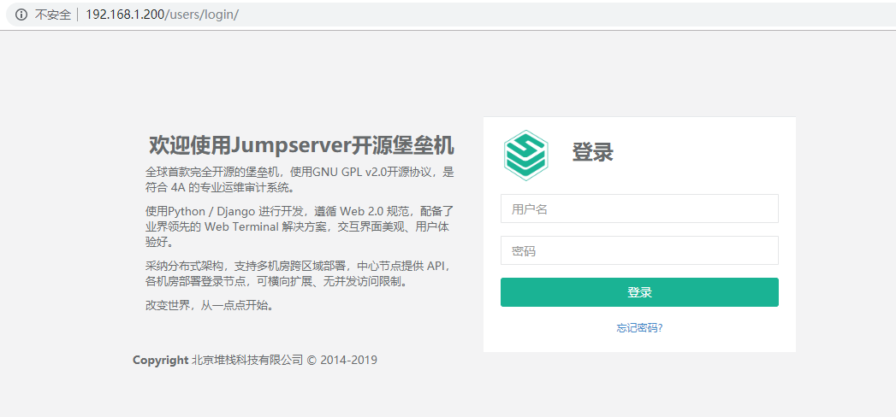

# JumpServer
Jumpserver 是全球首款完全开源的堡垒机, 使用 GNU GPL v2.0 开源协议, 是符合 4A 的专业运维审计系统。

Jumpserver 使用 Python / Django 进行开发, 遵循 Web 2.0 规范, 配备了业界领先的 Web Terminal 解决方案, 交互界面美观、用户体验好。

Jumpserver 采纳分布式架构, 支持多机房跨区域部署, 中心节点提供 API, 各机房部署登录节点, 可横向扩展、无并发访问限制。

Jumpserver 现已支持管理 SSH、 Telnet、 RDP、 VNC 协议资产。

## 基于Docker安装jumpserver
### 准备docker环境

1. docker源
```bash
[ root@localhost yum.repos.d]# wget https://mirrors.aliyun.com/docker-ce/linux/centos/docker-ce.repo
```

2. 安装最新版的docker
```bash
[ root@localhost yum.repos.d]# yum -y install docker-ce
```

3. 配置阿里云镜像加速
```bash
[ root@localhost yum.repos.d]# systemctl start docker
[ root@localhost yum.repos.d]# vim /etc/docker/daemon.json
{
  "registry-mirrors": ["https://qg2m7q97.mirror.aliyuncs.com"]
}
[ root@localhost yum.repos.d]# systemctl restart docker
```

### 准备数据库和redis
外置数据库要求：

- mysql 版本需要大于等于 5.6
- mariadb 版本需要大于等于 5.5.6
- 数据库编码要求 uft8

安装数据库并配置
```bash
[ root@localhost ~]# yum install mariadb-server
#数据库安装初始化...
[ root@localhost ~]# systemctl start mariadb
[ root@localhost ~]# systemctl enable mariadb
# 授权
MariaDB [(none)]> create database jumpserver default charset 'utf8';

MariaDB [(none)]> grant all on jumpserver.* to 'jumpserver'@'%' identified by 'admin123';
```

安装并配置redis
```bash
[ root@localhost ~]# yum -y install redis
[ root@localhost ~]# vim /etc/redis.conf
bind 0.0.0.0
requirepass admin123
[ root@localhost ~]# systemctl start redis
[ root@localhost ~]# systemctl enable redis
```

### 安装jumpserver


1. 下载jumpserver的镜像
```bash
[ root@localhost ~]# docker pull jumpserver/jms_all:1.4.8
```

2. 创建指定目录，用来给容器映射
```bash
[ root@localhost ~]# mkdir /opt/mysql

[ root@localhost ~]# mkdir /opt/jumpserver
```

3. 生成随机加密秘钥, 勿外泄,key一旦生成就不能变
```bash
[ root@localhost ~]# if [ "$SECRET_KEY" = "" ]; then SECRET_KEY=`cat /dev/urandom | tr -dc A-Za-z0-9 | head -c 50`; echo "SECRET_KEY=$SECRET_KEY" >> ~/.bashrc; echo $SECRET_KEY; else echo $SECRET_KEY; fi
0Ae6xh46DVia9IjxKCkbQ59Cx5RoUNq6CQ6htGCWt9wAdoD8gK

[ root@localhost ~]# if [ "$BOOTSTRAP_TOKEN" = "" ]; then BOOTSTRAP_TOKEN=`cat /dev/urandom | tr -dc A-Za-z0-9 | head -c 16`; echo "BOOTSTRAP_TOKEN=$BOOTSTRAP_TOKEN" >> ~/.bashrc; echo $BOOTSTRAP_TOKEN; else echo $BOOTSTRAP_TOKEN; fi
poRoMY3qBpZWsuCs
```

3. 启动一个容器
```bash
[ root@localhost ~]# docker run --name docker1 -d \
-v /opt/mysql:/var/lib/mysql \
-v /opt/jumpserver:/opt/jumpserver/data/media \
-p 80:80 \
-p 2222:2222 \
-e SECRET_KEY=0Ae6xh46DVia9IjxKCkbQ59Cx5RoUNq6CQ6htGCWt9wAdoD8gK \
-e BOOTSTRAP_TOKEN=poRoMY3qBpZWsuCs \
-e DB_HOST=192.168.168.2 \
-e DB_PORT=3306 \
-e DB_USER=jumpserver \
-e DB_PASSWORD=admin123 \
-e DB_NAME=jumpserver \
-e REDIS_HOST=192.168.168.2 \
-e REDIS_PORT=6379 \
-e REDIS_PASSWORD=admin123 \
jumpserver/jms_all:1.4.8

d80d95df9e78544abd1c4a17bcc71c6520579f5ed5dc86077335a85e40d44479

# --name jms_all：指点容器的名称
# -d：放到后天运行
# -p：端口映射，将本机的指定端口映射为容器的端口
# -e：传递生成的密钥 
# jumpserver/jms_all:1.4.8：jumpserver的镜像
```

4. 访问

- 浏览器访问: http://<容器所在服务器IP>
- SSH 访问: ssh -p 2222 <容器所在服务器IP>
- XShell 等工具请添加 connection 连接, 默认 ssh 端口 2222
- 默认管理员账户 admin 密码 admin

[](http://aishad.top/wordpress/wp-content/uploads/2019/06/login_jump.png)

# 设置jumpserver

1. 创建用户组和用户

2. 在资产管理中创建管理用户
管理用户是资产（被控服务器）上的root，或拥有 NOPASSWD: ALL sudo权限的用户， Jumpserver使用该用户来 推送系统用户、获取资产硬件信息 等。暂不支持 Windows或其它硬件， 可以随意设置一个

3. 创建系统用户
系统用户是 Jumpserver跳转登录资产时使用的用户，可以理解为登录资产用户，如 web, sa, dba(ssh web@some-host), 而不是使用某个用户的用户名跳转登录服务器(ssh xiaoming@some-host); 简单来说是 用户使用自己的用户名登录Jumpserver, Jumpserver使用系统用户登录资产。 系统用户创建时，如果选择了自动推送 Jumpserver会使用ansible自动推送系统用户到资产中，如果资产(交换机、windows)不支持ansible, 请手动填写账号密码。目前还不支持Windows的自动推送
> 一般在企业生产环境中，会使用Ansible批量创建相同uid的系统用户，防止出现权限不同的问题

4. 创建资产
资产树节点不能重名, 右击节点可以添加、删除和重命名节点, 以及进行资产相关的操作

5. 将资产给指定的用户或组授权
把资产授权给用户后, 用户才能在 "我的资产" 里面看到资产, 配置正确后用户才能正常连接资产

## 其他的设置请参看官方的参考文档