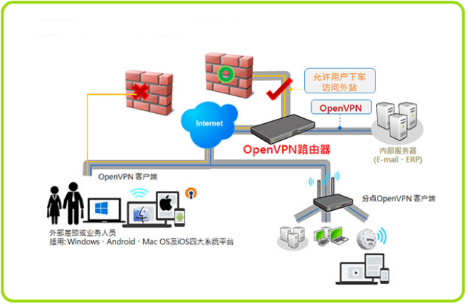
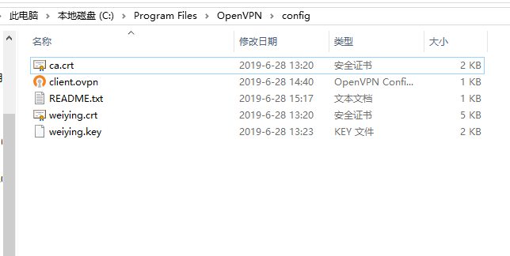
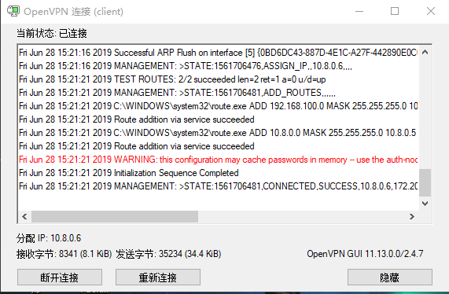
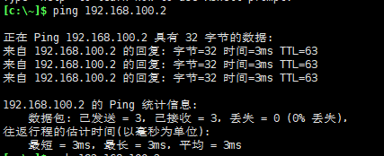
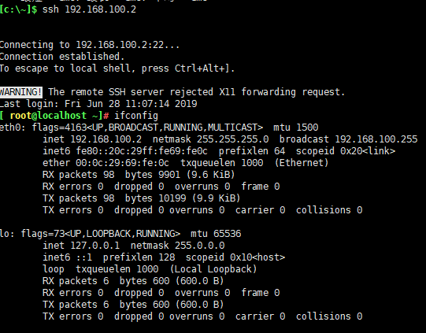

# VPN
VPN 英文全称(Virtual Private Network)，中文译为：虚拟私人网络，又称为虚拟专用网络，用于在不安全的线路上安全的传输数据。

# OpenVPN
一个实现VPN的开源软件，OpenVPN 是一个健壮的、高度灵活的 VPN 守护进程。它支持 SSL/TLS 安全、Ethernet bridging、经由代理的 TCP 或 UDP 隧道和 NAT。另外，它也支持动态 IP 地址以及DHCP，可伸缩性足以支持数百或数千用户的使用场景，同时可移植至大多数主流操作系统平台上。

官网：[openvpn官网](https://openvpn.net "openvpn官网")
GitHub：[openvpnGitHub地址](https://github.com/OpenVPN/openvpn "openvpnGitHub地址")

[](http://aishad.top/wordpress/wp-content/uploads/2019/06/openvpn.png)

## openvpn基础环境
openvpn server：172.20.45.138(外网地址) 192.168.100.1（内网地址，vmnet2）
后端服务器1：192.168.100.2（内网地址，vmnet2）
后端服务器2: 192.168.100.3（内网地址，vmnet2）

> OpenVPN用来接收外部的请求，当客户端连接到openvpn server时，openvpn server会给客户端分配一个内网地址(默认是10.8.0.0/24)和静态路由，凡是发往后端服务器(192.168.100.0/24)的请求，都会被发到openvpn server服务器(默认使用10.8.0.1/24)，最后openvpn server会将请求转发至指定的后端服务器
### 安装OpenVPN
```bash
[ root@localhost ~]# yum install openvpn easy-rsa -y
```

### 配置

1. 拷贝配置文件
```bash
[ root@localhost ~]# cp /usr/share/doc/openvpn-2.4.7/sample/sample-config-files/server.conf /etc/openvpn/

[ root@localhost ~]#  cp -r /usr/share/easy-rsa/ /etc/openvpn/

[ root@localhost ~]# cp /usr/share/doc/easy-rsa-3.0.3/vars.example /etc/openvpn/easy-rsa/3.0.3/vars

[ root@localhost openvpn]# tree /etc/openvpn/
/etc/openvpn/
├── client
├── easy-rsa
│   ├── 3 -> 3.0.3
│   ├── 3.0 -> 3.0.3
│   └── 3.0.3
│       ├── easyrsa
│       ├── openssl-1.0.cnf
│       ├── vars
│       └── x509-types
│           ├── ca
│           ├── client
│           ├── COMMON
│           ├── san
│           └── server
├── server
└── server.conf
```

2. 创建PKI
```bash
# 创建PKI
[ root@localhost easy-rsa]# cd /etc/openvpn/easy-rsa/3.0.3/
[ root@localhost 3.0.3]# ./easyrsa init-pki

Note: using Easy-RSA configuration from: ./vars

init-pki complete; you may now create a CA or requests.
Your newly created PKI dir is: /etc/openvpn/easy-rsa/3.0.3/pki

[ root@localhost 3.0.3]# ll pki/
total 0
drwx------ 2 root root 6 Jun 28 11:33 private
drwx------ 2 root root 6 Jun 28 11:33 reqs
```
3. 创建CA机构
```bash
[ root@localhost 3.0.3]# ./easyrsa build-ca nopass

Note: using Easy-RSA configuration from: ./vars
Generating a 2048 bit RSA private key
.................................................................+++
..............................................................................................................+++
writing new private key to '/etc/openvpn/easy-rsa/3.0.3/pki/private/ca.key.qIZprbTkzM'  #CA的私钥
-----
You are about to be asked to enter information that will be incorporated
into your certificate request.
What you are about to enter is what is called a Distinguished Name or a DN.
There are quite a few fields but you can leave some blank
For some fields there will be a default value,
If you enter '.', the field will be left blank.
-----
Common Name (eg: your user, host, or server name) [Easy-RSA CA]: #直接回车

CA creation complete and you may now import and sign cert requests.
Your new CA certificate file for publishing is at:
/etc/openvpn/easy-rsa/3.0.3/pki/ca.crt

#验证CA的私钥
[ root@localhost 3.0.3]# ll /etc/openvpn/easy-rsa/3.0.3/pki/private/ca.key
-rw------- 1 root root 1708 Jun 28 11:35 /etc/openvpn/easy-rsa/3.0.3/pki/private/ca.key
```
4. 创建服务器端证书(私钥)
```bash
[ root@localhost 3.0.3]#  ./easyrsa gen-req server nopass

Note: using Easy-RSA configuration from: ./vars
Generating a 2048 bit RSA private key
...........................................................................................+++
........................+++
writing new private key to '/etc/openvpn/easy-rsa/3.0.3/pki/private/server.key.Wu6dGpjF0v'
-----
You are about to be asked to enter information that will be incorporated
into your certificate request.
What you are about to enter is what is called a Distinguished Name or a DN.
There are quite a few fields but you can leave some blank
For some fields there will be a default value,
If you enter '.', the field will be left blank.
-----
Common Name (eg: your user, host, or server name) [server]:

Keypair and certificate request completed. Your files are:
req: /etc/openvpn/easy-rsa/3.0.3/pki/reqs/server.req
key: /etc/openvpn/easy-rsa/3.0.3/pki/private/server.key

[ root@localhost 3.0.3]# ll  ./pki/private/
total 8
-rw------- 1 root root 1708 Jun 28 11:35 ca.key
-rw------- 1 root root 1704 Jun 28 11:36 server.key
```
5. 签发服务器端证书
```bash
# 生成服务端crt公钥
[ root@localhost 3.0.3]# ./easyrsa sign server server

Note: using Easy-RSA configuration from: ./vars


You are about to sign the following certificate.
Please check over the details shown below for accuracy. Note that this request
has not been cryptographically verified. Please be sure it came from a trusted
source or that you have verified the request checksum with the sender.

Request subject, to be signed as a server certificate for 3650 days:

subject=
    commonName                = server


Type the word 'yes' to continue, or any other input to abort.
  Confirm request details: yes  #输入yes进行下一步
Using configuration from ./openssl-1.0.cnf
Check that the request matches the signature
Signature ok
The Subject's Distinguished Name is as follows
commonName            :ASN.1 12:'server'
Certificate is to be certified until Jun 25 03:39:44 2029 GMT (3650 days)

Write out database with 1 new entries
Data Base Updated

Certificate created at: /etc/openvpn/easy-rsa/3.0.3/pki/issued/server.crt

[ root@localhost 3.0.3]# ll /etc/openvpn/easy-rsa/3.0.3/pki/issued/server.crt
-rw------- 1 root root 4552 Jun 28 11:39 /etc/openvpn/easy-rsa/3.0.3/pki/issued/server.crt
```

6. 创建 Diffie-Hellman
密钥交换方法，由惠特菲尔德·迪菲（Bailey Whitfield Diffie）、马丁·赫尔曼（Martin Edward Hellman）于1976年发表。它是一种安全协议，让双方在完全没有对方任何预先信息的条件下通过不安全信道建立起一个密钥，这个密钥一般作为“对称加密”的密钥而被双方在后续数据传输中使用。DH数学原理是base离散对数问题。做类似事情的还有非对称加密类算法，如：RSA。其应用非常广泛，在SSH、VPN、Https...都有应用，勘称现代密码基石。
```bash
[ root@localhost 3.0.3]# ./easyrsa gen-dh

Note: using Easy-RSA configuration from: ./vars
Generating DH parameters, 2048 bit long safe prime, generator 2
This is going to take a long time
.......................................+..............................................+..........................++*++*

DH parameters of size 2048 created at /etc/openvpn/easy-rsa/3.0.3/pki/dh.pem

[ root@localhost 3.0.3]# ll /etc/openvpn/easy-rsa/3.0.3/pki/dh.pem
-rw------- 1 root root 424 Jun 28 11:41 /etc/openvpn/easy-rsa/3.0.3/pki/dh.pem
```
7. 创建客户端证书
```bash
#复制客户端配置文件：
[ root@localhost 3.0.3]# cp -r /usr/share/easy-rsa/ /etc/openvpn/client/easy-rsa
[ root@localhost 3.0.3]# cp /usr/share/doc/easy-rsa-3.0.3/vars.example /etc/openvpn/client/easy-rsa/vars

#生成pki目录
[ root@localhost 3.0.3]# cd /etc/openvpn/client/easy-rsa/3.0.3

[ root@localhost 3.0.3]# ./easyrsa init-pki

init-pki complete; you may now create a CA or requests.
Your newly created PKI dir is: /etc/openvpn/client/easy-rsa/3.0.3/pki

[ root@localhost 3.0.3]# ll pki/
total 0
drwx------ 2 root root 6 Jun 28 11:45 private
drwx------ 2 root root 6 Jun 28 11:45 reqs

#生成客户端证书,nopass不设置证书密码
[ root@localhost 3.0.3]#  ./easyrsa gen-req weiying nopass
Generating a 2048 bit RSA private key
...............................+++
................................................+++
writing new private key to '/etc/openvpn/client/easy-rsa/3.0.3/pki/private/weiying.key.d4lCwxIOvA'
-----
You are about to be asked to enter information that will be incorporated
into your certificate request.
What you are about to enter is what is called a Distinguished Name or a DN.
There are quite a few fields but you can leave some blank
For some fields there will be a default value,
If you enter '.', the field will be left blank.
-----
Common Name (eg: your user, host, or server name) [weiying]:

Keypair and certificate request completed. Your files are:
req: /etc/openvpn/client/easy-rsa/3.0.3/pki/reqs/weiying.req
key: /etc/openvpn/client/easy-rsa/3.0.3/pki/private/weiying.key

[ root@localhost 3.0.3]# tree /etc/openvpn/client/easy-rsa/3.0.3/pki/
/etc/openvpn/client/easy-rsa/3.0.3/pki/
├── private
│   └── weiying.key
└── reqs
    └── weiying.req
```

8. 签发客户端证书
```bash
#导入req文件
[ root@localhost 3.0.3]# ./easyrsa import-req /etc/openvpn/client/easy-rsa/3.0.3/pki/reqs/weiying.req weiying

Note: using Easy-RSA configuration from: ./vars

The request has been successfully imported with a short name of: weiying
You may now use this name to perform signing operations on this request.

#签发客户端证书：
[ root@localhost 3.0.3]# ./easyrsa sign client weiying 

Note: using Easy-RSA configuration from: ./vars


You are about to sign the following certificate.
Please check over the details shown below for accuracy. Note that this request
has not been cryptographically verified. Please be sure it came from a trusted
source or that you have verified the request checksum with the sender.

Request subject, to be signed as a client certificate for 3650 days:

subject=
    commonName                = weiying


Type the word 'yes' to continue, or any other input to abort.
  Confirm request details: yes
Using configuration from ./openssl-1.0.cnf
Check that the request matches the signature
Signature ok
The Subject's Distinguished Name is as follows
commonName            :ASN.1 12:'weiying'
Certificate is to be certified until Jun 25 03:58:49 2029 GMT (3650 days)

Write out database with 1 new entries
Data Base Updated

Certificate created at: /etc/openvpn/easy-rsa/3.0.3/pki/issued/weiying.crt

#验证签发后的crt证书
[ root@localhost 3.0.3]# ll /etc/openvpn/easy-rsa/3.0.3/pki/issued/weiying.crt 
-rw------- 1 root root 4433 Jun 28 11:58 /etc/openvpn/easy-rsa/3.0.3/pki/issued/weiying.crt
```
9. 复制证书到server目录
```bash
[ root@localhost 3.0.3]# mkdir /etc/openvpn/certs
[ root@localhost 3.0.3]# cd /etc/openvpn/certs
[ root@localhost certs]# cp /etc/openvpn/easy-rsa/3.0.3/pki/dh.pem .
[ root@localhost certs]# cp /etc/openvpn/easy-rsa/3.0.3/pki/ca.crt .
[ root@localhost certs]#  cp /etc/openvpn/easy-rsa/3.0.3/pki/issued/server.crt .
[ root@localhost certs]# cp /etc/openvpn/easy-rsa/3.0.3/pki/private/server.key .
[ root@localhost certs]# tree 
.
├── ca.crt
├── dh.pem
├── server.crt
└── server.key

```
10. 客户端公钥与私钥
```bash
[ root@localhost certs]# mkdir /etc/openvpn/client/weiying
[ root@localhost certs]# cp /etc/openvpn/easy-rsa/3.0.3/pki/ca.crt /etc/openvpn/client/weiying/
[ root@localhost certs]# cp /etc/openvpn/easy-rsa/3.0.3/pki/issued/weiying.crt /etc/openvpn/client/weiying/
[ root@localhost certs]# cp /etc/openvpn/client/easy-rsa/3.0.3/pki/private/weiying.key /etc/openvpn/client/weiying/
[ root@localhost certs]# tree /etc/openvpn/client/weiying/
/etc/openvpn/client/weiying/
├── ca.crt
├── weiying.crt
└── weiying.key
```

### serer端的配置文件
```bash

local 172.20.45.138  #本机监听IP
port 1194 #端口
proto tcp #协议，指定OpenVPN创建的通信隧道类型tcp或udp
dev tun
# dev tcp：创建一个以太网隧道，以太网使用tcp
# dev tun：创建一个路由IP隧道，互联网使用tun
#一个TUN设备大多时候，被用于基于IP协议的通讯。一个TAP设备允许完整的以太网帧通过Openvpn隧道，因此提供非ip协议的支持，比如IPX协议和AppleTalk协议

#dev-node MyTap #TAP-Win32适配器。非windows不需要

ca /etc/openvpn/certs/ca.crt
cert /etc/openvpn/certs/server.crt
key /etc/openvpn/certs/server.key  # This file should be kept secret

dh /etc/openvpn/certs/dh.pem

#网络拓扑，不需要配置
#topology subnet

#客户端连接后分配IP的地址池，服务器默认会占用第一个IP 10.8.0.1
server 10.8.0.0 255.255.255.0

#为客户端分配固定IP，不需要配置
#ifconfig-pool-persist ipp.txt

#为指定的客户端添加路由，改路由通常是客户端后面的内网网段而不是服务端的，也不需要设置
#server-bridge 10.8.0.4 255.255.255.0 10.8.0.50 10.8.0.100

#给客户端生成的静态路由表，下一跳为openvpn服务器的10.8.0.1
push "route 192.168.100.0 255.255.255.0"

#为指定的客户端添加路由，改路由通常是客户端后面的内网网段而不是服务端的，也不需要设置
#client-config-dir ccd
#route 192.168.40.128 255.255.255.248

#运行外部脚本，创建不同组的iptables 规则，不配置
#learn-address ./script

##启用后，客户端所有流量都将通过VPN服务器，因此不需要配置
#push "redirect-gateway def1 bypass-dhcp"

#推送DNS服务器，不需要配置
#push "dhcp-option DNS 208.67.222.222"

##运行不同的client直接通信
client-to-client

#多个用户共用一个账户，一般用于测试环境，生产环境都是一个用户一个证书
#duplicate-cn

#设置服务端检测的间隔和超时时间，默认为每 10 秒 ping一次，如果 120 秒没有回应则认为对方已经 down
keepalive 10 120


#可使用以下命令来生成：openvpn –genkey –secret ta.key #服务器和每个客户端都需要拥有该密钥的一个拷贝。第二个参数在服务器端应该为’0’，在客户端应该为’1’
#tls-auth ta.key 0

#加密算法
cipher AES-256-CBC

#启用压缩
#compress lz4-v2
#push "compress lz4-v2"
#旧户端兼容的压缩配置，需要客户端配置开启压缩
#comp-lzo

#最大客户端数
#旧户端兼容的压缩配置，需要客户端配置开启压缩

#运行openvpn服务的用户和组
user nobody
group nobody

#重启VPN服务，你重新读取keys文件，保留使用第一次的keys文件
persist-key
#重启vpn服务，一直保持tun或者tap设备是up的，否则会先down然后再up
persist-tun

#openVPN状态记录文件，每分钟会记录一次
status openvpn-status.log
#log         openvpn.log  #日志记录方式和路径，log会在openvpn启动的时候清空日志文件
log-append  /var/log/openvpn/openvpn.log  #重启openvpn后在之前的日志后面追加新的日志
verb 3 #设置日志级别，0-9，级别越高记录的内容越详细
mute 20 #相同类别的信息只有前20条会输出到日志文件中

#通知客户端，在服务端重启后可以自动重新连接，仅能用于udp模式，tcp模式不需要配置即可实现断开重连接
#explicit-exit-notify 1
```

创建日志目录
```bash
[ root@localhost ~]# mkdir /var/log/openvpn
[ root@localhost ~]# chown nobody.nobody /var/log/openvpn
```

### 客户端配置文件
```bash
#模板文件/usr/share/doc/openvpn-2.4.7/sample/sample-config-files/client.conf
[ root@localhost certs]# vim /etc/openvpn/client/weiying/client.ovpn
client #声明自己是个客户端
dev tun #接口类型，必须和服务端保持一致
proto tcp #使用的协议，必须和服务端保持一致
remote 172.20.45.138 1194 #server端的ip和端口，可以写域名但是需要可以解析成IP
resolv-retry infinite #如果是写的server端的域名，那么就始终解析，如果域名发生变化，会重新连接到新的域名对应的IP
nobind #本机不绑定监听端口，客户端是随机打开端口连接到服务端的1194
persist-key #
persist-tun
ca ca.crt
cert zhangshijie.crt
key zhangshijie.key
remote-cert-tls server #指定采用服务器校验方式
#tls-auth ta.key 1
cipher AES-256-CBC
verb 3

#将整个目录打包
[ root@localhost weiying]# tar czvf user-weiying.tar.gz /etc/openvpn/client/weiying/*
```
### 配置防火墙规则
```bash
[ root@localhost weiying]# systemctl stop firewalld.service
[ root@localhost weiying]# systemctl disable firewalld.service
[ root@localhost ~]# yum -y install iptables-services iptables
[ root@localhost ~]# systemctl enable iptables.service
Created symlink from /etc/systemd/system/basic.target.wants/iptables.service to /usr/lib/systemd/system/iptables.service.
[ root@localhost ~]#  systemctl start iptables.service

#清空已有规则
[ root@localhost ~]# iptables -F
[ root@localhost ~]# iptables -X
[ root@localhost ~]# iptables -Z
[ root@localhost ~]# iptables -t nat -F
[ root@localhost ~]# iptables -t nat -X
[ root@localhost ~]# iptables -t nat -Z

#开启路由转发功能
[ root@localhost weiying]# vim /etc/sysctl.conf
net.ipv4.ip_forward = 1
[ root@localhost weiying]# sysctl -p

#添加iptables规则
#源地址转换
[ root@localhost ~]# iptables -t nat -A POSTROUTING -s 10.8.0.0/24 -j MASQUERADE
#允许tcp 1194端口
[ root@localhost ~]# iptables -A INPUT -p TCP --dport 1194 -j ACCEPT

[ root@localhost ~]# iptables -A INPUT -m state --state ESTABLISHED,RELATED -j ACCEPT
[ root@localhost ~]# service iptables save
iptables: Saving firewall rules to /etc/sysconfig/iptables:[  OK  ]
```

### 启动openvpn服务
```bash
[ root@localhost weiying]# systemctl enable openvpn@server
[ root@localhost weiying]# systemctl start  openvpn@server
```
验证tun网卡设备：
```bash
tun0: flags=4305<UP,POINTOPOINT,RUNNING,NOARP,MULTICAST>  mtu 1500
        inet 10.8.0.1  netmask 255.255.255.255  destination 10.8.0.2
        inet6 fe80::5bb:28e4:e362:fa07  prefixlen 64  scopeid 0x20<link>
        unspec 00-00-00-00-00-00-00-00-00-00-00-00-00-00-00-00  txqueuelen 100  (UNSPEC)
        RX packets 0  bytes 0 (0.0 B)
        RX errors 0  dropped 0  overruns 0  frame 0
        TX packets 3  bytes 144 (144.0 B)
        TX errors 0  dropped 0 overruns 0  carrier 0  collisions 0
```

## 客户端安装openvpn客户端并使用
下载地址：[官方下载地址](https://openvpn.net/community-downloads/ "官方下载地址")
[非官方下载地址]( https://sourceforge.net/projects/securepoint/files/ "非官方下载地址")
[我的下载地址](http://upload.aishad.top "我的下载地址")

将打包的user-weiying.tar.gz解压到客户端的C:\Program Files\OpenVPN\config目录
[](http://aishad.top/wordpress/wp-content/uploads/2019/06/mul.png)

连接测试
[](http://aishad.top/wordpress/wp-content/uploads/2019/06/ces.png)
[](http://aishad.top/wordpress/wp-content/uploads/2019/06/ces2.png)
[](http://aishad.top/wordpress/wp-content/uploads/2019/06/ceshi3.png)