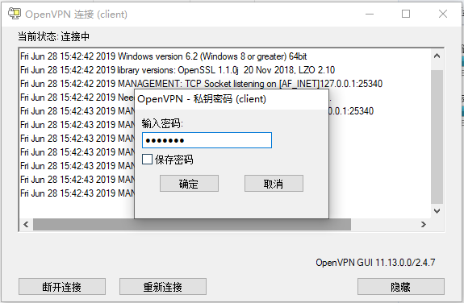

# 秘钥设置连接密码

## 创建新的用户weiying11,并设置证书密码
```bash
[ root@localhost 3.0.3]# cd /etc/openvpn/client/easy-rsa/3.0.3/
[ root@localhost 3.0.3]# ./easyrsa gen-req weiying11 #生成证书并设置密码

#导入reqwe年
[ root@localhost 3.0.3]# cd /etc/openvpn/easy-rsa/3.0.3/
[ root@localhost 3.0.3]# ./easyrsa import-req /etc/openvpn/client/easy-rsa/3.0.3/pki/reqs/weiying11.req weiying11 

#签发证书
[ root@localhost 3.0.3]#  ./easyrsa sign client weiying11


[ root@localhost 3.0.3]#  mkdir /etc/openvpn/client/weiying11
[ root@localhost 3.0.3]# cd /etc/openvpn/client/weiying11
[ root@localhost weiying11]# cp /etc/openvpn/easy-rsa/3.0.3/pki/ca.crt .
[ root@localhost weiying11]#  cp /etc/openvpn/easy-rsa/3.0.3/pki/issued/weiying11.crt .
[ root@localhost weiying11]# cp /etc/openvpn/client/easy-rsa/3.0.3/pki/private/weiying11.key .

#复制并更改客户端配置文件
[ root@localhost weiying11]# cp /etc/openvpn/client/weiying/client.ovpn /etc/openvpn/client/weiying11/
[ root@localhost weiying11]# vim /etc/openvpn/client/weiying11/client.ovpn

#将客户端文件打包发送给用户
```
客户端连接使用，要求输入密码
[](http://aishad.top/wordpress/wp-content/uploads/2019/06/mima.png)

# server端的证书管理
主要是证书的创建和吊销，对应的员工的入职和离职

## 设置证书自动过期
过期时间以服务器时间为准，开始检查证书的有效期是否在服务器时间为准的有效期内。
```bash
[root@openvpn-server easy-rsa]# pwd
/etc/openvpn/easy-rsa/3.0.3
[root@openvpn-server easy-rsa]# vim vars
117 #set_var EASYRSA_CERT_EXPIRE 3650 #默认3650天
117 set_var EASYRSA_CERT_EXPIRE 60#安装需求更改有效期
```

## 证书手动吊销
```bash
#查看证书状态为R吊销状态
[ root@localhost ~]# cat /etc/openvpn/easy-rsa/3/pki/index.txt
V	290625033944Z		F88D3DED349B5D791C4F15C5861D39D7	unknown	/CN=server
V	290625035849Z		3CC79A4684DA7B2CCB8D0FDFC0D3CE7D	unknown	/CN=weiying
V	290625073322Z		625FAE3BFE4B28BC1D5D61D851E68AC4	unknown	/CN=weiying11
```
吊销证书
```bash
cd /etc/openvpn/easy-rsa/3.0.3/
./easyrsa revoke zhangshijie
./easyrsa gen-crl
#编辑配置文件调用吊销证书的文件
vim /etc/openvpn/server.conf
crl-verify /etc/openvpn/easy-rsa/3.0.3/pki/crl.pem
[root@openvpn-server 3.0.3]# systemctl restart openvpn@server
[ root@localhost 3.0.3]# cat /etc/openvpn/easy-rsa/3/pki/index.txt
V	290625033944Z		F88D3DED349B5D791C4F15C5861D39D7	unknown	/CN=server
R	290625035849Z	190628075049Z	3CC79A4684DA7B2CCB8D0FDFC0D3CE7D	unknown	/CN=weiying
V	290625073322Z		625FAE3BFE4B28BC1D5D61D851E68AC4	unknown	/CN=weiying11
```