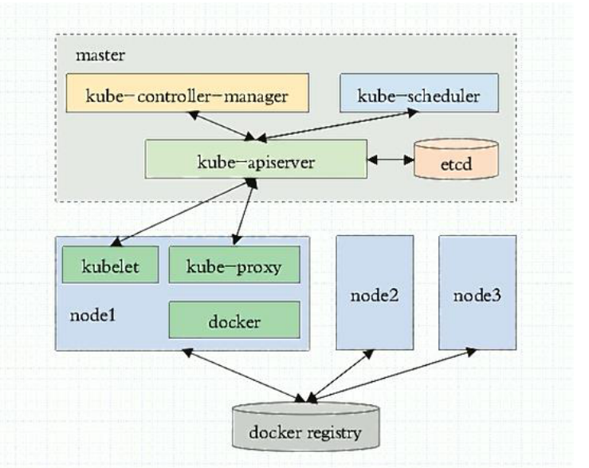

# kubernetes 集群的运行模式

1. 独立组件模式
系统的各个组件,直接以守护进程的方式运行在各个节点上,各个组件之间相互协作构成集群

2. 静态 pod 模式
除了 kubectl 和 docker 的其他组件,(如:etcd,kube-apiserver,kube-controller-manager,kube-shceduler等)都以静态 pod 对象运行于 master 节点之上

3. 自托管(self-hosted)模式
除了 kubectl 和 docker 的其他组件,运行为集群上的 pod 对象,打不同的是,这些 pod 对象托管在集群自身之上受控于 DaemonSet 类型的控制器,而非静态的 pod 对象


# 使用 kubeadm 搭建简单的 k8s 环境
使用 kubeadm 部署的 kubernetes 集群,其运行模式为上述的第二种或者第三种模式,默认为静态 pod 模式,需要使用自托管模式,在集群初始化的时候,在 kubeadm init 命令后面指定参数 --features-gates=selfHosting

部署规划:

master1: 192.168.100.111
node1: 192.168.100.116
node2: 192.168.100.117
node3: 192.168.100.118 (先不加入到集群,等集群搭建完毕后,以新结点添加到集群中)

#### kubeadm
使用 k8s 官方提供的部署工具 kubeadm 自动安装，需要在 master 和 node 节点上安装 docker 等组件，然后初始化，把管理端的控制服务和 node 上的服务都以pod 的方式运行

官方介绍:https://kubernetes.io/zh/docs/reference/setup-tools/kubeadm/kubeadm/

### 安装前准备
禁用 selinux,swap 和 iptables

### 具体步骤
1. master 和 node 先安装 kubelet，docker，kubeadm

2. master 节点运行 kubeadm init 初始化命令

3. 验证 master

4. Node 节点使用 kubeadm 加入 k8s master

5. 验证 node

6. 启动容器测试访问

### 开始安装部署

1. 安装必要的系统工具
```bash
root@master1:~# apt-get update && apt-get -y install apt-transport-https ca-certificates curl software-properties-common
```

2. 安装 docker
```bash
# step 2: 安装GPG证书
curl -fsSL https://mirrors.aliyun.com/docker-ce/linux/ubuntu/gpg | sudo apt-key add -
# Step 3: 写入软件源信息
sudo add-apt-repository "deb [arch=amd64] https://mirrors.aliyun.com/docker-ce/linux/ubuntu $(lsb_release -cs) stable"
# Step 4: 更新并安装Docker-CE
sudo apt-get -y update
sudo apt-get -y install docker-ce
# 安装指定版本的Docker-CE:
# Step 1: 查找Docker-CE的版本:
# apt-cache madison docker-ce
#   docker-ce | 17.03.1~ce-0~ubuntu-xenial | https://mirrors.aliyun.com/docker-ce/linux/ubuntu xenial/stable amd64 Packages
#   docker-ce | 17.03.0~ce-0~ubuntu-xenial | https://mirrors.aliyun.com/docker-ce/linux/ubuntu xenial/stable amd64 Packages
# Step 2: 安装指定版本的Docker-CE: (VERSION例如上面的17.03.1~ce-0~ubuntu-xenial)
# sudo apt-get -y install docker-ce=[VERSION]
```

3. 配置镜像加速器
```bash
sudo mkdir -p /etc/docker
sudo tee /etc/docker/daemon.json <<-'EOF'
{
  "registry-mirrors": ["https://qg2m7q97.mirror.aliyuncs.com"]
}
EOF
sudo systemctl daemon-reload
sudo systemctl restart docker
```

4. 配置阿里云仓库地址
配置阿里云镜像的 kubernetes 源(用于安装 kubelet kubeadm kubectl 命令)
```bash
apt-get update && apt-get install -y apt-transport-https
curl https://mirrors.aliyun.com/kubernetes/apt/doc/apt-key.gpg | apt-key add -
cat <<EOF >/etc/apt/sources.list.d/kubernetes.list
deb https://mirrors.aliyun.com/kubernetes/apt/ kubernetes-xenial main
EOF(手动输入 EOF)
apt-get update

```

5. 安装 kubeadm 命令
```bash
root@master1:~# apt-get install -y kubelet kubeadm kubectl
# 安装指定版本的 kubeadm

# 查看版本信息
root@master1:~# apt-cache madison kubeadm
# 安装指定版本
apt-get install -y kubelet=1.18.2-00  kubeadm=1.18.2-00 kubectl=1.18.2-00
```

6. 设置 kubelet开机自启动
```bash
root@master1:~# systemctl enable kubelet
root@master1:~# systemctl status kubelet
```

#### kubeadm 命令的使用

基本命令的使用:https://kubernetes.io/zh/docs/reference/setup-tools/kubeadm/kubeadm/

集群初始化命令的使用:https://kubernetes.io/zh/docs/reference/setup-tools/kubeadm/kubeadm-init/

```bash
root@master1:~# kubeadm --help

Usage:
  kubeadm [command]

Available Commands:
  alpha       预览一组可用的新功能以便从社区搜集反馈
  completion  Output shell completion code for the specified shell (bash or zsh)
  config      管理kubeadm集群的配置，该配置保留在集群的ConfigMap中
  help        查看帮助信息
  init        启动一个 kubernetes 主节点
  join        启动一个 Kubernetes 工作节点并且将其加入到集群
  reset       还原之前使用 kubeadm init 或者 kubeadm join 对节点产生的改变
  token       使用 kubeadm join 来管理令牌
  upgrade     更新一个 Kubernetes 集群到新版本
  version     查看版本嘻嘻

Flags:
      --add-dir-header           If true, adds the file directory to the header
      --log-file string          设置日志路径
      --log-file-max-size uint   设置日志文件最大的大小,单位为兆,默认为1800,0表示没有限制
      --rootfs string            宿主机的跟路径,也是 u 事使用绝对路径
      --skip-headers             为 true 表示:在log 日志里面不显示消息的头部信息
      --skip-log-headers        为 true 表示: 在日志文件李敏啊不记录头部信息
  -v, --v Level                  设置日志的记录级别
	--apiserver-advertise-address: 		API server 将要监听的地址
	--apiserver-bind-port int32 : 	API Server 绑定的端口,默认为6443
	--apiserver-cert-extra-sans stringSlice :可选的证书额外信息,用于指定 API Server 的服务器证书,可以是 ip 地址,也可以是 DNS 的名称
	--cert-dir string : 证书的存储路径,默认为/etc/kubernetes/pki
	--config string : kubeadm 配置文件的路径
	--ignore-preflight-errors stringSlice : 可以忽略检查过程中出现的错误信息,比如忽略 swap,如果为 all 就忽略所有
	--image-repository string: 设置镜像仓库,默认为k8s.gcr.io
	--kubernetes-version string: 选择 k8s 版本,默认为 stable-1
	--node-name string : 指定 node 的名称
	--pod-network-cidr string : 设置 pod ip 地址范围,如果设置了这个参数,将会为每个节点自动分配CIDR(无类别域间路由)
	--service-cidr string:设置 service 网络地址范围,默认值："10.96.0.0/12"
	--service-dns-domain string:设置域名,默认为 cluster.local
	--skip-certificate-key-print:不打印用于加密的 key 的信息
	--skip-phases strings :要跳过哪些阶段列表
	--skip-token-print: 跳过打印 token 信息
	--token : 指定 token
	--token-ttl : 指定 token 的过期时间,默认为24小时,0表示永不过期
	--upload-certs: 更新证书
```

##### 验证 kubeadm 的版本
```bash
root@master1:~# kubeadm version
kubeadm version: &version.Info{Major:"1", Minor:"18", GitVersion:"v1.18.2", GitCommit:"52c56ce7a8272c798dbc29846288d7cd9fbae032", GitTreeState:"clean", BuildDate:"2020-04-16T11:54:15Z", GoVersion:"go1.13.9", Compiler:"gc", Platform:"linux/amd64"}
```
> 注意:使用 kubeadm 工具安装 kubernetes 的时候,kubeadm 是哪个版本的就只能安装哪个版本的 k8s


#### 查看安装指定版本的 k8s 需要哪些镜像
```bash
root@master1:~# kubeadm config images list --kubernetes-version v1.18.2

k8s.gcr.io/kube-apiserver:v1.18.2
k8s.gcr.io/kube-controller-manager:v1.18.2
k8s.gcr.io/kube-scheduler:v1.18.2
k8s.gcr.io/kube-proxy:v1.18.2
k8s.gcr.io/pause:3.2
k8s.gcr.io/etcd:3.4.3-0
k8s.gcr.io/coredns:1.6.7
```

#### 下载镜像
初始化集群之前需要准备需要的镜像,但是由于官方的镜像无法下载,可以使用阿里云提供的镜像地址下载
```bash
docker pull registry.cn-hangzhou.aliyuncs.com/google_containers/kube-apiserver:v1.18.2
docker pull registry.cn-hangzhou.aliyuncs.com/google_containers/kube-controller-manager:v1.18.2
docker pull registry.cn-hangzhou.aliyuncs.com/google_containers/kube-scheduler:v1.18.2
docker pull registry.cn-hangzhou.aliyuncs.com/google_containers/kube-proxy:v1.18.2
docker pull registry.cn-hangzhou.aliyuncs.com/google_containers/pause:3.2
docker pull registry.cn-hangzhou.aliyuncs.com/google_containers/etcd:3.4.3-0
docker pull registry.cn-hangzhou.aliyuncs.com/google_containers/coredns:1.6.7
```

也可以在初始化集群的时候,指定阿里云的镜像仓库

1. 初始化 master
```bash
root@master1:~# kubeadm init --apiserver-advertise-address=192.168.100.111 --apiserver-bind-port=6443 --kubernetes-version=v1.18.2 --pod-network-cidr=10.10.0.0/16 --service-cidr=10.20.0.0/16 --service-dns-domain=k8stest.local --image-repository=registry.cn-hangzhou.aliyuncs.com/google_containers --ignore-preflight-errors=swap
.....
下载镜像,并进行初始化操作
.....


Your Kubernetes control-plane has initialized successfully!

To start using your cluster, you need to run the following as a regular user:

  mkdir -p $HOME/.kube
  sudo cp -i /etc/kubernetes/admin.conf $HOME/.kube/config
  sudo chown $(id -u):$(id -g) $HOME/.kube/config
# 提示使用普通用户,将/etc/kubernetes/admin.conf文件拷贝到家目录下,并更改权限
# 只有进行了这一步之后,才能执行 kubectl 命令

You should now deploy a pod network to the cluster.
Run "kubectl apply -f [podnetwork].yaml" with one of the options listed at:
  https://kubernetes.io/docs/concepts/cluster-administration/addons/
# 部署网络

Then you can join any number of worker nodes by running the following on each as root:

kubeadm join 192.168.100.111:6443 --token ant2q7.jweqls7k26k0qadd \
    --discovery-token-ca-cert-hash sha256:79c36558318d8d1d376592f9c4cff1b0e0b2101f23c43e417d9787a07095341f
# 这个参数一定要记住,包含 token 的值
```
> 注意:安装 k8s 的版本一定要与 kubeadm 的版本一致

查看下载的镜像
```bash
root@master1:~# docker images
REPOSITORY                                                                    TAG                 IMAGE ID            CREATED             SIZE
registry.cn-hangzhou.aliyuncs.com/google_containers/kube-proxy                v1.18.2             0d40868643c6        5 weeks ago         117MB
registry.cn-hangzhou.aliyuncs.com/google_containers/kube-apiserver            v1.18.2             6ed75ad404bd        5 weeks ago         173MB
registry.cn-hangzhou.aliyuncs.com/google_containers/kube-controller-manager   v1.18.2             ace0a8c17ba9        5 weeks ago         162MB
registry.cn-hangzhou.aliyuncs.com/google_containers/kube-scheduler            v1.18.2             a3099161e137        5 weeks ago         95.3MB
registry.cn-hangzhou.aliyuncs.com/google_containers/pause                     3.2                 80d28bedfe5d        3 months ago        683kB
registry.cn-hangzhou.aliyuncs.com/google_containers/coredns                   1.6.7               67da37a9a360        3 months ago        43.8MB
registry.cn-hangzhou.aliyuncs.com/google_containers/etcd                      3.4.3-0             303ce5db0e90        6 months ago        288MB
```

2. master 配置 kube 证书
```bash
# 证书中包括kube-apiserver地址及其相关信息
root@master1:~# mkdir -p $HOME/.kube
root@master1:~# sudo cp -i /etc/kubernetes/admin.conf $HOME/.kube/config
root@master1:~# sudo chown $(id -u):$(id -g) $HOME/.kube/config

# cat /root/.kube/config
```

3. 验证k8s的信息
```bash
root@master1:~# vim key
root@master1:~#  kubectl get cs
NAME                 STATUS    MESSAGE             ERROR
scheduler            Healthy   ok                  
controller-manager   Healthy   ok                  
etcd-0               Healthy   {"health":"true"} 
```

4. 查看当前的节点
```bash
root@master1:~# kubectl get nodes
NAME      STATUS     ROLES    AGE     VERSION
master1   NotReady   master   3m40s   v1.18.3
```

5. 部署flanne 网络服务
地址:https://github.com/coreos/flannel/
```bash
root@master1:~# kubectl apply -f https://raw.githubusercontent.com/coreos/flannel/master/Documentation/kube-flannel.yml
podsecuritypolicy.policy/psp.flannel.unprivileged created
clusterrole.rbac.authorization.k8s.io/flannel created
clusterrolebinding.rbac.authorization.k8s.io/flannel created
serviceaccount/flannel created
configmap/kube-flannel-cfg created
daemonset.apps/kube-flannel-ds-amd64 created
daemonset.apps/kube-flannel-ds-arm64 created
daemonset.apps/kube-flannel-ds-arm created
daemonset.apps/kube-flannel-ds-ppc64le created
daemonset.apps/kube-flannel-ds-s390x created
```

6. 插件pod的状态
```bash
root@master1:~# kubectl get pod --all-namespaces
NAMESPACE     NAME                              READY   STATUS    RESTARTS   AGE
kube-system   coredns-546565776c-ltp5q          1/1     Running   0          24m
kube-system   coredns-546565776c-rprsl          1/1     Running   0          24m
kube-system   etcd-master1                      1/1     Running   0          24m
kube-system   kube-apiserver-master1            1/1     Running   0          24m
kube-system   kube-controller-manager-master1   1/1     Running   0          24m
kube-system   kube-flannel-ds-amd64-7vvcn       1/1     Running   0          21m
kube-system   kube-proxy-tm2pf                  1/1     Running   0          24m
kube-system   kube-scheduler-master1            1/1     Running   0          24m
```

如果出现某个镜像不能下载的情况,在国内的网站下载后,改一下tig标签,例如:
```bash
[ root@weiying ~]# docker pull quay-mirror.qiniu.com/coreos/flannel:v0.12.0-amd64
root@master1:~# docker tag quay-mirror.qiniu.com/coreos/flannel:v0.12.0-amd64 quay.io/coreos/flannel:v0.12.0-amd64 
```

7. 添加两个node节点
各 node 节点都要安装 docker kubeadm kubelet ，即配置 apt 仓库、配置 docker 加速器、安装命令、启动 kubelet 服务。
```bash
root@node1:~# systemctl start docker kubelet
root@node1:~# systemctl enable docker kubelet
root@node1:~# kubeadm join 192.168.100.111:6443 --token 86s41l.sawm1oxpgyaexcqr --discovery-token-ca-cert-hash sha256:6d5a7bdf890e4595b464b5f5a42b60c85b4c3370af875c820f5e4b2c9918c1d7

# token的值为master节点初始化的时候,生成的token
# 两个节点都要执行这个命令,如果出现一下情况,说明某个镜像没有拉取成功,使用上面的方法继续
root@master1:~# kubectl get pod --all-namespaces
NAMESPACE     NAME                              READY   STATUS                  RESTARTS   AGE
kube-system   coredns-546565776c-ltp5q          1/1     Running                 0          158m
kube-system   coredns-546565776c-rprsl          1/1     Running                 0          158m
kube-system   etcd-master1                      1/1     Running                 0          159m
kube-system   kube-apiserver-master1            1/1     Running                 0          159m
kube-system   kube-controller-manager-master1   1/1     Running                 0          159m
kube-system   kube-flannel-ds-amd64-4llfb       0/1     Init:ImagePullBackOff   0          9m35s
kube-system   kube-flannel-ds-amd64-7vvcn       1/1     Running                 0          156m
kube-system   kube-flannel-ds-amd64-fpztd       1/1     Running                 1          35s
kube-system   kube-proxy-hr9hw                  1/1     Running                 0          35s
kube-system   kube-proxy-sqmh9                  1/1     Running                 0          9m35s
kube-system   kube-proxy-tm2pf                  1/1     Running                 0          158m
kube-system   kube-scheduler-master1            1/1     Running                 0          159m
```

> 加入到集群的node节点,会自动加入到master节点,并自动下载镜像启动,直到在master节点看到的是ready状态

```bash
root@master1:~# kubectl get nodes
NAME      STATUS   ROLES    AGE    VERSION
master1   Ready    master   162m   v1.18.3
node1     Ready    <none>   13m    v1.18.3
node2     Ready    <none>   4m1s   v1.18.3
```

### 创建容器并测试

1. 分别在node节点添加防火墙规则
```bash
# 开启forward
# Docker从1.13版本开始调整了默认的防火墙规则
# 禁用了iptables filter表中FOWARD链
# 这样会引起Kubernetes集群中跨Node的Pod无法通信
root@node1:~# iptables -P FORWARD ACCEPT

# 同样建议将这条规则加入到开机启动项 rc.local 中,Ubuntu 1084 默认没有 rc.local 文件,需要手动创建
ln -fs /lib/systemd/system/rc-local.service /etc/systemd/system/rc-local.service
vim /etc/systemd/system/rc-local.service
# 在最下面添加
[Install]
WantedBy=multi-user.target
Alias=rc-local.service

# 创建 rc.loacl 文件
vim /etc/rc.local
!/bin/bash

iptables -P FORWARD ACCEPT

# 添加执行权限
chmod +x /etc/rc.local
```

2. 创建容器,测试网络连接
```bash
# 创建容器
root@master1:~# kubectl run net-test1 --image=alpine --replicas=2 sleep 360000
root@master1:~# kubectl run net-test2 --image=alpine --replicas=2 sleep 360000
```

3. 查看了创建的容器
```bash
root@master1:~# kubectl get pods -o wide
NAME        READY   STATUS    RESTARTS   AGE     IP          NODE    NOMINATED NODE   READINESS GATES
net-test1   1/1     Running   0          2m48s   10.10.2.2   node2   <none>           <none>
net-test2   1/1     Running   0          56s     10.10.1.2   node1   <none>           <none>
```

4. 进入到容器中测试网络
```bash
# 进入到net-test1 pod 中,测试如net-test2 的网络连通性
root@master1:~# kubectl exec -it net-test2 sh

/ # ifconfig eth0
eth0      Link encap:Ethernet  HWaddr 6E:24:08:74:50:66  
          inet addr:10.10.1.2  Bcast:0.0.0.0  Mask:255.255.255.0
          UP BROADCAST RUNNING MULTICAST  MTU:1450  Metric:1
          RX packets:38 errors:0 dropped:0 overruns:0 frame:0
          TX packets:11 errors:0 dropped:0 overruns:0 carrier:0
          collisions:0 txqueuelen:0 
          RX bytes:2732 (2.6 KiB)  TX bytes:798 (798.0 B)

/ # ping 10.10.2.2
PING 10.10.2.2 (10.10.2.2): 56 data bytes
64 bytes from 10.10.2.2: seq=0 ttl=62 time=0.391 ms
64 bytes from 10.10.2.2: seq=1 ttl=62 time=0.294 ms
64 bytes from 10.10.2.2: seq=2 ttl=62 time=0.291 ms
64 bytes from 10.10.2.2: seq=3 ttl=62 time=0.270 ms
```

## 集群初始的流程

kubeadm init 通过执行一下步骤引导一个 kubernetes master 节点
```bash
root@master1:~# kubeadm init --apiserver-advertise-address=192.168.100.111 --apiserver-bind-port=6443 --kubernetes-version=v1.18.2 --pod-network-cidr=10.10.0.0/16 --service-cidr=10.20.0.0/16 --service-dns-domain=k8stest.local --image-repository=registry.cn-hangzhou.aliyuncs.com/google_containers --ignore-preflight-errors=swap
```

详细的集群初始参数和初始化过程请查看:https://k8smeetup.github.io/docs/reference/setup-tools/kubeadm/kubeadm-init/#init-workflow