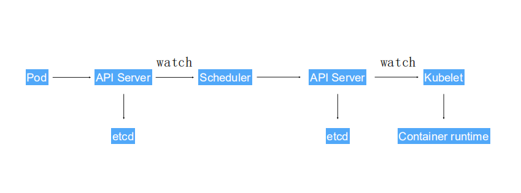

## pod对象的生命周期

pod对象从被创建到被销毁总是处于以下几种状态:

- Pending:API server 创建了pod资源对象,并将pod资源对象存入到了etcd中,但是它尚未被调度完成或者处于从仓库下载镜像的过程中
- Running:Pod已经被调度到了某个节点,并且所有的容器都已经被kubelet创建完成
- Succeeded: Pod 中的所有容器都已经成功终止,并且不会重新启动
- Faild: 所有的容器都已经被终止,但是至少有一个容器终止失败,并返回了一个非0值得退出状态码或者已经被系统终止
- Unknown: API server 无法正常获取到pod的信息,通常是因为pod所在的node节点的kubectl 无法与master节点通信导致的

## pod的创建过程

 

1. 用户通过kubectl 或者其他的API 客户端对象提交了pod创建的请求给API Server
2. API server 尝试将pod对象的相关信息写入到etcd中,待写入操作执行完成,API server 会返回确认信息给客户端
3. api server 开始反应etcd中状态的变化
4. 所有的kubernetes组件均能使用**watch**机制来追踪检查API server 上相关信息的变动
5. kube-scheduler 通过其 **watch** 机制察觉到Api server 创建了新的pod对象,但尚未绑定到任何的工作节点上
6. kube-scheduler 为pod 对象挑选一个工作节点并将其结果提交到API server
7. 调度结果由API server 中更新到ectd 存储系统,而且API Server 也开始反应此pod对象的调度结果
8. pod被调度到目标工作节点,上面的kubelet 尝试在当前节点上调用Docker启动容器并将容器的结果状态返回至API server
9. API server 将pod状态信息存入到etcd中
10. 在etcd确认写入操作成功完成之后,API server 将确认信息发送给相关的kubelet,事假将通过它被接受

### pod 生命周期中的其他重要行为

除了创建应用容器之外,用户还可以为pod对象添加其他的多种行为

1. 初始化容器(init container)

即应用程序的主容器启动之前要运行的容器,常用于为主容器执行一些预置操作,它们具有两种特征:

- 初始化容器运行完成直至结束,某初始化容器运行失败,kubernetes会重新启动它直至成功完成
- 每个初始化容器都必须安装定义的顺序串行运行

初始化容器的主要包括以下几种:

- 用于运行特定的工具程序,因为某些原因,这些程序不能运行在主容器中
- 提供主容器镜像中不存在的工具程序或者自定义代码
- 为容器镜像的构建和部署人员提供了分离,独立工作的途径,使得它们不必协同来制作一个镜像
- 初始化容器要先于应用容器串行启动运行完成,因此可用于延迟主容器的启动,直至某依赖条件满足

```bash
apiVersion: v1
kind: Pod
metadata:
  name: myapp-pod
  lables:
    app: myapp
    
spec:
  initContainers:
  - name: init-something
    image: busybox
    command: ['sh','-c','sleep 10']
  containers:
  - name: myapp-container
    image: ikubernetes/myapp:v1
```

2. 生命周期钩子函数

- postStart : 用于容器创建之后立即运行的钩子处理器,不过不能确保在容器中的进程之前运行
- preStop: 在容器终止操作之前立即运行的钩子处理器,以同步**(在执行完成之后才会返回结果)**的方式调用,会阻塞删除容器的操作

> 钩子处理器的实现方式有两种:分别是EXEC和HTTP,exec在钩子触发时直接在当前容器中执行用户定义的命令,http则是当触发时想某URL发起http请求

```bash
apiVersion: v1
kind: Pod
metadata:
  name: myapp-pod
  lables:
    app: myapp
    
spec:
  containers:
  - name: myapp-container
    image: ikubernetes/myapp:v1
    lifecycle:
      postStart:
        exec:
          command: ["/bin/sh","-c",echo 'this is a page' > /usr/share/nginx/html/test.html]
```

3. 容器探测

- ExecAction: 在容器中执行一个命令,并根据其返回状态码进行诊断的操作,称为exec探测,状态码为0表示成功,其他表示失败
- TCPSocketAction: 通过与容器的某TCP端口建立建立进行诊断
- HTTPGetAction:通过容器ip地址的某指定端口下的path进行http get请求,2xx或者3xx表示成功

#### 容器的重启策略

在yaml文件中,使用restartPolicy 参数指定

1. Always : 但凡pod对象终止就将其重启,此项为默认
2. OnFailure : 仅在pod对象出现错误的时候才重启
3. Never: 从不重启

### pod的终止过程

1. 用户提交删除pod的请求
2. API server 中的pod对象会随着时间的推移而更新,在宽限时间内(默认为30s),pod被视为dead
3. 将pod标记为**Terminating**状态
4. (与第三部同时进行)kubelet 在监控到了pod的状态变为 Terminating 的同时,启动pod关闭过程
5. (与第三部同时进行) 端点控制器监控到了pod对象的关闭行为时将其匹配到此端点的service 资源全部从端点列表中移除
6. 如果当前pod对象定义了preStop钩子处理器,将其标记为Terminating 状态后,立即会以同步的方式启动执行
7. pod对象中的容器紧凑收到**TERM**信号
8. 宽限时间结束后,若还有处于运行的进程,pod对象会立即收到SIGKILL信号
9. kubelet 请求api server 将此pod的宽限时间设置为0,从而完成删除操作

## pod 的存活性探测

pod 的spec参数为pod提供了一些探针,如果存活性探测失败的话,就会重启容器

1. 使用 exec 探针
exec 探针通过在容器中执行命令,根据命令的返回结果来对容器的健康值做判断,如果返回的是0,为成功,否则失败,查看exec探针的使用方法
```bash
root@master1:~# kubectl explain pod.spec.containers.livenessProbe.exec
KIND:     Pod
VERSION:  v1

RESOURCE: exec <Object>

DESCRIPTION:
     One and only one of the following should be specified. Exec specifies the
     action to take.

     ExecAction describes a "run in container" action.

FIELDS:
   command	<[]string>
     Command is the command line to execute inside the container, the working
     directory for the command is root ('/') in the container's filesystem. The
     command is simply exec'd, it is not run inside a shell, so traditional
     shell instructions ('|', etc) won't work. To use a shell, you need to
     explicitly call out to that shell. Exit status of 0 is treated as
     live/healthy and non-zero is unhealthy.


```

发现exec探针只有command一个参数,用来指定要执行的命令

```bash
apiVersion: v1
kind: Pod
metadata:
  name: myapp-pod
  lables:
    app: myapp
    
spec:
  containers:
  - name: myapp-container
    image: ikubernetes/myapp:v1
    args: ["/bin/sh","-c","touch /tmp/healthy;sleep 60;rm -rf /tmp/healthy;sleep 600"]
    livenessProbe:
      exec:
        command: ["test","-e","/tmp/healthy"]
```

2. http 探针
基于http请求的方式,想指定的url发送http get 请求,根据返回的响应码判断,响应码为2xx或者3xx为成功,其他的为失败

```bash
root@master1:~# kubectl explain pod.spec.containers.livenessProbe.http
error: field "http" does not exist
root@master1:~# kubectl explain pod.spec.containers.livenessProbe.httpGet
KIND:     Pod
VERSION:  v1

RESOURCE: httpGet <Object>

DESCRIPTION:
     HTTPGet specifies the http request to perform.

     HTTPGetAction describes an action based on HTTP Get requests.

FIELDS:
   host	<string>
     Host name to connect to, defaults to the pod IP. You probably want to set
     "Host" in httpHeaders instead.

   httpHeaders	<[]Object>
     Custom headers to set in the request. HTTP allows repeated headers.

   path	<string>
     Path to access on the HTTP server.

   port	<string> -required-
     Name or number of the port to access on the container. Number must be in
     the range 1 to 65535. Name must be an IANA_SVC_NAME.

   scheme	<string>
     Scheme to use for connecting to the host. Defaults to HTTP
```

设置HTTP探针
```bash
apiVersion: v1
kind: Pod
metadata:
  name: myapp-pod
  lables:
    app: myapp
    
spec:
  containers:
  - name: myapp-container
    image: nginx:1.12-alpine
    ports:
    - name: http
      containerPort: 80
    livenessProbe:
      httpGet:
        path: /
        port: http
        scheme: http
```

3. TCP 探针
使用向指定的端口发起TCP 链接请求的方式进行存活性探测,如果连接成功说明通过,如果不成功说明失败,但是这种方式不一定可靠,因为有的时候端口探测成功,不能说明资源可以正常使用
```bash
root@master1:~# kubectl explain pod.spec.containers.livenessProbe.tcpSocket
KIND:     Pod
VERSION:  v1

RESOURCE: tcpSocket <Object>

DESCRIPTION:
     TCPSocket specifies an action involving a TCP port. TCP hooks not yet
     supported

     TCPSocketAction describes an action based on opening a socket

FIELDS:
   host	<string>
     Optional: Host name to connect to, defaults to the pod IP.

   port	<string> -required-
     Number or name of the port to access on the container. Number must be in
     the range 1 to 65535. Name must be an IANA_SVC_NAME.
```

设置tpc探针
```bash
apiVersion: v1
kind: Pod
metadata:
  name: myapp-pod
  lables:
    app: myapp
    
spec:
  containers:
  - name: myapp-container
    image: nginx:1.12-alpine
    ports:
    - name: http
      containerPort: 80
    livenessProbe:
      tcpSocket:
        port: http
```

##### 其他参数

-  initialDelaySeconds: 存活性探测的延时时长,指的是自从容器启动后多久开始进行存活性探测,默认为0
-   timeoutSeconds: 存活探测的超时时长,默认为1s
-   successThreshold: 处于失败状态的时候,至少要成功探测多少次才能通过检测
-   failureThreshold:处于成功的状态的时候,至少几次探测失败才被视为检测不通过