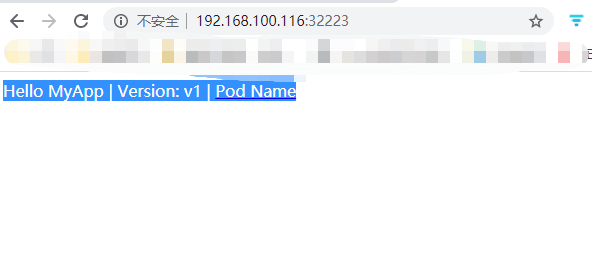

## service
service 是kubernetes的核心资源类型之一,通常可以看做是微服务的一种实现,事实上它是一种抽象:通过规则定义出由多个pod对象组合而成的逻辑集合,以及访问这些pod的策略

## service的相关概念

由Deployment控制器等管理的pod资源,在pod资源重启之后,相应变化的部分还有pod的ip地址访问接口等,例如当我们使用nginx或者tomcat的时候,访问的ip地址发生了变化会导致用户的不能访问,而pod的扩容或者缩容,都会导致客户端在访问的时候出现问题,所以特意使用service来解决这类文件

service 资源基标签选择器将一组pod定义成一个逻辑组合,并通过自己的ip地址和端口调度代理请求至组内的pod对象之上,它向客户端隐藏了真实的处理用户请求的pod资源,使得客户端看上去就是service在响应并处理用户请求一样

service对象的ip地址也称为cluster ip,它位于kubernetes集群配置指定专用ip地址范围之内,而是一种虚拟ip地址,它在service对象创建之后保持不变,并且能够被用一个集群中的pod资源所访问,service端口用于接收客户端的请求并将其转发至后端的pod中的应用的响应端口中,因此这种代理机制也称为`端口代理`或者四层代理,它工作于TCP/IP协议栈的传输层

通过其标签选择器匹配到后端的pod资源不止一个的时候,service资源能够以负载均衡的方式进行流量调度,实现了请求流量的分发机制,service与pod对象之间的关联关系通过标签选择器与松耦合的方式建立,它可以先于pod对象创建而不会发生错误,于是创建service与pod资源的任务可以由不同用户分别完成,

service资源会通过API server持续的监视(watch)标签选择器匹配到后端的pod对象,并实现跟踪各个对象实时的变动

> service并不是直接与pod对象对接,它们之间还有一层叫做EndPoint资源对象,它是一个由ip地址和端口组层的列表,EndPoint在service创建的时候会自动的窗帘

### 虚拟ip地址和服务代理

简单的来说,service对象就是工作节点上的iptables或者ipvs规则,用于将到达service对象ip地址的流量调度转发至相应的Endpoint对象指定的ip地址和端口上,工作于每个工作节点的kube-proxy组件通过API Server持续监控着各个service 及其关联的pod对象,并将其创建或者变动实时反映至当前工作节点的iptables或者ipvs规则上

service ip事实上是用于生产iptables或者ip规则时使用的ip地址,它仅用于实现kubernetes集群网络的内部通信,并且能够将规则中的转发服务的请求作为目标地址基于相应,这也是被称为虚拟ip的原因,kube-proxy将请求代理到相应端点的方式有三种: userspace,iptables和ipvs

#### userspace
此处的userspace是指linux操作系统的用户空间,这种模型中,kube-proxy负责跟踪API Server上的service和EndPoint对象的变动情况,并根据此调整service资源的定义

对于每个service对象,它会随机打开一个本地端口(运行于用户控件的kube-proxy进程负责监听),任何到达此代理端口的链接请求都将被代理至当前service资源厚点的各个pod上面,默认的调度算法是轮询

另外此类的service对象还会创建iptables规则以捕获任何到达Clusterip和端口的流量

> 这种代理模式中,请求流量到达内核空间之后经由套接字送往用户空阿金的kube-proxy,而后在由它送回到内核空间,并调度至后端的pod,这种方式中,请求在内核空间和用户空间来回转发必然会导致效率不高

#### iptables
iptables代理模型中,kube-proxy复制跟踪API server 上的service和EndPoint对象的变动,并据此作出service资源定义的变动,同时对于每个service,它都会创建iptables规则,直接捕获到达clusterIP和port的流量,并将其重定向到当前service的后端对于每个EndPoint对象,service资源会为其创建iptables规则并关联至后端的pod对象,默认的调度算法是随机调度`random`

在创建service资源的时候,集群中每个节点上的kube-proxy都会收到通知并将其定义为当前节点上的iptables规则,用于转发工作接口与此service资源的ClusterIP和端口的相关流量,客户端发来的请求被相关的iptables规则进行调度后再转发至集群内的pod对象之上

> 相对于userspace模型来说,iptables 模型无需将流量在用户空间和内核空间来回切换,因而更加高效和可靠,缺点就是iptables代理模型,不会再被选中的pod资源无响应的时候进行重定向,而userspace模型可以

#### ipvs
自从1.11版本之后,ipvs为默认的模型,此种模型中,kube-proxy跟踪API server 上的sercie和EndPoint的变动,据此来调用netlink接口创建ipvs规则,并确保API server中变动保持一致

> 与iptables的不同之处在于仅在其请求流量的调度功能由ipvs实现,余下的其他功能仍然由iptables完成

类似iptables模型,ipvs构建与netfilter钩子函数之上,但它使用hash表作为底层数据结构并工作于内核空间,因此具有流量转发速度快,规则同步性能好的热点,另外ipvs支持众多的调度算法

## 创建service资源

创建service资源的方式有两种,一是通过`kubectl expose`创建,另一种是通过资源清单创建

定义service资源对象的时候.spec字段常用的字段就是selector和ports,分别用于定义使用的标签选择器和要暴露的端口
```bash
# vim service-example.yml

kind: Service
apiVersion: v1
metadata:
  name: myapp-svc
spec:
  selector:
    app: myapp
  ports:
  - protocol: TCP
    port: 80
    targetPort: 80
```

创建资源并查看
```bash
# kubectl get pods --show-labels 
No resources found in default namespace.
root@master1:~# kubectl apply -f service-example.yml 
service/myapp-svc created

root@master1:~# kubectl get svc myapp-svc  -o wide
NAME        TYPE        CLUSTER-IP      EXTERNAL-IP   PORT(S)   AGE   SELECTOR
myapp-svc   ClusterIP   10.20.197.242   <none>        80/TCP    27s   app=myapp
```

> service 资源myapp-svc通过标签选择器关联标签为`app=myapp`的各个pod对象,它会自动的创建名为myapp-svc的EndPoint对象,并自动的创建一个ClusterIP,暴露的端口由port字段指定,后端pod对象的端口由targetPort给出

创建标签为`app=myapp`的对象
```bash
# vim deploy_demo.yaml 

apiVersion: apps/v1
kind: Deployment
metadata:
  name: myapp-deploy
spec:
  replicas: 3
  selector:
    matchLabels:
      app: myapp
  template:
    metadata:
      labels:
        app: myapp
    spec:
      containers:
      - name: myapp
        image: ikubernetes/myapp:v1
        ports:
        - containerPort: 80
          name: http

```

创建Deployment资源,并查看EndPoint资源
```bash
# kubectl get pods -l app=myapp -o wide
NAME                            READY   STATUS    RESTARTS   AGE   IP            NODE    NOMINATED NODE   READINESS GATES
myapp-deploy-7866747958-5spkl   1/1     Running   0          26s   10.10.1.36    node1   <none>           <none>
myapp-deploy-7866747958-c2hxl   1/1     Running   0          26s   10.10.3.192   node3   <none>           <none>
myapp-deploy-7866747958-nlf5w   1/1     Running   0          26s   10.10.2.187   node2   <none>           <none>
# kubectl get endpoints myapp-svc 
NAME        ENDPOINTS                                     AGE
myapp-svc   10.10.1.36:80,10.10.2.187:80,10.10.3.192:80   6m18s
```

### 向service对象请求服务
service默认的类型为ClusterIP,它仅能用于接收来自集群中的pod对象中的客户端程序的访问请求

下面创建一个专用的pod对象,利用其交互式接口完成访问测试
```bash
# 1. 创建一个临时的容器
# kubectl run cirros-$RANDOM --rm -it --image=cirros -- sh

# 2. 对clusterip发起访问请求
# curl http://10.20.197.242:80/
Hello MyApp | Version: v1 | <a href="hostname.html">Pod Name</a>

# 3. 多次请求/hostname.html页面,可以查看pod的主机名,验证调度
# for loop in 1 2 3 4; do curl http://10.20.197.242:80/hostname.html;done
myapp-deploy-7866747958-c2hxl
myapp-deploy-7866747958-nlf5w
myapp-deploy-7866747958-5spkl
myapp-deploy-7866747958-c2hxl
```

由于当前集群使用的是iptables模式,那么调度为随机调度,反复测试可以观察到预期效果

### service会话粘性

service还支持session affinity(会话粘性)机制,它能将来自同一个客户端的请求转发至相同的pod对象,这意味着将会影响调度算法的流量分发功能,进而降低负载均衡的效果

会话粘性的效果仅会在一定时间内生效,默认为 10800秒,超出时长之后,客户端再次访问会被调度到新的pod对象,另外service资源你的会话粘性机制仅能基于客户端ip识别客户端身份,因此效果可能不佳

service 资源通过`serices.spec.sessionAffinity`和`service.spec.sessionAffinityConfig`字段配置会话粘性

- `serices.spec.sessionAffinity` 字段用于定义会话粘性使用的类型,支持一下两种属性
  - None: 不使用会话粘性,默认值
  - ClientIP: 基于客户端ip地址识别客户端身份

- `service.spec.sessionAffinityConfig` 用于配置会话粘性的保持时长,是一个嵌套总段,其可用的时长范围是1-86400,默认为10800秒
```bash
spec:
  sessionAffinity: ClientIP
  sessionAffinityConfig:
    clientIP:
      timeoutSecond: <integer> 默认为10800
```

修改之前的service
```bash
# kubectl patch services myapp-svc -p '{"spec": {"sessionAffinity": "ClientIP"}}'
```


  再次使用客户端访问测试
```bash
# for loop in 1 2 3 4; do curl http://10.20.197.242:80/hostname.html;done
myapp-deploy-7866747958-c2hxl
myapp-deploy-7866747958-c2hxl
myapp-deploy-7866747958-c2hxl
myapp-deploy-7866747958-c2hxl
```

> 从上面的输出结果中,我们可以看出,设置了会话粘性之后,相同的客户端访问都被调度到了同一个pod对象上面


## 服务发现

服务发现就是服务或者应用之间相互定位的过程

服务发现机制的基本实现,一般是实现部署好一个网络为止较为稳定的服务注册中心,服务端向注册中心注册自己的位置信息,并在变动后及时的更新,客户端周期性的从注册中心中获取最新的服务端的位置信息,从而获取到要访问的目标资源,复杂的服务发现机制还能够让服务端提供其描述信息,状态信息以及资源使用信息等,从而让客户端实现更为复杂的服务选择逻辑


实践中,服务发现分为以下两种模式:

- 客户端发现:由客户端到注册中心发现其依赖的服务的相关信息,因此需要内置的服务发现程序和服务发现逻辑
- 服务端发现:这种方式需要额外的使用一个叫做中央路由或者负载均衡的组件,服务客户端将请求发送到中央路由或者负载均衡器,它们复制发现注册中心,并查询服务端的位置信息,并将客户端的请求转发给服务端

由此可见,注册中心是服务发现落地的核心组件,事实上DNS可以看做是最原始的服务发现系统之一,但是在服务的动态性很强大场景中,DNS记录的传播速度可能会跟不上服务的变更速度,所以实践中一般使用zookeeper和etcd等分布式键值存储系统,不过这些只能提供基础的键值存储功能,而且这些非常注重数据的一致性,这与有着高的服务可用性要求的微服务发现场景中的需求不太相符

Netflix的Eureka是目前比较流行的服务发现系统之一,它是专门用来实现服务发现系统的,以可用性的目的为先,另一个同级别的实现是Consul,它与服务发现的基础功能之外还提供了多数据中心的部署能力等一系列出众的特色

尽管传统的DNS不适合服务发现的场景中,但是ShyDNS项目(后来的kubeDNS),它结合和DNS,Golang以及Raft算法构建与etcd之上,为kubernetes系统实现了一种服务发现机制,service 资源为kubernetes提供了一个较为稳定的抽象层,这有点类似于服务端发现的方式,于是也就不存在DNS服务的时间窗口的问题

kubernetes 在1.3版本之后,其服务发现使用了kubeDNS,不过在新的版本中,已经默认使用了CNCF的CoreDNS

### 服务发现的方式:环境变量

创建Pod资源的时候,kubelet会将其所属名称空间内的每个活动的service对象以及一系列环境变量注入其中,支持使用kubernetes service环境变量以及与Docker的link兼容的变量

1. kubernetes service 环境变量
kubernetes 为每个service资源生成包括以下形式的环境变量在内的一系列的环境变量
,在同一个名称空间中创建的pod对象都会自动的拥有这些环境变量

- `{SVCNAME}_SERVICE_HOST`
- `{SVCNAME}_SERVICE_PORT`

> 如果SVCNAME中使用了连接线,那么kubernetes会在定义为环境变量的时候自动的将其装换为下划线

```bash
# 查看之前创建的service以及pod的环境变量
# kubectl exec myapp-deploy-7866747958-5spkl env 
...
MYAPP_SVC_SERVICE_HOST=10.20.197.242
MYAPP_SVC_SERVICE_PORT=80
...
```

2. docker link 形式的环境变量
docker 使用--link 选项实现容器链接是所设置的环境变量形式,在创建pod的数据卷,kubernetes也会将与此形式兼容的一系列的环境变量注入pod中

例如,在service资源myapp-svc创建后创建pod对象中查看可用的环境变量,其名称为`MYAPP_SVC_SERVICE`开头的就是kubernetes service 环境变量,名称中不包括SERVICE字样的就是docker link 环境变量
```bash
# kubectl exec myapp-deploy-7866747958-5spkl printenv | grep MYAPP
MYAPP_PORT=tcp://10.20.210.54:80
MYAPP_PORT_80_TCP_PORT=80
MYAPP_SERVICE_HOST=10.20.210.54
MYAPP_PORT_80_TCP_ADDR=10.20.210.54
MYAPP_SVC_PORT_80_TCP_PORT=80
MYAPP_SVC_PORT_80_TCP_ADDR=10.20.197.242
MYAPP_SERVICE_PORT=80
MYAPP_PORT_80_TCP_PROTO=tcp
MYAPP_SVC_SERVICE_HOST=10.20.197.242
MYAPP_SVC_SERVICE_PORT=80
MYAPP_SVC_PORT=tcp://10.20.197.242:80
MYAPP_PORT_80_TCP=tcp://10.20.210.54:80
MYAPP_SVC_PORT_80_TCP=tcp://10.20.197.242:80
MYAPP_SVC_PORT_80_TCP_PROTO=tcp
```

基于环境变量的服务发现功能简单,易用,但是有着一定的局限性,例如金鱼那些创建pod对象在同一个名称空间且实现存在的service对象信息才会以环境变量的形式注入,而处于不同名称空间的不会被注入

## 服务暴露

service 的ip地址仅在集群内部可达，而且总会有些服务需要暴露到外部网络中接受客户端的访问，例如web服务，此时，就需要在集群的边缘添加一层转发机制，以实现集群外部的请求流量接入到集群service资源上，这种操作也称为发布服务到外部网络中

 ### service 类型

kubernetes 的service 共有四种类型: `ClusterIP`,`NodePort`,`LoadBalancer`和`ExternalName`

1. ClusterIP
通过集群内部的IP地址暴露服务,此地址仅在集群内部可达,无法被集群外部的客户端访问,为默认的service

2. NodePort
此类型建立在ClusterIP类型之上,其在每个节点的ip地址的静态端口(NodePort)暴露服务,因此,简单的来说,NodePort类型就是在工作节点的ip地址上选择一个端口将用于集群外部的用户请求转发至目标service的ClusterIP和Port,因此,这种类型的Service即可以接受集群内部客户端的访问,也可以接受到集群外部客户端通过套接字的方式进行请求

3. LoadBalancer
这种类型构件与NodePort之上,通过cloud provider气功的负载均衡将服务暴露到集群外部,因此LoadBalance 一样具有NodePort和ClusterIP,简单来说一个LoadBalancer类型的service会指向集群外部的切实存在的负载均衡设备,该设备工作node节点上的NodePort向集群内部发送请求流量,

4. ExternalName
通过service映射至由externalName字段的内容指定的主机名来暴露服务,此主机名需要被DNS解析成CNAME类型的记录,简而言之,此种类型并非定义与kubernetes集群提供服务,而是把集群外部的服务以DNS CNAME记录的方式映射到集群内部,从而能够让集群内部的资源访问集群外部的service的一种方式


### NodePort类型的service

NodePort 即节点的端口,通常在部署kubernetes集群的时候,会预留一个端口范围用于NodePort,默认为`30000~32767`之间的端口,与ClusterIP类型的可省略`.spec.type`属性所不同的是,定义NodePort类型的时候,需要通过此属性来明确指定其类型名称


下面的命令中,创建了一个NodePort类型的service类型的资源,并且指定使用的端口为32223,一般情况下不建议自己指定端口,为了避免冲突直接使用系统分配的即可
```bash
# vim nodeport-example.yml

kind: Service
apiVersion: v1
metadata:
  name: myapp-svc-nodeport
spec:
  type: NodePort
  selector:
    app: myapp
  ports:
  - protocol: TCP
    port: 80
    targetPort: 80
    nodePort: 32223
```

根据上面的资源清单创建NodePort类型的service并查看
```bash
# kubectl get services myapp-svc-nodeport 
NAME                 TYPE       CLUSTER-IP      EXTERNAL-IP   PORT(S)        AGE
myapp-svc-nodeport   NodePort   10.20.142.165   <none>        80:32223/TCP   15s
```

通过上面的命令可以看出,NodePort类型的service仍然被分配了ClusterIP,集群外部的访问可以直接通过nodeIP+端口访问,但是集群内部的客户端仍然可以通过集群内部的ClusterIP访问


创建`app=myapp`标签的pod资源
```bash
# vim deploy_demo.yaml 

apiVersion: apps/v1
kind: Deployment
metadata:
  name: myapp-deploy
spec:
  replicas: 3
  selector:
    matchLabels:
      app: myapp
  template:
    metadata:
      labels:
        app: myapp
    spec:
      containers:
      - name: myapp
        image: ikubernetes/myapp:v1
        ports:
        - containerPort: 80
          name: http
```

然后在集群外部通过node节点的ip以及上面指定的端口访问测试
 

### LoadBalancer 类型的service

NodePort类型的service虽然能够内集群外部的客户端访问,但是外部的客户端必须能直到集群node节点的ip地址才行,如果实现选中的节点发生故障,客户端还必须重新获取新的node节点的ip地址,另外集群的node节点可能是IaaS云环境中的私有ip地址,是不能直接被外网用户访问的,因此,一般还应该在集群中创建具有公网ip的负载均衡器,由它接受外部请求,然后调度至相应的NodePort之上

```bash
vim lb-example.yml

kind: Service
apiVersion: v1
metadata:
  name: myapp-svc-lb
spec:
  type: LoadBalancer
  selector:
    app: myapp
  ports:
  - protocol: TCP
    port: 80
    targetPort: 80
    nodePort: 32223
```

> 上面的配置中,用户还可以使用`service.spec.loadBalancerIP`指定创建的负载均衡器的ip地址,并可以使用`service.spec.loadBalancerSourceRanges`来指定负载均衡器运行客户端来源的ip地址范围


### ExternalName 类型的service

ExternalName 类型的service 资源用于将集群外部的服务发布到集群内部中,以供pod中的应用程序访问,因此他不需要使用标签选择器来关联任何对象,但是必须使用`spec.externalName`属性定义一个CNAME记录哟给你一返回外部真正提供服务的主机名的别名,而后通过CANME记录获取到相关主机的ip地址

```bash
# vim externalname-example.yml

kind: Service
apiVersion: v1
metadata:
  name: myapp-svc-externalname
spec:
  type: ExternalName
  externalName: redis.ilinux.io
  ports:
  - protocol: TCP
    port: 6379
    targetPort: 6379
    nodePort: 0
  selector: {}

```

待service资源`myapp-svc-externalname`创建完成之后,各个Pod对象可通过`myapp-svc-externalname`或其FQDN格式的名称`myapp-svc-externalname.svc.default.cluster.local`方位相应的服务

由于ExternalName 类型的Service资源实现与DNS级别,客户端将直接接入外部的服务而完全不需要服务代理,因此,它无需配置ClusterIP,此类型的服务也称为Headless service

## Headless 类型的Service资源

service 对象隐藏了各个pod资源,并负载将客户端请求的流量调度至对应的后端的pod资源,但是还有一种情况就是,客户端要求直接访问pod中的资源,而不是通过中间层service,,那么就应该对客户端暴露pod的ip地址,这种类型的service资源便成为Headless service

Headless service 对象没有ClusterIP,于是kube-proxy便无需处理此类请求,也就没有了负载均衡或者代理的需要,headless 类型的service分为一下两种

- 具有标签选择器的: 端点控制(Endpoint Controller)会在API 中为其创建Endpoint记录,并将ClusterDNS中的A记录直接解析到此service后端的pod的各个ip地址上面
- 没有标签选择器的:端点控制不会再API中为其创建Endpoint记录,ClusterDNS的分配为两种情形,对ExteralName类型的服务创建CNAME记录,对于其他三种类型来说,为那些与当前service共享名称的所有的EndPoints对象创建一条记录

### 创建Headless 类型的service

配置service资源清单的时候,只需要将clusterIP字段的值设置为None即可将其定义为Headless类型

```bash
# vim headless-example.yml

kind: Service
apiVersion: v1
metadata:
  name: myapp-headless-svc
spec:
  clusterIP: None
  selector:
    app: myapp
  ports:
  - port: 80
    targetPort: 80
    name: httpport

```

根据资源清单创建资源,并且查看详细信息
```bash
# kubectl apply -f headless-example.yml
service/myapp-headless-svc created

root@master1:~# kubectl describe service myapp-headless-svc 
Name:              myapp-headless-svc
Namespace:         default
Labels:            <none>
Annotations:       kubectl.kubernetes.io/last-applied-configuration:
                     {"apiVersion":"v1","kind":"Service","metadata":{"annotations":{},"name":"myapp-headless-svc","namespace":"default"},"spec":{"clusterIP":"N...
Selector:          app=myapp
Type:              ClusterIP
IP:                None
Port:              httpport  80/TCP
TargetPort:        80/TCP
Endpoints:         10.10.1.3:80,10.10.2.6:80,10.10.3.7:80
Session Affinity:  None
Events:            <none>
```

通过上面的输出可以发现,并没有ClusterIP,只有Endpoint,这些Endpoint对象会被作为DNS资源记录名称 myapp-headless-svc 查询时候的A记录解析结果

下面创建pod解析测试
```bash
# kubectl run cirros-$RANDOM --rm -it --image=cirros -- sh
kubectl run --generator=deployment/apps.v1 is DEPRECATED and will be removed in a future version. Use kubectl run --generator=run-pod/v1 or kubectl create instead.
If you don't see a command prompt, try pressing enter.
/ # nslookup myapp-headless-svc 
Server:		10.20.0.10
Address:	10.20.0.10:53

Name:        myapp-headless-svc
Address    1: 10.10.1.3
Address    1: 10.10.2.6
Address    1: 10.10.3.7
```

客户端对此service发起的请求,会直接接入到pod资源的应用中.不再由service进行代理转发