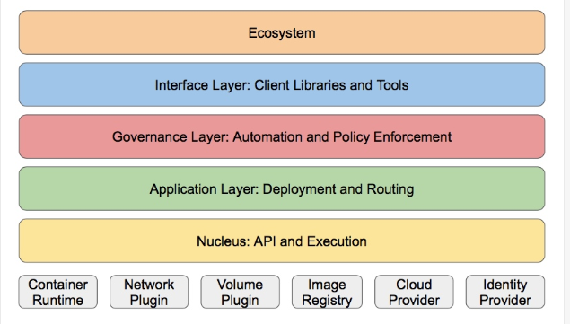

# kubernetes的设计架构
[参考文档][k8s设计架构]
[k8s设计架构]: https://www.kubernetes.org.cn/kubernetes%E8%AE%BE%E8%AE%A1%E6%9E%B6%E6%9E%84 "k8s设计架构"

Kubernetes集群包含有节点代理kubelet和Master组件(APIs, scheduler, etc)，一切都基于分布式的存储系统(etcd)

Kubernetes节点有运行应用容器必备的服务，而这些都是受Master的控制。

每次个节点上当然都要运行Docker。Docker来负责所有具体的映像下载和容器运行。

## k8s节点的核心组件

1. etcd：保存了整个集群的状态和数据，生成都是etcd单独部署etcd集群

2. apiserver提供了资源操作的唯一入口，并提供认证、授权、访问控制、API注册和发现等机制；
无论是用户还是node节点，都需要通过apiserver与scheduler和controller manager进行交互

3. controller manager负责维护集群的状态，比如故障检测、自动扩展、滚动更新、容器的创建指令等；

4. scheduler负责资源的调度，按照预定的调度策略将Pod调度到相应的机器上；
根据各个node节点的资源可用率做调度

5. kubelet负责维护容器的生命周期，同时也负责Volume（CVI）和网络（CNI）的管理；

6. Container runtime负责镜像管理以及Pod和容器的真正运行（CRI）（可以理解为docker）；

7. kube-proxy负责为Service提供cluster内部的服务发现和负载均衡；

### 其他的组件

1. kube-dns负责为整个集群提供DNS服务
通过域名来访问pod，而不是同pod的ip地址，因为pod的ip地址会经常变化，dns会实时更新A记录，当ip地址变化后dns会实时更新，总是能通过域名找到对应的pod，如果hube-dns出问题，会导致不能访问pod中的数据

2. Ingress Controller为服务提供外网入口
是基于nginx二次开发的七层代理，运行在k8s内部

3. Heapster提供资源监控
后期被Prometheus替代

4. Dashboard提供GUI

5. Federation提供跨可用区的集群
如果在多个地区部署了多个k8s集群会用到

6. Fluentd-elasticsearch提供集群日志采集、存储与查询

## kubernetes的设计分层概念
Kubernetes设计理念和功能其实就是一个类似Linux的分层架构

- 核心层：Kubernetes最核心的功能，对外提供API构建高层的应用，对内提供插件式应用执行环境

- 应用层：部署（无状态应用、有状态应用、批处理任务、集群应用等）和路由（服务发现、DNS解析等）

- 管理层：系统度量（如基础设施、容器和网络的度量），自动化（如自动扩展、动态Provision等）以及策略管理（RBAC、Quota、PSP、NetworkPolicy等）

- 接口层：kubectl命令行工具、客户端SDK以及集群联邦

- 生态系统：在接口层之上的庞大容器集群管理调度的生态系统，可以划分为两个范畴
Kubernetes外部：日志、监控、配置管理、CI、CD、Workflow、FaaS、OTS应用、ChatOps等

Kubernetes内部：CRI(Container runtime)、CNI(网络)、CVI(卷)、镜像仓库、Cloud Provider、集群自身的配置和管理等

- kubelet
kubelet负责管理pods和它们上面的容器，images镜像、volumes、etc。

- kube-proxy:生成iptables或者lvs规则
每一个节点也运行一个简单的网络代理和负载均衡。 正如Kubernetes API里面定义的这些服务也可以在各种终端中以轮询的方式做一些简单的TCP和UDP传输。

服务端点目前是通过DNS或者环境变量( Docker-links-compatible 和 Kubernetes{FOO}_SERVICE_HOST 及 {FOO}_SERVICE_PORT 变量都支持)。这些变量由服务代理所管理的端口来解析。

- Kubernetes控制面板
Kubernetes控制面板可以分为多个部分。目前它们都运行在一个master 节点，然而为了达到高可用性，这需要改变。不同部分一起协作提供一个统一的关于集群的视图。

- etcd
所有master的持续状态都存在etcd的一个实例中。这可以很好地存储配置数据。因为有watch(观察者)的支持，各部件协调中的改变可以很快被察觉

- Kubernetes API Server
API服务提供Kubernetes API 的服务。这个服务试图通过把所有或者大部分的业务逻辑放到不两只的部件中从而使其具有CRUD特性。它主要处理REST操作，在etcd中验证更新这些对象（并最终存储）。

- Scheduler
调度器把未调度的pod通过binding api绑定到节点上。

- Kubernetes控制管理服务器
所有其它的集群级别的功能目前都是由控制管理器所负责。例如，端点对象是被端点控制器来创建和更新。这些最终可以被分隔成不同的部件来让它们独自的可插拔。

# CNCF
CNCF（Cloud Native Compute Foundation） 是 Linux 基金会旗下的一个组织，旨在推动以容器为中心的云原生系统。从 2016 年 11 月，CNCF 开始维护了一个名为 [ Cloud Native Landscape](https://github.com/cncf/landscape " Cloud Native Landscape") 的 repo，汇总目前比较流行的云原生技术，并加以分类，希望能为企业构建云原生体系提供参考。

云原生以容器为核心技术，分为运行时（Runtime）和 Orchestration 两层，Runtime 负责容器的计算、存储、网络；Orchestration 负责容器集群的调度、服务发现和资源管理。

最下层是基础设施和配置管理，作为容器底层的基石。容器可以运行在各种系统上，包括公有云、私有云、物理机等；容器还依赖自动化部署工具、容器镜像工具、安全工具等运维系统才能工作。

往上是容器平台上的应用层，类似于手机的 App Store，图中分为数据库和数据分析、流处理、SCM 工具、CI/CD 和应用定义几类，每个公司根据业务需求会有不同的应用体系。

右边有两块：平台和观察分析。平台是指基于容器技术提供的平台级的服务，比如常见的 PaaS 服务和 Serverless 服务。观察分析是容器平台的运维，从日志和监控方面给出容器集群当前的运行情况，方便分析和 debug。

NOTE：因为图中给出的软件很多，所以文中会挑选一些比较有名的以及本人比较熟悉的介绍，会略过一些信息；此外，也因为个人的水平有限，并没有对所有产品都一一使用过，因此有些内容未免有偏颇或者错误之处，如果读者发现，还望能不吝指出。

## 详细的CNCF 云原生技术请查看文章：[CNCF 云原生容器生态系统概要](http://dockone.io/article/3006 "CNCF 云原生容器生态系统概要")

## 开源的CICD的技术项目：[猪齿鱼](http://choerodon.io/zh/ "猪齿鱼")