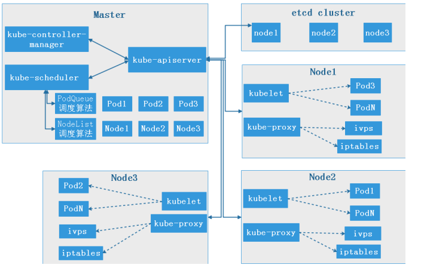
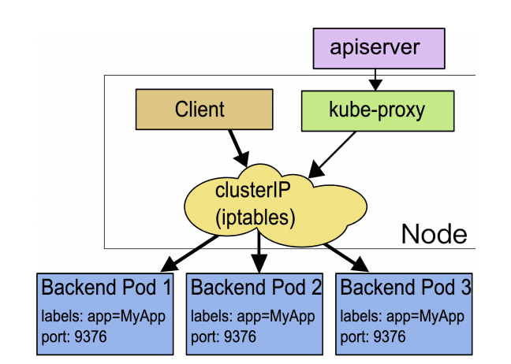
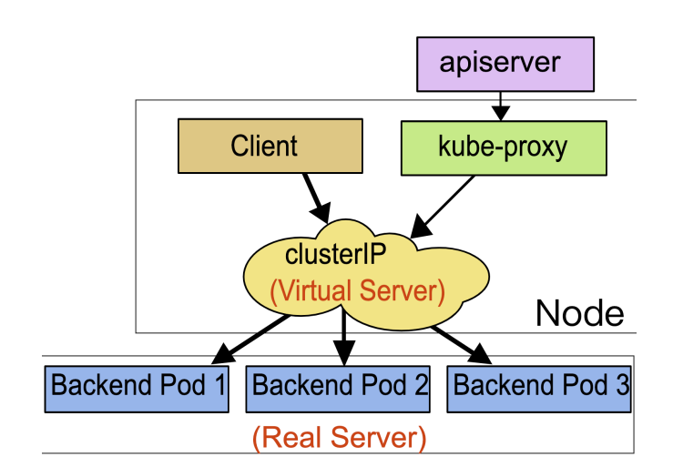

# master的运行机制
master 完全基于API的方式，来接收和处理用户的请求
## k8s 的api kube-apiserver
k8s的api server 提供了各类资源对象（POD，RC，service）的增删改查及watch等HTTP Rest接口，是整个系统的数据总线和数据中心

apiserver 目前在master监听两个端口，通过 --insecure-port int 监听一个非安全的127.0.0.1本地端口（默认为8080）

1. 该端口用于接收HTTP请求；
2. 该端口默认值为8080，可以通过API Server的启动参数“--insecure-port”的值来修改默认值；
3. 默认的IP地址为“localhost”，可以通过启动参数“--insecure-bind-address”的值来修改该IP地址；
4. 非认证或授权的HTTP请求通过该端口访问API Server

通过参数--bind-address=1.1.1.1 监听一个安全的端口（默认为6443）

1. 该端口默认值为6443，可通过启动参数“--secure-port”的值来修改默认值；
2. 默认IP地址为非本地（Non-Localhost）网络端口，通过启动参数“--bind-address”设置该值；
3. 该端口用于接收HTTPS请求；
4. 用于基于Tocken文件或客户端证书及HTTP Base的认证；
5. 用于基于策略的授权；

以上api server监听的端口定义在启动脚本中/etc/systemd/system/kube-apiserver.service该脚本中定义了，api server 启动时要传递的参数包括指定了外部监听的地址和本机监听的地址和端口

k8s API Server的功能与使用

1. 提供了几圈管理的rest api接口（包括认证授权、数据校验以及集群状态变更）

2. 提供其他模块之间的数据交互和通信的枢纽（其他模块通过 PIserver 查询或修改数据，只有API server 才直接操作etcd）

3. 是资源配额空中的入口

4. 拥有完备的集群安全机制

```bash
curl 127.0.0.1:8080/apis #分组api
curl 127.0.0.1:8080/api/v1 #带具体版本号的api
curl 127.0.0.1:8080/ #返回核心api列表
curl 127.0.0.1:8080/version #api 版本信息
curl 127.0.0.1:8080/healthz/etcd #与etcd的心跳监测
curl 127.0.0.1:8080/apis/autoscaling/v1 #api的详细信息
```

## kube-controller-manager
Controller Manager作为集群内部的管理控制中心，负责集群内的Node、Pod副本、服务端点（Endpoint）、命名空间（Namespace）、服务账号（ServiceAccount）、资源定额（ResourceQuota）的管理，当某个Node意外宕机时，Controller Manager会及时发现并执行自 动化修复流程，确保集群始终处于预期的工作状态。

启动脚本
```bash
cat /etc/systemd/system/kube-controller-manager.service 
[Unit]
Description=Kubernetes Controller Manager
Documentation=https://github.com/GoogleCloudPlatform/kubernetes

[Service]
ExecStart=/usr/bin/kube-controller-manager \
  --address=127.0.0.1 \
  --master=http://127.0.0.1:8080 \   #调用kube-api-server的本地端口进行通信
  --allocate-node-cidrs=true \
  --service-cluster-ip-range=10.50.0.0/16 \
  --cluster-cidr=172.50.0.0/16 \
  --cluster-name=kubernetes \
  --cluster-signing-cert-file=/etc/kubernetes/ssl/ca.pem \
  --cluster-signing-key-file=/etc/kubernetes/ssl/ca-key.pem \
  --service-account-private-key-file=/etc/kubernetes/ssl/ca-key.pem \
  --root-ca-file=/etc/kubernetes/ssl/ca.pem \
  --horizontal-pod-autoscaler-use-rest-clients=true \
  --leader-elect=true \
  --v=2
Restart=on-failure
RestartSec=5

[Install]
WantedBy=multi-user.target
```

## kube-scheduler
cheduler负责Pod调度，在整个系统中起"承上启下"作用，承上：负责接收Controller Manager创建的新的Pod，为其选择一个合适的Node；启下：Node上的kubelet接管Pod的生命周期。

启动脚本
```bash
cat /etc/systemd/system/kube-scheduler.service 
[Unit]
Description=Kubernetes Scheduler
Documentation=https://github.com/GoogleCloudPlatform/kubernetes

[Service]
ExecStart=/usr/bin/kube-scheduler \
  --address=127.0.0.1 \
  --master=http://127.0.0.1:8080 \   #调用kube-api-server的本地端口进行通信
  --leader-elect=true \
  --v=2
Restart=on-failure
RestartSec=5

[Install]
WantedBy=multi-user.target
```
通过调度算法为待调度Pod列表的每个Pod从可用Node列表中选择一个最适合的Node，并将信息写入etcd中node节点上的kubelet通过API Server(node节点不能直接访问etcd，只能是通过监听API server 才能实现)监听到kubernetes Scheduler产生的Pod绑定信息，然后获取对应的Pod清单，下载Image，并启动容器。

调度算法：
1. LeastRequestedPriority
优先从备选节点列表中选择资源消耗最小的节点（CPU+内存）。

2. CalculateNodeLabelPriority
优先选择含有指定Label的节点。在创建一个pod的时候，对pod进行分组，将指定的pod创建在指定label标签的node节点

3. BalancedResourceAllocation
优先从备选节点列表中选择各项资源使用率最均衡的节点。



创建容器的过程：通过 API server 创建pod，将创建任务分配给kube-scheduler，由kube-scheduler 通过API server到etcd的列表中选择，kube-scheduler通过调度算法对各个node 进行评测，最后将各个对应的pod指定到各个nodebig返回给API server ,node节点上的kubelet通过API Server监听到kubernetes Scheduler产生的Pod绑定信息，然后获取对应的Pod清单，下载Image，并启动容器，node节点本机的kube-proxy会自动的生成一些iptables或者lvs规则，确保能够从外部访问创建的pod

## node节点

在kubernetes集群中，每个Node节点都会启动kubelet进程，用来处理Master节点下发到本节点的任务，管理Pod和其中的容器。kubelet会在API Server上注册节点信息，定期向Master汇报节点资源使用情况，并通过cAdvisor监控容器和节点资源。可以把kubelet理解成Server/Agent架构中的agent，kubelet是Node上的pod管家。

在配置文件 /etc/kubernetes/kubelet.kubeconfig 中，定义了api server的地址已经和api server通信是使用的证书

## kube-proxy
kube-proxy 运行在每个节点上，监听 API Server 中服务对象的变化，再通过管理 IPtables 来实现网络的转发

kube-proxy的三种工作方式

1. userspace
k8s v1.2后就已经淘汰了

2. iptables
目前默认的方式

3. ipvs
需要安装ipvsadm、ipset工具包架子啊ip_vs内核模块


具体使用的工作方式定义在kube-proxy的启动脚本中：/etc/systemd/system/kube-proxy.service，--proxy-mode=iptables定义了使用的工作方式


### iptables
Kube-Proxy 监听 Kubernetes Master 增加和删除 Service 以及 Endpoint 的消息。对于每一个 Service，KubeProxy 创建相应的 IPtables 规则，并将发送到 Service Cluster IP 的流量转发到 Service 后端提供服务的 Pod 的相应端口上。 注： 虽然可以通过 Service 的 Cluster IP 和服务端口访问到后端 Pod 提供的服务，但该 Cluster IP 是Ping 不通的。 其原因是 Cluster IP 只是 IPtables 中的规则，并不对应到一个任何网络设备。 IPVS 模式的 ClusterIP 是可以 Ping 通的。



### IPVS
kubernetes从1.9开始测试支持ipvs(Graduate kube-proxy IPVS mode to beta)，https://github.com/kubernetes/kubernetes/blob/master/CHANGELOG-1.9.md#ipvs，从1.11版本正式支持ipvs(IPVS-based in-cluster load balancing is now GA)，https://github.com/kubernetes/kubernetes/blob/master/CHANGELOG1.11.md#ipvs。

IPVS 相对 IPtables 效率会更高一些，使用 IPVS 模式需要在运行 Kube-Proxy 的节点上安装 ipvsadm、ipset 工具包和加载 ip_vs 内核模块，当 Kube-Proxy 以 IPVS 代理模式启动时，Kube-Proxy 将验证节点上是否安装了 IPVS模块，如果未安装，则 Kube-Proxy 将回退到 IPtables 代理模式。


使用IPVS模式，Kube-Proxy会监视Kubernetes Service对象和Endpoints，调用宿主机内核Netlink接口以相应地创建IPVS规则并定期与Kubernetes Service对象 Endpoints对象同步IPVS规则，以确保IPVS状态与期望一致，访问服务时，流量将被重定向到其中一个后端 Pod,IPVS使用哈希表作为底层数据结构并在内核空间中工作，这意味着IPVS可以更快地重定向流量，并且在同步代理规则时具有更好的性能，此外，IPVS 为负载均衡算法提供了更多选项，例如：rr (轮询调度)、lc (最小连接数)、dh (目标哈希)、sh (源哈希)、sed (最短期望延迟)、nq(不排队调度)等。



### 更改iptables为ipvs

1. 在node和master节点上编辑启动脚本
```bash
vim /etc/systemd/system/kube-proxy.service
--proxy-mode=ipvs
```

2. 重启kube-proxy
```bash
systemctl daemon-reload
systemctl restart kube-proxy
```

3. 查看规则
```bash
ipvsadm -Ln
IP Virtual Server version 1.2.1 (size=4096)
Prot LocalAddress:Port Scheduler Flags
  -> RemoteAddress:Port           Forward Weight ActiveConn InActConn
TCP  172.17.0.1:48664 rr
  -> 172.50.120.7:8443            Masq    1      0          0         
TCP  172.50.120.0:48664 rr
  -> 172.50.120.7:8443            Masq    1      0          0         
TCP  192.168.7.110:48664 rr
  -> 172.50.120.7:8443            Masq    1      0          0         
TCP  10.50.0.1:443 rr
  -> 192.168.7.101:6443           Masq    1      0          0         
TCP  10.50.95.69:8086 rr
  -> 172.50.120.9:8086            Masq    1      0          0         
TCP  10.50.107.207:443 rr
  -> 172.50.120.7:8443            Masq    1      0          0         
TCP  10.50.149.20:80 rr
  -> 172.50.170.200:3000          Masq    1      0          0         
TCP  10.50.250.176:80 rr
  -> 172.50.170.201:8082          Masq    1      0          0         
TCP  10.50.254.254:53 rr
  -> 172.50.120.8:53              Masq    1      0          0         
TCP  127.0.0.1:48664 rr
  -> 172.50.120.7:8443            Masq    1      0          0         
UDP  10.50.254.254:53 rr
  -> 172.50.120.8:53              Masq    1      0          0 
```

## etcd运行机制
etcd是CoreOS团队于2013年6月发起的开源项目，它的目标是构建一个高可用的分布式键值(key-value)数据库。etcd内部采用raft协议作为一致性算法，etcd基于Go语言实现。

github地址：https://github.com/etcd-io/etcd
官方网站：https://etcd.io/

Etcd具有下面这些属性：
1. 完全复制：集群中的每个节点都可以使用完整的存档
2. 高可用性：Etcd可用于避免硬件的单点故障或网络问题
3. 一致性：每次读取都会返回跨多主机的最新写入
4. 简单：包括一个定义良好、面向用户的API（gRPC）
5. 安全：实现了带有可选的客户端证书身份验证的自动化TLS
6. 快速：每秒10000次写入的基准速度
7. 可靠：使用Raft算法实现了存储的合理分布Etcd的工作原理


启动脚本中定义的参数
```bash
 cat /etc/systemd/system/etcd.service 
[Unit]
Description=Etcd Server
After=network.target
After=network-online.target
Wants=network-online.target
Documentation=https://github.com/coreos

[Service]
Type=notify
WorkingDirectory=/var/lib/etcd/   # etcd的数据目录，etcd的数据目录都会放在该目录下
ExecStart=/usr/bin/etcd \   # 二进制文件路径
  --name=etcd1 \    		# 当前节点的名称
  --cert-file=/etc/etcd/ssl/etcd.pem \
  --key-file=/etc/etcd/ssl/etcd-key.pem \
  --peer-cert-file=/etc/etcd/ssl/etcd.pem \
  --peer-key-file=/etc/etcd/ssl/etcd-key.pem \
  --trusted-ca-file=/etc/kubernetes/ssl/ca.pem \
  --peer-trusted-ca-file=/etc/kubernetes/ssl/ca.pem \
  --initial-advertise-peer-urls=https://192.168.7.105:2380 \  # 通告自己的集群端口
  --listen-peer-urls=https://192.168.7.105:2380 \  # 集群之间的通讯端口
  --listen-client-urls=https://192.168.7.105:2379,http://127.0.0.1:2379 \  # 客户端访问地址
  --advertise-client-urls=https://192.168.7.105:2379 \  # 通告自己的客户端端口
  --initial-cluster-token=etcd-cluster-0 \   # 创建集群使用的token，一个集群内的节点保持一致
  --initial-cluster=etcd1=https://192.168.7.105:2380,etcd2=https://192.168.7.106:2380,etcd3=https://192.168.7.107:2380 \   # 集群内所有节点的信息
  --initial-cluster-state=new \ # 新建集群的时候的值为new，如果是已经存在的集群为existing
  --data-dir=/var/lib/etcd  # 数据目录路径
Restart=on-failure
RestartSec=5
LimitNOFILE=65536

[Install]
WantedBy=multi-user.target
```

### 成员信息查看
Etcd v2 和 v3 本质上是共享同一套 raft 协议代码的两个独立的应用，接口不一样，存储不一样，数据互相隔离。也就是说如果从 Etcd v2 升级到 Etcd v3，原来v2 的数据还是只能用 v2 的接口访问，v3 的接口创建的数据也只能访问通过 v3 的接口访问。

默认使用v2版本，设置API版本：ETCDCTL_API=3 to use v3 API or ETCDCTL_API=2 to use v2 API
```bash
ETCDCTL_API=3 etcdctl --help
NAME:
	etcdctl - A simple command line client for etcd3.

USAGE:
	etcdctl

VERSION:
	3.2.24

API VERSION:
	3.2
...


# 查看集群节点信息

ETCDCTL_API=3 etcdctl member list --endpoints=https://192.168.7.105:2379 --cacert=/etc/kubernetes/ssl/ca.pem --cert=/etc/etcd/ssl/etcd.pem --key=/etc/etcd/ssl/etcd-key.pem
8c8e9e20b0a43c21, started, etcd1, https://192.168.7.105:2380, https://192.168.7.105:2379
a8a013e9f76bcba8, started, etcd3, https://192.168.7.107:2380, https://192.168.7.107:2379
ba7316be01aaf3f6, started, etcd2, https://192.168.7.106:2380, https://192.168.7.106:2379
```

验证当前etcd所有成员状态
```bash
# 声明各个节点的信息
export NODE_IPS="192.168.7.105 192.168.7.106 192.168.7.107"
# 循环检测各个节点的心跳信息
for ip in ${NODE_IPS}; do ETCDCTL_API=3 /usr/bin/etcdctl endpoint health --endpoints=https://${ip}:2379 --cacert=/etc/kubernetes/ssl/ca.pem --cert=/etc/etcd/ssl/etcd.pem --key=/etc/etcd/ssl/etcd-key.pem ; done
https://192.168.7.105:2379 is healthy: successfully committed proposal: took = 4.315713ms
https://192.168.7.106:2379 is healthy: successfully committed proposal: took = 5.124545ms
https://192.168.7.107:2379 is healthy: successfully committed proposal: took = 5.026215ms
```

查看etcd节点的数据信息
```bash
#以路径的方式所有key信息
ETCDCTL_API=3 etcdctl get / --prefix --keys-only
/calico/ipam/v2/assignment/ipv4/block/172.50.120.0-26

/calico/ipam/v2/assignment/ipv4/block/172.50.170.192-26

/calico/ipam/v2/assignment/ipv4/block/172.50.211.192-26

/calico/ipam/v2/assignment/ipv4/block/172.50.38.64-26

/calico/ipam/v2/handle/k8s-pod-network.1ad5527ebcc8339fe494bd073692112f759f0a743ad2a3fee8ce60ce189a73a9

/calico/ipam/v2/handle/k8s-pod-network.2d140d4f8e22b173caec7a1d3c34b600e4183f701626c368e3840ec45273f2a8
...
/registry/services/specs/kube-system/monitoring-influxdb

# 获取其中摸个key的数据
ETCDCTL_API=3 etcdctl get /calico/ipam/v2/assignment/ipv4/block/172.50.38.64-26
/calico/ipam/v2/assignment/ipv4/block/172.50.38.64-26
{"cidr":"172.50.38.64/26","affinity":"host:k8s-master1.weiying.net","strictAffinity":false,"allocations":[0,null,null,null,null,null,null,null,null,null,null,null,null,null,null,null,null,null,null,null,null,null,null,null,null,null,null,null,null,null,null,null,null,null,null,null,null,null,null,null,null,null,null,null,null,null,null,null,null,null,null,null,null,null,null,null,null,null,null,null,null,null,null,null],"unallocated":[1,2,3,4,5,6,7,8,9,10,11,12,13,14,15,16,17,18,19,20,21,22,23,24,25,26,27,28,29,30,31,32,33,34,35,36,37,38,39,40,41,42,43,44,45,46,47,48,49,50,51,52,53,54,55,56,57,58,59,60,61,62,63],"attributes":[{"handle_id":null,"secondary":null}]}
# 里面的数据可以直接修改，但是不建议直接操作
```

### ectd对数据的增删改查

增加数据
```bash
ETCDCTL_API=3 /usr/bin/etcdctl put /testkey "test for etcd"
OK
```

查询数据
```bash
ETCDCTL_API=3 /usr/bin/etcdctl get /testkey 
/testkey
test for etcd
```

改动数据,直接覆盖就是更新数据
```bash
ETCDCTL_API=3 /usr/bin/etcdctl put /testkey "test for etcd v2"
OK
ETCDCTL_API=3 /usr/bin/etcdctl get /testkey 
/testkey
test for etcd v2
```

删除数据
```bash
ETCDCTL_API=3 /usr/bin/etcdctl del /testkey 
1
ETCDCTL_API=3 /usr/bin/etcdctl get /testkey 
```

### etcd的watch机制
基于不断监看数据，发生变化就主动通知客户端，etcd v3的watch机制支持watch摸个固定的key，也支持watch一个范围

相比etcd v2，etcd v3的一些主要变换
1. 接口通过grpc提供rpc接口，放弃了v2的http接口，优势是长连接效率提升明显，确定是使用不如以前方便，尤其对不方便尾部长连接的场景

2. 废弃了原来的目录结构，编程了纯粹的kv，用户可以通过前缀匹配模式模拟目录

3. 内存中不再保存value，同样的内存可以支持存储更多的key。

4. watch机制更稳定，基本上可以通过watch机制实现数据的完全同步。

5. 提供了批量操作以及事务机制，用户可以通过批量事务请求来实现Etcd v2的CAS机制（批量事务支持if条件判断）。

watch测试:
```bash
#在etcd node1上watch一个key
ETCDCTL_API=3 /usr/bin/etcdctl watch /testkey

#在etcd node2修改数据，验证etcd node1是否能够发现数据变化
ETCDCTL_API=3 /usr/bin/etcdctl put /testkey "test for watch"

# 结果etcd node1 能够发现watch的key发生变化
ETCDCTL_API=3 /usr/bin/etcdctl watch /testkey
PUT
/testkey
test for watch
```

### etcd数据备份与恢复机制
WAL是write ahead log的缩写，顾名思义，也就是在执行真正的写操作之前先写一个日志。

wal: 存放预写式日志,最大的作用是记录了整个数据变化的全部历程。在etcd中，所有数据的修改在提交前，都要先写入到WAL中。
```bash
ll /var/lib/etcd/member/wal/
total 125008
drwx------ 2 root root     4096 Aug  2 01:27 ./
drwx------ 4 root root     4096 Aug  2 01:27 ../
-rw------- 1 root root 64000000 Aug  2 02:45 0000000000000000-0000000000000000.wal
-rw------- 1 root root 64000000 Jul 11 07:59 0.tmp
```

#### etcd v2版本数据备份与恢复
```bash
V2版本帮助信息：
root@k8s-etcd2:~# /usr/bin/etcdctl backup --help
	NAME:
		etcdctl backup - backup an etcd directory
	USAGE:
		etcdctl backup [command options]
	OPTIONS:
		--data-dir value Path to the etcd data dir   #源数据目录
		--wal-dir value Path to the etcd wal dir     #源日志文件目录
		--backup-dir value Path to the backup dir    #备份目录
		--backup-wal-dir value Path to the backup wal dir  # 备份日志文件目录
```

备份：一般情况下只备份数据，不备份日志
```bash
 ETCDCTL_API=2 etcdctl backup --data-dir /var/lib/etcd/ --backupdir /opt/etcd_backup
```

恢复
```bash
# 查看恢复的帮助信息
etcd --help | grep force
	--force-new-cluster 'false'  # 强制创建新的集群节点
	force to create a new one-member cluster.
# 恢复
etcd --data-dir=/var/lib/etcd/default.etcd --force-new-cluster &
# 设置启动脚本中的集群节点为新的集群节点
vim /etc/systemd/system/etcd.service
[Unit]
Description=Etcd Server
After=network.target
After=network-online.target
Wants=network-online.target
Documentation=https://github.com/coreos
[Service]
Type=notify
WorkingDirectory=/var/lib/etcd/
ExecStart=/usr/bin/etcd \
--name=etcd2 \
.................................
--data-dir=/opt/etcd_backup -force-new-cluster #强制设置为为新集群
Restart=on-failure
RestartSec=5
LimitNOFILE=65536
[Install]
WantedBy=multi-user.target
# 重启etcd
```

#### etcd v3版本数据备份与恢复
v2版本是针对文件做备份，但是v3是使用快照

备份
```bash
ETCDCTL_API=3 etcdctl snapshot save snapshot.db
```

恢复
```bash
ETCDCTL_API=3 etcdctl snapshot restore snapshot.db --data-dir=/opt/etcd-testdir
# 停止ectd服务，将数据拷贝过去，或者在etcd启动脚本中将数据目录指向新的
```

自动备份数据
```bash
mkdir /data/etcd-backup-dir/ -p
 cat script.sh
#!/bin/bash
source /etc/profile
DATE=`date +%Y-%m-%d_%H-%M-%S`
ETCDCTL_API=3 /usr/bin/etcdctl snapshot save /data/etcd-backup-dir/etcdsnapshot-${DATE}.db

```