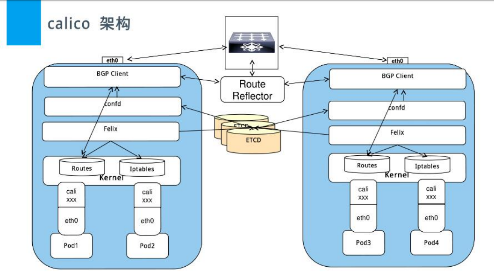
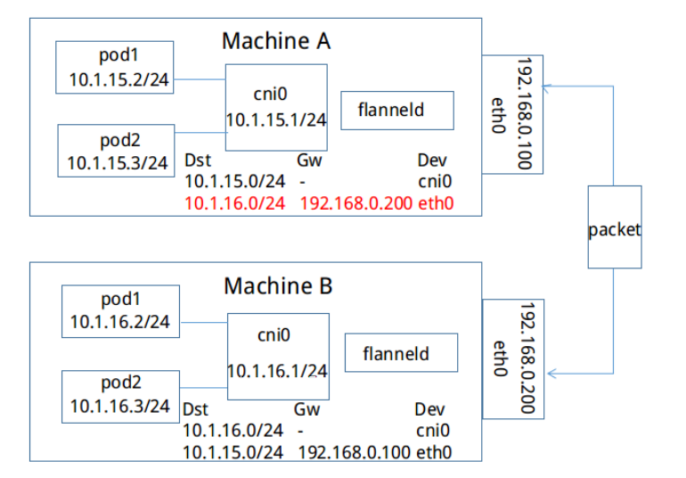
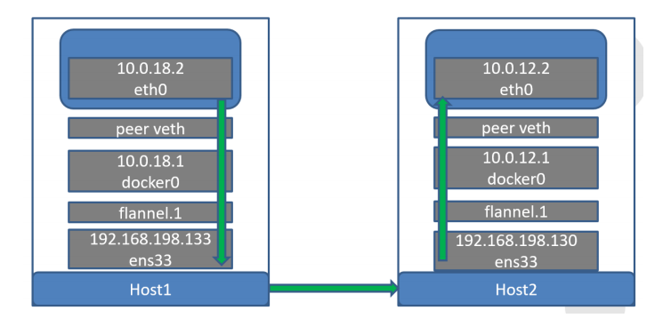

# 网络通信机制
k8s中的网络主要涉及到pod的的各种访问需求，如同一pod的内部(单容器或者多容器)通信、pod A与pod B的通信、从外部网络访问pod以及从pod访问外部网络。

k8s的网络基于第三方插件实现，但是定义了一些插件兼容规范，该规范有CoreOS和Google联合定制，叫做CNI(Container Network Interface)。

目前常用的的CNI网络插件有calico和flannel：

## calico
Calico是一个纯三层的网络解决方案，为容器提供多node间的访问通信，calico将每一个node节点都当做为一个路由器(router)，各节点通过BGP(Border Gateway Protocol) 边界网关协议学习并在node节点生成路由规则，从而将不同node节点上的pod连接起来进行通信。

```bash
route -n
Kernel IP routing table
Destination     Gateway         Genmask         Flags Metric Ref    Use Iface
0.0.0.0         192.168.0.254   0.0.0.0         UG    0      0        0 eth0
172.17.0.0      0.0.0.0         255.255.0.0     U     0      0        0 docker0
172.50.38.64    192.168.7.101   255.255.255.192 UG    0      0        0 tunl0
172.50.120.0    192.168.7.110   255.255.255.192 UG    0      0        0 tunl0
172.50.170.192  0.0.0.0         255.255.255.192 U     0      0        0 *
172.50.170.204  0.0.0.0         255.255.255.255 UH    0      0        0 calibfc22cd8b78
172.50.170.205  0.0.0.0         255.255.255.255 UH    0      0        0 cali12d4a061371
172.50.170.206  0.0.0.0         255.255.255.255 UH    0      0        0 cali0b3c4ee9131
172.50.170.207  0.0.0.0         255.255.255.255 UH    0      0        0 cali90f8db0ef63
172.50.170.208  0.0.0.0         255.255.255.255 UH    0      0        0 calie327e040961
```

BGP是一个去中心化的协议，它通过自动学习和维护路由表实现网络的可用性，但是并不是所有的网络都支持BGP，另外为了跨网络实现更大规模的网络管理，calico 还支持IP-in-IP的叠加模型，简称IPIP，IPIP可以实现跨不同网段建立路由通信，但是会存在安全性问题，其在内核内置，可以通过Calico的配置文件设置是否启用IPIP，在公司内部如果k8s的node节点没有跨越网段建议关闭IPIP。



验证当前路由表
```bash
calicoctl node status
Calico process is running.

IPv4 BGP status
+---------------+-------------------+-------+----------+--------------------------------+
| PEER ADDRESS  |     PEER TYPE     | STATE |  SINCE   |              INFO              |
+---------------+-------------------+-------+----------+--------------------------------+
| 192.168.7.101 | node-to-node mesh | up    | 01:47:42 | Established                    |
| 192.168.7.102 | node-to-node mesh | start | 01:47:41 | Active Socket: Host is         |
|               |                   |       |          | unreachable                    |
| 192.168.7.110 | node-to-node mesh | up    | 01:48:17 | Established                    |
+---------------+-------------------+-------+----------+--------------------------------+

IPv6 BGP status
No IPv6 peers found.
```

### 查看pod路由走向
通过验证开启IPIP和关闭IPIP的k8s集群验证

1. 开启IPIP的通信状态
```bash
root@k8s-master1:~# kubectl get pods -o wide
NAME                         READY   STATUS    RESTARTS   AGE   IP               NODE            NOMINATED NODE   READINESS GATES
busybox                      1/1     Running   8          21d   172.50.170.205   192.168.7.111   <none>           <none>
net-test1-68898c85b7-224j6   1/1     Running   1          21d   172.50.120.14    192.168.7.110   <none>           <none>
net-test1-68898c85b7-kwjm5   1/1     Running   1          21d   172.50.170.207   192.168.7.111   <none>           <none>
net-test1-68898c85b7-lm9sx   1/1     Running   1          21d   172.50.170.206   192.168.7.111   <none>           <none>
net-test1-68898c85b7-nwrl9   1/1     Running   1          21d   172.50.120.13    192.168.7.110   <none>           <none>
# 登录到node2上面的pod，查看到node1上面pod的路由信息
kubectl exec -it net-test1-68898c85b7-kwjm5 sh
/ # traceroute 172.50.120.13
traceroute to 172.50.120.13 (172.50.120.13), 30 hops max, 46 byte packets
 1  192.168.7.111 (192.168.7.111)  0.013 ms  0.010 ms  0.004 ms  # eth0网卡
 2  172.50.120.0 (172.50.120.0)  0.444 ms  0.365 ms  0.384 ms    # tunl0网卡
 3  172.50.120.13 (172.50.120.13)  61.360 ms  1.670 ms  0.398 ms # pod的虚拟网卡
```

2. 关闭ipip的通信状态
需要关闭IPIP并重启服务器
```bash
# 关闭ipip
root@k8s-master1:~# cd /etc/ansible/
root@k8s-master1:/etc/ansible# vim roles/calico/defaults/main.yml
CALICO_IPV4POOL_IPIP: "off"
# 重新部署网络服务
ansible-playbook 06.network.yml
# 重启master节点和node节点，重启后检查是否存在tunl0的设备，如果不存在说明关闭了IPIP
# 如果存在tunl0设备，执行下面操作
root@k8s-master1:~# cd /etc/ansible/
# 清除数据，重新安装k8s集群
root@k8s-master1:/etc/ansible# ansible-playbook 99.clean.yml
# 重启master和node节点，确保 tunl0 不存在
cd /etc/ansible/
root@k8s-master1:/etc/ansible# ansible-playbook 01.prepare.yml
root@k8s-master1:/etc/ansible# ansible-playbook 02.etcd.yml
root@k8s-master1:/etc/ansible# ansible-playbook 03.docker.yml
# 分发harbor证书
scp 192.168.7.103:/usr/local/harbor/certs/harborca.crt /etc/docker/certs.d/k8s-harbor1.weiying.net/
bash ~/scp.sh

root@k8s-master1:/etc/ansible# ansible-playbook 04.kube-master.yml
root@k8s-master1:/etc/ansible# ansible-playbook 05.kube-node.yml
root@k8s-master1:/etc/ansible# ansible-playbook 06.network.yml
# 创建容器
kubectl run net-test1 --image=alpine --replicas=4 sleep 360000
# 不同node节点上的pod之间测试通信
kubectl get pod -o wide
NAME                         READY   STATUS    RESTARTS   AGE     IP               NODE            NOMINATED NODE   READINESS GATES
net-test1-68898c85b7-54mfv   1/1     Running   0          2m57s   172.50.120.1     192.168.7.110   <none>           <none>
net-test1-68898c85b7-9x668   1/1     Running   0          2m57s   172.50.170.193   192.168.7.111   <none>           <none>
net-test1-68898c85b7-fs5s7   1/1     Running   0          2m57s   172.50.120.0     192.168.7.110   <none>           <none>
net-test1-68898c85b7-g45v8   1/1     Running   0          2m57s   172.50.170.192   192.168.7.111   <none>           <none>
kubectl exec -it net-test1-68898c85b7-54mfv sh
/ # traceroute 172.50.170.192
traceroute to 172.50.170.192 (172.50.170.192), 30 hops max, 46 byte packets
 1  192.168.7.110 (192.168.7.110)  0.011 ms  0.016 ms  0.015 ms
 2  192.168.7.111 (192.168.7.111)  1.120 ms  0.224 ms  0.341 ms
 3  172.50.170.192 (172.50.170.192)  1.066 ms  0.306 ms  0.362 ms
```

## flannel
由CoreOS开源的针对k8s的网络服务，其目的为解决k8s集群中各主机上的pod相互通信的问题，其借助于etcd维护网络IP地址分配，并为每一个node服务器分配一个不同的IP地址段。

Flannel 网络模型 (后端)，Flannel目前有三种方式实现 UDP/VXLAN/host-gw：

1. UDP：早期版本的Flannel使用UDP封装完成报文的跨越主机转发，其安全性及性能略有不足。

2. VXLAN：Linux 内核在在2012年底的v3.7.0之后加入了VXLAN协议支持，因此新版本的Flannel也有UDP转换为VXLAN，VXLAN本质上是一种tunnel（隧道）协议，用来基于3层网络实现虚拟的2层网络，目前flannel 的网络模型已经是基于VXLAN的叠加(覆盖)网络。

3. Host-gw：也就是Host GateWay，通过在node节点上创建到达各目标容器地址的路由表而完成报文的转发，因此这种方式要求各node节点本身必须处于同一个局域网(二层网络)中，因此不适用于网络变动频繁或比较大型的网络环境，但是其性能较好。

### flannel组件解释
Cni0:网桥设备，每创建一个pod都会创建一对 veth pair，其中一端是pod中的eth0，另一端是Cni0网桥中的端口（网卡），Pod中从网卡eth0发出的流量都会发送到Cni0网桥设备的端口（网卡）上，Cni0 设备获得的ip地址是该节点分配到的网段的第一个地址。

Flannel.1: overlay网络的设备，用来进行vxlan报文的处理（封包和解包），不同node之间的pod数据流量都从overlay设备以隧道的形式发送到对端。

### 部署flannel
```bash
# 更改网络模式为flannel
root@k8s-master1:~# cd /etc/ansible/
root@k8s-master1:/etc/ansible# vim hosts
CLUSTER_NETWORK="flannel"
# 查看并上传依赖的镜像
cat roles/flannel/templates/kube-flannel.yaml.j2
image: {{ flanneld_image }}
cat roles/flannel/defaults/main.yml
flanneld_image: "jmgao1983/flannel:v0.11.0-amd64"
# 下载镜像并上传到harbor
docker pull jmgao1983/flannel:v0.11.0-amd64

docker tag jmgao1983/flannel:v0.11.0-amd64 k8s-harbor1.weiying.net/baseimages/flannel:v0.11.0-amd64

root@k8s-master1:/etc/ansible# mkdir /etc/docker/certs.d/k8s-harbor1.weiying.net -p
root@k8s-master1:/etc/ansible# scp 192.168.7.103:/usr/local/harbor/certs/harborca.crt /etc/docker/certs.d/k8s-harbor1.weiying.net/

root@k8s-master1:/etc/ansible# docker push k8s-harbor1.weiying.net/baseimages/flannel:v0.11.0-amd64 

# 更改flannel指定的镜像
vim roles/flannel/defaults/main.yml
flanneld_image: "k8s-harbor1.weiying.net/baseimages/flannel:v0.11.0-amd64"

# 重新安装k8s集群
root@k8s-master1:/etc/ansible# ansible-playbook 01.prepare.yml
root@k8s-master1:/etc/ansible# ansible-playbook 02.etcd.yml
root@k8s-master1:/etc/ansible# ansible-playbook 03.docker.yml
# 分发harbor证书
bash ~/scp.sh

root@k8s-master1:/etc/ansible# ansible-playbook 04.kube-master.yml
root@k8s-master1:/etc/ansible# ansible-playbook 05.kube-node.yml
root@k8s-master1:/etc/ansible# ansible-playbook 06.network.yml
```

1. flannel pod状态
需要再部署k8s的时候使用Flannel作为网络插件。
```bash
root@k8s-master1:~# kubectl get pods -n kube-system
NAME                          READY   STATUS    RESTARTS   AGE
kube-flannel-ds-amd64-5hc66   1/1     Running   0          84s
kube-flannel-ds-amd64-5wxsf   1/1     Running   0          84s
kube-flannel-ds-amd64-vjzsk   1/1     Running   0          84s
```

2. 创建测试pod
```bash
# 创建容器
kubectl run net-test1 --image=alpine --replicas=4 sleep 360000
```

3. 验证pod状态
```bash
root@k8s-master1:~# kubectl get pod -o wide
NAME                         READY   STATUS    RESTARTS   AGE   IP           NODE            NOMINATED NODE   READINESS GATES
net-test1-68898c85b7-4nnlv   1/1     Running   0          83s   172.50.2.3   192.168.7.110   <none>           <none>
net-test1-68898c85b7-hw8vs   1/1     Running   0          83s   172.50.2.2   192.168.7.110   <none>           <none>
net-test1-68898c85b7-r24dx   1/1     Running   0          83s   172.50.1.2   192.168.7.111   <none>           <none>
net-test1-68898c85b7-vhcqt   1/1     Running   0          83s   172.50.1.3   192.168.7.111   <none>           <none>
```

4. 查看当前node节点的ip地址范围
```bash
root@k8s-node2:~# cat /run/flannel/subnet.env 
FLANNEL_NETWORK=172.50.0.0/16
FLANNEL_SUBNET=172.50.1.1/24
FLANNEL_MTU=1450
FLANNEL_IPMASQ=true
```
5. 查看当前主机的信息
```bash
cat /var/lib/cni/flannel/1f77a471b3eebe5a47d160571b17a77beceb7152d49395f538ebe2a519402e25 
{"hairpinMode":true,"ipMasq":false,"ipam":{"routes":[{"dst":"172.50.0.0/16"}],"subnet":"172.50.2.0/24","type":"host-local"},"isDefaultGateway":true,"isGateway":true,"mtu":1450,"name":"cbr0","type":"bridge"}
```

6. 查看当前主机的路由信息
```bash
root@k8s-node1:~# route -n
Kernel IP routing table
Destination     Gateway         Genmask         Flags Metric Ref    Use Iface
0.0.0.0         192.168.0.254   0.0.0.0         UG    0      0        0 eth0
172.17.0.0      0.0.0.0         255.255.0.0     U     0      0        0 docker0
172.50.0.0      172.50.0.0      255.255.255.0   UG    0      0        0 flannel.1
172.50.1.0      172.50.1.0      255.255.255.0   UG    0      0        0 flannel.1
172.50.2.0      0.0.0.0         255.255.255.0   U     0      0        0 cni0
192.168.0.0     0.0.0.0         255.255.248.0   U     0      0        0 eth0
```

7. 在不同的node节点上的pod验证网络的互通
```bash
root@k8s-master1:~# kubectl get pod -o wide
NAME                         READY   STATUS    RESTARTS   AGE   IP           NODE            NOMINATED NODE   READINESS GATES
net-test1-68898c85b7-4nnlv   1/1     Running   0          83s   172.50.2.3   192.168.7.110   <none>           <none>
net-test1-68898c85b7-hw8vs   1/1     Running   0          83s   172.50.2.2   192.168.7.110   <none>           <none>
net-test1-68898c85b7-r24dx   1/1     Running   0          83s   172.50.1.2   192.168.7.111   <none>           <none>
net-test1-68898c85b7-vhcqt   1/1     Running   0          83s   172.50.1.3   192.168.7.111   <none>           <none>
root@k8s-master1:~# kubectl exec -it net-test1-68898c85b7-4nnlv sh
/ # ifconfig 
eth0      Link encap:Ethernet  HWaddr 2E:EC:49:42:4F:AF  
          inet addr:172.50.2.3  Bcast:0.0.0.0  Mask:255.255.255.0
          UP BROADCAST RUNNING MULTICAST  MTU:1450  Metric:1
          RX packets:27 errors:0 dropped:0 overruns:0 frame:0
          TX packets:1 errors:0 dropped:0 overruns:0 carrier:0
          collisions:0 txqueuelen:0 
          RX bytes:2074 (2.0 KiB)  TX bytes:42 (42.0 B)

lo        Link encap:Local Loopback  
          inet addr:127.0.0.1  Mask:255.0.0.0
          UP LOOPBACK RUNNING  MTU:65536  Metric:1
          RX packets:0 errors:0 dropped:0 overruns:0 frame:0
          TX packets:0 errors:0 dropped:0 overruns:0 carrier:0
          collisions:0 txqueuelen:1000 
          RX bytes:0 (0.0 B)  TX bytes:0 (0.0 B)

/ # traceroute 172.50.1.2
traceroute to 172.50.1.2 (172.50.1.2), 30 hops max, 46 byte packets
 1  172.50.2.1 (172.50.2.1)  0.009 ms  0.039 ms  0.022 ms
 2  172.50.1.0 (172.50.1.0)  2.758 ms  0.415 ms  0.238 ms
 3  172.50.1.2 (172.50.1.2)  0.353 ms  0.403 ms  0.304 ms
```
### VxLAN Directrouting
Directrouting 为在同一个二层网络中的node节点启用直接路由机制，类似于host-gw模式,不再通过flannel.1进行通信，而是直接通过物理网卡

1. 修改flannel支持Directrouting
需要让配置文件在node节点重新生效
```bash
vim roles/flannel/templates/kube-flannel.yaml.j2
net-conf.json: |
{
"Network": "{{ CLUSTER_CIDR }}",
"Backend": {
"Type": "{{ FLANNEL_BACKEND }}",
"Directrouting": true
}

ansible-playbook 06.network.yml
# 安装后重启node节点
```

2. 验证修改后的路由
```bash
route -n
Kernel IP routing table
Destination     Gateway         Genmask         Flags Metric Ref    Use Iface
0.0.0.0         192.168.0.254   0.0.0.0         UG    0      0        0 eth0
172.17.0.0      0.0.0.0         255.255.0.0     U     0      0        0 docker0
172.50.0.0      192.168.7.101   255.255.255.0   UG    0      0        0 eth0
172.50.1.0      0.0.0.0         255.255.255.0   U     0      0        0 cni0
172.50.2.0      192.168.7.110   255.255.255.0   UG    0      0        0 eth0
192.168.0.0     0.0.0.0         255.255.248.0   U     0      0        0 eth0
```

3. 重新查看路由信息
```bash
 kubectl get pod -o wide
NAME                         READY   STATUS    RESTARTS   AGE    IP           NODE            NOMINATED NODE   READINESS GATES
net-test1-68898c85b7-444kt   1/1     Running   0          99s    172.50.2.5   192.168.7.110   <none>           <none>
net-test1-68898c85b7-64v7p   1/1     Running   0          6m7s   172.50.1.4   192.168.7.111   <none>           <none>
net-test1-68898c85b7-mzpm5   1/1     Running   0          113s   172.50.2.4   192.168.7.110   <none>           <none>
net-test1-68898c85b7-qc4n9   1/1     Running   0          6m7s   172.50.1.5   192.168.7.111   <none>           <none>
root@k8s-master1:~# kubectl exec -it net-test1-68898c85b7-444kt sh
/ # traceroute 172.50.1.5 
traceroute to 172.50.1.5 (172.50.1.5), 30 hops max, 46 byte packets
 1  172.50.2.1 (172.50.2.1)  0.010 ms  0.010 ms  0.005 ms
 2  192.168.7.111 (192.168.7.111)  0.962 ms  0.321 ms  0.169 ms
 3  172.50.1.5 (172.50.1.5)  0.221 ms  0.325 ms  0.195 ms
```


### Flannel不同node上的pod的通信流程
Flannel.1 是一个overlay网络的设备，用来进行 vxlan 报文的处理（封包和解包），不同node之间的pod数据流量都从overlay设备以隧道的形式发送到对端。


同一个主机上的pod，同桌cnni0直接通信，不同主机上的pod要想通信，pod发出额报文先经过cni0，后发送给Flannel.1，Flannel.1封装后发送给eth0，eth0封装后发送到交换机发送到另一个主机的eth0，主机B的eth0收到后解封装，发送给Flannel.1，后由Flannel.1发送给cni0在发送给指定的pod

1. pod中产生数据，根据pod的路由信息，将数据发送到Cni0
2. Cni0 根据节点的路由表，将数据发送到隧道设备flannel.1
3. Flannel.1查看数据包的目的ip，从flanneld获得对端隧道设备的必要信息，封装数据包。
4. Flannel.1将数据包发送到对端设备,对端节点的网卡接收到数据包
5. 对端节点发现数据包为overlay数据包，解开外层封装，并发送到到本机flannel.1设备。
6. Flannel.1设备查看数据包，根据路由表匹配，将数据发送给Cni0设备。
7. Cni0匹配路由表，发送数据给网桥上对应的端口(pod)。

