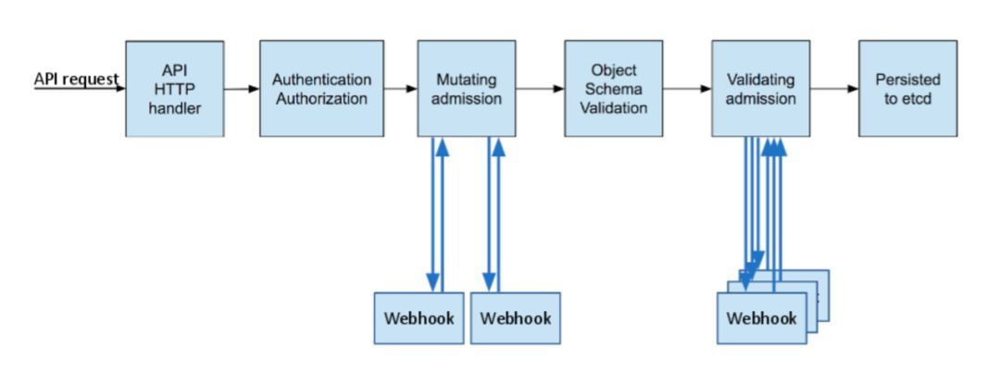
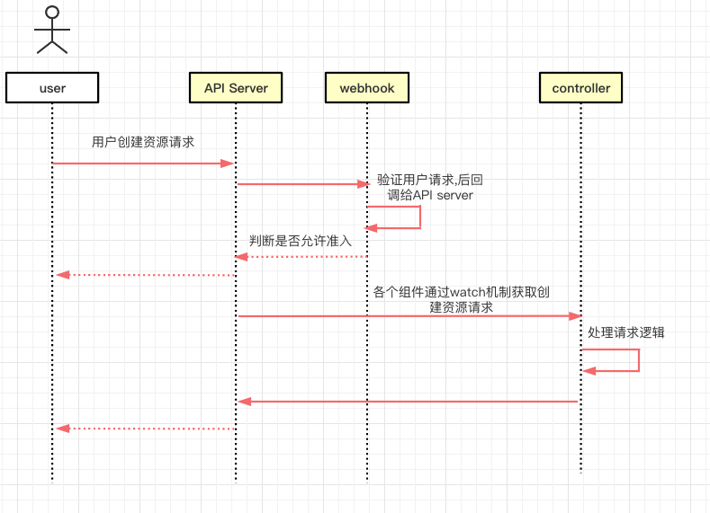
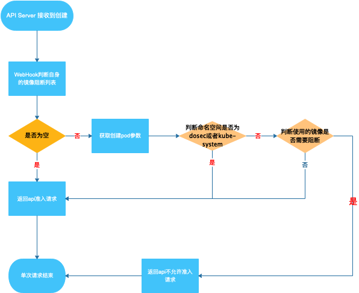

## 使用 Kubernetes Adminission controllers 实现镜像阻断

Adminission Control称为准入控制器,准入 Webhook 是一种用于接收准入请求并对其进行处理的 HTTP 回调机制。

[https://kubernetes.io/zh/docs/reference/access-authn-authz/extensible-admission-controllers/](https://kubernetes.io/zh/docs/reference/access-authn-authz/extensible-admission-controllers/)

### 使用场景

如果要想在pod创建出来之前,对其进行配置修改或者检查,这部分的工作如果放在apiServer里面,需要修改apiServer的源码,然后编译成二进制,而 Admission controllers 就是为这种场景而生的工具，以插件的形式附着到 ApiServer 中，==AdmissionWebhooks== 就是其中一种准入插件。


webhook本质上就是一个拦截器+回调器,它在拦截了用户的请求之后对通过以下2类webhook对请求做处理，然后再回调api-server。

- MutatingWebhookConfiguration: 修改用户请求的配置
- ValidatingWebhookConfiguration: 验证 用户请求的配置是否合法

- 二者合起来就是一个特殊类型的 `admission controllers`。



1.api请求到达K8S API Server

2.请求要先经过认证

- kubectl调用需要kubeconfig
- 直接调用K8S api需要证书+bearToken
- client-go调用也需要kubeconfig

3.执行一连串的admission controller，包括MutatingAdmissionWebhook和ValidatingAdmissionWebhook, 先串行执行MutatingAdmission的Webhook list

4.对请求对象的schema进行校验

5.并行执行ValidatingAdmission的Webhook list

6.最后写入etcd

### Webhooks 的工作流程

 


1. 注册webhook server

```yaml
apiVersion: admissionregistration.k8s.io/v1
kind: ValidatingWebhookConfiguration
metadata:
  name: image-bouncer-webook 
webhooks:
  - name: image-bouncer-webhook.default.svc ① 
    rules: ② 
      - apiGroups: 
          - ""
        apiVersions:
          - v1
        operations:
          - CREATE
        resources:
          - pods
        scope: "Namespaced" # scope字段指定了集群级别的资源("Cluster")或者名称空间级别的资源("Namespaced")需要匹配这些规则."*"表示没有任何范围限制.
    failurePolicy: Ignore
    sideEffects: None
    admissionReviewVersions: ["v1", "v1beta1"]
    clientConfig:
      caBundle: $(kubectl get csr image-bouncer-webhook.default -o jsonpath='{.status.certificate}')  ③
      service:
        name: image-bouncer-webhook ④ webhook service name
        namespace: default  ⑤  webhook service所在的namespace
  timeoutSeconds: 1 # web钩子请求默认超时时间为30秒,如果web钩子请求超时,请求将被web钩子的失败策略处理.
```

① webhook名称

② 描述api-server操作什么资源什么动作时调用webhook插件

③ 提供和webhook通信的TLS链接信息, 生成的证书必须支持<svc_name>.<svc_namespace>.svc，这个证书可以直接使用k8s集群的ca.crt（ kubectl config view --raw -o json | jq -r '.clusters[0].cluster."certificate-authority-data"' | tr -d '"'）

④ webhook service name

⑤ webhook service所在的namespace 


2. 创建webhook以及对应的services

目前的想法是: 在server 上新增一个监听的端口,并创建相应的services,当请求触发上面的 ValidatingWebhook 的时候,会将请求先发送到指定的services的webhook进行验证


webhook本质上是一个http 服务，由api-server通过一个叫做AdmissionReview的对象来发送&接受请求的

```go

type AdmissionReview struct {
	metav1.TypeMeta `json:",inline"`
	// Request describes the attributes for the admission request.
	// +optional
	Request *AdmissionRequest `json:"request,omitempty" protobuf:"bytes,1,opt,name=request"`
	// Response describes the attributes for the admission response.
	// +optional
	Response *AdmissionResponse `json:"response,omitempty" protobuf:"bytes,2,opt,name=response"`
}
```

可以看到在结构体内的request里包含了一个完整的资源配置，而webhook 对这些资源配置进行各种的资源修改/准入的操作后，再回调api-server

```go
type AdmissionRequest struct {
	UID types.UID `json:"uid" protobuf:"bytes,1,opt,name=uid"`
	Kind metav1.GroupVersionKind `json:"kind" protobuf:"bytes,2,opt,name=kind"`
	Resource metav1.GroupVersionResource `json:"resource" protobuf:"bytes,3,opt,name=resource"`
	SubResource string `json:"subResource,omitempty" protobuf:"bytes,4,opt,name=subResource"`
	RequestKind *metav1.GroupVersionKind `json:"requestKind,omitempty" protobuf:"bytes,13,opt,name=requestKind"`
	RequestResource *metav1.GroupVersionResource `json:"requestResource,omitempty" protobuf:"bytes,14,opt,name=requestResource"`
	RequestSubResource string `json:"requestSubResource,omitempty" protobuf:"bytes,15,opt,name=requestSubResource"`
	Name string `json:"name,omitempty" protobuf:"bytes,5,opt,name=name"`
	Namespace string `json:"namespace,omitempty" protobuf:"bytes,6,opt,name=namespace"`
	Operation Operation `json:"operation" protobuf:"bytes,7,opt,name=operation"`
	UserInfo authenticationv1.UserInfo `json:"userInfo" protobuf:"bytes,8,opt,name=userInfo"`
	Object runtime.RawExtension `json:"object,omitempty" protobuf:"bytes,9,opt,name=object"`
	OldObject runtime.RawExtension `json:"oldObject,omitempty" protobuf:"bytes,10,opt,name=oldObject"`
	DryRun *bool `json:"dryRun,omitempty" protobuf:"varint,11,opt,name=dryRun"`
	Options runtime.RawExtension `json:"options,omitempty" protobuf:"bytes,12,opt,name=options"`
}
```

其中`admissionReview.Request.Object.Raw` 中保存的是请求创建pod时的资源清单,也就是说可以通过这个字符串`Unmarshal`后得到Pod的结构体,通过`pod.Spec.Containers.Image`获取到使用的镜像,然后对其使用的镜像进行判断

同时在AdmissionReview结构体内加上一个response的结构体，类似如下：

```go
type AdmissionResponse struct {
	UID types.UID `json:"uid" protobuf:"bytes,1,opt,name=uid"`
	Allowed bool `json:"allowed" protobuf:"varint,2,opt,name=allowed"`
	Result *metav1.Status `json:"status,omitempty" protobuf:"bytes,3,opt,name=status"`
	Patch []byte `json:"patch,omitempty" protobuf:"bytes,4,opt,name=patch"`
	PatchType *PatchType `json:"patchType,omitempty" protobuf:"bytes,5,opt,name=patchType"`
	AuditAnnotations map[string]string `json:"auditAnnotations,omitempty" protobuf:"bytes,6,opt,name=auditAnnotations"`
	Warnings []string `json:"warnings,omitempty" protobuf:"bytes,7,rep,name=warnings"`
}
```

- Allowed : 就是webhook判断该资源是否准入的结果

- Result.Message: 返回具体不允许准入的原因
- UID 请求或者相应的标识,与`AdmissionRequest.UID`保持一致


#### webhook初步实现方式

代码逻辑就是写一个tls 的web server，然后渲染路由，路由的作用是后面注册到**ValidatingWebhookConfiguration**用的，不同路由有不同的准入规则，然后路由对应的处理函数就是实际对admissionreview资源配置的处理过程了


1. 在 server 启动一个 http 服务, 监听一个端口,并为这服务在k8s创建相应的services
2. http初步对外提供的访问接口

```go
http.HandleFunc("/", PostValidatingAdmission) // 根据请求验证镜像是否需要阻断

```

### 镜像阻断完整流程

>  针对 webhook 实现过程

##### 集群内流程(待定)




